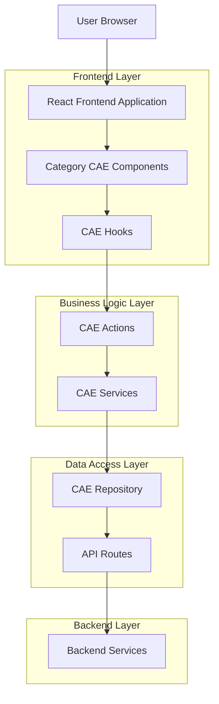
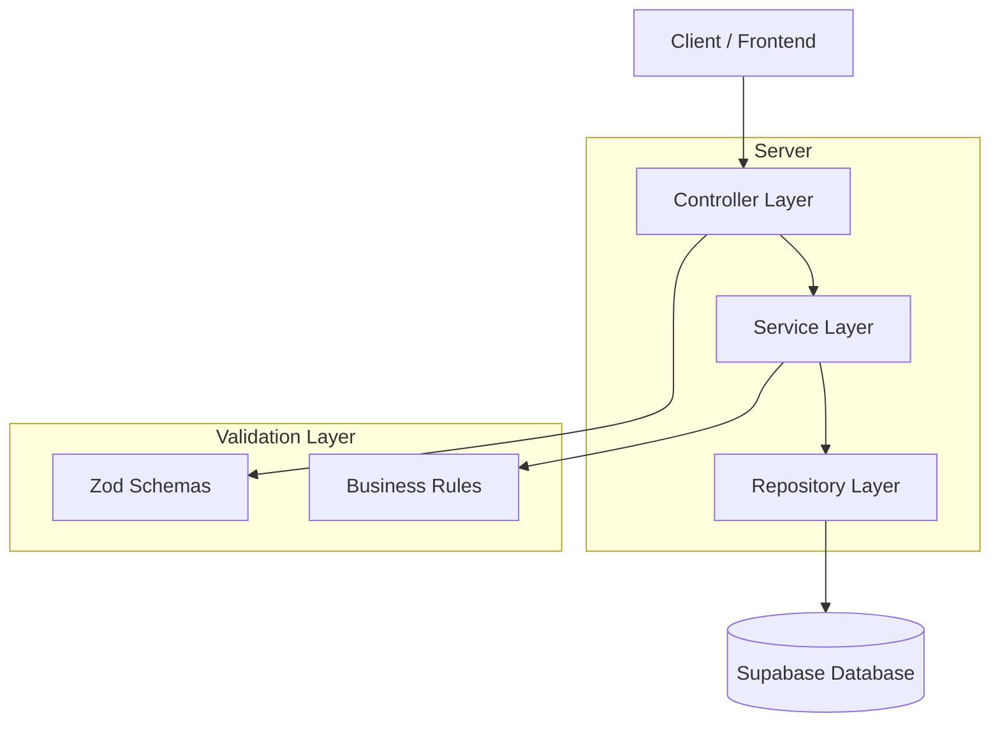
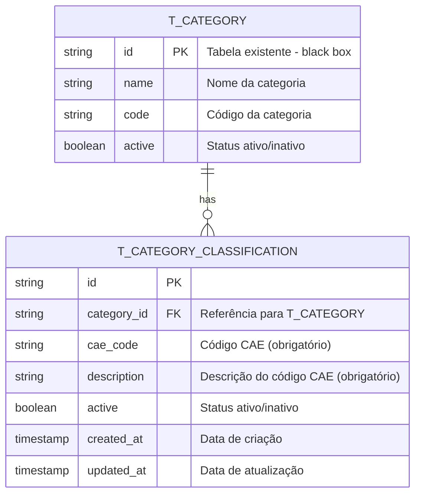

# Documento de Arquitetura Técnica - Associação CAE a Categorias

## 1. Architecture design



## 2. Technology Description

* Frontend: React\@18 + TypeScript + @igrp/igrp-framework-react-design-system + tailwindcss\@3 + vite

* Backend: Next.js API Routes + Supabase

* Database: Supabase (PostgreSQL)

* Validation: Zod + React Hook Form

## 3. Route definitions

| Route                              | Purpose                                                |
| ---------------------------------- | ------------------------------------------------------ |
| /parametrizacao                    | Lista de categorias com nova ação "Associar CAE"       |
| /parametrizacao/category/\[id]/cae | Formulário de associação CAE para categoria específica |
| /api/categories/\[id]/cae          | API endpoint para operações CRUD de associações CAE    |

## 4. API definitions

### 4.1 Core API

**Associações CAE por Categoria**

```
GET /api/categories/{categoryId}/cae
```

Response:

| Param Name  | Param Type | Description                      |
| ----------- | ---------- | -------------------------------- |
| id          | string     | ID único da associação           |
| categoryId  | string     | ID da categoria                  |
| code        | string     | Código CAE                       |
| description | string     | Descrição da atividade económica |
| active      | boolean    | Estado da associação             |
| createdAt   | string     | Data de criação                  |
| updatedAt   | string     | Data de atualização              |

**Criar/Atualizar Associações CAE**

```
POST /api/categories/{categoryId}/cae
PUT /api/categories/{categoryId}/cae
```

Request:

| Param Name                  | Param Type | isRequired | Description                     |
| --------------------------- | ---------- | ---------- | ------------------------------- |
| associations                | array      | true       | Lista de associações CAE        |
| associations\[].code        | string     | true       | Código CAE (formato: 5 dígitos) |
| associations\[].description | string     | true       | Descrição da atividade          |
| associations\[].active      | boolean    | false      | Estado (default: true)          |

Example:

```json
{
  "associations": [
    {
      "code": "62010",
      "description": "Atividades de programação informática",
      "active": true
    },
    {
      "code": "62020",
      "description": "Atividades de consultoria em informática",
      "active": true
    }
  ]
}
```

**Remover Associação CAE**

```
DELETE /api/categories/{categoryId}/cae/{associationId}
```

## 5. Server architecture diagram



## 6.Data model(if applicable)

### 6.1 Data model definition



### 6.2 Data Definition Language

**IMPORTANTE**: A tabela T\_CATEGORY já existe no negócio e deve ser tratada como black box (não modificar).

Nova Tabela T\_CATEGORY\_CLASSIFICATION

```sql
-- Criar tabela para classificações CAE das categorias
CREATE TABLE T_CATEGORY_CLASSIFICATION (
    id UUID PRIMARY KEY DEFAULT gen_random_uuid(),
    category_id UUID NOT NULL,
    cae_code VARCHAR(10) NOT NULL,
    description TEXT NOT NULL,
    active BOOLEAN DEFAULT true,
    created_at TIMESTAMP WITH TIME ZONE DEFAULT NOW(),
    updated_at TIMESTAMP WITH TIME ZONE DEFAULT NOW()
);

-- Criar índices para performance
CREATE INDEX idx_category_classification_category_id ON T_CATEGORY_CLASSIFICATION(category_id);
CREATE INDEX idx_category_classification_cae_code ON T_CATEGORY_CLASSIFICATION(cae_code);
CREATE INDEX idx_category_classification_active ON T_CATEGORY_CLASSIFICATION(active);

-- Constraint única para evitar duplicação de código CAE por categoria
CREATE UNIQUE INDEX idx_category_classification_unique 
ON T_CATEGORY_CLASSIFICATION(category_id, cae_code) 
WHERE active = true;

-- Trigger para atualizar updated_at automaticamente
CREATE OR REPLACE FUNCTION update_updated_at_column()
RETURNS TRIGGER AS $$
BEGIN
    NEW.updated_at = NOW();
    RETURN NEW;
END;
$$ language 'plpgsql';

CREATE TRIGGER update_category_classification_updated_at 
    BEFORE UPDATE ON T_CATEGORY_CLASSIFICATION 
    FOR EACH ROW EXECUTE FUNCTION update_updated_at_column();

-- RLS (Row Level Security) para Supabase
ALTER TABLE T_CATEGORY_CLASSIFICATION ENABLE ROW LEVEL SECURITY;

-- Política para leitura (anon e authenticated)
CREATE POLICY "Allow read access to category classifications" ON T_CATEGORY_CLASSIFICATION
    FOR SELECT USING (true);

-- Política para operações completas (authenticated apenas)
CREATE POLICY "Allow full access to authenticated users" ON T_CATEGORY_CLASSIFICATION
    FOR ALL USING (auth.role() = 'authenticated');

-- Dados iniciais de exemplo (opcional)
INSERT INTO T_CATEGORY_CLASSIFICATION (category_id, cae_code, description) VALUES
('example-category-id-1', '01110', 'Cultivo de cereais (exceto arroz), leguminosas secas e sementes oleaginosas'),
('example-category-id-1', '01120', 'Cultivo de arroz'),
('example-category-id-2', '10110', 'Abate de gado bovino');
```

**Permissões Supabase**

```sql
-- Conceder permissões básicas para role anon
GRANT SELECT ON category_cae_associations TO anon;

-- Conceder permissões completas para role authenticated
GRANT ALL PRIVILEGES ON category_cae_associations TO authenticated;
```

