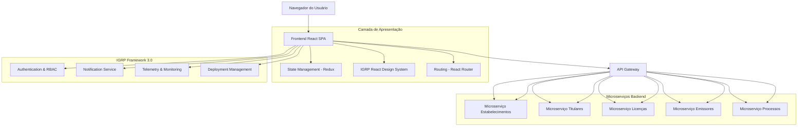

# Arquitetura Técnica - Frontend do Módulo de Gestão de Licenças Emitidas

## 1. Arquitetura de Design



## 2. Descrição das Tecnologias

### 2.1 Stack Principal

* **Frontend**: React 18+ com TypeScript

* **State Management**: Redux Toolkit + RTK Query

* **UI Framework**: IGRP-Framework-React-Design-System

* **Routing**: React Router v6 para navegação SPA

* **Validação**: React Hook Form + Yup para validação de formulários

* **HTTP Client**: Axios com interceptors para APIs

* **Gráficos**: Chart.js + React-Chartjs-2 para dashboards

* **Mapas**: Leaflet + React-Leaflet para georreferenciamento

* **Upload**: React-Dropzone para gestão de documentos

* **Build Tool**: Vite para desenvolvimento e build

* **Testing**: Jest + React Testing Library

### 2.2 Serviços Gerenciados pelo IGRP Framework 3.0

<mcreference link="https://docs3.igrp.cv/category/modularidade--extensibilidade" index="0">0</mcreference> <mcreference link="https://docs3.igrp.cv/category/gest%C3%A3o" index="1">1</mcreference>

* **Autenticação e Autorização**: Sistema RBAC integrado com adaptadores extensíveis

* **Gestão de Deployment**: Pipeline automatizado de deploy e versionamento

* **Telemetria e Monitoramento**: Coleta automática de métricas e logs de aplicação

* **Sistema de Notificações**: Provedor de email e notificações push integrado

* **Gestão de Usuários**: Interface administrativa para controle de acesso e permissões

## 3. Definições de Rotas

| Rota                  | Propósito                                      |
| --------------------- | ---------------------------------------------- |
| /                     | Redirecionamento para dashboard                |
| /dashboard            | Dashboard principal com estatísticas e resumos |
| /licencas             | Listagem e gestão de licenças emitidas         |
| /licencas/:id         | Detalhes de uma licença específica             |
| /licencas/nova        | Formulário de criação de nova licença          |
| /processos            | Gestão de processos de licenciamento           |
| /processos/:id        | Detalhes e timeline de um processo             |
| /processos/novo       | Formulário de novo processo                    |
| /estabelecimentos     | Gestão de estabelecimentos                     |
| /estabelecimentos/:id | Detalhes de estabelecimento                    |
| /titulares            | Gestão de titulares de licenças                |
| /titulares/:id        | Perfil de titular                              |
| /emissores            | Gestão de emissores de licenças                |
| /relatorios           | Interface de geração de relatórios             |
| /configuracoes        | Configurações do sistema                       |
| /perfil               | Perfil do usuário logado                       |

## 4. Integrações com Microserviços

### 4.1 APIs dos Microserviços Consumidas

#### Microserviço de Licenças Emitidas

```
GET /api/v1/licenses
```

**Integração Frontend:**

* **Hook personalizado**: `useLicenses(filters, pagination)`

* **Redux Slice**: `licensesSlice` com RTK Query

* **Componente**: `LicenseDataTable` com filtros dinâmicos

Parâmetros de Consulta:

| Nome do Parâmetro | Tipo    | Obrigatório | Descrição                                   |
| ----------------- | ------- | ----------- | ------------------------------------------- |
| page              | integer | false       | Número da página (padrão: 0)                |
| size              | integer | false       | Tamanho da página (padrão: 20)              |
| tipo              | string  | false       | Filtro por tipo de licença                  |
| status            | string  | false       | Filtro por status (ACTIVE, SUSPENDED, etc.) |
| emissor           | string  | false       | Filtro por código do emissor                |
| titular           | string  | false       | Filtro por ID do titular                    |
| dataInicio        | date    | false       | Data de emissão inicial                     |
| dataFim           | date    | false       | Data de emissão final                       |

**Resposta Frontend:**

* **Estado Redux**: Armazenado em `state.licenses.data`

* **Loading State**: `state.licenses.loading`

* **Error Handling**: `state.licenses.error`

* **Cache**: RTK Query com invalidação automática

**Integração React:**

```typescript
// Hook personalizado
const { data: licenses, isLoading, error } = useLicensesQuery({
  page: 0,
  size: 20,
  filters: { status: 'ACTIVE' }
});

// Componente DataTable
const LicensesList = () => {
  const { licenses, isLoading } = useLicenses();
  
  if (isLoading) return <CircularProgress />;
  
  return (
    <DataGrid
      rows={licenses?.content || []}
      columns={licenseColumns}
      pagination
      pageSize={20}
      onRowClick={handleLicenseDetails}
    />
  );
};
```

#### Microserviço de Estabelecimentos

```
GET /api/v1/establishments
```

**Integração Frontend:**

* **Hook**: `useEstablishments(searchTerm)`

* **Componente**: `EstablishmentAutocomplete`

* **Validação**: Yup schema para formulários

* **Cache**: Dados cached para performance

```typescript
// Hook de busca
const { data: establishments } = useEstablishmentsQuery(searchTerm);

// Componente Autocomplete
<Autocomplete
  options={establishments}
  getOptionLabel={(option) => option.nome}
  renderInput={(params) => (
    <TextField {...params} label="Estabelecimento" />
  )}
  onChange={handleEstablishmentSelect}
/>
```

#### Microserviço de Titulares

```
GET /api/v1/license-holders
```

**Integração Frontend:**

* **Hook**: `useLicenseHolders(filters)`

* **Componente**: `HolderSelector`

* **Formulário**: `HolderForm` com validação React Hook Form

```typescript
// Formulário de Titular
const HolderForm = () => {
  const { register, handleSubmit, formState: { errors } } = useForm();
  const [createHolder] = useCreateHolderMutation();
  
  return (
    <form onSubmit={handleSubmit(onSubmit)}>
      <TextField
        {...register('nome', { required: 'Nome é obrigatório' })}
        error={!!errors.nome}
        helperText={errors.nome?.message}
      />
    </form>
  );
};
```

#### Microserviço de Emissores

```
GET /api/v1/issuers
```

**Integração Frontend:**

* **Hook**: `useIssuers()`

* **Componente**: `IssuerDropdown`

* **Estado Global**: Lista de emissores disponíveis

* **Cache**: Dados persistidos no localStorage

```typescript
// Seletor de Emissor
const IssuerSelector = ({ value, onChange }) => {
  const { data: issuers } = useIssuersQuery();
  
  return (
    <FormControl fullWidth>
      <InputLabel>Emissor</InputLabel>
      <Select value={value} onChange={onChange}>
        {issuers?.map(issuer => (
          <MenuItem key={issuer.codigo} value={issuer.codigo}>
            {issuer.nome}
          </MenuItem>
        ))}
      </Select>
    </FormControl>
  );
};
```

#### Microserviço de Processos

```
GET /api/v1/processes
```

**Integração Frontend:**

* **Hook**: `useProcesses(filters)`

* **Componente**: `ProcessTimeline`

* **Real-time**: WebSocket para atualizações

* **Estado**: Gerenciamento de workflow

```typescript
// Timeline de Processo
const ProcessTimeline = ({ processId }) => {
  const { data: process } = useProcessQuery(processId);
  const [updateStatus] = useUpdateProcessStatusMutation();
  
  return (
    <Timeline>
      {process?.timeline?.map(step => (
        <TimelineItem key={step.id}>
          <TimelineContent>
            <Typography variant="h6">{step.status}</Typography>
            <Typography color="textSecondary">
              {step.timestamp}
            </Typography>
          </TimelineContent>
        </TimelineItem>
      ))}
    </Timeline>
  );
};
```

### 4.2 Gerenciamento de Estado Frontend

#### Redux Store Structure

```typescript
interface RootState {
  licenses: {
    data: License[];
    loading: boolean;
    error: string | null;
    filters: LicenseFilters;
    pagination: PaginationState;
  };
  establishments: {
    data: Establishment[];
    searchResults: Establishment[];
    loading: boolean;
  };
  holders: {
    data: LicenseHolder[];
    currentHolder: LicenseHolder | null;
    loading: boolean;
  };
  processes: {
    data: Process[];
    currentProcess: Process | null;
    timeline: ProcessStep[];
    loading: boolean;
  };
  issuers: {
    data: Issuer[];
    selectedIssuer: Issuer | null;
  };
  ui: {
    sidebarOpen: boolean;
    currentPage: string;
    notifications: Notification[];
  };
}
```

#### Componentes Principais

**Layout Components:**

* `AppLayout`: Layout principal com sidebar e header

* `Sidebar`: Navegação lateral com menu

* `Header`: Barra superior com usuário e notificações

* `Breadcrumbs`: Navegação hierárquica

**Data Components:**

* `LicenseDataGrid`: Tabela de licenças com filtros

* `ProcessTimeline`: Timeline de processos

* `EstablishmentCard`: Card de estabelecimento

* `HolderProfile`: Perfil de titular

**Form Components:**

* `LicenseForm`: Formulário de licença

* `ProcessForm`: Formulário de processo

* `HolderForm`: Formulário de titular

* `EstablishmentForm`: Formulário de estabelecimento

**Utility Components:**

* `LoadingSpinner`: Indicador de carregamento

* `ErrorBoundary`: Tratamento de erros

* `ConfirmDialog`: Diálogo de confirmação

* `NotificationSnackbar`: Notificações toast

## 5. Estrutura do Projeto Frontend

```
C:.
├───actions                    # Actions framework
│   └───igrp                  # Framework IGRP actions
├───app                       # Next.js App Router
│   ├───(igrp)               # Framework gerado IGRP
│   │   ├───(generated)      # Código gerado automaticamente
│   │   └───system-settings  # Configurações do sistema
│   ├───(myapp)              # Código de negócio da aplicação
│   │   ├───(pages)          # Rotas dinâmicas das páginas
│   │   │   ├───dashboard    # Dashboard principal
│   │   │   ├───licencas     # Gestão de licenças emitidas
│   │   │   │   ├───nova     # Criar nova licença
│   │   │   │   └───[id]     # Detalhes/edição de licença
│   │   │   │       ├───editar
│   │   │   │       └───historico
│   │   │   ├───processos    # Gestão de processos
│   │   │   │   ├───novo     # Criar novo processo
│   │   │   │   └───[id]     # Detalhes do processo
│   │   │   │       ├───editar
│   │   │   │       ├───documentos
│   │   │   │       └───timeline
│   │   │   ├───estabelecimentos # Gestão de estabelecimentos
│   │   │   │   ├───novo     # Criar estabelecimento
│   │   │   │   └───[id]     # Detalhes/edição
│   │   │   │       └───editar
│   │   │   ├───titulares    # Gestão de titulares
│   │   │   │   ├───novo     # Criar titular
│   │   │   │   └───[id]     # Detalhes/edição
│   │   │   │       └───editar
│   │   │   ├───emissores    # Gestão de emissores
│   │   │   │   ├───novo     # Criar emissor
│   │   │   │   └───[id]     # Detalhes/edição
│   │   │   │       └───editar
│   │   │   └───relatorios   # Relatórios e analytics
│   │   │       ├───dashboard
│   │   │       ├───licencas
│   │   │       └───processos
│   │   ├───actions          # Actions da aplicação
│   │   │   ├───licencas     # Actions de licenças
│   │   │   ├───processos    # Actions de processos
│   │   │   ├───estabelecimentos # Actions de estabelecimentos
│   │   │   ├───titulares    # Actions de titulares
│   │   │   └───emissores    # Actions de emissores
│   │   ├───functions        # Funções da aplicação
│   │   │   └───services     # Serviços de negócio
│   │   │       ├───licencas
│   │   │       ├───processos
│   │   │       ├───estabelecimentos
│   │   │       ├───titulares
│   │   │       └───emissores
│   │   ├───lib              # Bibliotecas da aplicação
│   │   │   ├───auth         # Autenticação
│   │   │   ├───utils        # Utilitários
│   │   │   ├───validations  # Validações
│   │   │   └───hooks        # Custom hooks
│   │   │       ├───api      # Hooks de API
│   │   │       ├───forms    # Hooks de formulários
│   │   │       └───utils    # Hooks utilitários
│   │   └───types            # Definições TypeScript
│   │       ├───licencas.ts
│   │       ├───processos.ts
│   │       ├───estabelecimentos.ts
│   │       ├───titulares.ts
│   │       └───emissores.ts
│   └───api                  # API Routes (Backend)
│       ├───licencas         # Endpoints de licenças
│       │   └───[id]
│       ├───processos        # Endpoints de processos
│       │   └───[id]
│       ├───estabelecimentos # Endpoints de estabelecimentos
│       │   └───[id]
│       ├───titulares        # Endpoints de titulares
│       │   └───[id]
│       ├───emissores        # Endpoints de emissores
│       │   └───[id]
│       ├───relatorios       # Endpoints de relatórios
│       │   ├───licencas
│       │   └───processos
│       └───upload           # Upload de documentos
├───components               # Componentes reutilizáveis
│   ├───common              # Componentes genéricos
│   │   ├───forms           # Componentes de formulário
│   │   ├───layout          # Componentes de layout
│   │   ├───data            # Componentes de dados
│   │   └───ui              # Componentes de interface
│   ├───licencas            # Componentes específicos de licenças
│   ├───processos           # Componentes específicos de processos
│   ├───estabelecimentos    # Componentes de estabelecimentos
│   ├───titulares           # Componentes de titulares
│   ├───emissores           # Componentes de emissores
│   └───relatorios          # Componentes de relatórios
├───lib                     # Bibliotecas do framework
│   ├───redux               # Configuração Redux
│   │   ├───store.ts        # Store principal
│   │   ├───slices          # Redux slices
│   │   └───api             # RTK Query APIs
│   ├───auth                # Sistema de autenticação
│   └───utils               # Utilitários do framework
├───styles                  # Estilos do framework
│   ├───globals.css         # Estilos globais
│   ├───components.css      # Estilos de componentes
│   └───themes              # Temas da aplicação
└───temp                    # Arquivos temporários do framework
    ├───applications        # Aplicações temporárias
    ├───menus              # Menus temporários
    └───users              # Usuários temporários
```

## 6. Definições de Tipos TypeScript

### 6.1 Tipos Principais

```typescript
// Licença
interface License {
  id: string;
  numero: string;
  tipo: LicenseType;
  titular: LicenseHolder;
  estabelecimento: Establishment;
  emissor: Issuer;
  dataEmissao: string;
  dataValidade?: string;
  status: LicenseStatus;
  condicoesEspeciais?: string;
  valorTaxa?: number;
  renovavel: boolean;
  createdAt: string;
  updatedAt: string;
}

// Processo de Licenciamento
interface Process {
  id: string;
  numero: string;
  licenca?: License;
  requerente: LicenseHolder;
  analista?: User;
  status: ProcessStatus;
  prioridade: ProcessPriority;
  dataSubmissao: string;
  dataConclusao?: string;
  notasRequerente?: string;
  notasInternas?: string;
  timeline: ProcessStep[];
  documentos: ProcessDocument[];
}

// Titular de Licença
interface LicenseHolder {
  id: string;
  tipo: 'PESSOA_FISICA' | 'PESSOA_JURIDICA';
  tipoIdentificacao: string;
  numeroIdentificacao: string;
  nomeCompleto: string;
  dataNascimento?: string;
  dataConstituicao?: string;
  nacionalidade?: string;
  email: string;
  telefone: string;
  endereco: Address;
  ativo: boolean;
}

// Estabelecimento
interface Establishment {
  id: string;
  nome: string;
  tipoEstabelecimento: string;
  endereco: Address;
  coordenadas?: {
    latitude: number;
    longitude: number;
  };
  telefone?: string;
  email?: string;
  licencaFuncionamento?: string;
  ativo: boolean;
}

// Emissor
interface Issuer {
  codigo: string;
  nome: string;
  tipo: string;
  endereco: Address;
  telefone: string;
  email: string;
  responsavel: string;
  ativo: boolean;
}

// Tipos Auxiliares
interface Address {
  endereco: string;
  municipio: string;
  ilha: string;
}

type LicenseStatus = 'ACTIVE' | 'SUSPENDED' | 'EXPIRED' | 'CANCELLED';
type ProcessStatus = 'SUBMITTED' | 'UNDER_REVIEW' | 'APPROVED' | 'REJECTED';
type ProcessPriority = 'LOW' | 'NORMAL' | 'HIGH' | 'URGENT';
```

### 6.2 Configuração e Deployment

#### Configuração de Desenvolvimento

```typescript
// vite.config.ts
import { defineConfig } from 'vite';
import react from '@vitejs/plugin-react';
import path from 'path';

export default defineConfig({
  plugins: [react()],
  resolve: {
    alias: {
      '@': path.resolve(__dirname, './src'),
      '@components': path.resolve(__dirname, './src/components'),
      '@pages': path.resolve(__dirname, './src/pages'),
      '@hooks': path.resolve(__dirname, './src/hooks'),
      '@store': path.resolve(__dirname, './src/store'),
      '@services': path.resolve(__dirname, './src/services'),
      '@types': path.resolve(__dirname, './src/types'),
    },
  },
  server: {
    port: 3000,
    proxy: {
      '/api': {
        target: 'http://localhost:8080',
        changeOrigin: true,
        secure: false,
      },
    },
  },
});
```

#### Variáveis de Ambiente

```bash
# .env.development
VITE_API_BASE_URL=http://localhost:8080/api/v1
VITE_APP_TITLE=Gestão de Licenças - DEV
VITE_ENABLE_DEVTOOLS=true

# .env.production
VITE_API_BASE_URL=https://api.licencas.gov.cv/v1
VITE_APP_TITLE=Gestão de Licenças
VITE_ENABLE_DEVTOOLS=false
```

#### Scripts de Build

```json
{
  "scripts": {
    "dev": "vite",
    "build": "tsc && vite build",
    "preview": "vite preview",
    "test": "jest",
    "test:watch": "jest --watch",
    "lint": "eslint src --ext ts,tsx --report-unused-disable-directives --max-warnings 0",
    "lint:fix": "eslint src --ext ts,tsx --fix",
    "type-check": "tsc --noEmit"
  }
}
```

## 7. Considerações de Performance

### 7.1 Otimizações Frontend

* **Code Splitting**: Divisão de código por rotas usando React.lazy()

* **Memoização**: Uso de React.memo, useMemo e useCallback

* **Virtualização**: Para listas grandes com react-window

* **Cache**: RTK Query com cache inteligente

* **Bundle Optimization**: Tree shaking e minificação

* **Image Optimization**: Lazy loading e formatos otimizados

### 7.2 Estratégias de Cache

* **API Cache**: RTK Query com TTL configurável

* **Browser Cache**: Service Workers para recursos estáticos

* **Memory Cache**: Redux para estado da aplicação

* **Local Storage**: Preferências do usuário e dados não sensíveis

### 7.3 Monitoramento

* **Error Tracking**: Integração com Sentry ou similar

* **Performance Monitoring**: Web Vitals e métricas customizadas

* **Analytics**: Tracking de uso e comportamento do usuário

* **Logging**: Logs estruturados para debugging

