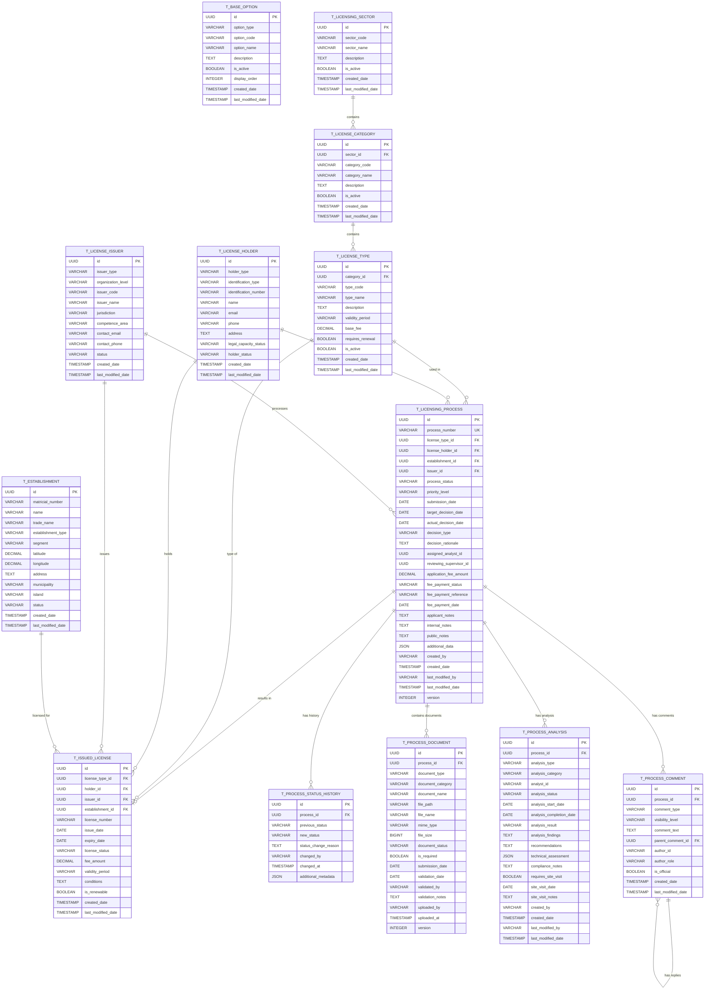

# BE-LIC-Gestao-Licenciamento

## 1. Visão Geral

Este documento especifica a arquitetura backend para o Sistema de Gestão de Licenciamento, um sistema abrangente para gerenciar todo o ciclo de vida de licenças, desde a parametrização até a emissão e controle.

### 1.1 Objetivos

* **Gestão Completa de Licenciamento**: Controlar todo o processo de licenciamento desde a parametrização até a emissão

* **Arquitetura DDD**: Implementar Domain-Driven Design para garantir clareza e manutenibilidade

* **APIs REST**: Fornecer interfaces padronizadas para integração com frontend e sistemas externos

* **Validações de Negócio**: Garantir integridade e consistência dos dados através de regras de domínio

* **Auditoria Completa**: Rastrear todas as operações e mudanças no sistema

* **Performance e Escalabilidade**: Suportar alto volume de transações com tempos de resposta adequados

### 1.2 Módulos do Sistema

O sistema é composto pelos seguintes módulos principais:

1. **Parametrização de Licenciamento** (PR00-PR01.\*)

   * Gestão de opções base do sistema

   * Configuração de setores, categorias e tipos de licenças

   * Dossier de tipos de licença (dados gerais, legislações, entidades, processos, taxas)

2. **Gestão de Estabelecimentos** (PR02.01)

   * Cadastro e gestão de estabelecimentos

   * Controle de localização geográfica

   * Gestão de documentos dos estabelecimentos

   * Classificação e segmentação

3. **Gestão de Titulares de Licença** (PR02.02)

   * Cadastro e gestão de pessoas físicas e jurídicas

   * Controle de representantes legais

   * Verificação de capacidade legal

   * Gestão de documentos dos titulares

4. **Gestão de Licenças Emitidas** (PR02.03)

   * Emissão de licenças definitivas e provisórias

   * Controle de status e validade

   * Histórico de alterações

   * Gestão de renovações

5. **Gestão de Emissores de Licenças** (PR02.04)

   * Cadastro de órgãos emissores

   * Controle de competências e jurisdições

   * Gestão de delegações

   * Acreditação de emissores

6. **Gestão de Processos de Licenciamento** (PR02.05)

   * Controle do fluxo de processos

   * Atribuição de analistas

   * Gestão de documentos do processo

   * Análises e decisões

## 2. Arquitetura Geral

### 2.1 Padrões Arquiteturais

* **Domain-Driven Design (DDD)**: Organização do código em camadas bem definidas

* **Clean Architecture**: Separação clara entre regras de negócio e detalhes de implementação

* **CQRS**: Separação entre comandos (escrita) e consultas (leitura) quando necessário

* **Event Sourcing**: Para auditoria e rastreabilidade de mudanças críticas

### 2.2 Estrutura de Camadas

```
├── Domain Layer
│   ├── Entities (Aggregate Roots)
│   ├── Value Objects
│   ├── Domain Services
│   ├── Repository Interfaces
│   └── Domain Events
├── Application Layer
│   ├── Use Cases
│   ├── DTOs (Commands/Queries)
│   └── Application Services
├── Infrastructure Layer
│   ├── Repository Implementations
│   ├── External Services
│   └── Database Configuration
└── Presentation Layer
    ├── REST Controllers
    ├── Request/Response DTOs
    └── Exception Handlers
```

### 2.3 Tecnologias Principais

* **Framework**: Spring Boot 3.x

* **Persistência**: Spring Data JPA + PostgreSQL

* **Validação**: Bean Validation (JSR-303)

* **Documentação**: OpenAPI 3.0 (Swagger)

* **Testes**: JUnit 5 + Testcontainers

* **Cache**: Redis (para consultas frequentes)

* **Mensageria**: RabbitMQ (para eventos de domínio)

## 3. Modelo de Dados Consolidado

### 3.1 Diagrama ER Geral



### 3.2 Principais Entidades de Domínio

#### 3.2.1 Aggregate Roots

* **LicensingProcess**: Controla todo o fluxo de um processo de licenciamento

* **IssuedLicense**: Representa uma licença emitida e seu ciclo de vida

* **LicenseHolder**: Gerencia titulares de licença (pessoas físicas/jurídicas)

* **LicenseIssuer**: Controla órgãos emissores e suas competências

* **LicenseType**: Define tipos de licença e suas características

#### 3.2.2 Value Objects Principais

* **LicenseNumber**: Número único da licença

* **ProcessNumber**: Número único do processo

* **Identification**: Dados de identificação (CPF/CNPJ)

* **ContactInfo**: Informações de contato

* **FeeInfo**: Informações de taxas e pagamentos

* **AuditInfo**: Informações de auditoria

#### 3.2.3 Gestão de Processos - Detalhamento

**Aggregate Root**: `LicensingProcess`

**Entidades**:

* `ProcessDocument` - Documentos anexados ao processo

* `ProcessAnalysis` - Análises técnicas realizadas

* `ProcessComment` - Comentários e comunicações

* `ProcessStatusHistory` - Histórico de mudanças de status

**Value Objects**:

* `ProcessNumber` - Número único do processo

* `ProcessStatus` - Status atual do processo (SUBMITTED, UNDER\_REVIEW, PENDING\_DOCUMENTS, TECHNICAL\_ANALYSIS, APPROVED, REJECTED, CANCELLED, ON\_HOLD)

* `ProcessPriority` - Prioridade do processo (LOW, NORMAL, HIGH, URGENT)

* `DocumentType` - Tipo de documento (APPLICATION\_FORM, TECHNICAL\_SPECS, FINANCIAL\_PROOF, LEGAL\_DOCS, SITE\_PLAN, ENVIRONMENTAL\_IMPACT)

* `AnalysisType` - Tipo de análise (TECHNICAL, LEGAL, ENVIRONMENTAL, FINANCIAL, COMPLIANCE)

* `CommentVisibility` - Visibilidade do comentário (PUBLIC, INTERNAL, APPLICANT\_ONLY)

* `PaymentStatus` - Status do pagamento (PENDING, PAID, OVERDUE, WAIVED)

**Domain Services**:

* `ProcessWorkflowService` - Gerencia transições de status

* `DocumentValidationService` - Valida documentos submetidos

* `AnalysisAssignmentService` - Atribui análises a especialistas

* `ProcessNotificationService` - Gerencia notificações

* `PaymentTrackingService` - Rastreia pagamentos de taxas

## 4. APIs REST Consolidadas

### 4.1 Endpoints Principais

#### 4.1.1 Parametrização

```http
GET    /api/v1/options
POST   /api/v1/options
PUT    /api/v1/options/{id}
DELETE /api/v1/options/{id}

GET    /api/v1/sectors
POST   /api/v1/sectors
PUT    /api/v1/sectors/{id}

GET    /api/v1/categories
POST   /api/v1/categories
PUT    /api/v1/categories/{id}

GET    /api/v1/license-types
POST   /api/v1/license-types
PUT    /api/v1/license-types/{id}
```

#### 4.1.2 Gestão de Estabelecimentos

```http
GET    /api/v1/establishments
POST   /api/v1/establishments
GET    /api/v1/establishments/{id}
PUT    /api/v1/establishments/{id}
PUT    /api/v1/establishments/{id}/activate
PUT    /api/v1/establishments/{id}/suspend
POST   /api/v1/establishments/{id}/documents
GET    /api/v1/establishments/nearby
```

#### 4.1.3 Gestão de Titulares

```http
GET    /api/v1/license-holders
POST   /api/v1/license-holders/individual
POST   /api/v1/license-holders/company
GET    /api/v1/license-holders/{id}
PUT    /api/v1/license-holders/{id}
PUT    /api/v1/license-holders/{id}/suspend
PUT    /api/v1/license-holders/{id}/reactivate
```

#### 4.1.4 Gestão de Emissores

```http
GET    /api/v1/license-issuers
POST   /api/v1/license-issuers
GET    /api/v1/license-issuers/{id}
PUT    /api/v1/license-issuers/{id}
POST   /api/v1/license-issuers/{id}/competences
POST   /api/v1/license-issuers/{id}/jurisdictions
```

#### 4.1.5 Gestão de Processos

**Operações básicas de processos:**

```http
GET    /api/v1/licensing-processes
POST   /api/v1/licensing-processes
GET    /api/v1/licensing-processes/{id}
PUT    /api/v1/licensing-processes/{id}
DELETE /api/v1/licensing-processes/{id}
```

**Gestão de fluxo e atribuições:**

```http
PUT    /api/v1/licensing-processes/{id}/assign-analyst
PUT    /api/v1/licensing-processes/{id}/change-status
PUT    /api/v1/licensing-processes/{id}/set-priority
PUT    /api/v1/licensing-processes/{id}/approve
PUT    /api/v1/licensing-processes/{id}/reject
PUT    /api/v1/licensing-processes/{id}/cancel
PUT    /api/v1/licensing-processes/{id}/hold
PUT    /api/v1/licensing-processes/{id}/resume
```

**Gestão de documentos do processo:**

```http
GET    /api/v1/licensing-processes/{id}/documents
POST   /api/v1/licensing-processes/{id}/documents
GET    /api/v1/licensing-processes/{id}/documents/{docId}
PUT    /api/v1/licensing-processes/{id}/documents/{docId}
DELETE /api/v1/licensing-processes/{id}/documents/{docId}
PUT    /api/v1/licensing-processes/{id}/documents/{docId}/validate
PUT    /api/v1/licensing-processes/{id}/documents/{docId}/reject
```

**Análises técnicas:**

```http
GET    /api/v1/licensing-processes/{id}/analyses
POST   /api/v1/licensing-processes/{id}/analyses
GET    /api/v1/licensing-processes/{id}/analyses/{analysisId}
PUT    /api/v1/licensing-processes/{id}/analyses/{analysisId}
PUT    /api/v1/licensing-processes/{id}/analyses/{analysisId}/complete
PUT    /api/v1/licensing-processes/{id}/analyses/{analysisId}/schedule-site-visit
```

**Comentários e comunicações:**

```http
GET    /api/v1/licensing-processes/{id}/comments
POST   /api/v1/licensing-processes/{id}/comments
GET    /api/v1/licensing-processes/{id}/comments/{commentId}
PUT    /api/v1/licensing-processes/{id}/comments/{commentId}
DELETE /api/v1/licensing-processes/{id}/comments/{commentId}
POST   /api/v1/licensing-processes/{id}/comments/{commentId}/reply
```

**Histórico e auditoria:**

```http
GET    /api/v1/licensing-processes/{id}/status-history
GET    /api/v1/licensing-processes/{id}/audit-trail
```

**Pagamentos:**

```http
PUT    /api/v1/licensing-processes/{id}/record-payment
GET    /api/v1/licensing-processes/{id}/payment-status
```

**Relatórios e estatísticas:**

```http
GET    /api/v1/licensing-processes/statistics
GET    /api/v1/licensing-processes/dashboard
GET    /api/v1/licensing-processes/overdue
GET    /api/v1/licensing-processes/pending-documents
GET    /api/v1/licensing-processes/by-analyst/{analystId}
```

#### 4.1.6 Gestão de Licenças

```http
GET    /api/v1/issued-licenses
POST   /api/v1/issued-licenses/definitive
POST   /api/v1/issued-licenses/provisional
GET    /api/v1/issued-licenses/{id}
PUT    /api/v1/issued-licenses/{id}/suspend
PUT    /api/v1/issued-licenses/{id}/reactivate
PUT    /api/v1/issued-licenses/{id}/cancel
POST   /api/v1/issued-licenses/{id}/renew
```

### 4.2 Exemplos Detalhados de APIs de Processos

#### 4.2.1 Criar Processo de Licenciamento

```http
POST /api/v1/licensing-processes
Content-Type: application/json
Authorization: Bearer {token}

{
  "licenseTypeId": "550e8400-e29b-41d4-a716-446655440001",
  "licenseHolderId": "550e8400-e29b-41d4-a716-446655440002",
  "establishmentId": "550e8400-e29b-41d4-a716-446655440003",
  "issuerId": "550e8400-e29b-41d4-a716-446655440004",
  "priorityLevel": "NORMAL",
  "applicationFeeAmount": 150.00,
  "applicantNotes": "Solicitação de licença para atividade comercial",
  "documents": [
    {
      "documentType": "APPLICATION_FORM",
      "documentName": "Formulário de Candidatura",
      "filePath": "/uploads/form_123.pdf",
      "isRequired": true
    }
  ]
}
```

#### 4.2.2 Atribuir Analista

```http
PUT /api/v1/licensing-processes/550e8400-e29b-41d4-a716-446655440005/assign-analyst
Content-Type: application/json
Authorization: Bearer {token}

{
  "analystId": "550e8400-e29b-41d4-a716-446655440006",
  "assignmentReason": "Especialista em licenças comerciais",
  "targetDecisionDate": "2025-02-15"
}
```

#### 4.2.3 Padrões de Response

**Sucesso**:

```json
{
  "success": true,
  "data": { ... },
  "message": "Operation completed successfully",
  "timestamp": "2025-01-15T10:30:00Z"
}
```

**Erro de Validação**:

```json
{
  "success": false,
  "error": {
    "code": "VALIDATION_ERROR",
    "message": "Validation failed",
    "details": [
      {
        "field": "email",
        "message": "Invalid email format"
      }
    ]
  },
  "timestamp": "2025-01-15T10:30:00Z"
}
```

**Erro de Negócio**:

```json
{
  "success": false,
  "error": {
    "code": "BUSINESS_RULE_VIOLATION",
    "message": "License holder does not have legal capacity",
    "details": []
  },
  "timestamp": "2025-01-15T10:30:00Z"
}
```

**Resposta de Processo Criado**:

```json
{
  "success": true,
  "data": {
    "id": "550e8400-e29b-41d4-a716-446655440005",
    "processNumber": "LIC-2025-001234",
    "status": "SUBMITTED",
    "submissionDate": "2025-01-15",
    "targetDecisionDate": "2025-02-15",
    "applicationFeeAmount": 150.00,
    "feePaymentStatus": "PENDING"
  },
  "message": "Processo de licenciamento criado com sucesso",
  "timestamp": "2025-01-15T10:30:00Z"
}
```

## 5. Eventos de Domínio

### 5.1 Eventos Principais

```java
// Processos
LicensingProcessCreatedEvent
AnalystAssignedEvent
ProcessStatusChangedEvent
ProcessDocumentAddedEvent
ProcessDocumentValidatedEvent
ProcessAnalysisRequestedEvent
ProcessAnalysisCompletedEvent
ProcessPaymentRecordedEvent
ProcessCommentAddedEvent
ProcessApprovedEvent
ProcessRejectedEvent
ProcessCancelledEvent
ProcessOnHoldEvent
ProcessResumedEvent
SiteVisitScheduledEvent
SiteVisitCompletedEvent

// Licenças
LicenseIssuedEvent
LicenseSuspendedEvent
LicenseRenewedEvent
LicenseCancelledEvent

// Titulares
LicenseHolderCreatedEvent
LicenseHolderSuspendedEvent
LegalCapacityVerifiedEvent

// Emissores
IssuerCreatedEvent
IssuerCompetenceGrantedEvent
IssuerJurisdictionAddedEvent
```

### 5.2 Integração entre Módulos

Os módulos se comunicam através de eventos de domínio:

#### 5.2.1 Fluxo de Processos de Licenciamento

* **Processo Criado** → **Validação do Titular** → **Verificação de Competência do Emissor**

* **Analista Atribuído** → **Notificação de Atribuição** → **Início da Análise**

* **Documentos Adicionados** → **Validação Automática** → **Notificação de Status**

* **Análise Técnica Solicitada** → **Atribuição de Especialista** → **Agendamento de Visita**

* **Pagamento Registrado** → **Atualização de Status** → **Continuação do Processo**

* **Processo Aprovado** → **Emissão de Licença** → **Notificação ao Titular**

* **Processo Rejeitado** → **Notificação de Rejeição** → **Registro de Motivos**

#### 5.2.2 Eventos de Integração

* **LicensingProcessCreatedEvent** → **Validação de Pré-requisitos**

* **ProcessDocumentAddedEvent** → **Verificação de Completude**

* **ProcessAnalysisCompletedEvent** → **Avaliação de Conformidade**

* **ProcessApprovedEvent** → **Geração de Licença**

* **ProcessPaymentRecordedEvent** → **Atualização Financeira**

* **SiteVisitScheduledEvent** → **Coordenação de Recursos**

#### 5.2.3 Comunicação Inter-Módulos

* **Processo Aprovado** → **Emissão de Licença**

* **Licença Emitida** → **Atualização do Titular**

* **Verificação de Capacidade** → **Atualização do Status do Titular**

* **Competência Concedida** → **Atualização das Capacidades do Emissor**

* **Documento Validado** → **Progressão do Processo**

* **Análise Completada** → **Decisão do Processo**

## 6. Segurança e Auditoria

### 6.1 Controle de Acesso

* **Autenticação**: JWT tokens com refresh

* **Autorização**: Role-based access control (RBAC)

* **Roles Principais**:

  * `ADMIN`: Acesso total ao sistema

  * `ANALYST`: Análise de processos

  * `ISSUER`: Emissão de licenças

  * `VIEWER`: Consulta apenas

### 6.2 Validações de Negócio Detalhadas

#### 6.2.1 Parametrização

* Códigos únicos por setor

* Hierarquia consistente de categorias

* Datas de vigência válidas

#### 6.2.2 Estabelecimentos

* Coordenadas geográficas válidas

* Documentação de registro completa

* Classificação adequada ao segmento

* Status ativo para licenciamento

#### 6.2.3 Titulares

* Documentos de identificação válidos

* Capacidades técnicas adequadas

* Status ativo para emissão de licenças

#### 6.2.4 Emissores

* Competências dentro do escopo legal

* Certificações válidas

* Autorização para o tipo de licença

#### 6.2.5 Licenças

* Titular habilitado

* Emissor competente

* Estabelecimento conforme

* Documentação completa

#### 6.2.6 Processos de Licenciamento

**Validações de Criação**:

* Titular deve estar ativo e habilitado

* Tipo de licença deve estar vigente

* Estabelecimento deve estar registrado

* Emissor deve ter competência para o tipo de licença

* Documentos obrigatórios devem estar presentes

**Validações de Transição de Status**:

* `SUBMITTED` → `UNDER_REVIEW`: Documentação básica completa

* `UNDER_REVIEW` → `PENDING_DOCUMENTS`: Identificação de documentos faltantes

* `PENDING_DOCUMENTS` → `UNDER_REVIEW`: Todos documentos obrigatórios submetidos

* `UNDER_REVIEW` → `TECHNICAL_ANALYSIS`: Análise técnica necessária

* `TECHNICAL_ANALYSIS` → `UNDER_REVIEW`: Análise técnica completada

* `UNDER_REVIEW` → `APPROVED`: Todos critérios atendidos e pagamento confirmado

* `UNDER_REVIEW` → `REJECTED`: Critérios não atendidos com justificativa

* Qualquer status → `CANCELLED`: Solicitação do requerente ou decisão administrativa

* Qualquer status → `ON_HOLD`: Suspensão temporária com motivo

**Validações de Documentos**:

* Tipo de documento deve ser válido para o tipo de licença

* Formato de arquivo deve ser aceito (PDF, DOC, DOCX, JPG, PNG)

* Tamanho máximo de 10MB por documento

* Documentos obrigatórios não podem ser removidos

* Validação deve ser feita por usuário autorizado

**Validações de Análise**:

* Analista deve ter competência para o tipo de análise

* Análise técnica requer visita de campo para certas categorias

* Prazo de análise deve respeitar SLA definido

* Resultado da análise deve incluir recomendações

**Validações de Pagamento**:

* Taxa deve corresponder ao tipo de licença

* Referência de pagamento deve ser única

* Data de pagamento não pode ser futura

* Status de pagamento deve ser consistente com o processo

**Validações de Comentários**:

* Comentários oficiais só podem ser criados por funcionários

* Comentários públicos são visíveis ao requerente

* Comentários internos são restritos à equipe

* Respostas devem referenciar comentário pai válido

### 6.3 Auditoria

* **Audit Trail**: Todas as operações são auditadas

* **Campos de Auditoria**: created\_at, updated\_at, created\_by, updated\_by

* **Eventos Críticos**: Logged em tabela separada

* **Retenção**: Dados de auditoria mantidos por 7 anos

## 7. Performance e Escalabilidade

### 7.1 Estratégias de Cache

* **Redis**: Cache de consultas frequentes

* **TTL**: Configurado por tipo de dados

* **Invalidação**: Baseada em eventos de domínio

### 7.2 Otimizações de Banco

* **Índices Compostos**: Para consultas complexas

* **Particionamento**: Tabelas grandes por período

* **Connection Pool**: Configurado para alta concorrência

### 7.3 Monitoramento

* **Métricas**: Tempo de resposta, throughput, erros

* **Health Checks**: Endpoints de saúde para cada módulo

* **Alertas**: Configurados para SLAs críticos

## 8. Testes e Qualidade

### 8.1 Estratégia de Testes

* **Unitários**: Cobertura > 80% para regras de negócio

* **Integração**: Testes de API com Testcontainers

* **Contrato**: Testes de contrato entre módulos

* **Performance**: Testes de carga para operações críticas

### 8.2 Qualidade de Código

* **SonarQube**: Análise estática de código

* **Checkstyle**: Padrões de codificação

* **SpotBugs**: Detecção de bugs potenciais

* **JaCoCo**: Cobertura de testes

## 9. Deployment e DevOps

### 9.1 Containerização

* **Docker**: Containers para cada módulo

* **Docker Compose**: Ambiente de desenvolvimento

* **Kubernetes**: Orquestração em produção

### 9.2 CI/CD

* **Pipeline**: Build → Test → Security Scan → Deploy

* **Ambientes**: DEV → QA → STAGING → PROD

* **Blue-Green**: Deployment sem downtime

### 9.3 Configuração

* **Spring Profiles**: Configuração por ambiente

* **ConfigMaps**: Configuração externa no Kubernetes

* **Secrets**: Credenciais e chaves criptografadas

## 10. Documentação dos Módulos

Cada módulo possui documentação detalhada nos seguintes arquivos:

* **PR00-BE-LIC-Parametrizacao-options.md**: Opções base do sistema

* **PR01-BE-LIC-Parametrizacao-Licenciamento-Sector-Categoria-Tipos-Licencas.md**: Parametrização de licenciamento

* **PR01.01-BE-LIC-Dossier-Tipo-Licenca-Dados-Gerais.md**: Dados gerais dos tipos de licença

* **PR01.02-BE-LIC-Dossier-Tipo-Licenca-Legislacoes.md**: Legislações aplicáveis

* **PR01.03-BE-LIC-Dossier-Tipo-Licenca-Entidades.md**: Entidades envolvidas

* **PR01.04-BE-LIC-Dossier-Tipo-Licenca-Associacao-Tipo-Processos.md**: Associação com tipos de processos

* **PR01.05-BE-LIC-Dossier-Tipo-Licenca-Associacao-Taxas.md**: Associação com taxas

* **PR02.01-BE-LIC-Gestao-Estabelecimentos.md**: Gestão completa de estabelecimentos, incluindo:

  * Cadastro e registro de estabelecimentos

  * Controle de localização geográfica com coordenadas GPS

  * Gestão de documentos e classificações

  * Busca por proximidade geográfica

  * Validações de conformidade

* **PR02.02-BE-LIC-Gestao-Titulares-Licenca.md**: Gestão de titulares de licença

* **PR02.03-BE-LIC-Gestao-Licencas-Emitidas.md**: Gestão de licenças emitidas

* **PR02.04-BE-LIC-Gestao-Emissores-Licencas.md**: Gestão de emissores de licenças

* **PR02.05-BE-LIC-Gestao-Processos-Licenciamento.md**: Gestão completa de processos de licenciamento, incluindo:

  * Controle de fluxo de processos (submissão, análise, decisão)

  * Gestão de documentos e validações

  * Análises técnicas e visitas de campo

  * Sistema de comentários e comunicações

  * Histórico completo de mudanças de status

  * Gestão de pagamentos e taxas

  * Atribuição de analistas e supervisores

  * Relatórios e estatísticas de processos

Cada documento contém:

* Modelo de dados detalhado

* Arquitetura DDD completa

* APIs REST com exemplos

* Validações de negócio

* Testes unitários e de integração

* Considerações de implementação

