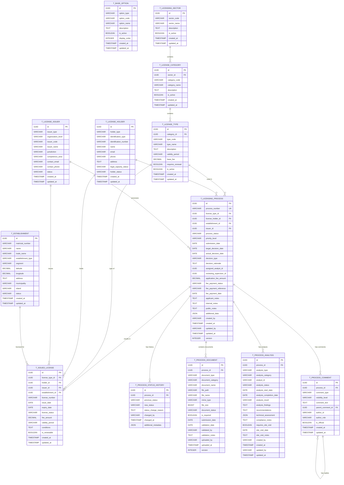
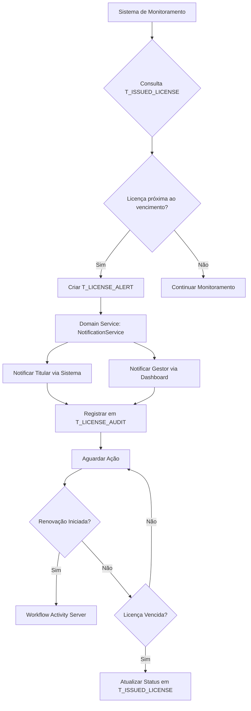
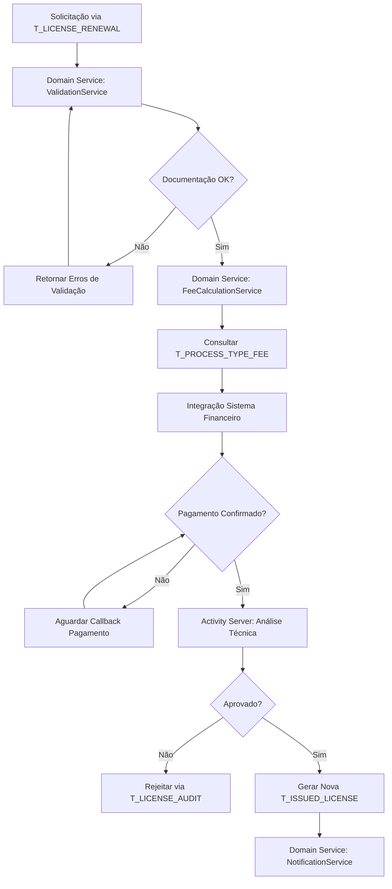
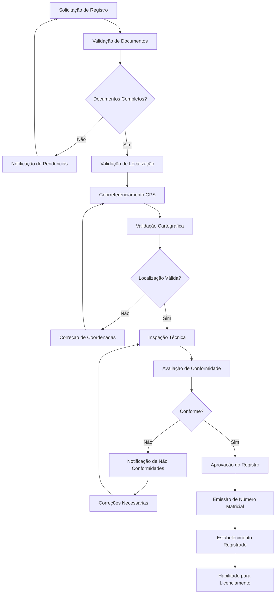
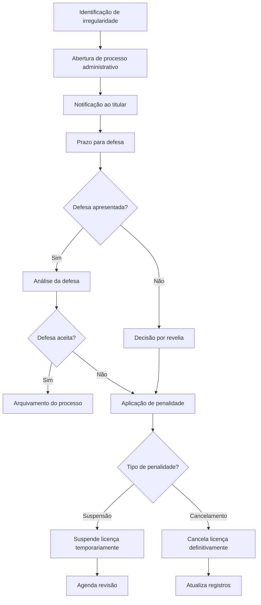

# Análise Conceitual - Módulos de Gestão de Licenças Emitidas

## Sistema de Licenciamento de Cabo Verde

## 1. Visão Geral do Módulo

O módulo de **Gestão de Licenças Emitidas** é responsável pela gestão completa do ciclo de vida das licenças após sua emissão, incluindo monitoramento de validade, processos de licenciamento, renovações, alterações, suspensão e controle de conformidade. Este módulo integra-se com o sistema de parametrização existente e utiliza arquitetura DDD para garantir robustez e manutenibilidade.

### 1.1 Objetivos

- Implementar gestão completa do ciclo de vida de licenças emitidas

- **Controlar processos de licenciamento desde a parametrização até a emissão**

- **Implementar arquitetura DDD com Domain-Driven Design para clareza e manutenibilidade**

- **Fornecer APIs REST padronizadas para integração com frontend e sistemas externos**

- **Garantir validações de negócio e integridade dos dados através de regras de domínio**

- **Implementar auditoria completa para rastrear todas as operações e mudanças**

- **Suportar performance e escalabilidade para alto volume de transações**

- Fornecer monitoramento automatizado de validade e alertas

- Processar renovações, alterações e transferências de titularidade através de processos de licenciamento

- Garantir rastreabilidade completa através de auditoria

- Integrar com sistemas externos através de eventos de domínio

- Implementar controles de acesso baseados em perfis de usuário com Row Level Security

### 1.2 Entidades Principais

#### 1.2.1 Entidades de Parametrização Base

- **T_BASE_OPTION**: Opções base do sistema
  - Tipos de opções configuráveis
  - Códigos e nomes padronizados
  - Status de ativação

- **T_LICENSING_SECTOR**: Setores de licenciamento
  - Códigos e nomes de setores
  - Descrições e status

- **T_LICENSE_CATEGORY**: Categorias de licenças
  - Vinculação a setores
  - Códigos e nomes de categorias

- **T_LICENSE_TYPE**: Tipos de licenças
  - Vinculação a categorias
  - Períodos de validade e taxas base
  - Configurações de renovação

#### 1.2.2 Entidades de Emissão

- **T_LICENSE_ISSUER**: Órgãos emissores de licenças
  - Tipo e nível organizacional do emissor
  - Códigos únicos e jurisdições
  - Áreas de competência
  - Dados de contato institucional
  - Status operacional

- **T_ISSUED_LICENSE**: Licenças emitidas com controle de ciclo de vida
  - Vinculação ao tipo, titular, emissor e estabelecimento
  - Números únicos de licença
  - Controle de validade e status
  - Valores de taxas e condições
  - Configurações de renovação

#### 1.2.3 Entidades de Titularidade

- **T_LICENSE_HOLDER**: Titulares de licenças (pessoas físicas e jurídicas)
  - Tipo de titular (individual/corporate)
  - Tipo e número de identificação
  - Nome, email, telefone e endereço
  - Status de capacidade legal
  - Status do titular

#### 1.2.4 Entidades de Estabelecimento

- **T_ESTABLISHMENT**: Estabelecimentos registrados no sistema
  - Número matricial único
  - Nome e nome comercial
  - Tipo e segmento do estabelecimento
  - Coordenadas de georreferenciamento (latitude/longitude)
  - Endereço, município e ilha
  - Status operacional

#### 1.2.5 Entidades de Processo de Licenciamento

- **T_LICENSING_PROCESS**: Processos de licenciamento
  - Número único do processo
  - Vinculação ao tipo de licença, titular, estabelecimento e emissor
  - Status e nível de prioridade
  - Datas de submissão, decisão alvo e decisão real
  - Tipo e justificativa da decisão
  - Analista atribuído e supervisor revisor
  - Informações de taxas e pagamentos
  - Notas do requerente, internas e públicas
  - Dados adicionais em JSON
  - Controle de versão e auditoria

- **T_PROCESS_STATUS_HISTORY**: Histórico de status dos processos
  - Vinculação ao processo
  - Status anterior e novo
  - Razão da mudança e responsável
  - Metadados adicionais

- **T_PROCESS_DOCUMENT**: Documentos dos processos
  - Vinculação ao processo
  - Tipo, categoria e nome do documento
  - Informações do arquivo (caminho, nome, tipo MIME, tamanho)
  - Status de validação e obrigatoriedade
  - Datas de submissão e validação
  - Notas de validação e responsável

- **T_PROCESS_ANALYSIS**: Análises técnicas dos processos
  - Vinculação ao processo
  - Tipo, categoria e analista responsável
  - Status e datas da análise
  - Resultado e descobertas da análise
  - Recomendações e avaliação técnica
  - Notas de conformidade
  - Informações de visita ao local

- **T_PROCESS_COMMENT**: Comentários e comunicações dos processos
  - Vinculação ao processo
  - Tipo e nível de visibilidade
  - Texto do comentário
  - Comentário pai (para respostas)
  - Autor e papel do autor
  - Indicador de comentário oficial

## 2. Modelo de Dados Consolidado

### 2.1 Diagrama ER Consolidado



### 2.2 Principais Entidades de Domínio

#### 2.2.1 Aggregate Roots

- **LicensingProcess**: Controla todo o fluxo de um processo de licenciamento
- **IssuedLicense**: Representa uma licença emitida e seu ciclo de vida
- **LicenseHolder**: Gerencia titulares de licença (pessoas físicas/jurídicas)
- **LicenseIssuer**: Controla órgãos emissores e suas competências
- **LicenseType**: Define tipos de licença e suas características

#### 2.2.2 Value Objects Principais

- **LicenseNumber**: Número único da licença
- **ProcessNumber**: Número único do processo
- **Identification**: Dados de identificação (CPF/CNPJ)
- **ContactInfo**: Informações de contato
- **FeeInfo**: Informações de taxas e pagamentos
- **AuditInfo**: Informações de auditoria

#### 2.2.3 Gestão de Processos - Detalhamento

**Aggregate Root**: `LicensingProcess`

**Entidades**:
- `ProcessDocument` - Documentos anexados ao processo
- `ProcessAnalysis` - Análises técnicas realizadas
- `ProcessComment` - Comentários e comunicações
- `ProcessStatusHistory` - Histórico de mudanças de status

**Value Objects**:
- `ProcessNumber` - Número único do processo
- `ProcessStatus` - Status atual do processo (SUBMITTED, UNDER_REVIEW, PENDING_DOCUMENTS, TECHNICAL_ANALYSIS, APPROVED, REJECTED, CANCELLED, ON_HOLD)
- `ProcessPriority` - Prioridade do processo (LOW, NORMAL, HIGH, URGENT)
- `DocumentType` - Tipo de documento (APPLICATION_FORM, TECHNICAL_SPECS, FINANCIAL_PROOF, LEGAL_DOCS, SITE_PLAN, ENVIRONMENTAL_IMPACT)
- `AnalysisType` - Tipo de análise (TECHNICAL, LEGAL, ENVIRONMENTAL, FINANCIAL, COMPLIANCE)
- `CommentVisibility` - Visibilidade do comentário (PUBLIC, INTERNAL, APPLICANT_ONLY)
- `PaymentStatus` - Status do pagamento (PENDING, PAID, OVERDUE, WAIVED)

**Domain Services**:
- `ProcessWorkflowService` - Gerencia transições de status
- `DocumentValidationService` - Valida documentos submetidos
- `AnalysisAssignmentService` - Atribui análises a especialistas
- `ProcessNotificationService` - Gerencia notificações
- `PaymentTrackingService` - Rastreia pagamentos de taxas

### 2.3 Relacionamentos e Regras de Negócio

#### Relacionamentos Principais

**Processos de Licenciamento:**
- Um `T_LICENSING_PROCESS` resulta em uma `T_ISSUED_LICENSE` quando aprovado
- Um `T_LICENSE_TYPE` pode ser usado em múltiplos `T_LICENSING_PROCESS`
- Um `T_LICENSE_HOLDER` pode aplicar para múltiplos `T_LICENSING_PROCESS`
- Um `T_LICENSE_ISSUER` pode processar múltiplos `T_LICENSING_PROCESS`
- Um `T_ESTABLISHMENT` pode estar associado a múltiplos `T_LICENSING_PROCESS`

**Licenças Emitidas:**
- Uma `T_ISSUED_LICENSE` pertence a exatamente um `T_LICENSE_TYPE`
- Uma `T_ISSUED_LICENSE` pertence a exatamente um `T_LICENSE_HOLDER`
- Uma `T_ISSUED_LICENSE` é emitida por exatamente um `T_LICENSE_ISSUER`
- Uma `T_ISSUED_LICENSE` está associada a exatamente um `T_ESTABLISHMENT`

**Histórico e Documentação:**
- Um `T_LICENSING_PROCESS` tem múltiplos `T_PROCESS_STATUS_HISTORY`
- Um `T_LICENSING_PROCESS` contém múltiplos `T_PROCESS_DOCUMENT`
- Um `T_LICENSING_PROCESS` tem múltiplas `T_PROCESS_ANALYSIS`
- Um `T_LICENSING_PROCESS` tem múltiplos `T_PROCESS_COMMENT`
- Um `T_PROCESS_COMMENT` pode ter múltiplas respostas (self-reference)

#### Regras de Integridade

**Processos de Licenciamento:**
- `process_number` deve ser único no sistema
- `submission_date` deve ser anterior ou igual a `target_decision_date`
- `actual_decision_date` só pode ser preenchida quando o processo for decidido
- Status deve seguir transições válidas do workflow

**Titulares:**
- `identification_number` deve ser único no sistema
- `holder_type` deve ser 'individual' ou 'corporate'
- `legal_capacity_status` deve ser validado antes da emissão de licenças

**Estabelecimentos:**
- `matricial_number` deve ser único no sistema
- Coordenadas de latitude e longitude devem ser válidas para Cabo Verde
- `municipality` e `island` devem corresponder à geografia de Cabo Verde

**Documentos de Processo:**
- Documentos obrigatórios (`is_required = true`) devem estar presentes para aprovação
- `document_status` deve ser 'VALIDATED' para documentos críticos
- Versioning deve ser mantido para rastreabilidade

#### Validações de Negócio

**Criação de Processos:**
- Verificar se o emissor tem competência para o tipo de licença
- Validar se o titular tem capacidade legal
- Verificar se o estabelecimento está registrado e ativo
- Confirmar que não existem processos duplicados em andamento

**Fluxo de Aprovação:**
- Analista deve ser atribuído antes do início da análise
- Documentos obrigatórios devem estar validados
- Análises técnicas devem estar completas
- Taxas devem estar pagas antes da emissão

**Emissão de Licenças:**
- Processo deve estar no status 'APPROVED'
- Todas as condições do tipo de licença devem ser atendidas
- Número da licença deve seguir padrão estabelecido
- Data de expiração deve ser calculada conforme período de validade

## 3. APIs REST Consolidadas

### 3.1 Endpoints Principais

#### 3.1.1 Parametrização

```http
GET    /api/v1/options
POST   /api/v1/options
PUT    /api/v1/options/{id}
DELETE /api/v1/options/{id}

GET    /api/v1/sectors
POST   /api/v1/sectors
PUT    /api/v1/sectors/{id}

GET    /api/v1/categories
POST   /api/v1/categories
PUT    /api/v1/categories/{id}

GET    /api/v1/license-types
POST   /api/v1/license-types
PUT    /api/v1/license-types/{id}
```

#### 3.1.2 Gestão de Titulares

```http
GET    /api/v1/license-holders
POST   /api/v1/license-holders/individual
POST   /api/v1/license-holders/company
GET    /api/v1/license-holders/{id}
PUT    /api/v1/license-holders/{id}
PUT    /api/v1/license-holders/{id}/suspend
PUT    /api/v1/license-holders/{id}/reactivate
```

#### 3.1.3 Gestão de Emissores

```http
GET    /api/v1/license-issuers
POST   /api/v1/license-issuers
GET    /api/v1/license-issuers/{id}
PUT    /api/v1/license-issuers/{id}
POST   /api/v1/license-issuers/{id}/competences
POST   /api/v1/license-issuers/{id}/jurisdictions
```

#### 3.1.4 Gestão de Processos

**Operações básicas de processos:**

```http
GET    /api/v1/licensing-processes
POST   /api/v1/licensing-processes
GET    /api/v1/licensing-processes/{id}
PUT    /api/v1/licensing-processes/{id}
DELETE /api/v1/licensing-processes/{id}
```

**Gestão de fluxo e atribuições:**

```http
PUT    /api/v1/licensing-processes/{id}/assign-analyst
PUT    /api/v1/licensing-processes/{id}/change-status
PUT    /api/v1/licensing-processes/{id}/set-priority
PUT    /api/v1/licensing-processes/{id}/approve
PUT    /api/v1/licensing-processes/{id}/reject
PUT    /api/v1/licensing-processes/{id}/cancel
PUT    /api/v1/licensing-processes/{id}/hold
PUT    /api/v1/licensing-processes/{id}/resume
```

**Gestão de documentos do processo:**

```http
GET    /api/v1/licensing-processes/{id}/documents
POST   /api/v1/licensing-processes/{id}/documents
GET    /api/v1/licensing-processes/{id}/documents/{docId}
PUT    /api/v1/licensing-processes/{id}/documents/{docId}
DELETE /api/v1/licensing-processes/{id}/documents/{docId}
PUT    /api/v1/licensing-processes/{id}/documents/{docId}/validate
PUT    /api/v1/licensing-processes/{id}/documents/{docId}/reject
```

**Análises técnicas:**

```http
GET    /api/v1/licensing-processes/{id}/analyses
POST   /api/v1/licensing-processes/{id}/analyses
GET    /api/v1/licensing-processes/{id}/analyses/{analysisId}
PUT    /api/v1/licensing-processes/{id}/analyses/{analysisId}
PUT    /api/v1/licensing-processes/{id}/analyses/{analysisId}/complete
PUT    /api/v1/licensing-processes/{id}/analyses/{analysisId}/schedule-site-visit
```

**Comentários e comunicações:**

```http
GET    /api/v1/licensing-processes/{id}/comments
POST   /api/v1/licensing-processes/{id}/comments
GET    /api/v1/licensing-processes/{id}/comments/{commentId}
PUT    /api/v1/licensing-processes/{id}/comments/{commentId}
DELETE /api/v1/licensing-processes/{id}/comments/{commentId}
POST   /api/v1/licensing-processes/{id}/comments/{commentId}/reply
```

**Histórico e auditoria:**

```http
GET    /api/v1/licensing-processes/{id}/status-history
GET    /api/v1/licensing-processes/{id}/audit-trail
```

**Pagamentos:**

```http
PUT    /api/v1/licensing-processes/{id}/record-payment
GET    /api/v1/licensing-processes/{id}/payment-status
```

**Relatórios e estatísticas:**

```http
GET    /api/v1/licensing-processes/statistics
GET    /api/v1/licensing-processes/dashboard
GET    /api/v1/licensing-processes/overdue
GET    /api/v1/licensing-processes/pending-documents
GET    /api/v1/licensing-processes/by-analyst/{analystId}
```

#### 3.1.5 Gestão de Licenças

```http
GET    /api/v1/issued-licenses
POST   /api/v1/issued-licenses/definitive
POST   /api/v1/issued-licenses/provisional
GET    /api/v1/issued-licenses/{id}
PUT    /api/v1/issued-licenses/{id}/suspend
PUT    /api/v1/issued-licenses/{id}/reactivate
PUT    /api/v1/issued-licenses/{id}/cancel
POST   /api/v1/issued-licenses/{id}/renew
```

## 4. Requisitos Funcionais

### 4.1 Gestão do Ciclo de Vida das Licenças

#### RF001 - Consulta de Licenças Emitidas

- **Descrição:** Permitir consulta e visualização de todas as licenças emitidas no sistema com filtros avançados

- **Critérios de Aceitação:**
  - Busca por número da licença, titular, tipo, setor ou categoria
  - Filtros por status (license_status: ACTIVE, EXPIRED, SUSPENDED, CANCELLED)
  - Filtros por período de emissão e validade
  - Visualização em lista paginada com ordenação
  - Exportação de resultados em CSV/Excel
  - Integração com sistema de cache para performance

#### RF002 - Detalhamento de Licença

- **Descrição:** Exibir informações completas de uma licença específica com histórico de auditoria

- **Critérios de Aceitação:**
  - Dados do titular (T_LICENSE_HOLDER)
  - Informações técnicas da licença vinculadas ao T_LICENSE_TYPE
  - Histórico completo através do processo de licenciamento (T_LICENSING_PROCESS)
  - Documentos anexos através de T_PROCESS_DOCUMENT
  - Status atual e datas relevantes com validações de negócio
  - Informações de taxas e pagamentos
  - Integração com sistema de parametrização para dados dinâmicos

#### RF003 - Monitoramento de Validade

- **Descrição:** Controlar e alertar sobre vencimentos de licenças através de eventos de domínio

- **Critérios de Aceitação:**
  - Dashboard com licenças próximas ao vencimento
  - Alertas automáticos configuráveis (90, 60, 30, 15 dias)
  - Notificações por email integradas com sistema de notificações
  - Relatórios de licenças vencidas com filtros avançados
  - Configuração de períodos de alerta por tipo de licença
  - Processamento assíncrono de alertas com eventos

#### RF004 - Processo de Renovação

- **Descrição:** Gerenciar solicitações de renovação através de novos processos de licenciamento (T_LICENSING_PROCESS)

- **Critérios de Aceitação:**
  - Criação de novo processo de licenciamento para renovação
  - Validação de documentos e requisitos via Domain Services
  - Cálculo automático de taxas através de configurações do tipo de licença
  - Workflow de aprovação integrado com fluxo de processos
  - Geração de nova licença com numeração sequencial
  - Versionamento e auditoria completanamento de licenças renovadas

  - Integração com sistema de pagamentos

#### RF005 - Suspensão e Cancelamento

- **Descrição:** Permitir suspensão temporária ou cancelamento definitivo com auditoria completa

- **Critérios de Aceitação:**
  - Registro de motivo da suspensão/cancelamento no T_LICENSE_AUDIT

  - Workflow de aprovação para ações administrativas via Activity

  - Notificação automática ao titular via sistema de notificações

  - Histórico completo de ações com rastreabilidade

  - Possibilidade de reativação de licenças suspensas

  - Validações de regras de negócio através de Domain Services

  - Integração com sistema de compliance

### 3.2 Gestão de Alterações

#### RF006 - Alteração de Dados da Licença

- **Descrição:** Permitir alterações em dados não críticos através da tabela T_LICENSE_AMENDMENT

- **Critérios de Aceitação:**
  - Identificação de campos editáveis por tipo de licença via T_LICENSE_PARAMETER

  - Workflow de aprovação para alterações integrado com Activity Server

  - Versionamento completo de dados alterados no T_LICENSE_AUDIT

  - Geração de aditivos à licença original com numeração sequencial

  - Cobrança de taxas quando aplicável via T_PROCESS_TYPE_FEE

  - Validações de regras de negócio através de Domain Services

  - Notificação automática ao titular sobre alterações

#### RF007 - Transferência de Titularidade

- **Descrição:** Processar transferências através da tabela T_LICENSE_TRANSFER

- **Critérios de Aceitação:**
  - Validação de documentação do novo titular via T_LICENSE_HOLDER

  - Verificação de impedimentos legais através de Domain Services

  - Workflow de aprovação específico integrado com Activity

  - Atualização de dados cadastrais com auditoria completa

  - Emissão de nova licença com nova titularidade

  - Histórico completo da transferência no T_LICENSE_AUDIT

  - Integração com sistema de organizações globais

### 3.3 Relatórios e Analytics

#### RF008 - Dashboard Executivo

- **Descrição:** Apresentar indicadores-chave baseados em dados normalizados das tabelas T_ISSUED_LICENSE e T_LICENSE_AUDIT

- **Critérios de Aceitação:**
  - Métricas de licenças ativas, vencidas e em processo via consultas otimizadas

  - Gráficos de tendências temporais com cache Redis para performance

  - Indicadores de receita por tipo de licença integrados com T_PROCESS_TYPE_FEE

  - Alertas de licenças próximas ao vencimento via T_LICENSE_ALERT

  - Filtros por período, setor e categoria usando índices otimizados

  - Integração com sistema de Business Intelligence

  - Atualização em tempo real via WebSockets

#### RF009 - Relatórios Operacionais

- **Descrição:** Gerar relatórios detalhados através de consultas estruturadas no modelo normalizado

- **Critérios de Aceitação:**
  - Relatório de licenças por status com dados do T_ISSUED_LICENSE

  - Relatório de renovações pendentes via T_LICENSE_RENEWAL

  - Relatório de receitas por período integrado com sistema financeiro

  - Relatório de auditoria completa baseado em T_LICENSE_AUDIT

  - Exportação em múltiplos formatos (PDF, Excel, CSV) via serviços especializados

  - Agendamento automático de relatórios

  - Controle de acesso baseado em perfis de usuário

## 4. Requisitos Não Funcionais

### 4.1 Performance e Escalabilidade

#### RNF001 - Tempo de Resposta

- Consultas simples: máximo 2 segundos com índices otimizados

- Relatórios complexos: máximo 30 segundos com cache Redis

- Exportações: processamento assíncrono com notificação via WebSockets

#### RNF002 - Capacidade

- Suporte a 10.000 licenças ativas simultâneas com arquitetura distribuída

- 1.000 usuários concorrentes com load balancing

- Crescimento de 20% ao ano com escalabilidade horizontal

#### RNF003 - Disponibilidade

- 99.5% de uptime durante horário comercial com alta disponibilidade

- Janela de manutenção: domingos 02:00-06:00

- Backup automático diário com retenção configurável

### 4.2 Segurança e Compliance

#### RNF004 - Autenticação e Autorização

- Integração com Supabase Auth e Active Directory/LDAP

- Controle de acesso baseado em perfis via RLS (Row Level Security)

- Sessões com timeout configurável

- Log de tentativas de acesso com monitoramento

#### RNF005 - Proteção de Dados

- Criptografia de dados sensíveis em repouso e em trânsito

- Comunicação via HTTPS/TLS 1.3

- Anonimização de dados para relatórios

- Compliance com LGPD/GDPR

### 4.3 Usabilidade e Experiência

#### RNF006 - Interface

- Design responsivo baseado em Design System corporativo

- Compatibilidade com navegadores modernos

- Acessibilidade WCAG 2.1 nível AA

- Suporte a múltiplos idiomas (PT, EN) via internacionalização

- PWA com funcionalidades offline para consultas básicas

## 5. Fluxos de Trabalho

### 5.1 Monitoramento de Validade



### 5.2 Processo de Renovação



## 3. Processos de Registro de Estabelecimentos

### 3.1 Obrigatoriedade de Registro

O sistema implementa a **obrigatoriedade de registro de estabelecimentos** como pré-requisito fundamental para o licenciamento, especialmente para:

#### 3.1.1 Segmentos Obrigatórios

- **Estabelecimentos Comerciais**
  - Lojas de varejo e atacado
  - Centros comerciais e galerias
  - Mercados e feiras permanentes
  - Postos de combustível
  - Farmácias e estabelecimentos de saúde

- **Estabelecimentos Turísticos**
  - Hotéis, pousadas e alojamentos
  - Restaurantes e estabelecimentos de alimentação
  - Agências de viagem e turismo
  - Estabelecimentos de entretenimento
  - Operadores turísticos

- **Estabelecimentos Industriais**
  - Fábricas e unidades de produção
  - Armazéns e centros de distribuição
  - Oficinas e serviços técnicos
  - Estabelecimentos de transformação

#### 3.1.2 Critérios de Registro

- **Registro Matricial Único**: Cada estabelecimento recebe um número matricial único e permanente

- **Georreferenciamento Obrigatório**: Coordenadas GPS precisas (latitude/longitude) validadas cartograficamente

- **Documentação Específica por Segmento**: Conjunto de documentos obrigatórios definidos por tipo de estabelecimento

- **Conformidade Legal**: Alinhamento com legislação vigente de Cabo Verde

- **Validação Técnica**: Inspeção e validação das condições operacionais

### 3.2 Processo de Registro de Estabelecimento



### 3.3 Documentação Obrigatória por Segmento

#### 3.3.1 Estabelecimentos Comerciais

- Certidão de registo comercial
- Planta de localização e layout
- Certificado de conformidade urbanística
- Licença de funcionamento municipal
- Certificado de segurança contra incêndios
- Alvará sanitário (quando aplicável)
- Comprovativo de propriedade ou arrendamento

#### 3.3.2 Estabelecimentos Turísticos

- Licença de estabelecimento turístico
- Certificado de classificação turística
- Plano de segurança e evacuação
- Certificado ambiental
- Licença de restauração (quando aplicável)
- Certificado de acessibilidade
- Seguro de responsabilidade civil

#### 3.3.3 Estabelecimentos Industriais

- Licença industrial
- Estudo de impacto ambiental
- Certificado de conformidade técnica
- Plano de gestão de resíduos
- Certificado de segurança ocupacional
- Licença de emissões atmosféricas
- Autorização de captação de água (quando aplicável)

### 3.4 Sistema de Georreferenciamento

#### 3.4.1 Requisitos Técnicos

- **Precisão**: Coordenadas GPS com precisão mínima de 3 metros
- **Sistema de Referência**: WGS84 (EPSG:4326)
- **Validação**: Verificação cartográfica obrigatória
- **Atualização**: Revisão periódica das coordenadas

#### 3.4.2 Dados de Localização

- Latitude e longitude em graus decimais
- Endereço completo normalizado
- Código postal e zona administrativa
- Classificação de zoneamento urbano
- Tipo de uso do solo
- Área de influência do estabelecimento

### 3.5 Fluxo de Suspensão/Cancelamento



## 5. Integração com Outros Módulos

### 5.1 Integração com Módulo de Parametrização

#### Dependências

- **Tipos de Licença:** Herda configurações através de T_LICENSE_TYPE com validações de Domain Services

- **Legislação:** Aplica normas vigentes via T_LEGISLATION com versionamento

- **Entidades:** Utiliza dados de órgãos através de T_ENTITY com cache distribuído

- **Processos:** Executa workflows via T_LICENSE_TYPE_PROCESS_TYPE

#### Sincronização

- Atualização automática via Event Sourcing quando parâmetros são alterados

- Versionamento de configurações através de T_LICENSE_AUDIT

- Migração controlada via Domain Services especializados

### 5.2 Integração com Sistema de Processos (Activity)

#### Funcionalidades

- Criação automática via Domain Services integrados

- Acompanhamento através de T_LICENSE_AUDIT

- Notificações via Event-Driven Architecture

- Integração com workflow engine via APIs REST

#### APIs Utilizadas

- `POST /api/processes` - Criação com dados normalizados

- `GET /api/processes/{id}/status` - Consulta com cache Redis

- `PUT /api/processes/{id}/advance` - Avanço com auditoria

- `GET /api/processes/search` - Busca com Elasticsearch

### 5.3 Integração com Sistema Financeiro

#### Funcionalidades

- Geração via T_PROCESS_TYPE_FEE com cálculos automatizados

- Consulta através de webhooks com retry pattern

- Conciliação via Saga Pattern para consistência

- Relatórios integrados com Business Intelligence

#### Dados Compartilhados

- Códigos via T_FEE_CATEGORY estruturados

- Valores através de Domain Services especializados

- Histórico normalizado em T_LICENSE_AUDIT

- Dados de inadimplência com alertas automáticos

### 5.4 Integração com Sistema de Notificações

#### Canais de Comunicação

- Email via templates estruturados em T_LICENSE_ALERT

- SMS através de Domain Services especializados

- Push notifications via WebSockets em tempo real

- Publicação automatizada com workflow aprovação

#### Templates de Mensagens

- Alertas baseados em T_LICENSE_PARAMETER configuráveis

- Confirmações via T_LICENSE_AUDIT estruturadas

- Notificações com dados normalizados do titular

- Lembretes programados via scheduler distribuído

## 6. Controles de Acesso e Segurança

### 6.1 Perfis de Usuário (Row Level Security)

#### Consultor

- **Permissões via RLS:**
  - `SELECT` em T_ISSUED_LICENSE (filtrado por setor)

  - `SELECT` em T_LICENSE_HOLDER (dados básicos)

  - `SELECT` em relatórios pré-definidos

  - Exportação limitada via Domain Services

- **Restrições:**
  - Não acessa dados pessoais completos

  - Não visualiza informações financeiras

  - Limitado a consultas básicas

#### Analista

- **Permissões via RLS:**
  - Herda permissões de Consultor

  - `INSERT/UPDATE` em T_LICENSE_RENEWAL

  - `UPDATE` em T_ISSUED_LICENSE (campos específicos)

  - `INSERT` em T_LICENSE_AMENDMENT

  - `SELECT` em T_LICENSE_AUDIT (auditoria básica)

- **Restrições:**
  - Não pode suspender/cancelar licenças

  - Não acessa configurações do sistema

  - Limitado a ações de rotina

#### Supervisor

- **Permissões via RLS:**
  - Herda permissões do Analista

  - `UPDATE` em T_ISSUED_LICENSE (status temporário)

  - `INSERT` em T_LICENSE_ALERT

  - Acesso a workflows via Activity Server

- **Restrições:**
  - Não pode cancelar licenças definitivamente

  - Não altera parâmetros do sistema

#### Gestor

- **Permissões via RLS:**
  - Herda permissões do Supervisor

  - `UPDATE` em T_ISSUED_LICENSE (cancelamento definitivo)

  - `INSERT/UPDATE` em T_LICENSE_TRANSFER

  - `SELECT` em relatórios executivos

  - Configuração de workflows via Activity

- **Restrições:**
  - Não altera estrutura de dados

  - Não gerencia usuários do sistema

#### Administrador

- **Permissões via RLS:**
  - `ALL PRIVILEGES` em todas as tabelas T\_\*

  - Acesso completo a T_LICENSE_AUDIT

  - Configuração de T_LICENSE_PARAMETER

  - **Gerenciamento de usuários via Spring Security**

  - **Configuração de JWT tokens e refresh tokens**

  - Execução de operações em lote via Domain Services

### 6.2 Controles de Segurança por Funcionalidade

#### Consulta de Licenças

- **Autenticação:** Obrigatória para todas as consultas

- **Autorização:** Baseada no perfil do usuário via RLS

- **Auditoria:** Log completo em T_LICENSE_AUDIT com rastreabilidade

- **Filtros de Dados:** Aplicados conforme perfil com cache distribuído

- **Rate Limiting:** Controle de taxa via middleware especializado

#### Alteração de Dados

- **Autenticação:** Dupla verificação para alterações críticas

- **Autorização:** Workflow de aprovação via Activity Server

- **Auditoria:** Versionamento completo em T_LICENSE_AUDIT

- **Validação:** Verificação através de Domain Services

- **Rollback:** Controle via Event Sourcing

#### Relatórios

- **Autenticação:** Sessão válida obrigatória

- **Autorização:** Acesso granular por tipo de relatório

- **Auditoria:** Log detalhado em T_LICENSE_AUDIT

- **Anonimização:** Sanitização conforme LGPD

- **Watermark:** Identificação dinâmica do usuário

### 6.3 Políticas de Segurança

#### Gestão de Senhas

- Complexidade mínima: 8 caracteres, maiúsculas, minúsculas, números

- Renovação obrigatória a cada 90 dias

- Histórico de 12 senhas anteriores

- Bloqueio após 5 tentativas incorretas

#### Controle de Sessão

- Timeout automático após 30 minutos de inatividade

- Sessão única por usuário

- Logout automático fora do horário comercial

- Monitoramento de sessões suspeitas

#### Proteção de Dados

- Criptografia AES-256 para dados em repouso

- Hashing SHA-256 para senhas

- Comunicação exclusiva via HTTPS

- Backup criptografado com chaves rotacionadas

#### Monitoramento e Alertas

- Detecção de tentativas de acesso não autorizado

- Alertas para alterações em dados críticos

- Monitoramento de performance e disponibilidade

- Relatórios de segurança semanais

## 7. Especificações Técnicas

### 7.1 Stack Tecnológica

#### Framework Backend

- **Spring Boot 3.2+** - Framework principal para desenvolvimento
  - Configuração automática e convenções sobre configuração

  - Embedded server (Tomcat) para facilitar deployment

  - Starter dependencies para integração simplificada

  - Profile-based configuration para diferentes ambientes

#### Autenticação e Segurança

- **Spring Security 6** - Framework de segurança enterprise
  - Method-level security com anotações

  - CORS configuration para integração frontend

  - CSRF protection configurável

  - Password encoding com BCrypt

- **JWT (JSON Web Tokens)** - Autenticação stateless
  - Access tokens com expiração configurável

  - Refresh tokens para renovação automática

  - Claims customizados para roles e permissões

  - Assinatura HMAC SHA-512 para segurança

#### Banco de Dados

- **PostgreSQL 15+** - Banco de dados relacional principal
  - Row Level Security (RLS) para controle granular

  - Índices especializados para performance

  - Extensões para UUID e funções avançadas

  - Particionamento para tabelas de auditoria

- **Redis 7+** - Cache distribuído e sessões
  - Cache de consultas frequentes

  - Armazenamento de refresh tokens

  - Rate limiting e throttling

  - Pub/Sub para notificações em tempo real

#### Persistência e Mapeamento

- **Spring Data JPA** - Abstração para acesso a dados
  - Repository pattern com interfaces declarativas

  - Specifications para consultas dinâmicas

  - Auditing automático com @EntityListeners

  - Pagination e sorting nativos

- **Hibernate** - ORM para mapeamento objeto-relacional
  - Lazy loading otimizado

  - Second-level cache integration

  - Batch processing para operações em lote

  - Custom types para campos específicos

- **MapStruct** - Mapeamento entre DTOs e Entities
  - Geração de código em tempo de compilação

  - Performance superior a reflection-based mappers

  - Type-safe mapping com validação

  - Custom mapping methods para casos complexos

#### Versionamento e Migração

- **Flyway** - Controle de versão do banco de dados
  - Scripts SQL versionados

  - Migração automática em startup

  - Rollback controlado para ambientes de desenvolvimento

  - Validação de integridade do schema

### 7.2 Padrões Arquiteturais

#### Domain-Driven Design (DDD)

- **Aggregates** - Consistência transacional
  - IssuedLicense como Aggregate Root

  - LicenseHolder com invariantes de negócio

  - Boundaries bem definidos entre contextos

- **Domain Services** - Lógica de negócio complexa
  - ValidationService para regras de validação

  - NotificationService para comunicação

  - FeeCalculationService para cálculos financeiros

- **Repository Pattern** - Abstração de persistência
  - Interfaces no domínio, implementação na infraestrutura

  - Queries específicas do negócio

  - Unit of Work pattern com @Transactional

#### Arquitetura em Camadas

- **Presentation Layer** - Controllers REST
  - @RestController com endpoints RESTful

  - DTOs para request/response

  - Validation com Bean Validation

  - Exception handling global

- **Application Layer** - Orquestração de casos de uso
  - Application Services com @Service

  - Command/Query separation

  - Transaction management

  - Event publishing

- **Domain Layer** - Regras de negócio
  - Entities com comportamentos ricos

  - Value Objects imutáveis

  - Domain Events para comunicação

  - Specifications para consultas complexas

- **Infrastructure Layer** - Detalhes técnicos
  - JPA Repositories

  - External service integrations

  - Configuration properties

  - Monitoring e logging

## 8. Considerações de Implementação

### 8.1 Arquitetura DDD Recomendada

#### Frontend

- React 18+ com TypeScript e Design System corporativo

- Material-UI ou Ant Design para componentes

- Redux Toolkit para gerenciamento de estado

- React Query para cache e sincronização

#### Backend (Domain-Driven Design)

- **Spring Boot 3.2+** com Java 17+ para arquitetura robusta

- **PostgreSQL 15+** com Row Level Security (RLS) nativo

- **Spring Security 6** com autenticação JWT

- **Redis 7+** distribuído para cache de alta performance

- **Event-Driven Architecture** com Spring Events e RabbitMQ

- **Spring Data JPA** com Hibernate para persistência

- **MapStruct** para mapeamento entre DTOs e Entities

#### Infraestrutura

- Containerização com Docker e OpenJDK 17

- Orquestração com Kubernetes

- Load balancer com NGINX

- Observabilidade com Prometheus/Grafana e Spring Actuator

- **Flyway** para versionamento de banco de dados

### 8.2 Fases de Implementação DDD

#### Fase 1 - Domain Core (3 meses)

- **Implementação de Aggregates principais** (IssuedLicense, LicenseHolder)
  - Entities JPA com anotações Spring Data

  - Value Objects com validações Bean Validation

  - Domain Services com @Service e @Transactional

- **Repository Pattern com Spring Data JPA**
  - Interfaces JpaRepository customizadas

  - Queries nativas para PostgreSQL com RLS

  - Specifications para consultas dinâmicas

- **Segurança e Autenticação**
  - Spring Security com JWT Token Provider

  - Row Level Security (RLS) no PostgreSQL

  - Method-level security com @PreAuthorize

- **Consulta básica com cache Redis**
  - @Cacheable em services críticos

  - Cache distribuído para consultas frequentes

#### Fase 2 - Application Services (2 meses)

- **Command/Query Pattern com Spring**
  - Controllers REST com @RestController

  - DTOs com MapStruct para conversão

  - Validation com Bean Validation (@Valid)

- **Integration Events com Spring Events**
  - @EventListener para eventos de domínio

  - @Async para processamento assíncrono

  - RabbitMQ para comunicação entre bounded contexts

- **Monitoramento e Observabilidade**
  - Spring Actuator para health checks

  - Micrometer para métricas customizadas

  - Scheduled tasks para validação automática

#### Fase 3 - Advanced Features (2 meses)

- **Complex Domain Services**
  - FeeCalculationService com regras de negócio complexas

  - TransferService com workflow de aprovação

  - NotificationService integrado com email/SMS

- **Auditoria Avançada com JPA Auditing**
  - @EntityListeners para auditoria automática

  - @CreatedDate, @LastModifiedDate, @CreatedBy

  - Histórico completo de alterações

- **Performance e Otimização**
  - Índices especializados no PostgreSQL

  - Connection pooling com HikariCP

  - Query optimization com @Query nativas

- **Relatórios e Business Intelligence**
  - JasperReports para relatórios complexos

  - Spring Batch para processamento em lote

  - Exportação para Excel/PDF

### 8.3 Critérios de Sucesso DDD

#### Métricas de Performance

- Tempo médio de consulta < 2 segundos com cache distribuído

- Disponibilidade > 99.5% com arquitetura resiliente

- Satisfação do usuário > 4.0/5.0

- Redução de 50% no tempo de processamento

#### Métricas de Negócio

- Aumento de 30% na taxa de renovação

- Redução de 40% em licenças vencidas

- Melhoria de 60% na arrecadação

- Diminuição de 70% em retrabalho manual

#### Métricas de Qualidade

- 100% dos conceitos de negócio modelados como Aggregates

- Cobertura de testes > 80% em Domain Services

- Zero incidentes com RLS e auditoria completa

## 8. Conclusão

Esta análise conceitual estabelece as bases para o desenvolvimento de um sistema robusto de gestão de licenças emitidas, complementando o sistema de parametrização existente. A implementação deve seguir uma abordagem incremental, priorizando funcionalidades core e expandindo gradualmente para recursos avançados.

O sucesso do projeto depende da integração efetiva com os sistemas existentes, da implementação adequada dos controles de segurança e do atendimento aos requisitos de performance e usabilidade especificados.
