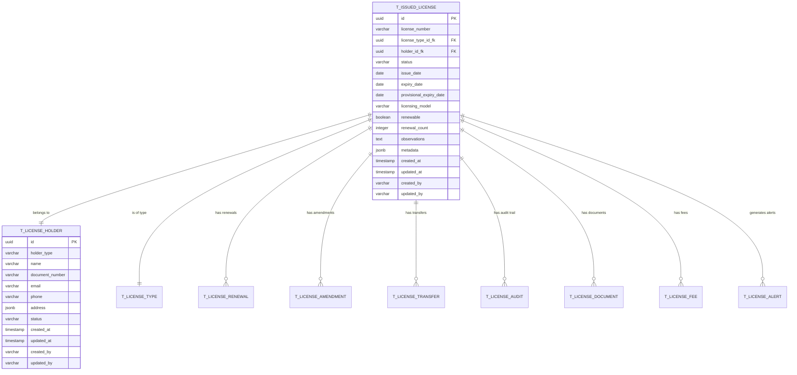
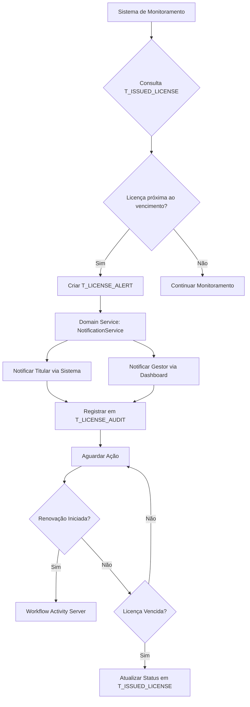
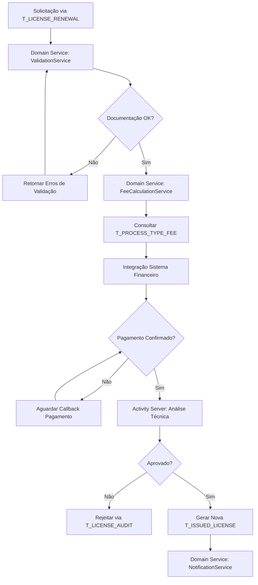
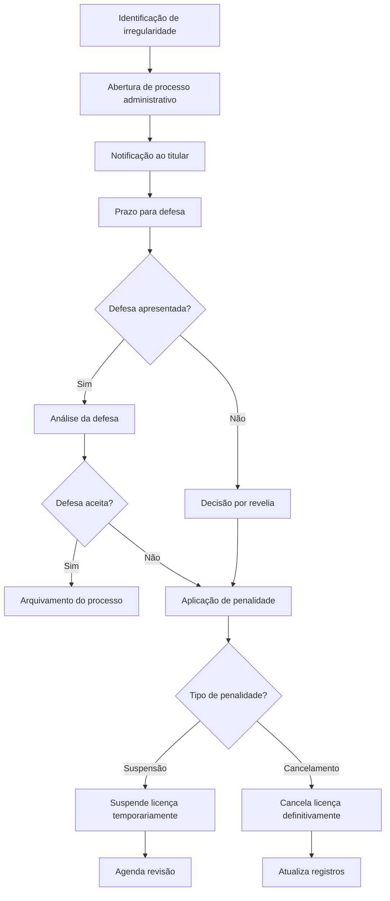

# Análise Conceitual - Módulos de Gestão de Licenças Emitidas

## Sistema de Licenciamento de Cabo Verde

## 1. Visão Geral do Módulo

O módulo de **Gestão de Licenças Emitidas** é responsável pela gestão completa do ciclo de vida das licenças após sua emissão, incluindo monitoramento de validade, processos de renovação, alterações, suspensão e controle de conformidade. Este módulo integra-se com o sistema de parametrização existente e utiliza arquitetura DDD para garantir robustez e manutenibilidade.

### 1.1 Objetivos

* Implementar gestão completa do ciclo de vida de licenças emitidas

* Fornecer monitoramento automatizado de validade e alertas

* Processar renovações, alterações e transferências de titularidade

* Garantir rastreabilidade completa através de auditoria

* Integrar com sistemas externos (Activity, Financeiro, Notificações)

* Suportar diferentes modelos de licenciamento (simples, complexo, automático)

* Implementar controles de acesso baseados em perfis de usuário

### 1.2 Entidades Principais

* **T\_ISSUED\_LICENSE**: Licenças emitidas com controle de ciclo de vida

* **T\_LICENSE\_HOLDER**: Titulares de licenças (pessoas físicas/jurídicas)

* **T\_LICENSE\_RENEWAL**: Processos de renovação de licenças

* **T\_LICENSE\_AMENDMENT**: Alterações e aditivos às licenças

* **T\_LICENSE\_TRANSFER**: Transferências de titularidade

* **T\_LICENSE\_AUDIT**: Histórico completo de auditoria

## 2. Modelo de Dados Normalizado

### 2.1 Diagrama ER

## 3. Requisitos Funcionais

### 3.1 Gestão do Ciclo de Vida das Licenças

#### RF001 - Consulta de Licenças Emitidas

* **Descrição:** Permitir consulta e visualização de todas as licenças emitidas no sistema com filtros avançados

* **Critérios de Aceitação:**

  * Busca por número da licença, titular, tipo, setor ou categoria

  * Filtros por status (ACTIVE, EXPIRED, SUSPENDED, CANCELLED)

  * Filtros por período de emissão e validade

  * Visualização em lista paginada com ordenação

  * Exportação de resultados em CSV/Excel

  * Integração com sistema de cache para performance

#### RF002 - Detalhamento de Licença

* **Descrição:** Exibir informações completas de uma licença específica com histórico de auditoria

* **Critérios de Aceitação:**

  * Dados do titular (T\_LICENSE\_HOLDER) e representante legal

  * Informações técnicas da licença vinculadas ao T\_LICENSE\_TYPE

  * Histórico completo de alterações (T\_LICENSE\_AUDIT)

  * Documentos anexos (T\_LICENSE\_DOCUMENT) e legislação aplicável

  * Status atual e datas relevantes com validações de negócio

  * Taxas pagas e pendentes (T\_LICENSE\_FEE)

  * Integração com sistema de parametrização para dados dinâmicos

#### RF003 - Monitoramento de Validade

* **Descrição:** Controlar e alertar sobre vencimentos de licenças através do T\_LICENSE\_ALERT

* **Critérios de Aceitação:**

  * Dashboard com licenças próximas ao vencimento

  * Alertas automáticos configuráveis (90, 60, 30, 15 dias)

  * Notificações por email integradas com sistema de notificações

  * Relatórios de licenças vencidas com filtros avançados

  * Configuração de períodos de alerta por tipo de licença via T\_OPTIONS

  * Processamento assíncrono de alertas com queue system

#### RF004 - Processo de Renovação

* **Descrição:** Gerenciar solicitações de renovação através da tabela T\_LICENSE\_RENEWAL

* **Critérios de Aceitação:**

  * Iniciação automática baseada em configurações do T\_LICENSE\_PARAMETER

  * Validação de documentos e requisitos via Domain Services

  * Cálculo automático de taxas através de T\_PROCESS\_TYPE\_FEE

  * Workflow de aprovação integrado com Activity Server

  * Geração de nova licença com numeração sequencial

  * Versionamento de licenças renovadas

  * Integração com sistema de pagamentos

#### RF005 - Suspensão e Cancelamento

* **Descrição:** Permitir suspensão temporária ou cancelamento definitivo com auditoria completa

* **Critérios de Aceitação:**

  * Registro de motivo da suspensão/cancelamento no T\_LICENSE\_AUDIT

  * Workflow de aprovação para ações administrativas via Activity

  * Notificação automática ao titular via sistema de notificações

  * Histórico completo de ações com rastreabilidade

  * Possibilidade de reativação de licenças suspensas

  * Validações de regras de negócio através de Domain Services

  * Integração com sistema de compliance

### 3.2 Gestão de Alterações

#### RF006 - Alteração de Dados da Licença

* **Descrição:** Permitir alterações em dados não críticos através da tabela T\_LICENSE\_AMENDMENT

* **Critérios de Aceitação:**

  * Identificação de campos editáveis por tipo de licença via T\_LICENSE\_PARAMETER

  * Workflow de aprovação para alterações integrado com Activity Server

  * Versionamento completo de dados alterados no T\_LICENSE\_AUDIT

  * Geração de aditivos à licença original com numeração sequencial

  * Cobrança de taxas quando aplicável via T\_PROCESS\_TYPE\_FEE

  * Validações de regras de negócio através de Domain Services

  * Notificação automática ao titular sobre alterações

#### RF007 - Transferência de Titularidade

* **Descrição:** Processar transferências através da tabela T\_LICENSE\_TRANSFER

* **Critérios de Aceitação:**

  * Validação de documentação do novo titular via T\_LICENSE\_HOLDER

  * Verificação de impedimentos legais através de Domain Services

  * Workflow de aprovação específico integrado com Activity

  * Atualização de dados cadastrais com auditoria completa

  * Emissão de nova licença com nova titularidade

  * Histórico completo da transferência no T\_LICENSE\_AUDIT

  * Integração com sistema de organizações globais

### 3.3 Relatórios e Analytics

#### RF008 - Dashboard Executivo

* **Descrição:** Apresentar indicadores-chave baseados em dados normalizados das tabelas T\_ISSUED\_LICENSE e T\_LICENSE\_AUDIT

* **Critérios de Aceitação:**

  * Métricas de licenças ativas, vencidas e em processo via consultas otimizadas

  * Gráficos de tendências temporais com cache Redis para performance

  * Indicadores de receita por tipo de licença integrados com T\_PROCESS\_TYPE\_FEE

  * Alertas de licenças próximas ao vencimento via T\_LICENSE\_ALERT

  * Filtros por período, setor e categoria usando índices otimizados

  * Integração com sistema de Business Intelligence

  * Atualização em tempo real via WebSockets

#### RF009 - Relatórios Operacionais

* **Descrição:** Gerar relatórios detalhados através de consultas estruturadas no modelo normalizado

* **Critérios de Aceitação:**

  * Relatório de licenças por status com dados do T\_ISSUED\_LICENSE

  * Relatório de renovações pendentes via T\_LICENSE\_RENEWAL

  * Relatório de receitas por período integrado com sistema financeiro

  * Relatório de auditoria completa baseado em T\_LICENSE\_AUDIT

  * Exportação em múltiplos formatos (PDF, Excel, CSV) via serviços especializados

  * Agendamento automático de relatórios

  * Controle de acesso baseado em perfis de usuário

## 4. Requisitos Não Funcionais

### 4.1 Performance e Escalabilidade

#### RNF001 - Tempo de Resposta

* Consultas simples: máximo 2 segundos com índices otimizados

* Relatórios complexos: máximo 30 segundos com cache Redis

* Exportações: processamento assíncrono com notificação via WebSockets

#### RNF002 - Capacidade

* Suporte a 10.000 licenças ativas simultâneas com arquitetura distribuída

* 1.000 usuários concorrentes com load balancing

* Crescimento de 20% ao ano com escalabilidade horizontal

#### RNF003 - Disponibilidade

* 99.5% de uptime durante horário comercial com alta disponibilidade

* Janela de manutenção: domingos 02:00-06:00

* Backup automático diário com retenção configurável

### 4.2 Segurança e Compliance

#### RNF004 - Autenticação e Autorização

* Integração com Supabase Auth e Active Directory/LDAP

* Controle de acesso baseado em perfis via RLS (Row Level Security)

* Sessões com timeout configurável

* Log de tentativas de acesso com monitoramento

#### RNF005 - Proteção de Dados

* Criptografia de dados sensíveis em repouso e em trânsito

* Comunicação via HTTPS/TLS 1.3

* Anonimização de dados para relatórios

* Compliance com LGPD/GDPR

### 4.3 Usabilidade e Experiência

#### RNF006 - Interface

* Design responsivo baseado em Design System corporativo

* Compatibilidade com navegadores modernos

* Acessibilidade WCAG 2.1 nível AA

* Suporte a múltiplos idiomas (PT, EN) via internacionalização

* PWA com funcionalidades offline para consultas básicas

## 5. Fluxos de Trabalho

### 5.1 Monitoramento de Validade

### 5.2 Processo de Renovação

### 4.3 Fluxo de Suspensão/Cancelamento

## 5. Integração com Outros Módulos

### 5.1 Integração com Módulo de Parametrização

#### Dependências

* **Tipos de Licença:** Herda configurações através de T\_LICENSE\_TYPE com validações de Domain Services

* **Legislação:** Aplica normas vigentes via T\_LEGISLATION com versionamento

* **Entidades:** Utiliza dados de órgãos através de T\_ENTITY com cache distribuído

* **Processos:** Executa workflows via T\_LICENSE\_TYPE\_PROCESS\_TYPE

#### Sincronização

* Atualização automática via Event Sourcing quando parâmetros são alterados

* Versionamento de configurações através de T\_LICENSE\_AUDIT

* Migração controlada via Domain Services especializados

### 5.2 Integração com Sistema de Processos (Activity)

#### Funcionalidades

* Criação automática via Domain Services integrados

* Acompanhamento através de T\_LICENSE\_AUDIT

* Notificações via Event-Driven Architecture

* Integração com workflow engine via APIs REST

#### APIs Utilizadas

* `POST /api/processes` - Criação com dados normalizados

* `GET /api/processes/{id}/status` - Consulta com cache Redis

* `PUT /api/processes/{id}/advance` - Avanço com auditoria

* `GET /api/processes/search` - Busca com Elasticsearch

### 5.3 Integração com Sistema Financeiro

#### Funcionalidades

* Geração via T\_PROCESS\_TYPE\_FEE com cálculos automatizados

* Consulta através de webhooks com retry pattern

* Conciliação via Saga Pattern para consistência

* Relatórios integrados com Business Intelligence

#### Dados Compartilhados

* Códigos via T\_FEE\_CATEGORY estruturados

* Valores através de Domain Services especializados

* Histórico normalizado em T\_LICENSE\_AUDIT

* Dados de inadimplência com alertas automáticos

### 5.4 Integração com Sistema de Notificações

#### Canais de Comunicação

* Email via templates estruturados em T\_LICENSE\_ALERT

* SMS através de Domain Services especializados

* Push notifications via WebSockets em tempo real

* Publicação automatizada com workflow aprovação

#### Templates de Mensagens

* Alertas baseados em T\_LICENSE\_PARAMETER configuráveis

* Confirmações via T\_LICENSE\_AUDIT estruturadas

* Notificações com dados normalizados do titular

* Lembretes programados via scheduler distribuído

## 6. Controles de Acesso e Segurança

### 6.1 Perfis de Usuário (Row Level Security)

#### Consultor

* **Permissões via RLS:**

  * `SELECT` em T\_ISSUED\_LICENSE (filtrado por setor)

  * `SELECT` em T\_LICENSE\_HOLDER (dados básicos)

  * `SELECT` em relatórios pré-definidos

  * Exportação limitada via Domain Services

* **Restrições:**

  * Não acessa dados pessoais completos

  * Não visualiza informações financeiras

  * Limitado a consultas básicas

#### Analista

* **Permissões via RLS:**

  * Herda permissões de Consultor

  * `INSERT/UPDATE` em T\_LICENSE\_RENEWAL

  * `UPDATE` em T\_ISSUED\_LICENSE (campos específicos)

  * `INSERT` em T\_LICENSE\_AMENDMENT

  * `SELECT` em T\_LICENSE\_AUDIT (auditoria básica)

* **Restrições:**

  * Não pode suspender/cancelar licenças

  * Não acessa configurações do sistema

  * Limitado a ações de rotina

#### Supervisor

* **Permissões via RLS:**

  * Herda permissões do Analista

  * `UPDATE` em T\_ISSUED\_LICENSE (status temporário)

  * `INSERT` em T\_LICENSE\_ALERT

  * Acesso a workflows via Activity Server

* **Restrições:**

  * Não pode cancelar licenças definitivamente

  * Não altera parâmetros do sistema

#### Gestor

* **Permissões via RLS:**

  * Herda permissões do Supervisor

  * `UPDATE` em T\_ISSUED\_LICENSE (cancelamento definitivo)

  * `INSERT/UPDATE` em T\_LICENSE\_TRANSFER

  * `SELECT` em relatórios executivos

  * Configuração de workflows via Activity

* **Restrições:**

  * Não altera estrutura de dados

  * Não gerencia usuários do sistema

#### Administrador

* **Permissões via RLS:**

  * `ALL PRIVILEGES` em todas as tabelas T\_\*

  * Acesso completo a T\_LICENSE\_AUDIT

  * Configuração de T\_LICENSE\_PARAMETER

  * Gerenciamento de usuários via Supabase Auth

  * Execução de operações em lote via Domain Services

### 6.2 Controles de Segurança por Funcionalidade

#### Consulta de Licenças

* **Autenticação:** Obrigatória para todas as consultas

* **Autorização:** Baseada no perfil do usuário via RLS

* **Auditoria:** Log completo em T\_LICENSE\_AUDIT com rastreabilidade

* **Filtros de Dados:** Aplicados conforme perfil com cache distribuído

* **Rate Limiting:** Controle de taxa via middleware especializado

#### Alteração de Dados

* **Autenticação:** Dupla verificação para alterações críticas

* **Autorização:** Workflow de aprovação via Activity Server

* **Auditoria:** Versionamento completo em T\_LICENSE\_AUDIT

* **Validação:** Verificação através de Domain Services

* **Rollback:** Controle via Event Sourcing

#### Relatórios

* **Autenticação:** Sessão válida obrigatória

* **Autorização:** Acesso granular por tipo de relatório

* **Auditoria:** Log detalhado em T\_LICENSE\_AUDIT

* **Anonimização:** Sanitização conforme LGPD

* **Watermark:** Identificação dinâmica do usuário

### 6.3 Políticas de Segurança

#### Gestão de Senhas

* Complexidade mínima: 8 caracteres, maiúsculas, minúsculas, números

* Renovação obrigatória a cada 90 dias

* Histórico de 12 senhas anteriores

* Bloqueio após 5 tentativas incorretas

#### Controle de Sessão

* Timeout automático após 30 minutos de inatividade

* Sessão única por usuário

* Logout automático fora do horário comercial

* Monitoramento de sessões suspeitas

#### Proteção de Dados

* Criptografia AES-256 para dados em repouso

* Hashing SHA-256 para senhas

* Comunicação exclusiva via HTTPS

* Backup criptografado com chaves rotacionadas

#### Monitoramento e Alertas

* Detecção de tentativas de acesso não autorizado

* Alertas para alterações em dados críticos

* Monitoramento de performance e disponibilidade

* Relatórios de segurança semanais

## 7. Considerações de Implementação

### 7.1 Arquitetura DDD Recomendada

#### Frontend

* React 18+ com TypeScript e Design System corporativo

* Material-UI ou Ant Design para componentes

* Redux Toolkit para gerenciamento de estado

* React Query para cache e sincronização

#### Backend (Domain-Driven Design)

* Node.js com NestJS ou .NET Core

* Supabase (PostgreSQL) com RLS nativo

* Redis distribuído para cache

* Event-Driven Architecture com RabbitMQ

#### Infraestrutura

* Containerização com Docker

* Orquestração com Kubernetes

* Load balancer com NGINX

* Observabilidade com Prometheus/Grafana

### 7.2 Fases de Implementação DDD

#### Fase 1 - Domain Core (3 meses)

* Implementação de Aggregates principais (IssuedLicense, LicenseHolder)

* Domain Services essenciais (ValidationService, NotificationService)

* Repository Pattern com Supabase integration

* Consulta básica com RLS implementado

#### Fase 2 - Application Services (2 meses)

* Command/Query handlers para operações CRUD

* Integration Events para comunicação entre bounded contexts

* Workflow integration com Activity Server

* Monitoramento automatizado de validade

#### Fase 3 - Advanced Features (2 meses)

* Complex Domain Services (FeeCalculationService, TransferService)

* Event Sourcing para auditoria avançada

* Relatórios com Business Intelligence integration

* Otimizações de performance com índices especializados

### 7.3 Critérios de Sucesso DDD

#### Métricas de Performance

* Tempo médio de consulta < 2 segundos com cache distribuído

* Disponibilidade > 99.5% com arquitetura resiliente

* Satisfação do usuário > 4.0/5.0

* Redução de 50% no tempo de processamento

#### Métricas de Negócio

* Aumento de 30% na taxa de renovação

* Redução de 40% em licenças vencidas

* Melhoria de 60% na arrecadação

* Diminuição de 70% em retrabalho manual

#### Métricas de Qualidade

* 100% dos conceitos de negócio modelados como Aggregates

* Cobertura de testes > 80% em Domain Services

* Zero incidentes com RLS e auditoria completa

## 8. Conclusão

Esta análise conceitual estabelece as bases para o desenvolvimento de um sistema robusto de gestão de licenças emitidas, complementando o sistema de parametrização existente. A implementação deve seguir uma abordagem incremental, priorizando funcionalidades core e expandindo gradualmente para recursos avançados.

O sucesso do projeto depende da integração efetiva com os sistemas existentes, da implementação adequada dos controles de segurança e do atendimento aos requisitos de performance e usabilidade especificados.
