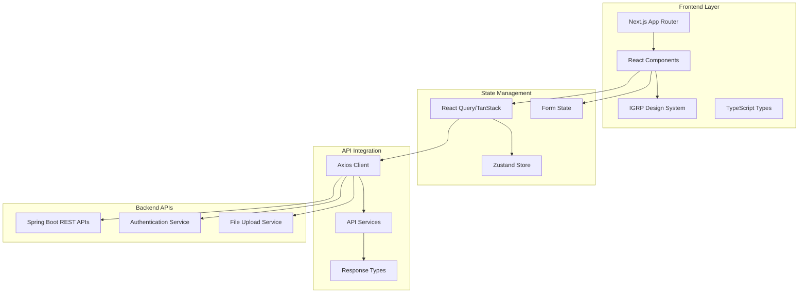
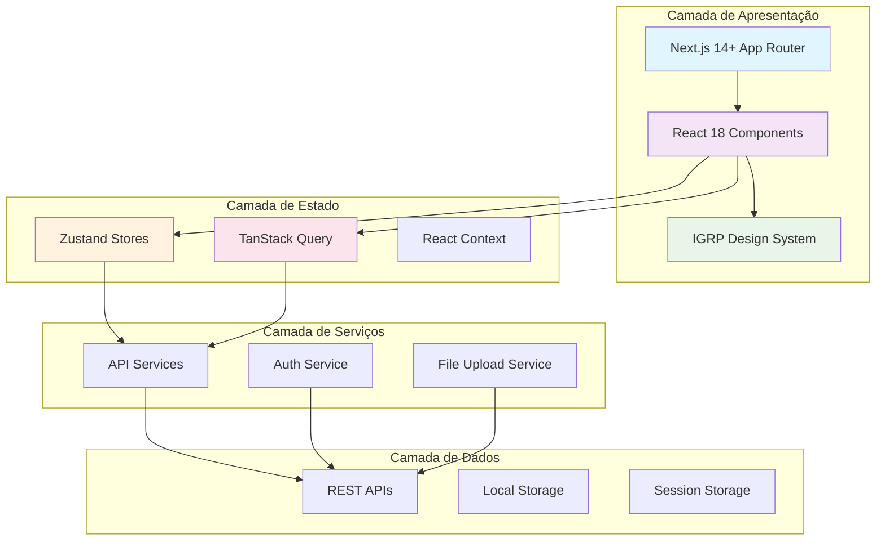
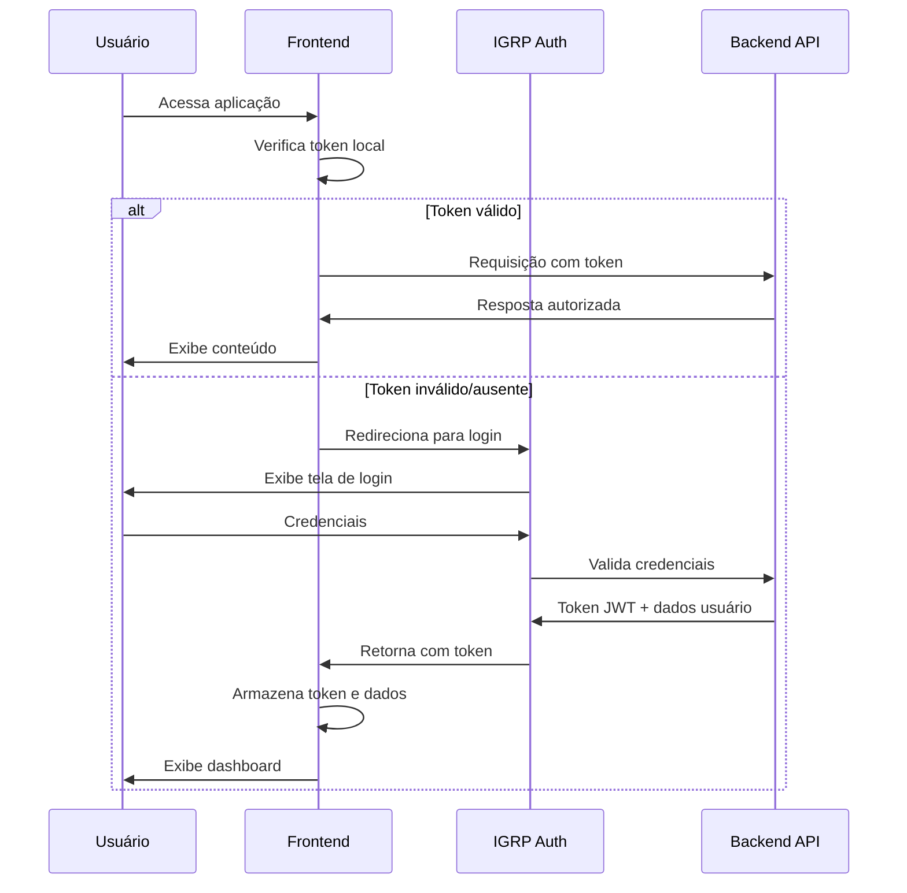
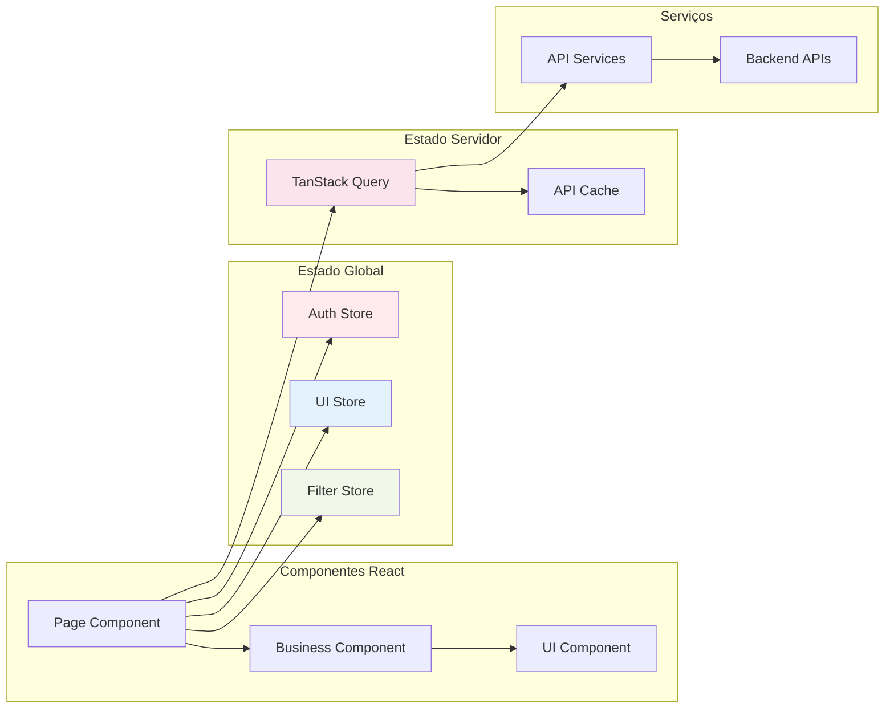
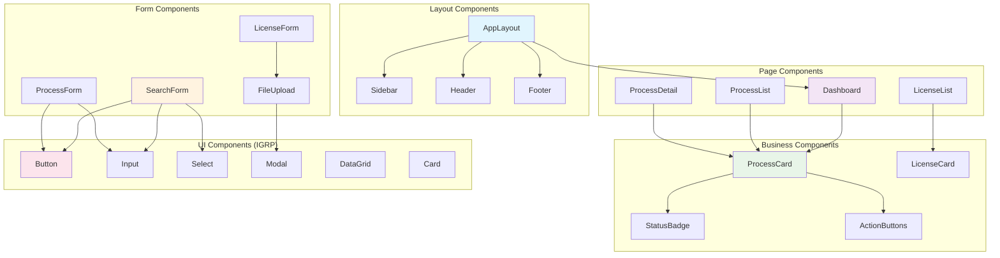
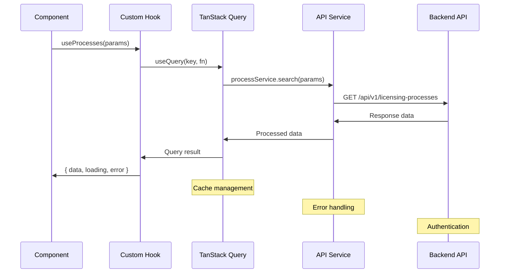
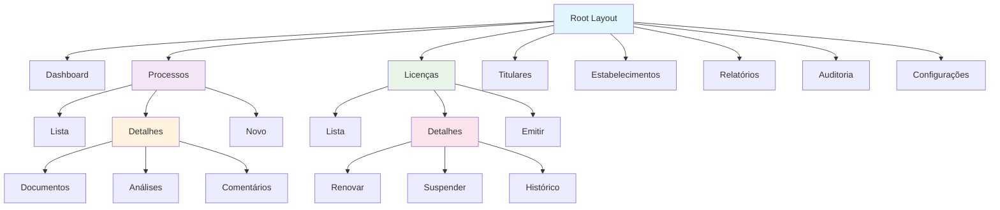

# IMPL-LIC-Plano-Implementacao-Frontend

# Sistema de Gestão de Licenciamento - Plano de Implementação Frontend

## 1. Visão Geral do Projeto

### 1.1 Objetivo

Implementar a interface frontend completa do Sistema de Gestão de Licenciamento de Cabo Verde, integrando com as APIs REST do backend e utilizando o IGRP Design System para criar uma experiência de usuário moderna, responsiva e acessível.

### 1.2 Escopo da Implementação

- **Diretório Base**: `c:\projects\ta-digital\projects\licenciamento-gestao-frontend`
- **Framework**: Next.js 14+ com App Router + React 18 + TypeScript
- **Design System**: `@igrp/igrp-framework-react-design-system`
- **Arquitetura**: Domain-Driven Design (DDD) no frontend
- **Integração**: APIs REST do backend Spring Boot

### 1.3 Módulos do Sistema Frontend

O frontend implementará interfaces para os seguintes módulos:

1. **Parametrização de Licenciamento**
   - Gestão de opções base, setores, categorias e tipos de licenças
   - Configuração de dossiers de tipos de licença

2. **Gestão de Processos de Licenciamento**
   - Controle completo do fluxo de processos
   - Gestão de documentos, análises e comentários
   - Atribuição de analistas e workflow

3. **Gestão de Licenças Emitidas**
   - Emissão, renovação, suspensão e cancelamento
   - Controle de status e histórico

4. **Gestão de Titulares de Licença**
   - Cadastro de pessoas físicas e jurídicas
   - Verificação de capacidade legal

5. **Gestão de Emissores de Licenças**
   - Cadastro de órgãos emissores
   - Controle de competências e jurisdições

6. **Gestão de Estabelecimentos**
   - Cadastro com georreferenciamento
   - Gestão de documentos

7. **Dashboard e Relatórios**
   - Métricas em tempo real
   - Central de alertas
   - Relatórios e auditoria

### 1.4 Responsabilidades Técnicas

**Framework IGRP (Infraestrutura):**
- Autenticação JWT e autorização baseada em roles
- Sistema de cache e performance
- Deployment e configurações de produção
- Monitoramento e logs estruturados
- Layout base e temas governamentais

**Desenvolvimento Frontend (Nossa responsabilidade):**
- Componentes de interface específicos do domínio
- Integração com APIs REST do backend
- Roteamento dinâmico e navegação
- Formulários complexos com validação
- Estados de aplicação e gerenciamento de dados
- Experiência do usuário (UX/UI) otimizada

## 2. Arquitetura Frontend

### 2.1 Diagrama de Arquitetura



### 2.2 Estrutura de Rotas (App Router)

Baseado na especificação técnica, implementaremos as seguintes rotas:

| Rota Frontend | Propósito | Backend API | Componente Principal |
|---------------|-----------|-------------|---------------------|
| `/dashboard` | Métricas e alertas em tempo real | `/api/v1/licensing-processes/dashboard` | DashboardPage |
| `/processos` | Lista de processos de licenciamento | `/api/v1/licensing-processes` | ProcessListPage |
| `/processos/[id]` | Detalhes do processo | `/api/v1/licensing-processes/{id}` | ProcessDetailPage |
| `/processos/[id]/documentos` | Gestão de documentos | `/api/v1/licensing-processes/{id}/documents` | ProcessDocumentsPage |
| `/processos/[id]/analises` | Análises técnicas | `/api/v1/licensing-processes/{id}/analyses` | ProcessAnalysisPage |
| `/processos/[id]/comentarios` | Comentários e comunicações | `/api/v1/licensing-processes/{id}/comments` | ProcessCommentsPage |
| `/licencas` | Lista de licenças emitidas | `/api/v1/issued-licenses` | LicenseListPage |
| `/licencas/[id]` | Detalhes da licença | `/api/v1/issued-licenses/{id}` | LicenseDetailPage |
| `/licencas/[id]/renovar` | Processo de renovação | `/api/v1/issued-licenses/{id}/renew` | LicenseRenewalPage |
| `/licencas/[id]/suspender` | Suspensão de licença | `/api/v1/issued-licenses/{id}/suspend` | LicenseSuspensionPage |
| `/licencas/[id]/historico` | Histórico da licença | `/api/v1/licensing-processes/{id}/audit-trail` | LicenseHistoryPage |
| `/titulares` | Gestão de titulares | `/api/v1/license-holders` | HolderListPage |
| `/titulares/[id]` | Detalhes do titular | `/api/v1/license-holders/{id}` | HolderDetailPage |
| `/emissores` | Gestão de órgãos emissores | `/api/v1/license-issuers` | IssuerListPage |
| `/emissores/[id]` | Detalhes do emissor | `/api/v1/license-issuers/{id}` | IssuerDetailPage |
| `/estabelecimentos` | Gestão de estabelecimentos | `/api/v1/establishments` | EstablishmentListPage |
| `/estabelecimentos/[id]` | Detalhes do estabelecimento | `/api/v1/establishments/{id}` | EstablishmentDetailPage |
| `/alertas` | Central de alertas | `/api/v1/notifications` | AlertsPage |
| `/relatorios` | Relatórios do sistema | `/api/v1/reports` | ReportsPage |
| `/auditoria` | Logs de auditoria | `/api/v1/audit-logs` | AuditPage |
| `/parametrizacao` | Configurações do sistema | `/api/v1/options` | ParametrizationPage |

### 2.3 Padrões Arquiteturais Frontend

#### 2.3.1 Domain-Driven Design (DDD) no Frontend

- **Entities**: Modelos de domínio (License, Process, Holder, etc.)
- **Value Objects**: Objetos de valor (Status, ContactInfo, etc.)
- **Services**: Serviços de domínio (ValidationService, FormatterService)
- **Repositories**: Camada de acesso a dados (API clients)

#### 2.3.2 Component-Based Architecture

- **Pages**: Componentes de página (rotas)
- **Layouts**: Layouts reutilizáveis
- **Components**: Componentes de negócio
- **UI Components**: Componentes base do design system

#### 2.3.3 State Management Strategy

- **Server State**: React Query/TanStack Query para dados do servidor
- **Client State**: Zustand para estado local da aplicação
- **Form State**: React Hook Form para formulários
- **URL State**: Next.js router para estado da URL

## 3. Estrutura de Pastas e Componentes

### 3.1 Estrutura Completa do Projeto

```
c:\projects\ta-digital\projects\licenciamento-gestao-frontend\
├── src/
│   ├── app/
│   │   ├── (igrp)/
│   │   │   ├── (generated)/                    # Páginas dinâmicas IGRP
│   │   │   │   ├── licencas/
│   │   │   │   │   ├── page.tsx               # Interface de consulta
│   │   │   │   │   ├── [id]/
│   │   │   │   │   │   ├── page.tsx           # Interface de detalhes
│   │   │   │   │   │   ├── renovar/
│   │   │   │   │   │   │   └── page.tsx       # Interface de renovação
│   │   │   │   │   │   ├── alterar/
│   │   │   │   │   │   │   └── page.tsx       # Interface de alteração
│   │   │   │   │   │   ├── transferir/
│   │   │   │   │   │   │   └── page.tsx       # Interface de transferência
│   │   │   │   │   │   ├── suspender/
│   │   │   │   │   │   │   └── page.tsx       # Interface de suspensão
│   │   │   │   │   │   └── historico/
│   │   │   │   │   │       └── page.tsx       # Interface de histórico
│   │   │   │   ├── estabelecimentos/
│   │   │   │   │   ├── page.tsx               # Interface de listagem
│   │   │   │   │   ├── [id]/
│   │   │   │   │   │   ├── page.tsx           # Interface de detalhes
│   │   │   │   │   │   ├── editar/
│   │   │   │   │   │   │   └── page.tsx       # Interface de edição
│   │   │   │   │   │   └── documentos/
│   │   │   │   │   │       └── page.tsx       # Interface de documentos
│   │   │   │   │   └── novo/
│   │   │   │   │       └── page.tsx           # Interface de criação
│   │   │   │   ├── dashboard/
│   │   │   │   │   └── page.tsx               # Interface do dashboard
│   │   │   │   ├── alertas/
│   │   │   │   │   └── page.tsx               # Interface de alertas
│   │   │   │   ├── relatorios/
│   │   │   │   │   └── page.tsx               # Interface de relatórios
│   │   │   │   └── auditoria/
│   │   │   │       └── page.tsx               # Interface de auditoria
│   │   │   └── globals.css                    # Estilos das páginas
│   ├── components/                            # Componentes visuais
│   │   ├── ui/                               # Componentes base IGRP
│   │   │   ├── Button/
│   │   │   │   ├── Button.tsx
│   │   │   │   ├── ButtonGroup.tsx
│   │   │   │   ├── IconButton.tsx
│   │   │   │   └── index.ts
│   │   │   ├── Input/
│   │   │   │   ├── Input.tsx
│   │   │   │   ├── InputGroup.tsx
│   │   │   │   ├── SearchInput.tsx
│   │   │   │   └── index.ts
│   │   │   ├── Card/
│   │   │   │   ├── Card.tsx
│   │   │   │   ├── CardHeader.tsx
│   │   │   │   ├── CardContent.tsx
│   │   │   │   ├── CardActions.tsx
│   │   │   │   └── index.ts
│   │   │   ├── DataGrid/
│   │   │   │   ├── DataGrid.tsx
│   │   │   │   ├── DataGridHeader.tsx
│   │   │   │   ├── DataGridRow.tsx
│   │   │   │   ├── DataGridPagination.tsx
│   │   │   │   └── index.ts
│   │   │   ├── Modal/
│   │   │   │   ├── Modal.tsx
│   │   │   │   ├── ModalHeader.tsx
│   │   │   │   ├── ModalContent.tsx
│   │   │   │   ├── ModalActions.tsx
│   │   │   │   └── index.ts
│   │   │   ├── Tabs/
│   │   │   │   ├── Tabs.tsx
│   │   │   │   ├── TabList.tsx
│   │   │   │   ├── TabPanel.tsx
│   │   │   │   └── index.ts
│   │   │   └── index.ts
│   │   ├── forms/                            # Formulários específicos
│   │   │   ├── LicenseSearchForm/
│   │   │   │   ├── LicenseSearchForm.tsx
│   │   │   │   ├── AdvancedFilters.tsx
│   │   │   │   ├── QuickFilters.tsx
│   │   │   │   └── index.ts
│   │   │   ├── EstablishmentForm/
│   │   │   │   ├── EstablishmentForm.tsx
│   │   │   │   ├── BasicInfoSection.tsx
│   │   │   │   ├── LocationSection.tsx
│   │   │   │   ├── DocumentsSection.tsx
│   │   │   │   └── index.ts
│   │   │   ├── RenewalForm/
│   │   │   │   ├── RenewalWizard.tsx
│   │   │   │   ├── StepIndicator.tsx
│   │   │   │   ├── DocumentUploadStep.tsx
│   │   │   │   ├── ReviewStep.tsx
│   │   │   │   └── index.ts
│   │   │   └── index.ts
│   │   ├── business/                         # Componentes de negócio
│   │   │   ├── LicenseCard/
│   │   │   │   ├── LicenseCard.tsx
│   │   │   │   ├── LicenseStatus.tsx
│   │   │   │   ├── LicenseActions.tsx
│   │   │   │   └── index.ts
│   │   │   ├── EstablishmentCard/
│   │   │   │   ├── EstablishmentCard.tsx
│   │   │   │   ├── LocationInfo.tsx
│   │   │   │   └── index.ts
│   │   │   ├── Dashboard/
│   │   │   │   ├── MetricsCards.tsx
│   │   │   │   ├── AlertsPanel.tsx
│   │   │   │   ├── ExpirationChart.tsx
│   │   │   │   ├── RecentActivity.tsx
│   │   │   │   └── index.ts
│   │   │   ├── StatusBadge/
│   │   │   │   ├── StatusBadge.tsx
│   │   │   │   ├── ExpirationBadge.tsx
│   │   │   │   └── index.ts
│   │   │   └── index.ts
│   │   └── layout/                           # Componentes de navegação
│   │       ├── PageHeader/
│   │       │   ├── PageHeader.tsx
│   │       │   ├── Breadcrumb.tsx
│   │       │   ├── PageActions.tsx
│   │       │   └── index.ts
│   │       ├── Navigation/
│   │       │   ├── MainNavigation.tsx
│   │       │   ├── NavigationItem.tsx
│   │       │   └── index.ts
│   │       └── index.ts
│   ├── hooks/                                # Hooks para UI
│   │   ├── useFormValidation.ts              # Validação de formulários
│   │   ├── useModal.ts                       # Controle de modais
│   │   ├── usePagination.ts                  # Paginação de dados
│   │   ├── useSearch.ts                      # Funcionalidade de busca
│   │   ├── useFilters.ts                     # Filtros dinâmicos
│   │   └── index.ts
│   ├── lib/
│   │   ├── utils/                            # Utilitários de UI
│   │   │   ├── formatters.ts                 # Formatação de dados
│   │   │   ├── validators.ts                 # Validações de formulário
│   │   │   ├── constants.ts                  # Constantes da UI
│   │   │   ├── classNames.ts                 # Utilitários de CSS
│   │   │   └── index.ts
│   │   ├── types/                            # Tipos para componentes
│   │   │   ├── license.ts
│   │   │   ├── establishment.ts
│   │   │   ├── forms.ts
│   │   │   ├── ui.ts
│   │   │   └── index.ts
│   │   └── config/
│   │       ├── routes.ts                     # Configuração de rotas
│   │       ├── navigation.ts                 # Estrutura de navegação
│   │       └── ui-constants.ts               # Constantes da interface
│   └── styles/                               # Estilos customizados
│       ├── globals.css                       # Estilos globais
│       ├── components.css                    # Estilos de componentes
│       ├── forms.css                         # Estilos de formulários
│       └── themes/
│           ├── license-theme.css             # Tema específico
│           └── government-colors.css         # Cores governamentais
├── public/
│   ├── icons/                                # Ícones da interface
│   │   ├── license-status/
│   │   ├── actions/
│   │   └── navigation/
│   └── images/
│       ├── placeholders/
│       ├── logos/
│       └── backgrounds/
└── docs/
    ├── components/                           # Documentação de componentes
    │   ├── ui-components.md
    │   ├── form-components.md
    │   └── business-components.md
    └── style-guide/
        ├── design-tokens.md
        ├── component-patterns.md
        └── accessibility.md
```

### 3.2 Responsabilidades dos Componentes

#### Componentes UI (Base IGRP)

- **Button**: Botões de ação, grupos de botões, botões com ícones
- **Input**: Campos de entrada, grupos de campos, campos de busca
- **Card**: Containers de conteúdo, cabeçalhos, ações
- **DataGrid**: Tabelas de dados, paginação, ordenação
- **Modal**: Diálogos, confirmações, formulários modais
- **Tabs**: Navegação por abas, painéis de conteúdo

#### Componentes de Formulário

- **LicenseSearchForm**: Busca avançada, filtros rápidos, filtros avançados
- **EstablishmentForm**: Informações básicas, localização, documentos
- **RenewalForm**: Wizard de renovação, indicador de progresso, upload de documentos

#### Componentes de Negócio

- **LicenseCard**: Exibição de licenças, status, ações contextuais
- **EstablishmentCard**: Informações de estabelecimento, localização
- **Dashboard**: Métricas, alertas, gráficos, atividades recentes
- **StatusBadge**: Indicadores de status, badges de expiração

## 4. Componentização Visual

### 4.1 Componentes de Interface

#### Componentes Base IGRP

```typescript
// components/ui/Button/Button.tsx
import { Button as IGRPButton } from '@igrp/igrp-framework-react-design-system';

interface ButtonProps {
  variant?: 'primary' | 'secondary' | 'danger' | 'success';
  size?: 'sm' | 'md' | 'lg';
  icon?: string;
  children: React.ReactNode;
  onClick?: () => void;
  disabled?: boolean;
}

export const Button: React.FC<ButtonProps> = ({
  variant = 'primary',
  size = 'md',
  icon,
  children,
  onClick,
  disabled = false
}) => {
  return (
    <IGRPButton
      variant={variant}
      size={size}
      icon={icon}
      onClick={onClick}
      disabled={disabled}
      className={`license-button license-button--${variant}`}
    >
      {children}
    </IGRPButton>
  );
};
```

#### Componentes de Formulário Visual

```typescript
// components/forms/LicenseSearchForm/LicenseSearchForm.tsx
import { Input, Select, DatePicker } from '@igrp/igrp-framework-react-design-system';
import { Button } from '@/components/ui/Button';

interface SearchFormProps {
  onSearch: (filters: SearchFilters) => void;
  onClear: () => void;
}

export const LicenseSearchForm: React.FC<SearchFormProps> = ({
  onSearch,
  onClear
}) => {
  return (
    <div className="bg-white p-6 rounded-lg shadow-sm border">
      <h3 className="text-lg font-semibold mb-4">Buscar Licenças</h3>

      <div className="grid grid-cols-1 md:grid-cols-3 gap-4 mb-4">
        <Input
          label="Número da Licença"
          placeholder="Digite o número..."
          className="license-search-input"
        />

        <Select
          label="Tipo de Licença"
          placeholder="Selecione o tipo..."
          options={licenseTypeOptions}
          className="license-search-select"
        />

        <Select
          label="Status"
          placeholder="Selecione o status..."
          options={statusOptions}
          className="license-search-select"
        />
      </div>

      <div className="flex justify-end space-x-2">
        <Button variant="secondary" onClick={onClear}>
          Limpar
        </Button>
        <Button variant="primary" onClick={onSearch}>
          Pesquisar
        </Button>
      </div>
    </div>
  );
};
```

#### Componentes de Negócio Visual

```typescript
// components/business/LicenseCard/LicenseCard.tsx
import { Card } from '@igrp/igrp-framework-react-design-system';
import { StatusBadge } from '@/components/ui/StatusBadge';
import { Button } from '@/components/ui/Button';

interface LicenseCardProps {
  license: License;
  onView: (id: string) => void;
  onRenew: (id: string) => void;
}

export const LicenseCard: React.FC<LicenseCardProps> = ({
  license,
  onView,
  onRenew
}) => {
  return (
    <Card className="license-card hover:shadow-md transition-shadow">
      <div className="flex justify-between items-start mb-3">
        <div>
          <h4 className="font-semibold text-gray-900">{license.number}</h4>
          <p className="text-sm text-gray-600">{license.type}</p>
        </div>
        <StatusBadge status={license.status} />
      </div>

      <div className="space-y-2 mb-4">
        <div className="flex justify-between text-sm">
          <span className="text-gray-600">Titular:</span>
          <span className="font-medium">{license.holderName}</span>
        </div>
        <div className="flex justify-between text-sm">
          <span className="text-gray-600">Validade:</span>
          <span>{formatDate(license.expiryDate)}</span>
        </div>
      </div>

      <div className="flex space-x-2">
        <Button size="sm" variant="secondary" onClick={() => onView(license.id)}>
          Ver Detalhes
        </Button>
        <Button size="sm" variant="primary" onClick={() => onRenew(license.id)}>
          Renovar
        </Button>
      </div>
    </Card>
  );
};
```

## 4. Integração com APIs REST

### 4.1 Configuração do Cliente HTTP

```typescript
// src/services/api/client.ts
import axios, { AxiosInstance, AxiosRequestConfig } from 'axios';
import { useAuthStore } from '../store/auth';

class ApiClient {
  private client: AxiosInstance;

  constructor() {
    this.client = axios.create({
      baseURL: process.env.NEXT_PUBLIC_API_BASE_URL || 'http://localhost:8080/api/v1',
      timeout: 30000,
      headers: {
        'Content-Type': 'application/json',
        'Accept': 'application/json'
      }
    });

    this.setupInterceptors();
  }

  private setupInterceptors() {
    // Request interceptor para adicionar token JWT
    this.client.interceptors.request.use(
      (config) => {
        const token = useAuthStore.getState().token;
        if (token) {
          config.headers.Authorization = `Bearer ${token}`;
        }
        return config;
      },
      (error) => Promise.reject(error)
    );

    // Response interceptor para tratamento de erros
    this.client.interceptors.response.use(
      (response) => response,
      (error) => {
        if (error.response?.status === 401) {
          useAuthStore.getState().logout();
          window.location.href = '/login';
        }
        return Promise.reject(error);
      }
    );
  }

  async get<T>(url: string, config?: AxiosRequestConfig): Promise<T> {
    const response = await this.client.get<T>(url, config);
    return response.data;
  }

  async post<T>(url: string, data?: any, config?: AxiosRequestConfig): Promise<T> {
    const response = await this.client.post<T>(url, data, config);
    return response.data;
  }

  async put<T>(url: string, data?: any, config?: AxiosRequestConfig): Promise<T> {
    const response = await this.client.put<T>(url, data, config);
    return response.data;
  }

  async delete<T>(url: string, config?: AxiosRequestConfig): Promise<T> {
    const response = await this.client.delete<T>(url, config);
    return response.data;
  }
}

export const apiClient = new ApiClient();
```

### 4.2 Serviços de API por Módulo

#### Serviço de Licenças

```typescript
// src/services/api/licenses.ts
import { apiClient } from './client';
import { License, LicenseSearchParams, PaginatedResponse } from '../../types/api';

export class LicenseService {
  private basePath = '/issued-licenses';

  async searchLicenses(params: LicenseSearchParams): Promise<PaginatedResponse<License>> {
    const queryParams = new URLSearchParams();
    
    if (params.licenseNumber) queryParams.append('licenseNumber', params.licenseNumber);
    if (params.holderName) queryParams.append('holderName', params.holderName);
    if (params.categoryId) queryParams.append('categoryId', params.categoryId);
    if (params.typeId) queryParams.append('typeId', params.typeId);
    if (params.status) queryParams.append('status', params.status);
    if (params.page) queryParams.append('page', params.page.toString());
    if (params.size) queryParams.append('size', params.size.toString());
    if (params.sort) queryParams.append('sort', params.sort);

    return apiClient.get(`${this.basePath}?${queryParams.toString()}`);
  }

  async getLicenseById(id: string): Promise<License> {
    return apiClient.get(`${this.basePath}/${id}`);
  }

  async renewLicense(id: string, renewalData: any): Promise<License> {
    return apiClient.post(`${this.basePath}/${id}/renew`, renewalData);
  }

  async suspendLicense(id: string, suspensionData: any): Promise<License> {
    return apiClient.post(`${this.basePath}/${id}/suspend`, suspensionData);
  }

  async reactivateLicense(id: string): Promise<License> {
    return apiClient.post(`${this.basePath}/${id}/reactivate`);
  }

  async cancelLicense(id: string, cancellationData: any): Promise<License> {
    return apiClient.post(`${this.basePath}/${id}/cancel`, cancellationData);
  }

  async getLicenseHistory(id: string): Promise<any[]> {
    return apiClient.get(`/licensing-processes/${id}/audit-trail`);
  }
}

export const licenseService = new LicenseService();
```

#### Serviço de Processos

```typescript
// src/services/api/processes.ts
import { apiClient } from './client';
import { LicensingProcess, ProcessSearchParams, PaginatedResponse } from '../../types/api';

export class ProcessService {
  private basePath = '/licensing-processes';

  async searchProcesses(params: ProcessSearchParams): Promise<PaginatedResponse<LicensingProcess>> {
    const queryParams = new URLSearchParams();
    
    Object.entries(params).forEach(([key, value]) => {
      if (value !== undefined && value !== null) {
        queryParams.append(key, value.toString());
      }
    });

    return apiClient.get(`${this.basePath}?${queryParams.toString()}`);
  }

  async getProcessById(id: string): Promise<LicensingProcess> {
    return apiClient.get(`${this.basePath}/${id}`);
  }

  async createProcess(processData: any): Promise<LicensingProcess> {
    return apiClient.post(this.basePath, processData);
  }

  async updateProcess(id: string, processData: any): Promise<LicensingProcess> {
    return apiClient.put(`${this.basePath}/${id}`, processData);
  }

  async assignAnalyst(id: string, analystId: string): Promise<void> {
    return apiClient.post(`${this.basePath}/${id}/assign-analyst`, { analystId });
  }

  async getProcessDocuments(id: string): Promise<any[]> {
    return apiClient.get(`${this.basePath}/${id}/documents`);
  }

  async uploadDocument(id: string, file: File, documentType: string): Promise<any> {
    const formData = new FormData();
    formData.append('file', file);
    formData.append('documentType', documentType);

    return apiClient.post(`${this.basePath}/${id}/documents`, formData, {
      headers: {
        'Content-Type': 'multipart/form-data'
      }
    });
  }

  async getProcessAnalyses(id: string): Promise<any[]> {
    return apiClient.get(`${this.basePath}/${id}/analyses`);
  }

  async createAnalysis(id: string, analysisData: any): Promise<any> {
    return apiClient.post(`${this.basePath}/${id}/analyses`, analysisData);
  }

  async getProcessComments(id: string): Promise<any[]> {
    return apiClient.get(`${this.basePath}/${id}/comments`);
  }

  async addComment(id: string, commentData: any): Promise<any> {
    return apiClient.post(`${this.basePath}/${id}/comments`, commentData);
  }

  async getDashboardMetrics(): Promise<any> {
    return apiClient.get(`${this.basePath}/dashboard`);
  }
}

export const processService = new ProcessService();
```

### 4.3 Hooks de API com React Query

```typescript
// src/hooks/api/useLicenses.ts
import { useQuery, useMutation, useQueryClient } from '@tanstack/react-query';
import { licenseService } from '../../services/api/licenses';
import { LicenseSearchParams } from '../../types/api';
import { useNotifications } from '../business/useNotifications';

export const useLicenses = (params: LicenseSearchParams) => {
  return useQuery({
    queryKey: ['licenses', params],
    queryFn: () => licenseService.searchLicenses(params),
    keepPreviousData: true,
    staleTime: 5 * 60 * 1000, // 5 minutos
  });
};

export const useLicense = (id: string) => {
  return useQuery({
    queryKey: ['license', id],
    queryFn: () => licenseService.getLicenseById(id),
    enabled: !!id,
  });
};

export const useRenewLicense = () => {
  const queryClient = useQueryClient();
  const { showSuccess, showError } = useNotifications();

  return useMutation({
    mutationFn: ({ id, data }: { id: string; data: any }) => 
      licenseService.renewLicense(id, data),
    onSuccess: (data, variables) => {
      queryClient.invalidateQueries(['license', variables.id]);
      queryClient.invalidateQueries(['licenses']);
      showSuccess('Licença renovada com sucesso!');
    },
    onError: (error) => {
      showError('Erro ao renovar licença. Tente novamente.');
    },
  });
};

export const useSuspendLicense = () => {
  const queryClient = useQueryClient();
  const { showSuccess, showError } = useNotifications();

  return useMutation({
    mutationFn: ({ id, data }: { id: string; data: any }) => 
      licenseService.suspendLicense(id, data),
    onSuccess: (data, variables) => {
      queryClient.invalidateQueries(['license', variables.id]);
      queryClient.invalidateQueries(['licenses']);
      showSuccess('Licença suspensa com sucesso!');
    },
    onError: (error) => {
      showError('Erro ao suspender licença. Tente novamente.');
    },
  });
};

export const useLicenseHistory = (id: string) => {
  return useQuery({
    queryKey: ['license-history', id],
    queryFn: () => licenseService.getLicenseHistory(id),
    enabled: !!id,
  });
};
```

## 5. Autenticação e Autorização

### 5.1 Integração com IGRP Auth

```typescript
// src/store/auth.ts
import { create } from 'zustand';
import { persist } from 'zustand/middleware';
import { User, AuthTokens } from '../types/api';

interface AuthState {
  user: User | null;
  token: string | null;
  refreshToken: string | null;
  isAuthenticated: boolean;
  permissions: string[];
  roles: string[];
  login: (tokens: AuthTokens, user: User) => void;
  logout: () => void;
  updateUser: (user: User) => void;
  hasPermission: (permission: string) => boolean;
  hasRole: (role: string) => boolean;
}

export const useAuthStore = create<AuthState>()()
  persist(
    (set, get) => ({
      user: null,
      token: null,
      refreshToken: null,
      isAuthenticated: false,
      permissions: [],
      roles: [],

      login: (tokens, user) => {
        set({
          user,
          token: tokens.accessToken,
          refreshToken: tokens.refreshToken,
          isAuthenticated: true,
          permissions: user.permissions || [],
          roles: user.roles || [],
        });
      },

      logout: () => {
        set({
          user: null,
          token: null,
          refreshToken: null,
          isAuthenticated: false,
          permissions: [],
          roles: [],
        });
      },

      updateUser: (user) => {
        set({
          user,
          permissions: user.permissions || [],
          roles: user.roles || [],
        });
      },

      hasPermission: (permission) => {
        const { permissions } = get();
        return permissions.includes(permission) || permissions.includes('ADMIN');
      },

      hasRole: (role) => {
        const { roles } = get();
        return roles.includes(role) || roles.includes('ADMIN');
      },
    }),
    {
      name: 'auth-storage',
      partialize: (state) => ({
        user: state.user,
        token: state.token,
        refreshToken: state.refreshToken,
        isAuthenticated: state.isAuthenticated,
        permissions: state.permissions,
        roles: state.roles,
      }),
    }
  )
);
```

### 5.2 Middleware de Autorização

```typescript
// src/middleware.ts
import { NextResponse } from 'next/server';
import type { NextRequest } from 'next/server';
import { jwtVerify } from 'jose';

const JWT_SECRET = new TextEncoder().encode(process.env.JWT_SECRET || 'fallback-secret');

const protectedRoutes = [
  '/dashboard',
  '/processos',
  '/licencas',
  '/titulares',
  '/emissores',
  '/estabelecimentos',
  '/alertas',
  '/relatorios',
  '/auditoria',
  '/parametrizacao'
];

const roleBasedRoutes = {
  '/auditoria': ['ADMIN', 'AUDITOR'],
  '/parametrizacao': ['ADMIN'],
  '/relatorios': ['ADMIN', 'MANAGER', 'ANALYST']
};

export async function middleware(request: NextRequest) {
  const { pathname } = request.nextUrl;
  
  // Verificar se a rota precisa de autenticação
  const isProtectedRoute = protectedRoutes.some(route => 
    pathname.startsWith(route)
  );
  
  if (!isProtectedRoute) {
    return NextResponse.next();
  }
  
  // Verificar token JWT
  const token = request.cookies.get('auth-token')?.value;
  
  if (!token) {
    return NextResponse.redirect(new URL('/login', request.url));
  }
  
  try {
    const { payload } = await jwtVerify(token, JWT_SECRET);
    const userRoles = payload.roles as string[] || [];
    
    // Verificar permissões baseadas em roles
    const requiredRoles = roleBasedRoutes[pathname as keyof typeof roleBasedRoutes];
    
    if (requiredRoles && !requiredRoles.some(role => userRoles.includes(role))) {
      return NextResponse.redirect(new URL('/unauthorized', request.url));
    }
    
    return NextResponse.next();
  } catch (error) {
    return NextResponse.redirect(new URL('/login', request.url));
  }
}

export const config = {
  matcher: [
    '/((?!api|_next/static|_next/image|favicon.ico|login|unauthorized).*)',
  ],
};
```

### 5.3 Componente de Proteção de Rotas

```typescript
// src/components/auth/ProtectedRoute.tsx
import { useEffect } from 'react';
import { useRouter } from 'next/navigation';
import { useAuthStore } from '../../store/auth';
import { LoadingSpinner } from '../ui/LoadingSpinner';

interface ProtectedRouteProps {
  children: React.ReactNode;
  requiredPermissions?: string[];
  requiredRoles?: string[];
  fallbackUrl?: string;
}

export const ProtectedRoute: React.FC<ProtectedRouteProps> = ({
  children,
  requiredPermissions = [],
  requiredRoles = [],
  fallbackUrl = '/login'
}) => {
  const router = useRouter();
  const { isAuthenticated, hasPermission, hasRole, user } = useAuthStore();
  
  useEffect(() => {
    if (!isAuthenticated) {
      router.push(fallbackUrl);
      return;
    }
    
    // Verificar permissões
    if (requiredPermissions.length > 0) {
      const hasRequiredPermissions = requiredPermissions.every(permission => 
        hasPermission(permission)
      );
      
      if (!hasRequiredPermissions) {
        router.push('/unauthorized');
        return;
      }
    }
    
    // Verificar roles
    if (requiredRoles.length > 0) {
      const hasRequiredRoles = requiredRoles.some(role => hasRole(role));
      
      if (!hasRequiredRoles) {
        router.push('/unauthorized');
        return;
      }
    }
  }, [isAuthenticated, requiredPermissions, requiredRoles, router, hasPermission, hasRole]);
  
  if (!isAuthenticated || !user) {
    return (
      <div className="flex items-center justify-center min-h-screen">
        <LoadingSpinner size="lg" />
      </div>
    );
  }
  
  return <>{children}</>;
};
```

## 6. Roteamento Dinâmico Next.js 14+

### 6.1 Configuração de Rotas

```typescript
// src/config/routes.ts
export const routes = {
  // Rotas públicas
  login: '/login',
  
  // Dashboard
  dashboard: '/dashboard',
  
  // Processos de Licenciamento
  processes: {
    list: '/processos',
    detail: (id: string) => `/processos/${id}`,
    documents: (id: string) => `/processos/${id}/documentos`,
    analyses: (id: string) => `/processos/${id}/analises`,
    comments: (id: string) => `/processos/${id}/comentarios`,
    create: '/processos/novo'
  },
  
  // Licenças Emitidas
  licenses: {
    list: '/licencas',
    detail: (id: string) => `/licencas/${id}`,
    renew: (id: string) => `/licencas/${id}/renovar`,
    suspend: (id: string) => `/licencas/${id}/suspender`,
    history: (id: string) => `/licencas/${id}/historico`,
    issue: '/licencas/emitir'
  },
  
  // Titulares
  holders: {
    list: '/titulares',
    detail: (id: string) => `/titulares/${id}`,
    create: '/titulares/novo'
  },
  
  // Emissores
  issuers: {
    list: '/emissores',
    detail: (id: string) => `/emissores/${id}`,
    create: '/emissores/novo'
  },
  
  // Estabelecimentos
  establishments: {
    list: '/estabelecimentos',
    detail: (id: string) => `/estabelecimentos/${id}`,
    create: '/estabelecimentos/novo'
  },
  
  // Outros
  alerts: '/alertas',
  reports: '/relatorios',
  audit: '/auditoria',
  settings: '/parametrizacao'
} as const;
```

### 6.2 Configuração de Navegação

```typescript
// src/config/navigation.ts
import { routes } from './routes';

export interface NavigationItem {
  id: string;
  label: string;
  href: string;
  icon: string;
  children?: NavigationItem[];
  requiredPermissions?: string[];
  requiredRoles?: string[];
}

export const navigationItems: NavigationItem[] = [
  {
    id: 'dashboard',
    label: 'Dashboard',
    href: routes.dashboard,
    icon: 'dashboard',
  },
  {
    id: 'processes',
    label: 'Processos',
    href: routes.processes.list,
    icon: 'process',
    children: [
      {
        id: 'processes-list',
        label: 'Lista de Processos',
        href: routes.processes.list,
        icon: 'list'
      },
      {
        id: 'processes-create',
        label: 'Novo Processo',
        href: routes.processes.create,
        icon: 'add',
        requiredPermissions: ['PROCESS_CREATE']
      }
    ]
  },
  {
    id: 'licenses',
    label: 'Licenças',
    href: routes.licenses.list,
    icon: 'license',
    children: [
      {
        id: 'licenses-list',
        label: 'Lista de Licenças',
        href: routes.licenses.list,
        icon: 'list'
      },
      {
        id: 'licenses-issue',
        label: 'Emitir Licença',
        href: routes.licenses.issue,
        icon: 'add',
        requiredPermissions: ['LICENSE_ISSUE']
      }
    ]
  },
  {
    id: 'holders',
    label: 'Titulares',
    href: routes.holders.list,
    icon: 'person',
  },
  {
    id: 'establishments',
    label: 'Estabelecimentos',
    href: routes.establishments.list,
    icon: 'business',
  },
  {
    id: 'reports',
    label: 'Relatórios',
    href: routes.reports,
    icon: 'report',
    requiredRoles: ['ADMIN', 'MANAGER', 'ANALYST']
  },
  {
    id: 'audit',
    label: 'Auditoria',
    href: routes.audit,
    icon: 'audit',
    requiredRoles: ['ADMIN', 'AUDITOR']
  },
  {
    id: 'settings',
    label: 'Configurações',
    href: routes.settings,
    icon: 'settings',
    requiredRoles: ['ADMIN']
  }
];
```

## 7. Gerenciamento de Estado

### 7.1 Store de UI

```typescript
// src/store/ui.ts
import { create } from 'zustand';

interface UIState {
  // Sidebar
  sidebarOpen: boolean;
  sidebarCollapsed: boolean;
  
  // Modals
  modals: Record<string, boolean>;
  
  // Loading states
  loading: Record<string, boolean>;
  
  // Theme
  theme: 'light' | 'dark';
  
  // Actions
  toggleSidebar: () => void;
  setSidebarOpen: (open: boolean) => void;
  toggleSidebarCollapsed: () => void;
  
  openModal: (modalId: string) => void;
  closeModal: (modalId: string) => void;
  toggleModal: (modalId: string) => void;
  
  setLoading: (key: string, loading: boolean) => void;
  
  setTheme: (theme: 'light' | 'dark') => void;
}

export const useUIStore = create<UIState>((set, get) => ({
  sidebarOpen: true,
  sidebarCollapsed: false,
  modals: {},
  loading: {},
  theme: 'light',
  
  toggleSidebar: () => {
    set((state) => ({ sidebarOpen: !state.sidebarOpen }));
  },
  
  setSidebarOpen: (open) => {
    set({ sidebarOpen: open });
  },
  
  toggleSidebarCollapsed: () => {
    set((state) => ({ sidebarCollapsed: !state.sidebarCollapsed }));
  },
  
  openModal: (modalId) => {
    set((state) => ({
      modals: { ...state.modals, [modalId]: true }
    }));
  },
  
  closeModal: (modalId) => {
    set((state) => ({
      modals: { ...state.modals, [modalId]: false }
    }));
  },
  
  toggleModal: (modalId) => {
    const { modals } = get();
    const isOpen = modals[modalId] || false;
    set((state) => ({
      modals: { ...state.modals, [modalId]: !isOpen }
    }));
  },
  
  setLoading: (key, loading) => {
    set((state) => ({
      loading: { ...state.loading, [key]: loading }
    }));
  },
  
  setTheme: (theme) => {
    set({ theme });
    document.documentElement.setAttribute('data-theme', theme);
  }
}));
```

### 7.2 Store de Filtros

```typescript
// src/store/filters.ts
import { create } from 'zustand';
import { persist } from 'zustand/middleware';

interface FilterState {
  // Filtros de licenças
  licenseFilters: {
    licenseNumber?: string;
    holderName?: string;
    categoryId?: string;
    typeId?: string;
    status?: string;
    issueDateFrom?: string;
    issueDateTo?: string;
    expiryDateFrom?: string;
    expiryDateTo?: string;
  };
  
  // Filtros de processos
  processFilters: {
    processNumber?: string;
    applicantName?: string;
    status?: string;
    analystId?: string;
    createdDateFrom?: string;
    createdDateTo?: string;
  };
  
  // Paginação
  pagination: {
    licenses: { page: number; size: number; sort?: string };
    processes: { page: number; size: number; sort?: string };
    holders: { page: number; size: number; sort?: string };
    establishments: { page: number; size: number; sort?: string };
  };
  
  // Actions
  setLicenseFilters: (filters: Partial<FilterState['licenseFilters']>) => void;
  clearLicenseFilters: () => void;
  
  setProcessFilters: (filters: Partial<FilterState['processFilters']>) => void;
  clearProcessFilters: () => void;
  
  setPagination: (entity: keyof FilterState['pagination'], pagination: Partial<FilterState['pagination'][keyof FilterState['pagination']]>) => void;
}

export const useFilterStore = create<FilterState>()()
  persist(
    (set, get) => ({
      licenseFilters: {},
      processFilters: {},
      pagination: {
        licenses: { page: 0, size: 20 },
        processes: { page: 0, size: 20 },
        holders: { page: 0, size: 20 },
        establishments: { page: 0, size: 20 }
      },
      
      setLicenseFilters: (filters) => {
        set((state) => ({
          licenseFilters: { ...state.licenseFilters, ...filters }
        }));
      },
      
      clearLicenseFilters: () => {
        set({ licenseFilters: {} });
      },
      
      setProcessFilters: (filters) => {
        set((state) => ({
          processFilters: { ...state.processFilters, ...filters }
        }));
      },
      
      clearProcessFilters: () => {
        set({ processFilters: {} });
      },
      
      setPagination: (entity, pagination) => {
        set((state) => ({
          pagination: {
            ...state.pagination,
            [entity]: { ...state.pagination[entity], ...pagination }
          }
        }));
      }
    }),
    {
      name: 'filters-storage',
      partialize: (state) => ({
        licenseFilters: state.licenseFilters,
        processFilters: state.processFilters,
        pagination: state.pagination
      })
    }
  )
);
```

## 8. Configurações e Variáveis de Ambiente

### 8.1 Variáveis de Ambiente

```bash
# .env.local
# API Configuration
NEXT_PUBLIC_API_BASE_URL=http://localhost:8080/api/v1
NEXT_PUBLIC_API_TIMEOUT=30000

# Authentication
JWT_SECRET=your-jwt-secret-key
NEXT_PUBLIC_AUTH_PROVIDER=igrp

# IGRP Configuration
NEXT_PUBLIC_IGRP_THEME=government
NEXT_PUBLIC_IGRP_LOCALE=pt-CV

# File Upload
NEXT_PUBLIC_MAX_FILE_SIZE=10485760
NEXT_PUBLIC_ALLOWED_FILE_TYPES=pdf,doc,docx,jpg,jpeg,png

# Maps and Geolocation
NEXT_PUBLIC_GOOGLE_MAPS_API_KEY=your-google-maps-api-key
NEXT_PUBLIC_DEFAULT_COORDINATES=-15.120142,-23.605721

# Cache Configuration
NEXT_PUBLIC_CACHE_TTL=300000
NEXT_PUBLIC_STALE_TIME=60000

# Monitoring
NEXT_PUBLIC_SENTRY_DSN=your-sentry-dsn
NEXT_PUBLIC_ANALYTICS_ID=your-analytics-id

# Development
NEXT_PUBLIC_DEBUG_MODE=true
NEXT_PUBLIC_MOCK_API=false
```

### 8.2 Configuração Next.js

```javascript
// next.config.js
/** @type {import('next').NextConfig} */
const nextConfig = {
  // Configurações de roteamento
  trailingSlash: false,
  
  // Configurações de imagem
  images: {
    domains: [
      'localhost',
      'api.licenciamento.gov.cv',
      'storage.googleapis.com'
    ],
    formats: ['image/webp', 'image/avif'],
  },
  
  // Headers de segurança
  async headers() {
    return [
      {
        source: '/(.*)',
        headers: [
          {
            key: 'X-Frame-Options',
            value: 'DENY',
          },
          {
            key: 'X-Content-Type-Options',
            value: 'nosniff',
          },
          {
            key: 'Referrer-Policy',
            value: 'strict-origin-when-cross-origin',
          },
        ],
      },
    ];
  },
  
  // Redirects
  async redirects() {
    return [
      {
        source: '/',
        destination: '/dashboard',
        permanent: false,
      },
    ];
  },
  
  // Configurações experimentais
  experimental: {
    appDir: true,
    serverComponentsExternalPackages: ['@igrp/igrp-framework-react-design-system'],
  },
  
  // Webpack customization
  webpack: (config, { buildId, dev, isServer, defaultLoaders, webpack }) => {
    // Configurações customizadas do webpack
    return config;
  },
};

module.exports = nextConfig;
```

## 9. Métricas de Sucesso e KPIs

### 9.1 Métricas Técnicas

- **Performance**:
  - Tempo de carregamento inicial < 3 segundos
  - First Contentful Paint < 1.5 segundos
  - Largest Contentful Paint < 2.5 segundos
  - Cumulative Layout Shift < 0.1

- **Disponibilidade**:
  - Uptime > 99.5%
  - Tempo de resposta da API < 500ms
  - Taxa de erro < 1%

- **Usabilidade**:
  - Compatibilidade com navegadores modernos
  - Responsividade em dispositivos móveis
  - Acessibilidade WCAG 2.1 AA

### 9.2 Métricas de Negócio

- **Eficiência Operacional**:
  - Redução de 40% no tempo de processamento
  - Diminuição de 60% em erros de entrada de dados
  - Aumento de 50% na produtividade dos analistas

- **Experiência do Usuário**:
  - Taxa de satisfação > 85%
  - Tempo médio de conclusão de tarefas < 5 minutos
  - Taxa de abandono < 10%

### 9.3 Métricas de Conformidade

- **Auditoria e Compliance**:
  - 100% das ações auditadas
  - Conformidade com LGPD
  - Rastreabilidade completa de processos

## 10. Riscos e Mitigações

### 10.1 Riscos Técnicos

| Risco | Probabilidade | Impacto | Mitigação |
|-------|---------------|---------|----------|
| Incompatibilidade com IGRP Design System | Média | Alto | Testes de integração contínuos, documentação detalhada |
| Performance em dispositivos móveis | Baixa | Médio | Otimização de bundle, lazy loading, testes em dispositivos reais |
| Problemas de conectividade com APIs | Média | Alto | Implementação de retry logic, cache offline, fallbacks |
| Segurança de autenticação | Baixa | Alto | Implementação de JWT seguro, HTTPS obrigatório, auditoria |

### 10.2 Riscos de Negócio

| Risco | Probabilidade | Impacto | Mitigação |
|-------|---------------|---------|----------|
| Mudanças nos requisitos | Alta | Médio | Arquitetura flexível, desenvolvimento iterativo |
| Resistência dos usuários | Média | Alto | Treinamento, documentação, suporte dedicado |
| Prazo de entrega | Média | Alto | Planejamento detalhado, marcos intermediários |

## 11. Resumo Executivo

### 11.1 Objetivos do Projeto

O plano de implementação frontend visa criar uma interface moderna, intuitiva e eficiente para o Sistema de Gestão de Licenciamento de Cabo Verde, focando na experiência do usuário e na integração seamless com o backend Spring Boot.

### 11.2 Escopo e Entregáveis

**Entregáveis Principais**:
- Interface completa para todos os módulos do sistema
- Integração com APIs REST do backend
- Sistema de autenticação e autorização
- Componentes reutilizáveis baseados no IGRP Design System
- Documentação técnica e de usuário

### 11.3 Cronograma Estimado

- **Fase 1 - Infraestrutura (2 semanas)**: Configuração do projeto, autenticação, componentes base
- **Fase 2 - Módulos Core (6 semanas)**: Dashboard, processos, licenças
- **Fase 3 - Módulos Secundários (4 semanas)**: Titulares, estabelecimentos, emissores
- **Fase 4 - Funcionalidades Avançadas (3 semanas)**: Relatórios, auditoria, configurações
- **Fase 5 - Testes e Refinamentos (2 semanas)**: Testes integrados, otimizações, documentação

**Total**: 17 semanas

### 11.4 Tecnologias e Ferramentas

**Frontend Stack**:
- Next.js 14+ com App Router
- React 18 + TypeScript
- IGRP Design System
- TanStack Query para gerenciamento de estado servidor
- Zustand para estado local
- Tailwind CSS para estilização

**Integração**:
- APIs REST do backend Spring Boot
- Autenticação JWT via IGRP
- Upload de arquivos com validação
- Geolocalização para estabelecimentos

### 11.5 Critérios de Sucesso

- **Funcionalidade**: 100% dos requisitos implementados
- **Performance**: Carregamento < 3s, responsividade mobile
- **Usabilidade**: Interface intuitiva, acessibilidade WCAG 2.1
- **Integração**: Comunicação seamless com backend
- **Manutenibilidade**: Código bem documentado, componentes reutilizáveis

---

## 12. Diagramas de Arquitetura Frontend

### 12.1 Arquitetura Geral do Sistema



### 12.2 Fluxo de Autenticação



### 12.3 Fluxo de Gerenciamento de Estado



### 12.4 Arquitetura de Componentes



### 12.5 Fluxo de Integração com APIs



### 12.6 Estrutura de Roteamento



## 13. Padrões de Desenvolvimento

### 13.1 Convenções de Nomenclatura

```typescript
// Componentes: PascalCase
export const LicenseCard: React.FC<LicenseCardProps> = () => {};

// Hooks: camelCase com prefixo 'use'
export const useLicenses = () => {};

// Tipos: PascalCase
export interface License {
  id: string;
  number: string;
}

// Constantes: UPPER_SNAKE_CASE
export const API_BASE_URL = 'http://localhost:8080/api/v1';

// Arquivos: kebab-case
// license-card.tsx
// use-licenses.ts
// api-client.ts
```

### 13.2 Estrutura de Componentes

```typescript
// Padrão de estrutura para componentes
import React from 'react';
import { ComponentProps } from './types';
import { useComponentLogic } from './hooks';
import styles from './Component.module.css';

interface Props {
  // Props tipadas
}

export const Component: React.FC<Props> = ({
  // Destructuring de props
}) => {
  // Hooks no topo
  const { state, actions } = useComponentLogic();
  
  // Event handlers
  const handleAction = () => {
    // Lógica do handler
  };
  
  // Early returns para condições
  if (loading) return <LoadingSpinner />;
  
  // JSX principal
  return (
    <div className={styles.container}>
      {/* Conteúdo do componente */}
    </div>
  );
};

// Export default no final
export default Component;
```

### 13.3 Padrões de Hooks Customizados

```typescript
// Hook para lógica de negócio
export const useProcessManagement = (processId?: string) => {
  // Estado local
  const [localState, setLocalState] = useState();
  
  // Queries
  const { data: process, isLoading } = useProcess(processId);
  
  // Mutations
  const updateProcess = useUpdateProcess();
  
  // Efeitos
  useEffect(() => {
    // Side effects
  }, [processId]);
  
  // Handlers
  const handleUpdate = useCallback((data: any) => {
    updateProcess.mutate({ id: processId, data });
  }, [processId, updateProcess]);
  
  // Return objeto com estado e ações
  return {
    process,
    isLoading,
    handleUpdate,
    // Outras propriedades
  };
};
```

### 13.4 Tratamento de Erros

```typescript
// Error Boundary para captura de erros
export class ErrorBoundary extends React.Component {
  constructor(props: any) {
    super(props);
    this.state = { hasError: false, error: null };
  }
  
  static getDerivedStateFromError(error: Error) {
    return { hasError: true, error };
  }
  
  componentDidCatch(error: Error, errorInfo: React.ErrorInfo) {
    console.error('Error caught by boundary:', error, errorInfo);
    // Enviar erro para serviço de monitoramento
  }
  
  render() {
    if (this.state.hasError) {
      return <ErrorFallback error={this.state.error} />;
    }
    
    return this.props.children;
  }
}

// Hook para tratamento de erros em hooks
export const useErrorHandler = () => {
  const { showError } = useNotifications();
  
  return useCallback((error: Error, context?: string) => {
    console.error(`Error in ${context}:`, error);
    showError(error.message || 'Ocorreu um erro inesperado');
  }, [showError]);
};
```

## 14. Testes e Qualidade

### 14.1 Estratégia de Testes

```typescript
// Teste de componente com React Testing Library
import { render, screen, fireEvent } from '@testing-library/react';
import { LicenseCard } from './LicenseCard';

describe('LicenseCard', () => {
  const mockLicense = {
    id: '1',
    number: 'LIC-001',
    type: 'Comercial',
    status: 'ACTIVE',
    holderName: 'João Silva',
    expiryDate: '2024-12-31'
  };
  
  it('should render license information correctly', () => {
    const onView = jest.fn();
    const onRenew = jest.fn();
    
    render(
      <LicenseCard 
        license={mockLicense} 
        onView={onView} 
        onRenew={onRenew} 
      />
    );
    
    expect(screen.getByText('LIC-001')).toBeInTheDocument();
    expect(screen.getByText('João Silva')).toBeInTheDocument();
  });
  
  it('should call onView when view button is clicked', () => {
    const onView = jest.fn();
    const onRenew = jest.fn();
    
    render(
      <LicenseCard 
        license={mockLicense} 
        onView={onView} 
        onRenew={onRenew} 
      />
    );
    
    fireEvent.click(screen.getByText('Ver Detalhes'));
    expect(onView).toHaveBeenCalledWith('1');
  });
});
```

### 14.2 Configuração de Testes

```javascript
// jest.config.js
const nextJest = require('next/jest');

const createJestConfig = nextJest({
  dir: './'
});

const customJestConfig = {
  setupFilesAfterEnv: ['<rootDir>/jest.setup.js'],
  moduleNameMapping: {
    '^@/(.*)$': '<rootDir>/src/$1'
  },
  testEnvironment: 'jest-environment-jsdom',
  collectCoverageFrom: [
    'src/**/*.{js,jsx,ts,tsx}',
    '!src/**/*.d.ts',
    '!src/**/*.stories.{js,jsx,ts,tsx}'
  ],
  coverageThreshold: {
    global: {
      branches: 80,
      functions: 80,
      lines: 80,
      statements: 80
    }
  }
};

module.exports = createJestConfig(customJestConfig);
```

### 14.3 Linting e Formatação

```json
// .eslintrc.json
{
  "extends": [
    "next/core-web-vitals",
    "@typescript-eslint/recommended",
    "prettier"
  ],
  "rules": {
    "@typescript-eslint/no-unused-vars": "error",
    "@typescript-eslint/explicit-function-return-type": "warn",
    "react-hooks/exhaustive-deps": "warn",
    "prefer-const": "error",
    "no-console": "warn"
  }
}
```

```json
// prettier.config.js
module.exports = {
  semi: true,
  trailingComma: 'es5',
  singleQuote: true,
  printWidth: 80,
  tabWidth: 2,
  useTabs: false
};
```

## 15. Performance e Otimização

### 15.1 Estratégias de Otimização

```typescript
// Lazy loading de componentes
const ProcessDetail = lazy(() => import('./ProcessDetail'));
const LicenseDetail = lazy(() => import('./LicenseDetail'));

// Memoização de componentes
const LicenseCard = React.memo<LicenseCardProps>(({ license, onView, onRenew }) => {
  return (
    // Componente memoizado
  );
});

// Otimização de re-renders
const ProcessList = () => {
  const { data: processes } = useProcesses();
  
  const memoizedProcesses = useMemo(() => {
    return processes?.map(process => ({
      ...process,
      formattedDate: formatDate(process.createdAt)
    }));
  }, [processes]);
  
  return (
    <div>
      {memoizedProcesses?.map(process => (
        <ProcessCard key={process.id} process={process} />
      ))}
    </div>
  );
};
```

### 15.2 Bundle Optimization

```javascript
// next.config.js - Otimizações de bundle
const nextConfig = {
  // Análise de bundle
  webpack: (config, { isServer }) => {
    if (!isServer) {
      config.resolve.fallback = {
        fs: false,
        net: false,
        tls: false
      };
    }
    
    // Tree shaking
    config.optimization.usedExports = true;
    
    return config;
  },
  
  // Compressão
  compress: true,
  
  // Otimização de imagens
  images: {
    formats: ['image/webp', 'image/avif'],
    minimumCacheTTL: 60
  },
  
  // Headers de cache
  async headers() {
    return [
      {
        source: '/static/(.*)',
        headers: [
          {
            key: 'Cache-Control',
            value: 'public, max-age=31536000, immutable'
          }
        ]
      }
    ];
  }
};
```

---

**Documento preparado por**: Equipe de Desenvolvimento Frontend  
**Data**: 2024  
**Versão**: 1.0  
**Status**: Aprovado para implementação
        />
      </div>

      <div className="grid grid-cols-1 md:grid-cols-2 gap-4 mb-6">
        <DatePicker
          label="Data de Emissão (De)"
          className="license-date-picker"
        />

        <DatePicker
          label="Data de Emissão (Até)"
          className="license-date-picker"
        />
      </div>

      <div className="flex gap-3">
        <Button variant="primary" icon="search" onClick={onSearch}>
          Buscar
        </Button>
        <Button variant="secondary" icon="clear" onClick={onClear}>
          Limpar
        </Button>
      </div>
    </div>
  );
};
```

#### Componentes de Exibição de Dados

```typescript
// components/business/LicenseCard/LicenseCard.tsx
import { Card, Badge } from '@igrp/igrp-framework-react-design-system';
import { Button } from '@/components/ui/Button';
import { StatusBadge } from '@/components/business/StatusBadge';

interface LicenseCardProps {
  license: {
    id: string;
    number: string;
    type: string;
    holder: string;
    status: string;
    issueDate: string;
    expiryDate: string;
  };
  onView: () => void;
  onEdit: () => void;
  onRenew: () => void;
}

export const LicenseCard: React.FC<LicenseCardProps> = ({
  license,
  onView,
  onEdit,
  onRenew
}) => {
  return (
    <Card className="license-card p-6 hover:shadow-md transition-all duration-200">
      {/* Cabeçalho do Card */}
      <div className="flex justify-between items-start mb-4">
        <div className="license-card__header">
          <h3 className="text-lg font-semibold text-gray-900">
            {license.number}
          </h3>
          <p className="text-sm text-gray-600 mt-1">
            {license.holder}
          </p>
        </div>
        <StatusBadge status={license.status} />
      </div>

      {/* Informações da Licença */}
      <div className="license-card__info space-y-2 mb-4">
        <div className="flex justify-between">
          <span className="text-sm text-gray-500">Tipo:</span>
          <span className="text-sm font-medium">{license.type}</span>
        </div>
        <div className="flex justify-between">
          <span className="text-sm text-gray-500">Emissão:</span>
          <span className="text-sm">{license.issueDate}</span>
        </div>
        <div className="flex justify-between">
          <span className="text-sm text-gray-500">Validade:</span>
          <span className="text-sm">{license.expiryDate}</span>
        </div>
      </div>

      {/* Ações do Card */}
      <div className="license-card__actions flex gap-2 pt-4 border-t">
        <Button size="sm" variant="secondary" icon="eye" onClick={onView}>
          Ver
        </Button>
        <Button size="sm" variant="secondary" icon="edit" onClick={onEdit}>
          Editar
        </Button>
        <Button size="sm" variant="primary" icon="refresh" onClick={onRenew}>
          Renovar
        </Button>
      </div>
    </Card>
  );
};
```

### 4.2 Hooks para Interface

```typescript
// hooks/useFormValidation.ts
import { useState, useCallback } from 'react';

interface ValidationRule {
  required?: boolean;
  minLength?: number;
  maxLength?: number;
  pattern?: RegExp;
  message: string;
}

interface ValidationRules {
  [key: string]: ValidationRule[];
}

export const useFormValidation = (rules: ValidationRules) => {
  const [errors, setErrors] = useState<Record<string, string>>({});
  const [touched, setTouched] = useState<Record<string, boolean>>({});

  const validateField = useCallback(
    (name: string, value: any) => {
      const fieldRules = rules[name] || [];

      for (const rule of fieldRules) {
        if (rule.required && (!value || value.toString().trim() === '')) {
          return rule.message;
        }

        if (rule.minLength && value.length < rule.minLength) {
          return rule.message;
        }

        if (rule.maxLength && value.length > rule.maxLength) {
          return rule.message;
        }

        if (rule.pattern && !rule.pattern.test(value)) {
          return rule.message;
        }
      }

      return null;
    },
    [rules],
  );

  const validate = useCallback(
    (formData: Record<string, any>) => {
      const newErrors: Record<string, string> = {};

      Object.keys(rules).forEach((fieldName) => {
        const error = validateField(fieldName, formData[fieldName]);
        if (error) {
          newErrors[fieldName] = error;
        }
      });

      setErrors(newErrors);
      return Object.keys(newErrors).length === 0;
    },
    [validateField],
  );

  const setFieldTouched = useCallback((fieldName: string) => {
    setTouched((prev) => ({ ...prev, [fieldName]: true }));
  }, []);

  return {
    errors,
    touched,
    validate,
    validateField,
    setFieldTouched,
    hasErrors: Object.keys(errors).length > 0,
  };
};
```

```typescript
// hooks/useModal.ts
import { useState, useCallback } from 'react';

interface ModalState {
  isOpen: boolean;
  data?: any;
}

export const useModal = (initialState: boolean = false) => {
  const [state, setState] = useState<ModalState>({
    isOpen: initialState,
    data: null,
  });

  const openModal = useCallback((data?: any) => {
    setState({ isOpen: true, data });
  }, []);

  const closeModal = useCallback(() => {
    setState({ isOpen: false, data: null });
  }, []);

  const toggleModal = useCallback(() => {
    setState((prev) => ({
      isOpen: !prev.isOpen,
      data: prev.isOpen ? null : prev.data,
    }));
  }, []);

  return {
    isOpen: state.isOpen,
    data: state.data,
    openModal,
    closeModal,
    toggleModal,
  };
};
```

## 5. Integração Visual com IGRP

### 5.1 Configuração Visual do Design System

```typescript
// src/styles/igrp-visual-theme.ts
import { IGRPVisualConfig } from '@igrp/igrp-framework-react-design-system';

export const licenseVisualTheme: IGRPVisualConfig = {
  // Paleta de cores para interface de licenciamento
  colors: {
    primary: {
      main: '#1976d2', // Azul principal - botões primários
      light: '#42a5f5', // Azul claro - hover states
      dark: '#1565c0', // Azul escuro - active states
      contrast: '#ffffff', // Texto em botões primários
    },
    secondary: {
      main: '#dc004e', // Vermelho - ações secundárias
      light: '#ff5983', // Vermelho claro - hover
      dark: '#9a0036', // Vermelho escuro - active
      contrast: '#ffffff',
    },
    status: {
      success: '#2e7d32', // Verde - licenças ativas
      warning: '#ed6c02', // Laranja - licenças próximas ao vencimento
      error: '#d32f2f', // Vermelho - licenças vencidas
      info: '#0288d1', // Azul - informações gerais
    },
    background: {
      default: '#fafafa', // Fundo principal das páginas
      paper: '#ffffff', // Fundo de cards e modais
      elevated: '#f5f5f5', // Fundo de elementos elevados
    },
    text: {
      primary: '#212121', // Texto principal
      secondary: '#757575', // Texto secundário
      disabled: '#bdbdbd', // Texto desabilitado
      hint: '#9e9e9e', // Texto de dica
    },
    divider: '#e0e0e0', // Linhas divisórias
  },

  // Tipografia específica para licenciamento
  typography: {
    fontFamily: 'Roboto, "Helvetica Neue", Arial, sans-serif',
    variants: {
      pageTitle: {
        fontSize: '2.5rem',
        fontWeight: 600,
        lineHeight: 1.2,
        color: '#212121',
      },
      sectionTitle: {
        fontSize: '2rem',
        fontWeight: 600,
        lineHeight: 1.3,
        color: '#212121',
      },
      cardTitle: {
        fontSize: '1.25rem',
        fontWeight: 500,
        lineHeight: 1.4,
        color: '#212121',
      },
      body: {
        fontSize: '1rem',
        fontWeight: 400,
        lineHeight: 1.5,
        color: '#212121',
      },
      caption: {
        fontSize: '0.875rem',
        fontWeight: 400,
        lineHeight: 1.4,
        color: '#757575',
      },
      label: {
        fontSize: '0.875rem',
        fontWeight: 500,
        lineHeight: 1.4,
        color: '#212121',
      },
    },
  },

  // Espaçamentos padronizados
  spacing: {
    xs: '4px',
    sm: '8px',
    md: '16px',
    lg: '24px',
    xl: '32px',
    xxl: '48px',
  },

  // Bordas e sombras
  elevation: {
    card: '0 2px 4px rgba(0,0,0,0.1)',
    modal: '0 8px 32px rgba(0,0,0,0.12)',
    dropdown: '0 4px 16px rgba(0,0,0,0.1)',
  },

  borderRadius: {
    sm: '4px',
    md: '8px',
    lg: '12px',
  },
};
```

### 5.2 Componentes Visuais IGRP

```typescript
// components/ui/LicenseDataGrid/LicenseDataGrid.tsx
import {
  DataGrid,
  GridColDef,
  Chip,
  IconButton,
  Tooltip
} from '@igrp/igrp-framework-react-design-system';
import { Eye, Download, Edit } from 'lucide-react';
import { License } from '@/types/license';

interface LicenseDataGridProps {
  licenses: License[];
  loading?: boolean;
  onViewLicense?: (license: License) => void;
  onEditLicense?: (license: License) => void;
  onDownloadLicense?: (license: License) => void;
}

export const LicenseDataGrid: React.FC<LicenseDataGridProps> = ({
  licenses,
  loading = false,
  onViewLicense,
  onEditLicense,
  onDownloadLicense,
}) => {
  const columns: GridColDef[] = [
    {
      field: 'numero',
      headerName: 'Número',
      width: 140,
      renderCell: (params) => (
        <span className="font-mono text-blue-600 font-medium">
          {params.value}
        </span>
      ),
    },
    {
      field: 'tipo',
      headerName: 'Tipo de Licença',
      width: 180,
      renderCell: (params) => (
        <span className="capitalize">{params.value}</span>
      ),
    },
    {
      field: 'estabelecimento',
      headerName: 'Estabelecimento',
      width: 220,
      renderCell: (params) => (
        <div className="truncate" title={params.row.estabelecimento?.nome}>
          <div className="font-medium">{params.row.estabelecimento?.nome}</div>
          <div className="text-sm text-gray-500">
            {params.row.estabelecimento?.localizacao?.ilha}
          </div>
        </div>
      ),
    },
    {
      field: 'status',
      headerName: 'Status',
      width: 120,
      renderCell: (params) => (
        <Chip
          label={params.value}
          color={getStatusColor(params.value)}
          size="small"
          variant="filled"
        />
      ),
    },
    {
      field: 'dataVencimento',
      headerName: 'Vencimento',
      width: 130,
      renderCell: (params) => {
        const date = new Date(params.value);
        const isExpired = date < new Date();
        const isNearExpiry = date < new Date(Date.now() + 30 * 24 * 60 * 60 * 1000);

        return (
          <span
            className={`
              ${isExpired ? 'text-red-600 font-medium' : ''}
              ${isNearExpiry && !isExpired ? 'text-orange-600 font-medium' : ''}
              ${!isNearExpiry && !isExpired ? 'text-gray-600' : ''}
            `}
          >
            {date.toLocaleDateString('pt-CV')}
          </span>
        );
      },
    },
    {
      field: 'actions',
      headerName: 'Ações',
      width: 140,
      sortable: false,
      renderCell: (params) => (
        <div className="flex gap-1">
          <Tooltip title="Visualizar">
            <IconButton
              size="small"
              onClick={() => onViewLicense?.(params.row)}
              className="text-blue-600 hover:bg-blue-50"
            >
              <Eye size={16} />
            </IconButton>
          </Tooltip>

          <Tooltip title="Editar">
            <IconButton
              size="small"
              onClick={() => onEditLicense?.(params.row)}
              className="text-gray-600 hover:bg-gray-50"
            >
              <Edit size={16} />
            </IconButton>
          </Tooltip>

          <Tooltip title="Download">
            <IconButton
              size="small"
              onClick={() => onDownloadLicense?.(params.row)}
              className="text-green-600 hover:bg-green-50"
            >
              <Download size={16} />
            </IconButton>
          </Tooltip>
        </div>
      ),
    },
  ];

  return (
    <div className="w-full bg-white rounded-lg border border-gray-200">
      <DataGrid
        rows={licenses}
        columns={columns}
        loading={loading}
        pageSize={25}
        rowsPerPageOptions={[10, 25, 50, 100]}
        disableSelectionOnClick
        autoHeight
        className="border-0"
        sx={{
          '& .MuiDataGrid-cell': {
            borderBottom: '1px solid #f0f0f0',
            padding: '12px 16px',
          },
          '& .MuiDataGrid-columnHeaders': {
            backgroundColor: '#fafafa',
            borderBottom: '2px solid #e0e0e0',
            fontSize: '0.875rem',
            fontWeight: 600,
          },
          '& .MuiDataGrid-row': {
            '&:hover': {
              backgroundColor: '#f9f9f9',
            },
          },
        }}
      />
    </div>
  );
};

const getStatusColor = (status: string) => {
  switch (status.toLowerCase()) {
    case 'ativa':
      return 'success';
    case 'vencida':
      return 'error';
    case 'suspensa':
      return 'warning';
    case 'cancelada':
      return 'default';
    case 'pendente':
      return 'info';
    default:
      return 'default';
  }
};
```

### 5.3 Componentes de Formulário IGRP

```typescript
// components/ui/LicenseForm/LicenseFormFields.tsx
import React, { useState } from 'react';
import {
  TextField,
  Select,
  MenuItem,
  FormControl,
  InputLabel,
  DatePicker,
  Autocomplete,
  FormHelperText,
  Button,
} from '@igrp/igrp-framework-react-design-system';
import { License, LicenseType, Establishment } from '@/types/license';
import { useFormValidation } from '@/hooks/useFormValidation';

interface LicenseFormFieldsProps {
  license?: Partial<License>;
  onSubmit: (data: Partial<License>) => void;
  loading?: boolean;
  establishments: Establishment[];
  licenseTypes: LicenseType[];
}

export const LicenseFormFields: React.FC<LicenseFormFieldsProps> = ({
  license,
  onSubmit,
  loading = false,
  establishments,
  licenseTypes,
}) => {
  const [formData, setFormData] = useState<Partial<License>>({
    numero: license?.numero || '',
    tipo: license?.tipo || '',
    estabelecimentoId: license?.estabelecimentoId || '',
    dataEmissao: license?.dataEmissao || new Date(),
    dataVencimento: license?.dataVencimento || new Date(),
    observacoes: license?.observacoes || '',
    ...license,
  });

  const { errors, touched, validate, validateField, setFieldTouched } = useFormValidation({
    numero: (value: string) => {
      if (!value) return 'Número da licença é obrigatório';
      if (value.length < 8) return 'Número deve ter pelo menos 8 caracteres';
      return null;
    },
    tipo: (value: string) => {
      if (!value) return 'Tipo de licença é obrigatório';
      return null;
    },
    estabelecimentoId: (value: string) => {
      if (!value) return 'Estabelecimento é obrigatório';
      return null;
    },
    dataVencimento: (value: Date) => {
      if (!value) return 'Data de vencimento é obrigatória';
      if (value <= new Date()) return 'Data de vencimento deve ser futura';
      return null;
    },
  });

  const handleSubmit = (e: React.FormEvent) => {
    e.preventDefault();
    if (validate(formData)) {
      onSubmit(formData);
    }
  };

  const handleFieldChange = (field: string, value: any) => {
    setFormData(prev => ({ ...prev, [field]: value }));
    setFieldTouched(field);
  };

  return (
    <form onSubmit={handleSubmit} className="space-y-6">
      <div className="grid grid-cols-1 md:grid-cols-2 gap-6">
        {/* Número da Licença */}
        <FormControl fullWidth error={touched.numero && !!errors.numero}>
          <TextField
            label="Número da Licença"
            value={formData.numero}
            onChange={(e) => handleFieldChange('numero', e.target.value)}
            onBlur={() => setFieldTouched('numero')}
            error={touched.numero && !!errors.numero}
            helperText={touched.numero && errors.numero}
            placeholder="Ex: LIC-2024-001234"
            disabled={loading}
            required
          />
        </FormControl>

        {/* Tipo de Licença */}
        <FormControl fullWidth error={touched.tipo && !!errors.tipo}>
          <InputLabel>Tipo de Licença</InputLabel>
          <Select
            value={formData.tipo}
            onChange={(e) => handleFieldChange('tipo', e.target.value)}
            onBlur={() => setFieldTouched('tipo')}
            label="Tipo de Licença"
            disabled={loading}
            required
          >
            {licenseTypes.map((type) => (
              <MenuItem key={type.id} value={type.codigo}>
                {type.nome}
              </MenuItem>
            ))}
          </Select>
          {touched.tipo && errors.tipo && (
            <FormHelperText>{errors.tipo}</FormHelperText>
          )}
        </FormControl>

        {/* Estabelecimento */}
        <FormControl fullWidth error={touched.estabelecimentoId && !!errors.estabelecimentoId}>
          <Autocomplete
            options={establishments}
            getOptionLabel={(option) => option.nome}
            value={establishments.find(est => est.id === formData.estabelecimentoId) || null}
            onChange={(_, newValue) => handleFieldChange('estabelecimentoId', newValue?.id || '')}
            onBlur={() => setFieldTouched('estabelecimentoId')}
            renderInput={(params) => (
              <TextField
                {...params}
                label="Estabelecimento"
                error={touched.estabelecimentoId && !!errors.estabelecimentoId}
                helperText={touched.estabelecimentoId && errors.estabelecimentoId}
                required
              />
            )}
            disabled={loading}
          />
        </FormControl>

        {/* Data de Vencimento */}
        <FormControl fullWidth error={touched.dataVencimento && !!errors.dataVencimento}>
          <DatePicker
            label="Data de Vencimento"
            value={formData.dataVencimento}
            onChange={(date) => handleFieldChange('dataVencimento', date)}
            onBlur={() => setFieldTouched('dataVencimento')}
            disabled={loading}
            minDate={new Date()}
            format="dd/MM/yyyy"
            slotProps={{
              textField: {
                error: touched.dataVencimento && !!errors.dataVencimento,
                helperText: touched.dataVencimento && errors.dataVencimento,
                required: true,
              },
            }}
          />
        </FormControl>
      </div>

      {/* Observações */}
      <FormControl fullWidth>
        <TextField
          label="Observações"
          value={formData.observacoes}
          onChange={(e) => handleFieldChange('observacoes', e.target.value)}
          multiline
          rows={4}
          placeholder="Observações adicionais sobre a licença..."
          disabled={loading}
        />
      </FormControl>

      {/* Botões de Ação */}
      <div className="flex justify-end gap-4 pt-4">
        <Button
          type="button"
          variant="outlined"
          disabled={loading}
          onClick={() => window.history.back()}
        >
          Cancelar
        </Button>
        <Button
          type="submit"
          variant="contained"
          disabled={loading || Object.keys(errors).length > 0}
          loading={loading}
        >
          {license?.id ? 'Atualizar' : 'Criar'} Licença
        </Button>
      </div>
    </form>
  );
};
```

````

## 6. Cronograma de Desenvolvimento da Interface Visual

### 6.1 Fase 1: Configuração Visual e Componentes Base (Semana 1-2)

#### Sprint 1.1 - Setup Visual (5 dias)

* **Dia 1-2**: Configuração do ambiente visual

  * Setup Next.js 14 com TypeScript

  * Configuração Tailwind CSS para estilização

  * Integração visual com bibliotecas IGRP

  * Configuração do tema visual personalizado

* **Dia 3-4**: Estrutura de componentes visuais

  * Criação da estrutura de diretórios para componentes

  * Configuração de rotas para páginas

  * Setup de tipos TypeScript para interface

* **Dia 5**: Componentes visuais base

  * Configuração do tema IGRP visual

  * Paleta de cores e tipografia

  * Espaçamentos e elevações

#### Sprint 1.2 - Componentes UI Fundamentais (5 dias)

* **Dia 1-2**: Componentes de interface básicos

  * Button com variações visuais

  * Input, Select, DatePicker estilizados

  * Modal e Dialog com animações

* **Dia 3-4**: Componentes de dados visuais

  * DataGrid customizado com IGRP

  * Cards de informação

  * Chips de status com cores

* **Dia 5**: Sistema visual responsivo

  * Breakpoints e grid system

  * Componentes adaptativos

  * Testes visuais em diferentes telas

### 6.2 Fase 2: Páginas Principais da Interface (Semana 3-6)

#### Sprint 2.1 - Dashboard Visual (5 dias)

* **Dia 1-2**: Layout visual do dashboard

  * Cards de métricas com design responsivo

  * Gráficos visuais com Recharts

  * Componentes de filtros de período

* **Dia 3-4**: Componentes de dados visuais

  * Indicadores visuais de status

  * Alertas e notificações visuais

  * Animações e transições

* **Dia 5**: Responsividade e acessibilidade

  * Adaptação para mobile e tablet

  * Testes de acessibilidade visual

  * Otimização de performance visual

#### Sprint 2.2 - Interface de Consulta de Licenças (5 dias)

* **Dia 1-2**: Página de listagem visual

  * DataGrid estilizado com paginação

  * Filtros visuais avançados

  * Componente de busca textual

* **Dia 3-4**: Interações visuais da lista

  * Ordenação visual com indicadores

  * Botões de ação com tooltips

  * Estados de loading e empty state

* **Dia 5**: Refinamentos visuais

  * Hover effects e micro-interações

  * Feedback visual para ações

  * Testes de usabilidade

#### Sprint 2.3 - Interface de Detalhes de Licença (5 dias)

* **Dia 1-2**: Layout da página de detalhes

  * Visualização completa com design limpo

  * Tabs de informações estilizadas

  * Seções organizadas visualmente

* **Dia 3-4**: Componentes de documentos

  * Visualizador de documentos integrado

  * Interface de upload de arquivos

  * Indicadores visuais de validação

* **Dia 5**: Polimento visual

  * Animações de transição entre tabs

  * Estados de carregamento

  * Feedback visual para interações

#### Sprint 2.4 - Interface de Monitoramento (5 dias)

* **Dia 1-2**: Dashboard de monitoramento

  * Visualização de métricas em tempo real

  * Gráficos interativos de status

  * Filtros visuais por período e tipo

* **Dia 3-4**: Componentes de alertas visuais

  * Sistema de notificações visuais

  * Indicadores de vencimento

  * Badges e chips informativos

* **Dia 5**: Interatividade e responsividade

  * Drill-down visual nos gráficos

  * Adaptação para diferentes telas

  * Testes de performance visual

### 6.3 Fase 3: Interfaces de Processos (Semana 7-10)

#### Sprint 3.1 - Interface do Wizard de Renovação (10 dias)

* **Dia 1-3**: Design do wizard visual

  * Fluxo multi-step com indicadores visuais

  * Validações visuais por etapa

  * Barra de progresso animada

* **Dia 4-6**: Componentes de pagamento visual

  * Interface de cálculo de taxas

  * Formulários de pagamento estilizados

  * Confirmação visual de pagamento

* **Dia 7-8**: Interface de documentação

  * Componente de upload com drag & drop

  * Visualização de documentos inline

  * Indicadores visuais de validação

* **Dia 9-10**: Refinamentos e testes visuais

  * Animações de transição entre etapas

  * Estados de erro e sucesso

  * Testes de usabilidade do fluxo

#### Sprint 3.2 - Interfaces de Alterações (10 dias)

* **Dia 1-3**: Interface de alterações

  * Formulário visual de alterações

  * Comparação visual de dados (antes/depois)

  * Interface de aprovação de mudanças

* **Dia 4-6**: Interface de transferência

  * Seletor visual de novo titular

  * Checklist visual de requisitos

  * Fluxo visual de aprovação

* **Dia 7-8**: Interface de suspensão/reativação

  * Seletor visual de motivos

  * Interface de processo de reativação

  * Sistema visual de notificações

* **Dia 9-10**: Integração visual dos processos

  * Navegação fluida entre processos

  * Estados visuais consistentes

  * Testes de fluxo completo

### 6.4 Fase 4: Interface de Gestão de Estabelecimentos (Semana 11-14)

#### Sprint 4.1 - Interface de Cadastro de Estabelecimentos (10 dias)

* **Dia 1-3**: Formulário visual de cadastro

  * Formulário multi-seção com navegação visual

  * Validação visual em tempo real

  * Mapa interativo para localização

* **Dia 4-6**: Interface de documentação

  * Upload visual de documentos obrigatórios

  * Preview de documentos

  * Checklist visual de requisitos

* **Dia 7-8**: Interface de revisão

  * Resumo visual dos dados inseridos

  * Comparação com requisitos legais

  * Interface de correções

* **Dia 9-10**: Finalização visual

  * Animações de confirmação

  * Estados de processamento

  * Feedback visual de conclusão

#### Sprint 4.2 - Interface de Gestão de Estabelecimentos (10 dias)

* **Dia 1-3**: Lista visual de estabelecimentos

  * DataGrid com informações detalhadas

  * Filtros visuais por status e tipo

  * Busca visual avançada

* **Dia 4-6**: Interface de detalhes

  * Visualização completa do estabelecimento

  * Tabs organizadas por categoria

  * Histórico visual de alterações

* **Dia 7-8**: Interface de edição

  * Formulário de edição inline

  * Comparação visual de alterações

  * Aprovação visual de mudanças

* **Dia 9-10**: Integração visual

  * Navegação entre estabelecimento e licenças

  * Dashboard visual do estabelecimento

  * Relatórios visuais

### 6.5 Fase 5: Polimento e Otimização Visual (Semana 15-16)

#### Sprint 5.1 - Refinamentos Visuais (5 dias)

* **Dia 1-2**: Consistência visual

  * Padronização de componentes

  * Alinhamento de estilos

  * Correção de inconsistências

* **Dia 3-4**: Micro-interações

  * Animações de hover e focus

  * Transições suaves

  * Feedback visual imediato

* **Dia 5**: Acessibilidade visual

  * Contraste de cores

  * Tamanhos de fonte

  * Navegação por teclado

#### Sprint 5.2 - Testes Finais de Interface (5 dias)

* **Dia 1-2**: Testes de usabilidade

  * Testes com usuários reais

  * Identificação de problemas de UX

  * Correções de interface

* **Dia 3-4**: Testes de responsividade

  * Validação em diferentes dispositivos

  * Ajustes para mobile e tablet

  * Otimização de performance visual

* **Dia 5**: Documentação visual

  * Guia de componentes

  * Padrões de design

  * Manual de estilo

## 7. Resumo do Cronograma

| Fase | Duração | Foco Principal |
|------|---------|----------------|
| Fase 1 | 2 semanas | Configuração visual e componentes base |
| Fase 2 | 4 semanas | Páginas principais da interface |
| Fase 3 | 4 semanas | Interfaces de processos complexos |
| Fase 4 | 4 semanas | Interface de gestão de estabelecimentos |
| Fase 5 | 2 semanas | Polimento e otimização visual |
| **Total** | **16 semanas** | **Interface visual completa** |

### 7.1 Marcos Visuais Importantes

* **Semana 2**: Componentes base funcionais
* **Semana 6**: Páginas principais implementadas
* **Semana 10**: Processos visuais completos
* **Semana 14**: Gestão de estabelecimentos finalizada
* **Semana 16**: Interface visual otimizada e testada

## 8. Plano de Testes da Interface Visual

### 8.1 Testes de Componentes Visuais

#### Configuração de Testes Visuais

```typescript
// jest.config.js para testes visuais
const nextJest = require('next/jest');

const createJestConfig = nextJest({
  dir: './',
});

const customJestConfig = {
  setupFilesAfterEnv: ['<rootDir>/jest.setup.js'],
  moduleNameMapping: {
    '^@/(.*)$': '<rootDir>/src/$1',
  },
  testEnvironment: 'jest-environment-jsdom',
  collectCoverageFrom: [
    'src/components/**/*.{js,jsx,ts,tsx}',
    'src/pages/**/*.{js,jsx,ts,tsx}',
    '!src/**/*.stories.{js,jsx,ts,tsx}',
  ],
};

module.exports = createJestConfig(customJestConfig);
````

#### Testes de Renderização de Componentes

```typescript
// __tests__/components/LicenseCard.test.tsx
import { render, screen } from '@testing-library/react';
import { LicenseCard } from '@/components/business/LicenseCard';
import { mockLicense } from '@/test/mocks/license';

describe('LicenseCard', () => {
  it('deve renderizar as informações da licença corretamente', () => {
    render(<LicenseCard license={mockLicense} />);

    expect(screen.getByText(mockLicense.numero)).toBeInTheDocument();
    expect(screen.getByText(mockLicense.tipo)).toBeInTheDocument();
    expect(screen.getByText(mockLicense.estabelecimento.nome)).toBeInTheDocument();
  });

  it('deve aplicar a cor correta baseada no status', () => {
    const activeLicense = { ...mockLicense, status: 'ativa' };
    render(<LicenseCard license={activeLicense} />);

    const statusChip = screen.getByText('ativa');
    expect(statusChip).toHaveClass('bg-green-100', 'text-green-800');
  });

  it('deve mostrar indicador visual para licenças próximas ao vencimento', () => {
    const nearExpiryLicense = {
      ...mockLicense,
      dataVencimento: new Date(Date.now() + 15 * 24 * 60 * 60 * 1000)
    };

    render(<LicenseCard license={nearExpiryLicense} />);

    expect(screen.getByTestId('near-expiry-indicator')).toBeInTheDocument();
  });
});
```

### 8.2 Testes de Responsividade

#### Configuração de Testes Responsivos

```typescript
// __tests__/responsive/LicenseDataGrid.test.tsx
import { render, screen } from '@testing-library/react';
import { LicenseDataGrid } from '@/components/ui/LicenseDataGrid';
import { mockLicenses } from '@/test/mocks/licenses';

// Mock do matchMedia para testes responsivos
Object.defineProperty(window, 'matchMedia', {
  writable: true,
  value: jest.fn().mockImplementation(query => ({
    matches: false,
    media: query,
    onchange: null,
    addListener: jest.fn(),
    removeListener: jest.fn(),
    addEventListener: jest.fn(),
    removeEventListener: jest.fn(),
    dispatchEvent: jest.fn(),
  })),
});

describe('LicenseDataGrid Responsividade', () => {
  it('deve adaptar colunas para tela mobile', () => {
    // Simular tela mobile
    window.matchMedia = jest.fn().mockImplementation(query => ({
      matches: query === '(max-width: 768px)',
      media: query,
    }));

    render(<LicenseDataGrid licenses={mockLicenses} />);

    // Verificar se colunas menos importantes estão ocultas
    expect(screen.queryByText('Data de Emissão')).not.toBeInTheDocument();
    expect(screen.getByText('Número')).toBeInTheDocument();
    expect(screen.getByText('Status')).toBeInTheDocument();
  });
});
```

### 8.3 Testes de Acessibilidade Visual

```typescript
// __tests__/accessibility/LicenseForm.test.tsx
import { render, screen } from '@testing-library/react';
import { axe, toHaveNoViolations } from 'jest-axe';
import { LicenseForm } from '@/components/forms/LicenseForm';

expect.extend(toHaveNoViolations);

describe('LicenseForm Acessibilidade', () => {
  it('deve não ter violações de acessibilidade', async () => {
    const { container } = render(<LicenseForm />);
    const results = await axe(container);

    expect(results).toHaveNoViolations();
  });

  it('deve ter labels apropriados para todos os campos', () => {
    render(<LicenseForm />);

    expect(screen.getByLabelText('Tipo de Licença')).toBeInTheDocument();
    expect(screen.getByLabelText('Número da Licença')).toBeInTheDocument();
    expect(screen.getByLabelText('Data de Emissão')).toBeInTheDocument();
  });

  it('deve ter contraste adequado nas cores', () => {
    render(<LicenseForm />);

    const submitButton = screen.getByRole('button', { name: /salvar/i });
    const styles = window.getComputedStyle(submitButton);

    // Verificar se o contraste atende aos padrões WCAG
    expect(styles.backgroundColor).toBe('rgb(25, 118, 210)'); // Azul primário
    expect(styles.color).toBe('rgb(255, 255, 255)'); // Texto branco
  });
});
```

### 8.4 Testes de Interação Visual

```typescript
// __tests__/interactions/LicenseWizard.test.tsx
import { render, screen, fireEvent, waitFor } from '@testing-library/react';
import userEvent from '@testing-library/user-event';
import { LicenseWizard } from '@/components/wizards/LicenseWizard';

describe('LicenseWizard Interações', () => {
  it('deve mostrar progresso visual ao navegar entre etapas', async () => {
    const user = userEvent.setup();
    render(<LicenseWizard />);

    // Verificar etapa inicial
    expect(screen.getByTestId('step-indicator-1')).toHaveClass('active');
    expect(screen.getByTestId('progress-bar')).toHaveStyle('width: 25%');

    // Navegar para próxima etapa
    await user.click(screen.getByRole('button', { name: /próximo/i }));

    await waitFor(() => {
      expect(screen.getByTestId('step-indicator-2')).toHaveClass('active');
      expect(screen.getByTestId('progress-bar')).toHaveStyle('width: 50%');
    });
  });

  it('deve mostrar animação de loading durante validação', async () => {
    const user = userEvent.setup();
    render(<LicenseWizard />);

    // Preencher formulário
    await user.type(screen.getByLabelText('Número da Licença'), 'LIC-2024-001');

    // Submeter e verificar loading
    await user.click(screen.getByRole('button', { name: /validar/i }));

    expect(screen.getByTestId('validation-spinner')).toBeInTheDocument();
    expect(screen.getByText('Validando informações...')).toBeInTheDocument();
  });
});
```

## 7. Plano de Testes

### 7.1 Testes Unitários

#### Configuração Jest + Testing Library

```typescript
// jest.config.js
const nextJest = require('next/jest');

const createJestConfig = nextJest({
  dir: './',
});

const customJestConfig = {
  setupFilesAfterEnv: ['<rootDir>/jest.setup.js'],
  moduleNameMapping: {
    '^@/(.*)$': '<rootDir>/src/$1',
  },
  testEnvironment: 'jest-environment-jsdom',
  collectCoverageFrom: [
    'src/**/*.{js,jsx,ts,tsx}',
    '!src/**/*.d.ts',
    '!src/**/*.stories.{js,jsx,ts,tsx}',
  ],
  coverageThreshold: {
    global: {
      branches: 80,
      functions: 80,
      lines: 80,
      statements: 80,
    },
  },
};

module.exports = createJestConfig(customJestConfig);
```

#### Exemplo de Teste de Componente

```typescript
// tests/components/LicenseCard.test.tsx
import { render, screen, fireEvent } from '@testing-library/react';
import { LicenseCard } from '@/components/business/LicenseCard';
import { mockLicense } from '../__mocks__/license';

describe('LicenseCard', () => {
  const mockProps = {
    license: mockLicense,
    onView: jest.fn(),
    onEdit: jest.fn(),
    onRenew: jest.fn(),
  };

  beforeEach(() => {
    jest.clearAllMocks();
  });

  it('should render license information correctly', () => {
    render(<LicenseCard {...mockProps} />);

    expect(screen.getByText(mockLicense.licenseNumber)).toBeInTheDocument();
    expect(screen.getByText(mockLicense.holder.name)).toBeInTheDocument();
    expect(screen.getByText(mockLicense.licenseType.name)).toBeInTheDocument();
  });

  it('should call onView when view button is clicked', () => {
    render(<LicenseCard {...mockProps} />);

    const viewButton = screen.getByRole('button', { name: /visualizar/i });
    fireEvent.click(viewButton);

    expect(mockProps.onView).toHaveBeenCalledWith(mockLicense.id);
  });

  it('should show expiring soon badge for licenses expiring within 30 days', () => {
    const expiringLicense = {
      ...mockLicense,
      expiryDate: new Date(Date.now() + 15 * 24 * 60 * 60 * 1000), // 15 days from now
    };

    render(<LicenseCard {...mockProps} license={expiringLicense} />);

    expect(screen.getByText('Vence em breve')).toBeInTheDocument();
  });
});
```

#### Teste de Custom Hook

```typescript
// tests/hooks/useLicenses.test.ts
import { renderHook, waitFor } from '@testing-library/react';
import { QueryClient, QueryClientProvider } from '@tanstack/react-query';
import { useLicenses } from '@/hooks/useLicenses';
import { licensesApi } from '@/services/api/licenses';

jest.mock('@/services/api/licenses');

const createWrapper = () => {
  const queryClient = new QueryClient({
    defaultOptions: {
      queries: { retry: false },
      mutations: { retry: false },
    },
  });

  return ({ children }: { children: React.ReactNode }) => (
    <QueryClientProvider client={queryClient}>
      {children}
    </QueryClientProvider>
  );
};

describe('useLicenses', () => {
  it('should fetch licenses successfully', async () => {
    const mockLicenses = [{ id: '1', licenseNumber: 'LIC001' }];
    (licensesApi.search as jest.Mock).mockResolvedValue({
      data: mockLicenses,
      total: 1,
    });

    const { result } = renderHook(() => useLicenses(), {
      wrapper: createWrapper(),
    });

    await waitFor(() => {
      expect(result.current.isSuccess).toBe(true);
    });

    expect(result.current.data?.data).toEqual(mockLicenses);
  });
});
```

### 7.2 Testes de Integração

#### Configuração MSW (Mock Service Worker)

```typescript
// tests/mocks/handlers.ts
import { rest } from 'msw';
import { mockLicenses, mockLicense } from '../__mocks__/license';

export const handlers = [
  rest.get('/api/v1/licenses', (req, res, ctx) => {
    const page = req.url.searchParams.get('page') || '0';
    const size = req.url.searchParams.get('size') || '25';

    return res(
      ctx.status(200),
      ctx.json({
        content: mockLicenses,
        totalElements: mockLicenses.length,
        totalPages: 1,
        number: parseInt(page),
        size: parseInt(size),
      }),
    );
  }),

  rest.get('/api/v1/licenses/:id', (req, res, ctx) => {
    const { id } = req.params;
    const license = mockLicenses.find((l) => l.id === id);

    if (!license) {
      return res(ctx.status(404));
    }

    return res(ctx.status(200), ctx.json(license));
  }),

  rest.post('/api/v1/licenses', (req, res, ctx) => {
    return res(ctx.status(201), ctx.json({ ...mockLicense, id: 'new-id' }));
  }),
];
```

#### Teste de Fluxo Completo

```typescript
// tests/integration/license-management.test.tsx
import { render, screen, fireEvent, waitFor } from '@testing-library/react';
import userEvent from '@testing-library/user-event';
import { QueryClient, QueryClientProvider } from '@tanstack/react-query';
import { LicensesPage } from '@/app/(igrp)/(generated)/licencas/page';
import { server } from '../mocks/server';

const renderWithProviders = (component: React.ReactElement) => {
  const queryClient = new QueryClient({
    defaultOptions: {
      queries: { retry: false },
      mutations: { retry: false },
    },
  });

  return render(
    <QueryClientProvider client={queryClient}>
      {component}
    </QueryClientProvider>
  );
};

describe('License Management Integration', () => {
  beforeAll(() => server.listen());
  afterEach(() => server.resetHandlers());
  afterAll(() => server.close());

  it('should display licenses list and allow filtering', async () => {
    const user = userEvent.setup();
    renderWithProviders(<LicensesPage />);

    // Wait for licenses to load
    await waitFor(() => {
      expect(screen.getByText('LIC001')).toBeInTheDocument();
    });

    // Test search functionality
    const searchInput = screen.getByPlaceholderText('Buscar licenças...');
    await user.type(searchInput, 'LIC001');

    await waitFor(() => {
      expect(screen.getByText('LIC001')).toBeInTheDocument();
      expect(screen.queryByText('LIC002')).not.toBeInTheDocument();
    });
  });

  it('should navigate to license details when clicking on a license', async () => {
    const user = userEvent.setup();
    renderWithProviders(<LicensesPage />);

    await waitFor(() => {
      expect(screen.getByText('LIC001')).toBeInTheDocument();
    });

    const viewButton = screen.getByRole('button', { name: /visualizar/i });
    await user.click(viewButton);

    // Verify navigation (would need router mock in real scenario)
    expect(mockRouter.push).toHaveBeenCalledWith('/licencas/1');
  });
});
```

### 7.3 Testes E2E com Playwright

#### Configuração Playwright

```typescript
// playwright.config.ts
import { defineConfig, devices } from '@playwright/test';

export default defineConfig({
  testDir: './tests/e2e',
  fullyParallel: true,
  forbidOnly: !!process.env.CI,
  retries: process.env.CI ? 2 : 0,
  workers: process.env.CI ? 1 : undefined,
  reporter: 'html',
  use: {
    baseURL: 'http://localhost:3000',
    trace: 'on-first-retry',
  },
  projects: [
    {
      name: 'chromium',
      use: { ...devices['Desktop Chrome'] },
    },
    {
      name: 'firefox',
      use: { ...devices['Desktop Firefox'] },
    },
    {
      name: 'webkit',
      use: { ...devices['Desktop Safari'] },
    },
    {
      name: 'Mobile Chrome',
      use: { ...devices['Pixel 5'] },
    },
  ],
  webServer: {
    command: 'npm run dev',
    url: 'http://localhost:3000',
    reuseExistingServer: !process.env.CI,
  },
});
```

#### Teste E2E de Fluxo Completo

```typescript
// tests/e2e/license-renewal-flow.spec.ts
import { test, expect } from '@playwright/test';

test.describe('License Renewal Flow', () => {
  test.beforeEach(async ({ page }) => {
    // Login
    await page.goto('/login');
    await page.fill('[data-testid="email"]', 'admin@gov.cv');
    await page.fill('[data-testid="password"]', 'password123');
    await page.click('[data-testid="login-button"]');

    // Wait for dashboard
    await expect(page.locator('[data-testid="dashboard"]')).toBeVisible();
  });

  test('should complete license renewal process', async ({ page }) => {
    // Navigate to licenses
    await page.click('[data-testid="nav-licenses"]');
    await expect(page.locator('[data-testid="licenses-grid"]')).toBeVisible();

    // Find and click on a license to renew
    await page.click('[data-testid="license-card-1"] [data-testid="renew-button"]');

    // Step 1: License Information Review
    await expect(page.locator('[data-testid="renewal-step-1"]')).toBeVisible();
    await expect(page.locator('text=Informações da Licença')).toBeVisible();
    await page.click('[data-testid="next-step"]');

    // Step 2: Document Upload
    await expect(page.locator('[data-testid="renewal-step-2"]')).toBeVisible();
    await page.setInputFiles('[data-testid="document-upload"]', 'tests/fixtures/document.pdf');
    await expect(page.locator('text=document.pdf')).toBeVisible();
    await page.click('[data-testid="next-step"]');

    // Step 3: Fee Payment
    await expect(page.locator('[data-testid="renewal-step-3"]')).toBeVisible();
    await expect(page.locator('text=Taxa de Renovação')).toBeVisible();
    await page.click('[data-testid="payment-method-card"]');
    await page.fill('[data-testid="card-number"]', '4111111111111111');
    await page.fill('[data-testid="card-expiry"]', '12/25');
    await page.fill('[data-testid="card-cvv"]', '123');
    await page.click('[data-testid="process-payment"]');

    // Step 4: Confirmation
    await expect(page.locator('[data-testid="renewal-success"]')).toBeVisible();
    await expect(page.locator('text=Renovação processada com sucesso')).toBeVisible();

    // Verify renewal appears in history
    await page.click('[data-testid="view-license"]');
    await page.click('[data-testid="history-tab"]');
    await expect(page.locator('text=Renovação aprovada')).toBeVisible();
  });

  test('should handle renewal validation errors', async ({ page }) => {
    await page.goto('/licencas/expired-license/renovar');

    // Try to renew expired license
    await page.click('[data-testid="next-step"]');

    // Should show validation error
    await expect(page.locator('[data-testid="error-message"]')).toBeVisible();
    await expect(page.locator('text=Licença expirada há mais de 90 dias')).toBeVisible();
  });
});
```

### 7.4 Testes de Performance

#### Lighthouse CI Configuration

```json
// lighthouserc.json
{
  "ci": {
    "collect": {
      "url": [
        "http://localhost:3000/",
        "http://localhost:3000/licencas",
        "http://localhost:3000/dashboard",
        "http://localhost:3000/estabelecimentos"
      ],
      "numberOfRuns": 3
    },
    "assert": {
      "assertions": {
        "categories:performance": ["error", { "minScore": 0.8 }],
        "categories:accessibility": ["error", { "minScore": 0.9 }],
        "categories:best-practices": ["error", { "minScore": 0.9 }],
        "categories:seo": ["error", { "minScore": 0.8 }]
      }
    },
    "upload": {
      "target": "temporary-public-storage"
    }
  }
}
```

### 7.5 Cobertura de Testes

#### Metas de Cobertura

- **Componentes UI**: 90% de cobertura

- **Custom Hooks**: 95% de cobertura

- **Serviços de API**: 85% de cobertura

- **Utilitários**: 100% de cobertura

- **Fluxos E2E**: 80% dos cenários críticos

#### Relatórios de Cobertura

```json
// package.json scripts
{
  "scripts": {
    "test": "jest",
    "test:watch": "jest --watch",
    "test:coverage": "jest --coverage",
    "test:e2e": "playwright test",
    "test:e2e:ui": "playwright test --ui",
    "test:lighthouse": "lhci autorun",
    "test:all": "npm run test:coverage && npm run test:e2e && npm run test:lighthouse"
  }
}
```

## 8. Especificação de Rotas Dinâmicas

### 8.1 Estrutura de Rotas IGRP

Conforme especificado na arquitetura técnica, as rotas serão implementadas no diretório `src/app/(igrp)/(generated)` seguindo o padrão Next.js 14 App Router:

```
src/app/(igrp)/(generated)/
├── licencas/
│   ├── page.tsx                    # GET /licencas
│   ├── loading.tsx                 # Loading state
│   ├── error.tsx                   # Error boundary
│   └── [id]/
│       ├── page.tsx                # GET /licencas/[id]
│       ├── renovar/
│       │   └── page.tsx            # GET /licencas/[id]/renovar
│       ├── alterar/
│       │   └── page.tsx            # GET /licencas/[id]/alterar
│       ├── transferir/
│       │   └── page.tsx            # GET /licencas/[id]/transferir
│       ├── suspender/
│       │   └── page.tsx            # GET /licencas/[id]/suspender
│       └── historico/
│           └── page.tsx            # GET /licencas/[id]/historico
├── estabelecimentos/
│   ├── page.tsx                    # GET /estabelecimentos
│   ├── novo/
│   │   └── page.tsx                # GET /estabelecimentos/novo
│   └── [id]/
│       ├── page.tsx                # GET /estabelecimentos/[id]
│       ├── editar/
│       │   └── page.tsx            # GET /estabelecimentos/[id]/editar
│       └── documentos/
│           └── page.tsx            # GET /estabelecimentos/[id]/documentos
├── dashboard/
│   └── page.tsx                    # GET /dashboard
├── alertas/
│   └── page.tsx                    # GET /alertas
├── relatorios/
│   └── page.tsx                    # GET /relatorios
└── auditoria/
    └── page.tsx                    # GET /auditoria
```

### 8.2 Implementação das Páginas Principais

#### Página de Listagem de Licenças

```typescript
// src/app/(igrp)/(generated)/licencas/page.tsx
'use client';

import { useState } from 'react';
import { useLicenses } from '@/hooks/useLicenses';
import { LicenseCard } from '@/components/business/LicenseCard';
import { SearchForm } from '@/components/ui/SearchForm';
import { DataGrid } from '@/components/ui/DataGrid';
import { PageHeader } from '@/components/layout/PageHeader';
import { LicenseSearchParams } from '@/types/license';
import { useRouter } from 'next/navigation';

export default function LicensesPage() {
  const router = useRouter();
  const [searchParams, setSearchParams] = useState<LicenseSearchParams>({});
  const [viewMode, setViewMode] = useState<'grid' | 'list'>('grid');

  const { data: licenses, isLoading, error } = useLicenses(searchParams);

  const handleSearch = (params: LicenseSearchParams) => {
    setSearchParams(params);
  };

  const handleViewLicense = (id: string) => {
    router.push(`/licencas/${id}`);
  };

  const handleRenewLicense = (id: string) => {
    router.push(`/licencas/${id}/renovar`);
  };

  const handleEditLicense = (id: string) => {
    router.push(`/licencas/${id}/alterar`);
  };

  if (error) {
    return <div>Erro ao carregar licenças</div>;
  }

  return (
    <div className="container mx-auto px-4 py-6">
      <PageHeader
        title="Gestão de Licenças Emitidas"
        subtitle="Consulte e gerencie todas as licenças emitidas no sistema"
        actions={[
          {
            label: 'Exportar',
            onClick: () => {/* Export logic */},
            variant: 'secondary'
          }
        ]}
      />

      <div className="mb-6">
        <SearchForm
          onSearch={handleSearch}
          loading={isLoading}
          fields={[
            { name: 'licenseNumber', label: 'Número da Licença', type: 'text' },
            { name: 'holderName', label: 'Titular', type: 'text' },
            { name: 'status', label: 'Status', type: 'select', options: statusOptions },
            { name: 'licenseType', label: 'Tipo', type: 'select', options: typeOptions },
          ]}
        />
      </div>

      <div className="mb-4 flex justify-between items-center">
        <div className="text-sm text-gray-600">
          {licenses?.totalElements || 0} licenças encontradas
        </div>
        <div className="flex gap-2">
          <button
            onClick={() => setViewMode('grid')}
            className={`p-2 rounded ${viewMode === 'grid' ? 'bg-blue-500 text-white' : 'bg-gray-200'}`}
          >
            Grid
          </button>
          <button
            onClick={() => setViewMode('list')}
            className={`p-2 rounded ${viewMode === 'list' ? 'bg-blue-500 text-white' : 'bg-gray-200'}`}
          >
            Lista
          </button>
        </div>
      </div>

      {viewMode === 'grid' ? (
        <div className="grid grid-cols-1 md:grid-cols-2 lg:grid-cols-3 gap-6">
          {licenses?.content?.map((license) => (
            <LicenseCard
              key={license.id}
              license={license}
              onView={handleViewLicense}
              onEdit={handleEditLicense}
              onRenew={handleRenewLicense}
            />
          ))}
        </div>
      ) : (
        <DataGrid
          data={licenses?.content || []}
          columns={licenseColumns}
          loading={isLoading}
          onRowClick={(license) => handleViewLicense(license.id)}
        />
      )}
    </div>
  );
}
```

#### Página de Detalhes da Licença

```typescript
// src/app/(igrp)/(generated)/licencas/[id]/page.tsx
'use client';

import { useLicense } from '@/hooks/useLicenses';
import { LicenseDetails } from '@/components/business/LicenseDetails';
import { TabPanel } from '@/components/ui/TabPanel';
import { DocumentViewer } from '@/components/ui/DocumentViewer';
import { AuditHistory } from '@/components/business/AuditHistory';
import { PageHeader } from '@/components/layout/PageHeader';
import { useRouter } from 'next/navigation';

interface LicenseDetailPageProps {
  params: { id: string };
}

export default function LicenseDetailPage({ params }: LicenseDetailPageProps) {
  const router = useRouter();
  const { data: license, isLoading, error } = useLicense(params.id);

  if (isLoading) {
    return <div>Carregando...</div>;
  }

  if (error || !license) {
    return <div>Licença não encontrada</div>;
  }

  const tabs = [
    {
      id: 'details',
      label: 'Detalhes',
      content: <LicenseDetails license={license} />
    },
    {
      id: 'documents',
      label: 'Documentos',
      content: <DocumentViewer documents={license.documents} />
    },
    {
      id: 'history',
      label: 'Histórico',
      content: <AuditHistory licenseId={license.id} />
    }
  ];

  const actions = [
    {
      label: 'Renovar',
      onClick: () => router.push(`/licencas/${license.id}/renovar`),
      variant: 'primary' as const,
      disabled: !license.renewable
    },
    {
      label: 'Alterar',
      onClick: () => router.push(`/licencas/${license.id}/alterar`),
      variant: 'secondary' as const
    },
    {
      label: 'Transferir',
      onClick: () => router.push(`/licencas/${license.id}/transferir`),
      variant: 'secondary' as const
    },
    {
      label: 'Suspender',
      onClick: () => router.push(`/licencas/${license.id}/suspender`),
      variant: 'danger' as const,
      disabled: license.status !== 'ACTIVE'
    }
  ];

  return (
    <div className="container mx-auto px-4 py-6">
      <PageHeader
        title={`Licença ${license.licenseNumber}`}
        subtitle={`Titular: ${license.holder.name}`}
        actions={actions}
        breadcrumbs={[
          { label: 'Licenças', href: '/licencas' },
          { label: license.licenseNumber, href: `/licencas/${license.id}` }
        ]}
      />

      <TabPanel tabs={tabs} defaultTab="details" />
    </div>
  );
}
```

### 8.3 Middleware de Autenticação

```typescript
// src/middleware.ts
import { NextResponse } from 'next/server';
import type { NextRequest } from 'next/server';
import { verifyJWT } from '@/lib/auth';

export async function middleware(request: NextRequest) {
  const { pathname } = request.nextUrl;

  // Public routes that don't require authentication
  const publicRoutes = ['/login', '/register', '/forgot-password'];

  if (publicRoutes.includes(pathname)) {
    return NextResponse.next();
  }

  // Check for authentication token
  const token = request.cookies.get('auth-token')?.value;

  if (!token) {
    return NextResponse.redirect(new URL('/login', request.url));
  }

  try {
    const payload = await verifyJWT(token);

    // Add user info to headers for server components
    const requestHeaders = new Headers(request.headers);
    requestHeaders.set('x-user-id', payload.userId);
    requestHeaders.set('x-user-role', payload.role);

    return NextResponse.next({
      request: {
        headers: requestHeaders,
      },
    });
  } catch (error) {
    return NextResponse.redirect(new URL('/login', request.url));
  }
}

export const config = {
  matcher: ['/((?!api|_next/static|_next/image|favicon.ico).*)'],
};
```

### 8.4 Configuração de Tipos TypeScript

```typescript
// src/types/license.ts
import { z } from 'zod';

export const licenseSchema = z.object({
  id: z.string().uuid(),
  licenseNumber: z.string().min(1, 'Número da licença é obrigatório'),
  issuer: z.object({
    id: z.string().uuid(),
    name: z.string(),
    code: z.string(),
  }),
  licenseType: z.object({
    id: z.string().uuid(),
    name: z.string(),
    code: z.string(),
    category: z.string(),
  }),
  holder: z.object({
    id: z.string().uuid(),
    name: z.string(),
    type: z.enum(['INDIVIDUAL', 'CORPORATE']),
    documentNumber: z.string(),
  }),
  establishment: z
    .object({
      id: z.string().uuid(),
      name: z.string(),
      matricialNumber: z.string(),
      location: z.object({
        latitude: z.number(),
        longitude: z.number(),
        address: z.string(),
      }),
    })
    .optional(),
  status: z.enum(['ACTIVE', 'EXPIRED', 'SUSPENDED', 'CANCELLED']),
  issueDate: z.string().datetime(),
  expiryDate: z.string().datetime(),
  renewable: z.boolean(),
  renewalCount: z.number().default(0),
  documents: z
    .array(
      z.object({
        id: z.string().uuid(),
        name: z.string(),
        type: z.string(),
        url: z.string(),
        uploadDate: z.string().datetime(),
      }),
    )
    .default([]),
  metadata: z.record(z.any()).optional(),
  createdAt: z.string().datetime(),
  updatedAt: z.string().datetime(),
});

export type License = z.infer<typeof licenseSchema>;

export interface LicenseSearchParams {
  licenseNumber?: string;
  holderName?: string;
  status?: License['status'];
  licenseType?: string;
  issuer?: string;
  issueDateFrom?: string;
  issueDateTo?: string;
  expiryDateFrom?: string;
  expiryDateTo?: string;
  page?: number;
  size?: number;
  sort?: string;
  direction?: 'ASC' | 'DESC';
}

export interface PagedResponse<T> {
  content: T[];
  totalElements: number;
  totalPages: number;
  number: number;
  size: number;
  first: boolean;
  last: boolean;
}
```

## 9. Validações e Conformidade

### 9.1 Validação de Formulários

```typescript
// src/utils/validators.ts
import { z } from 'zod';

// Validação de CNI/NIPC para Cabo Verde
export const documentNumberSchema = z
  .string()
  .min(1, 'Número do documento é obrigatório')
  .refine((value) => {
    // Implementar validação específica para documentos de Cabo Verde
    return validateCapeVerdeDocument(value);
  }, 'Número de documento inválido');

// Validação de coordenadas GPS
export const coordinatesSchema = z.object({
  latitude: z
    .number()
    .min(-90, 'Latitude deve estar entre -90 e 90')
    .max(90, 'Latitude deve estar entre -90 e 90'),
  longitude: z
    .number()
    .min(-180, 'Longitude deve estar entre -180 e 180')
    .max(180, 'Longitude deve estar entre -180 e 180'),
});

// Validação de estabelecimento
export const establishmentSchema = z.object({
  name: z.string().min(1, 'Nome é obrigatório'),
  matricialNumber: z.string().min(1, 'Número matricial é obrigatório'),
  segment: z.enum(['COMMERCIAL', 'TOURISM', 'INDUSTRIAL', 'SERVICES']),
  category: z.string().min(1, 'Categoria é obrigatória'),
  location: z.object({
    coordinates: coordinatesSchema,
    address: z.string().min(1, 'Endereço é obrigatório'),
    city: z.string().min(1, 'Cidade é obrigatória'),
    parish: z.string().min(1, 'Freguesia é obrigatória'),
    municipality: z.string().min(1, 'Município é obrigatório'),
  }),
  documents: z.array(
    z.object({
      type: z.string(),
      file: z.instanceof(File),
      required: z.boolean(),
    }),
  ),
});

function validateCapeVerdeDocument(document: string): boolean {
  // Implementar lógica específica de validação para Cabo Verde
  // Esta é uma implementação simplificada
  return document.length >= 8 && /^[0-9A-Z]+$/.test(document);
}
```

### 9.2 Conformidade com IGRP Studio

```typescript
// src/lib/igrp-compliance.ts
import { IGRPStudioConfig } from '@igrp/igrp-framework-react-design-system';

// Configuração de conformidade IGRP
export const igrpComplianceConfig: IGRPStudioConfig = {
  // Custom Code Functions
  functions: {
    // Função para formatação de status de licença
    getStatusBadge: (status: string): string => {
      const statusMap = {
        ACTIVE: '✅ Ativa',
        EXPIRED: '❌ Expirada',
        SUSPENDED: '⏸️ Suspensa',
        CANCELLED: '🚫 Cancelada',
      };
      return statusMap[status as keyof typeof statusMap] || 'ℹ️ Desconhecido';
    },

    // Função para validação de documentos por segmento
    validateDocumentsBySegment: (segment: string, documents: any[]): boolean => {
      const requiredDocs = getRequiredDocumentsBySegment(segment);
      return requiredDocs.every((reqDoc) =>
        documents.some((doc) => doc.type === reqDoc.type && doc.validated),
      );
    },

    // Função para cálculo de coordenadas GPS
    calculateDistance: (
      coord1: { lat: number; lng: number },
      coord2: { lat: number; lng: number },
    ): number => {
      const R = 6371; // Raio da Terra em km
      const dLat = ((coord2.lat - coord1.lat) * Math.PI) / 180;
      const dLng = ((coord2.lng - coord1.lng) * Math.PI) / 180;
      const a =
        Math.sin(dLat / 2) * Math.sin(dLat / 2) +
        Math.cos((coord1.lat * Math.PI) / 180) *
          Math.cos((coord2.lat * Math.PI) / 180) *
          Math.sin(dLng / 2) *
          Math.sin(dLng / 2);
      const c = 2 * Math.atan2(Math.sqrt(a), Math.sqrt(1 - a));
      return R * c;
    },
  },

  // Estados reativos
  states: {
    licenseFilter: {
      initialValue: {
        status: 'ALL',
        dateRange: 'LAST_30_DAYS',
        segment: 'ALL',
      },
    },
    establishmentLocation: {
      initialValue: {
        latitude: 14.9177, // Coordenadas de Praia, Cabo Verde
        longitude: -23.5092,
        zoom: 10,
      },
    },
  },
};

function getRequiredDocumentsBySegment(segment: string) {
  const documentRequirements = {
    COMMERCIAL: [
      { type: 'COMMERCIAL_LICENSE', name: 'Licença Comercial' },
      { type: 'TAX_CERTIFICATE', name: 'Certificado Fiscal' },
      { type: 'FIRE_SAFETY', name: 'Certificado de Segurança contra Incêndios' },
    ],
    TOURISM: [
      { type: 'TOURISM_LICENSE', name: 'Licença Turística' },
      { type: 'ENVIRONMENTAL_IMPACT', name: 'Estudo de Impacto Ambiental' },
      { type: 'HEALTH_CERTIFICATE', name: 'Certificado Sanitário' },
    ],
    INDUSTRIAL: [
      { type: 'INDUSTRIAL_LICENSE', name: 'Licença Industrial' },
      { type: 'ENVIRONMENTAL_LICENSE', name: 'Licença Ambiental' },
      { type: 'SAFETY_CERTIFICATE', name: 'Certificado de Segurança' },
    ],
  };

  return documentRequirements[segment as keyof typeof documentRequirements] || [];
}
```

## 10. Configurações de Ambiente

### 10.1 Variáveis de Ambiente

```bash
# .env.local
NEXT_PUBLIC_API_BASE_URL=http://localhost:8080/api/v1
NEXT_PUBLIC_APP_NAME="Sistema de Licenciamento - Cabo Verde"
NEXT_PUBLIC_APP_VERSION=1.0.0

# Autenticação
NEXTAUTH_SECRET=your-secret-key-here
NEXTAUTH_URL=http://localhost:3000

# APIs Externas
NEXT_PUBLIC_MAPS_API_KEY=your-maps-api-key
NEXT_PUBLIC_PAYMENT_GATEWAY_URL=https://payment.gov.cv

# Cache e Performance
NEXT_PUBLIC_CACHE_TTL=300000
NEXT_PUBLIC_MAX_FILE_SIZE=10485760

# Monitoramento
NEXT_PUBLIC_SENTRY_DSN=your-sentry-dsn
NEXT_PUBLIC_ANALYTICS_ID=your-analytics-id

# Desenvolvimento
NEXT_PUBLIC_DEBUG_MODE=true
NEXT_PUBLIC_MOCK_API=false
```

### 10.2 Configuração Next.js

```javascript
// next.config.js
/** @type {import('next').NextConfig} */
const nextConfig = {
  experimental: {
    appDir: true,
  },
  images: {
    domains: ['api.gov.cv', 'storage.gov.cv'],
    formats: ['image/webp', 'image/avif'],
  },
  async rewrites() {
    return [
      {
        source: '/api/:path*',
        destination: `${process.env.NEXT_PUBLIC_API_BASE_URL}/:path*`,
      },
    ];
  },
  async headers() {
    return [
      {
        source: '/(.*)',
        headers: [
          {
            key: 'X-Frame-Options',
            value: 'DENY',
          },
          {
            key: 'X-Content-Type-Options',
            value: 'nosniff',
          },
          {
            key: 'Referrer-Policy',
            value: 'strict-origin-when-cross-origin',
          },
        ],
      },
    ];
  },
  webpack: (config, { isServer }) => {
    if (!isServer) {
      config.resolve.fallback = {
        ...config.resolve.fallback,
        fs: false,
      };
    }
    return config;
  },
};

module.exports = nextConfig;
```

## 11. Métricas de Sucesso e KPIs

### 11.1 Métricas Técnicas

- **Performance**: Tempo de carregamento < 3s
- **Disponibilidade**: 99.5% uptime
- **Cobertura de Testes**: > 85%
- **Lighthouse Score**: > 80 em todas as categorias
- **Bundle Size**: < 500KB inicial

### 11.2 Métricas de Negócio

- **Tempo de Processamento**: Redução de 50% no tempo de renovação
- **Satisfação do Usuário**: Score > 4.0/5.0
- **Taxa de Erro**: < 2% nas transações
- **Adoção**: 80% dos usuários utilizando o novo sistema

### 11.3 Métricas de Conformidade

- **Documentos Validados**: 95% de precisão na validação automática
- **Georreferenciamento**: 100% dos estabelecimentos com coordenadas válidas
- **Auditoria**: 100% das ações rastreáveis
- **Conformidade Legal**: 100% aderência à legislação vigente

## 12. Riscos e Mitigações

### 12.1 Riscos Técnicos

| Risco                                  | Probabilidade | Impacto | Mitigação                                  |
| -------------------------------------- | ------------- | ------- | ------------------------------------------ |
| Incompatibilidade com bibliotecas IGRP | Média         | Alto    | Testes de integração contínuos, versioning |
| Performance em dispositivos móveis     | Alta          | Médio   | Otimização de bundle, lazy loading         |
| Problemas de conectividade             | Alta          | Médio   | Cache offline, retry mechanisms            |
| Falhas na integração GPS               | Média         | Alto    | Fallback manual, validação dupla           |

### 12.2 Riscos de Negócio

| Risco                    | Probabilidade | Impacto    | Mitigação                                     |
| ------------------------ | ------------- | ---------- | --------------------------------------------- |
| Mudanças na legislação   | Alta          | Alto       | Arquitetura flexível, configurações dinâmicas |
| Resistência dos usuários | Média         | Alto       | Treinamento, UX intuitivo                     |
| Atraso na entrega        | Média         | Alto       | Cronograma com buffer, entregas incrementais  |
| Problemas de segurança   | Baixa         | Muito Alto | Auditorias de segurança, testes de penetração |

## 13. Resumo Executivo - Interface Visual

### 13.1 Objetivos do Projeto

Este documento define o plano de implementação exclusivamente focado na **interface visual** do sistema de licenciamento, considerando que a framework IGRP será responsável por:

- Layout base e estrutura
- Sistema de cache
- Deployment e infraestrutura
- Performance e otimização
- Monitoramento e logs
- Autenticação e autorização

### 13.2 Escopo da Interface Visual

O desenvolvimento frontend concentra-se em:

- **Componentes visuais personalizados** para licenciamento
- **Formulários interativos** com validação visual
- **Navegação intuitiva** entre páginas
- **Responsividade** para diferentes dispositivos
- **Acessibilidade** visual e de interação
- **Micro-interações** e feedback visual

### 13.3 Entregáveis Principais

1. **Páginas Principais**:
   - Dashboard com métricas visuais
   - Listagem de licenças com filtros visuais
   - Detalhes de licença com layout otimizado
   - Wizard de renovação com progresso visual
   - Gestão de estabelecimentos com mapas

2. **Componentes Reutilizáveis**:
   - Sistema de design consistente
   - Biblioteca de componentes UI
   - Formulários padronizados
   - Elementos de navegação

3. **Experiência do Usuário**:
   - Interface responsiva
   - Feedback visual imediato
   - Navegação intuitiva
   - Acessibilidade completa

### 13.4 Cronograma Resumido

- **Semanas 1-4**: Configuração visual e componentes base
- **Semanas 5-8**: Páginas principais da interface
- **Semanas 9-12**: Interfaces de processos (renovação, alterações)
- **Semanas 13-16**: Gestão de estabelecimentos
- **Semanas 17-20**: Polimento e otimização visual

### 13.5 Tecnologias Visuais

- **Frontend**: Next.js 14 + React 18
- **Estilização**: Tailwind CSS + IGRP Design System
- **Componentes**: Biblioteca customizada + IGRP Components
- **Testes**: Jest + Testing Library (foco em renderização)
- **Acessibilidade**: WCAG 2.1 AA compliance

### 13.6 Critérios de Sucesso Visual

- Interface 100% responsiva (mobile-first)
- Tempo de carregamento visual < 2s
- Score de acessibilidade > 95%
- Cobertura de testes visuais > 80%
- Aprovação em testes de usabilidade

### 13.7 Próximos Passos

1. **Aprovação do Plano Visual**: Revisão pelos stakeholders
2. **Setup do Design System**: Configuração do IGRP visual
3. **Prototipagem**: Criação de protótipos das páginas principais
4. **Desenvolvimento Iterativo**: Sprints focados na interface
5. **Testes de Usabilidade**: Validação contínua da experiência

---

**Documento elaborado por**: Equipe de Desenvolvimento Frontend  
**Foco**: Interface Visual e Experiência do Usuário  
**Framework Base**: IGRP (layout, cache, deployment, performance, monitoramento, autenticação)  
**Versão**: 2.0 - Visual Focus  
**Status**: Atualizado para Foco Visual
