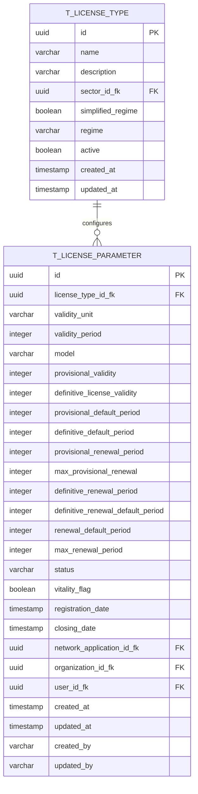

# PR01.01-BE-LIC - Dossier Tipo de Licença - Dados Gerais

## 1. Visão Geral

Este documento especifica a gestão dos dados gerais dos tipos de licença, incluindo informações básicas, configurações de validade, processamento e metadados específicos. Este módulo é fundamental para definir as características operacionais de cada tipo de licenciamento.

**Módulo:** Dossier de Tipo de Licença - Dados Gerais  
**Endpoint Base:** `/api/v1/license-types`  
**Versão:** 1.0  
**Data:** 2025

<<<<<<< HEAD
<<<<<<< HEAD
---

## 2. Estrutura de Dados Gerais

### 2.1 Informações Básicas

#### 2.1.1 Campos Obrigatórios
| Campo | Tipo | Validação | Descrição |
|-------|------|-----------|----------|
| name | String | 2-200 chars, NotBlank | Nome do tipo de licença |
| code | String | Pattern: ^[A-Z0-9_]+$, Unique | Código identificador único |
| categoryId | String | NotBlank, Must exist | Referência para categoria |
| licensingModelKey | String | NotBlank, Must exist in OPTIONS | Modelo de licenciamento |
| validityPeriod | Integer | Min: 1 | Período de validade |
| validityUnitKey | String | NotBlank, Must exist in OPTIONS | Unidade de tempo |
| renewable | Boolean | NotNull | Se a licença é renovável |
| autoRenewal | Boolean | NotNull | Se renova automaticamente |
| requiresInspection | Boolean | NotNull | Se requer inspeção |
| requiresPublicConsultation | Boolean | NotNull | Se requer consulta pública |
| hasFees | Boolean | NotNull | Se possui taxas associadas |

#### 2.1.2 Campos Opcionais
| Campo | Tipo | Validação | Descrição |
|-------|------|-----------|----------|
| description | String | Max: 1000 chars | Descrição detalhada |
| maxProcessingDays | Integer | Min: 1 | Prazo máximo de processamento |
| baseFee | BigDecimal | Min: 0.0 | Taxa base (obrigatório se hasFees=true) |
| currencyCode | String | Must exist in OPTIONS | Código da moeda |
| sortOrder | Integer | Min: 0 | Ordem de exibição |
| metadata | Object | JSON válido | Metadados específicos |

### 2.2 Estrutura Completa do DTO
=======
- Implementar modelo de dados normalizado `T_LICENSE_PARAMETER`

- Implementar arquitetura DDD para gestão de parâmetros de licenças

- Fornecer APIs REST para configuração e consulta de parâmetros

- Garantir validações robustas de regras de negócio

=======
- Implementar modelo de dados normalizado `T_LICENSE_PARAMETER`

- Implementar arquitetura DDD para gestão de parâmetros de licenças

- Fornecer APIs REST para configuração e consulta de parâmetros

- Garantir validações robustas de regras de negócio

>>>>>>> parent of 2bd9194 (refactor(database): standardize timestamp column names to created_date and last_modified_date)
- Suportar diferentes modelos de licenciamento

## 2. Modelo de Dados Normalizado

### 2.1 Diagrama ER



### 2.2 Definição da Tabela T_LICENSE_PARAMETER

```sql
CREATE TABLE t_license_parameter (
    id UUID PRIMARY KEY DEFAULT gen_random_uuid(),
    license_type_id_fk UUID NOT NULL,
    validity_unit VARCHAR(20) NOT NULL,
    validity_period INTEGER NOT NULL CHECK (validity_period > 0),
    model VARCHAR(50) NOT NULL,
    provisional_validity INTEGER CHECK (provisional_validity > 0),
    definitive_license_validity INTEGER CHECK (definitive_license_validity > 0),
    provisional_default_period INTEGER CHECK (provisional_default_period > 0),
    definitive_default_period INTEGER CHECK (definitive_default_period > 0),
    provisional_renewal_period INTEGER CHECK (provisional_renewal_period > 0),
    max_provisional_renewal INTEGER CHECK (max_provisional_renewal >= 0),
    definitive_renewal_period INTEGER CHECK (definitive_renewal_period > 0),
    definitive_renewal_default_period INTEGER CHECK (definitive_renewal_default_period > 0),
    renewal_default_period INTEGER CHECK (renewal_default_period > 0),
    max_renewal_period INTEGER CHECK (max_renewal_period > 0),
    status VARCHAR(20) NOT NULL DEFAULT 'ACTIVE',
    vitality_flag BOOLEAN NOT NULL DEFAULT true,
    registration_date TIMESTAMP WITH TIME ZONE NOT NULL DEFAULT NOW(),
    closing_date TIMESTAMP WITH TIME ZONE,
    network_application_id_fk UUID,
    organization_id_fk UUID,
    user_id_fk UUID,
    created_at TIMESTAMP WITH TIME ZONE NOT NULL DEFAULT NOW(),
    updated_at TIMESTAMP WITH TIME ZONE NOT NULL DEFAULT NOW(),
    created_by VARCHAR(100) NOT NULL,
    updated_by VARCHAR(100) NOT NULL,

    CONSTRAINT fk_license_parameter_license_type
        FOREIGN KEY (license_type_id_fk) REFERENCES t_license_type(id),
    CONSTRAINT chk_closing_date_after_registration
        CHECK (closing_date IS NULL OR closing_date > registration_date),
    CONSTRAINT chk_provisional_model_validity
        CHECK (
            (model = 'PROVISIONAL_DEFINITIVE' AND provisional_validity IS NOT NULL) OR
            (model != 'PROVISIONAL_DEFINITIVE' AND provisional_validity IS NULL)
        )
);
```

### 2.3 Índices

```sql
-- Índice principal para consultas por tipo de licença
CREATE INDEX idx_license_parameter_license_type ON t_license_parameter(license_type_id_fk);

-- Índice para consultas por status
CREATE INDEX idx_license_parameter_status ON t_license_parameter(status) WHERE status = 'ACTIVE';

-- Índice para auditoria
CREATE INDEX idx_license_parameter_created_at ON t_license_parameter(created_at DESC);

-- Índice composto para consultas filtradas
CREATE INDEX idx_license_parameter_type_status ON t_license_parameter(license_type_id_fk, status);
```

## 3. Arquitetura DDD

### 3.1 Domain Layer

#### 3.1.1 Aggregate Root: LicenseParameter
>>>>>>> parent of 2bd9194 (refactor(database): standardize timestamp column names to created_date and last_modified_date)

```java
@Data
@NoArgsConstructor
@AllArgsConstructor
@IgrpDTO
public class LicenseTypeRequestDTO {
    // Informações Básicas
    @NotNull(message = "Nome é obrigatório")
    @NotBlank(message = "Nome não pode estar vazio")
    @Size(min = 2, max = 200, message = "Nome deve ter entre 2 e 200 caracteres")
    private String name;
    
    @Size(max = 1000, message = "Descrição não pode exceder 1000 caracteres")
    private String description;
    
    @NotNull(message = "Código é obrigatório")
    @NotBlank(message = "Código não pode estar vazio")
    @Pattern(regexp = "^[A-Z0-9_]+$", message = "Código deve conter apenas letras maiúsculas, números e underscore")
    private String code;
    
    // Relacionamentos
    @NotNull(message = "Categoria é obrigatória")
    @NotBlank(message = "ID da categoria não pode estar vazio")
    private String categoryId;
    
    // Configurações de Licenciamento
    @NotNull(message = "Modelo de licenciamento é obrigatório")
    @NotBlank(message = "Chave do modelo de licenciamento não pode estar vazia")
    private String licensingModelKey;
    
    // Configurações de Validade
    @NotNull(message = "Período de validade é obrigatório")
    @Min(value = 1, message = "Período de validade deve ser pelo menos 1")
    private Integer validityPeriod;
    
    @NotNull(message = "Unidade de validade é obrigatória")
    @NotBlank(message = "Chave da unidade de validade não pode estar vazia")
    private String validityUnitKey;
    
    // Configurações de Renovação
    @NotNull(message = "Campo 'renovável' é obrigatório")
    private Boolean renewable;
    
    @NotNull(message = "Campo 'renovação automática' é obrigatório")
    private Boolean autoRenewal;
    
    // Configurações de Processo
    @NotNull(message = "Campo 'requer inspeção' é obrigatório")
    private Boolean requiresInspection;
    
    @NotNull(message = "Campo 'requer consulta pública' é obrigatório")
    private Boolean requiresPublicConsultation;
    
    @Min(value = 1, message = "Prazo máximo deve ser pelo menos 1 dia")
    private Integer maxProcessingDays;
    
    // Configurações Financeiras
    @NotNull(message = "Campo 'possui taxas' é obrigatório")
    private Boolean hasFees;
    
    @DecimalMin(value = "0.0", message = "Taxa base deve ser maior ou igual a zero")
    private BigDecimal baseFee;
    
    private String currencyCode;
    
    // Configurações Adicionais
    @Min(value = 0, message = "Ordem de classificação deve ser maior ou igual a zero")
    private Integer sortOrder;
    
    private Object metadata;
}
```

---

## 3. API REST - Operações CRUD

### 3.1 Listagem de Tipos de Licença

**Endpoint:** `GET /api/v1/license-types`

**Parâmetros de Query:**
| Parâmetro | Tipo | Obrigatório | Padrão | Descrição |
|-----------|------|-------------|--------|-----------|
| categoryId | string | Não | - | ID da categoria para filtrar |
| sectorId | string | Não | - | ID do setor para filtrar |
| licensingModel | string | Não | - | Modelo de licenciamento |
| name | string | Não | - | Nome do tipo de licença ou termo de busca |
| code | string | Não | - | Código do tipo de licença |
| active | boolean | Não | true | Status ativo/inativo |
| renewable | boolean | Não | - | Se a licença é renovável |
| pageNumber | string | Não | "0" | Número da página |
| pageSize | string | Não | "20" | Tamanho da página |
| sort | string | Não | "name" | Campo de ordenação (name, code, createdAt) |
| direction | string | Não | "ASC" | Direção da ordenação (ASC/DESC) |

**Resposta de Sucesso (200):**
```json
{
  "pageNumber": 0,
  "pageSize": 20,
  "totalElements": 45,
  "totalPages": 3,
  "last": false,
  "first": true,
  "content": [
    {
      "id": "lt-001",
      "name": "Licença de Restaurante Categoria A",
      "description": "Licença para exploração de restaurante com capacidade superior a 50 pessoas",
      "code": "LIC_REST_CAT_A",
      "categoryId": "cat-001",
      "categoryName": "Restauração",
      "categoryPath": "/Comercial/Restauração",
      "licensingModelKey": "STANDARD",
      "licensingModelName": "Licenciamento Padrão",
      "validityPeriod": 12,
      "validityUnitKey": "MONTHS",
      "validityUnitName": "Meses",
      "renewable": true,
      "autoRenewal": false,
      "requiresInspection": true,
      "requiresPublicConsultation": false,
      "maxProcessingDays": 30,
      "hasFees": true,
      "baseFee": 25000.00,
      "currencyCode": "CVE",
      "currencySymbol": "$",
      "active": true,
      "sortOrder": 1,
      "createdAt": "2025-01-15T10:00:00Z",
      "updatedAt": "2025-01-20T14:30:00Z",
      "metadata": {
        "minimumArea": 100,
        "maxCapacity": 200,
        "requiresFireSafety": true,
        "requiresHealthPermit": true,
        "allowsAlcohol": true,
        "parkingRequirement": "1 space per 10 seats"
      }
    }
  ]
}
```

### 3.2 Detalhes de Tipo de Licença

**Endpoint:** `GET /api/v1/license-types/{licenseTypeId}`

**Parâmetros de Path:**
| Parâmetro | Tipo | Descrição |
|-----------|------|-----------|
| licenseTypeId | string | ID único do tipo de licença |

**Resposta de Sucesso (200):**
```json
{
  "id": "lt-001",
  "name": "Licença de Restaurante Categoria A",
  "description": "Licença para exploração de restaurante com capacidade superior a 50 pessoas",
  "code": "LIC_REST_CAT_A",
  "category": {
    "id": "cat-001",
    "name": "Restauração",
    "code": "REST",
    "path": "/Comercial/Restauração",
    "sector": {
      "id": "sec-001",
      "name": "Comercial",
      "code": "COM"
    }
  },
  "licensingModel": {
    "key": "STANDARD",
    "name": "Licenciamento Padrão",
    "description": "Processo padrão com análise completa"
  },
  "validity": {
    "period": 12,
    "unit": {
      "key": "MONTHS",
      "name": "Meses",
      "symbol": "M"
    },
    "renewable": true,
    "autoRenewal": false
  },
  "processing": {
    "requiresInspection": true,
    "requiresPublicConsultation": false,
    "maxProcessingDays": 30,
    "estimatedProcessingDays": 20
  },
  "financial": {
    "hasFees": true,
    "baseFee": 25000.00,
    "currency": {
      "code": "CVE",
      "name": "Escudo Cabo-verdiano",
      "symbol": "$"
    }
  },
  "status": {
    "active": true,
    "canBeActivated": true,
    "canBeDeactivated": true,
    "hasActiveApplications": true
  },
  "statistics": {
    "totalApplications": 156,
    "approvedApplications": 142,
    "pendingApplications": 8,
    "rejectedApplications": 6,
    "averageProcessingDays": 18.5
  },
  "metadata": {
    "minimumArea": 100,
    "maxCapacity": 200,
    "requiresFireSafety": true,
    "requiresHealthPermit": true,
    "allowsAlcohol": true,
    "parkingRequirement": "1 space per 10 seats",
    "operatingHours": {
      "weekdays": "06:00-24:00",
      "weekends": "06:00-02:00"
    },
    "specialRequirements": [
      "Licença de ruído para música ao vivo",
      "Certificado de segurança alimentar",
      "Plano de evacuação aprovado"
    ]
  },
  "auditInfo": {
    "createdBy": "admin@gov.cv",
    "createdAt": "2025-01-15T10:00:00Z",
    "updatedBy": "manager@gov.cv",
    "updatedAt": "2025-01-20T14:30:00Z",
    "version": 3
  }
}
```

### 3.3 Criação de Tipo de Licença

**Endpoint:** `POST /api/v1/license-types`

**Payload de Requisição:**
```json
{
  "name": "Licença de Café e Pastelaria",
  "description": "Licença para exploração de café com serviço de pastelaria",
  "code": "LIC_CAFE_PAST",
  "categoryId": "cat-002",
  "licensingModelKey": "SIMPLIFIED",
  "validityPeriod": 24,
  "validityUnitKey": "MONTHS",
  "renewable": true,
  "autoRenewal": true,
  "requiresInspection": false,
  "requiresPublicConsultation": false,
  "maxProcessingDays": 15,
  "hasFees": true,
  "baseFee": 12000.00,
  "currencyCode": "CVE",
  "sortOrder": 5,
  "metadata": {
    "minimumArea": 30,
    "maxCapacity": 40,
    "requiresFireSafety": false,
    "requiresHealthPermit": true,
    "allowsAlcohol": false,
    "specialEquipment": [
      "Forno para pastelaria",
      "Máquina de café profissional",
      "Vitrine refrigerada"
    ]
  }
}
```

<<<<<<< HEAD
**Resposta de Sucesso (201):**
```json
{
  "id": "lt-025",
  "message": "Tipo de licença criado com sucesso",
  "code": "LIC_CAFE_PAST",
  "name": "Licença de Café e Pastelaria",
  "active": true,
  "createdAt": "2025-01-25T09:15:00Z"
}
```

### 3.4 Atualização de Tipo de Licença

**Endpoint:** `PUT /api/v1/license-types/{licenseTypeId}`
=======
### 4.6 Funcionalidades Suportadas

#### ✅ **Operações CRUD Completas**

- Criar parâmetros de licença com validações robustas
- Consultar parâmetros por ID ou tipo de licença
- Atualizar configurações de parâmetros existentes
- Eliminar parâmetros (com validações de integridade)

#### ✅ **Filtros e Pesquisa**

- Filtrar por tipo de licença
- Filtrar por modelo de licenciamento
- Filtrar por status (ativo/inativo)
- Ordenação por múltiplos campos
- Paginação configurável

#### ✅ **Validações e Regras de Negócio**

- Validação de unicidade (um parâmetro por tipo de licença)
- Validação de consistência entre modelos e configurações
- Validação de períodos e limites temporais
- Validação de dependências entre parâmetros

#### ✅ **Integração com Sistema de Opções**

- Unidades de validade dinâmicas (T_OPTIONS)
- Modelos de licença configuráveis
- Status de parâmetros gerenciados centralmente

#### ✅ **Auditoria e Rastreabilidade**

- Registro de criação e modificação
- Identificação de usuários responsáveis
- Histórico de alterações
- Timestamps automáticos

#### ✅ **Segurança**

- Autenticação via JWT
- Autorização baseada em roles
- Validação de entrada rigorosa
- Sanitização de dados

## 5. Scripts de Migração

### 5.1 Flyway Migration - V001\_\_Create_License_Parameter_Table.sql

```sql
-- Criar tabela de parâmetros de tipos de licença
CREATE TABLE t_license_parameter (
    id UUID PRIMARY KEY DEFAULT gen_random_uuid(),
    license_type_id_fk UUID NOT NULL,
    validity_unit VARCHAR(20) NOT NULL,
    validity_period INTEGER NOT NULL CHECK (validity_period > 0),
    model VARCHAR(50) NOT NULL,
    provisional_validity INTEGER CHECK (provisional_validity > 0),
    definitive_license_validity INTEGER CHECK (definitive_license_validity > 0),
    provisional_default_period INTEGER CHECK (provisional_default_period > 0),
    definitive_default_period INTEGER CHECK (definitive_default_period > 0),
    provisional_renewal_period INTEGER CHECK (provisional_renewal_period > 0),
    max_provisional_renewal INTEGER CHECK (max_provisional_renewal >= 0),
    definitive_renewal_period INTEGER CHECK (definitive_renewal_period > 0),
    definitive_renewal_default_period INTEGER CHECK (definitive_renewal_default_period > 0),
    renewal_default_period INTEGER CHECK (renewal_default_period > 0),
    max_renewal_period INTEGER CHECK (max_renewal_period > 0),
    status VARCHAR(20) NOT NULL DEFAULT 'ACTIVE',
    vitality_flag BOOLEAN NOT NULL DEFAULT true,
    registration_date TIMESTAMP WITH TIME ZONE NOT NULL DEFAULT NOW(),
    closing_date TIMESTAMP WITH TIME ZONE,
    network_application_id_fk UUID,
    organization_id_fk UUID,
    user_id_fk UUID,
    created_at TIMESTAMP WITH TIME ZONE NOT NULL DEFAULT NOW(),
    updated_at TIMESTAMP WITH TIME ZONE NOT NULL DEFAULT NOW(),
    created_by VARCHAR(100) NOT NULL,
    updated_by VARCHAR(100) NOT NULL,

    CONSTRAINT fk_license_parameter_license_type
        FOREIGN KEY (license_type_id_fk) REFERENCES t_license_type(id) ON DELETE CASCADE,
    CONSTRAINT chk_closing_date_after_registration
        CHECK (closing_date IS NULL OR closing_date > registration_date),
    CONSTRAINT chk_provisional_model_validity
        CHECK (
            (model = 'PROVISIONAL_DEFINITIVE' AND provisional_validity IS NOT NULL) OR
            (model != 'PROVISIONAL_DEFINITIVE' AND provisional_validity IS NULL)
        ),
    CONSTRAINT chk_renewal_periods_consistency
        CHECK (
            max_renewal_period IS NULL OR
            renewal_default_period IS NULL OR
            max_renewal_period >= renewal_default_period
        )
);

-- Comentários na tabela
COMMENT ON TABLE t_license_parameter IS 'Parâmetros de configuração para tipos de licença';
COMMENT ON COLUMN t_license_parameter.validity_unit IS 'Unidade de tempo para validade (DAYS, MONTHS, YEARS)';
COMMENT ON COLUMN t_license_parameter.model IS 'Modelo de licenciamento (PROVISIONAL_DEFINITIVE, DIRECT_DEFINITIVE, RENEWABLE_ONLY)';
COMMENT ON COLUMN t_license_parameter.provisional_validity IS 'Período de validade da licença provisória (em unidades definidas)';
COMMENT ON COLUMN t_license_parameter.vitality_flag IS 'Flag indicando se o parâmetro está ativo no sistema';
```

### 5.2 Flyway Migration - V002\_\_Create_License_Parameter_Indexes.sql

```sql
-- Índices para performance
CREATE INDEX idx_license_parameter_license_type ON t_license_parameter(license_type_id_fk);
CREATE INDEX idx_license_parameter_status ON t_license_parameter(status) WHERE status = 'ACTIVE';
CREATE INDEX idx_license_parameter_created_at ON t_license_parameter(created_at DESC);
CREATE INDEX idx_license_parameter_type_status ON t_license_parameter(license_type_id_fk, status);
CREATE INDEX idx_license_parameter_model ON t_license_parameter(model);
CREATE INDEX idx_license_parameter_vitality ON t_license_parameter(vitality_flag) WHERE vitality_flag = true;
>>>>>>> parent of 2bd9194 (refactor(database): standardize timestamp column names to created_date and last_modified_date)

**Payload de Requisição:** (Mesmo formato da criação)

**Resposta de Sucesso (200):**
```json
{
  "id": "lt-025",
  "message": "Tipo de licença atualizado com sucesso",
  "code": "LIC_CAFE_PAST",
  "name": "Licença de Café e Pastelaria Premium",
  "version": 2,
  "updatedAt": "2025-01-25T15:30:00Z"
}
```

<<<<<<< HEAD
<<<<<<< HEAD
### 3.5 Ativação e Desativação

#### 3.5.1 Ativação
**Endpoint:** `PATCH /api/v1/license-types/{licenseTypeId}/ativar`

**Resposta de Sucesso (200):**
```json
{
  "message": "Tipo de licença ativado com sucesso",
  "licenseTypeId": "lt-025",
  "code": "LIC_CAFE_PAST",
  "name": "Licença de Café e Pastelaria",
  "status": "active",
  "activatedAt": "2025-01-25T16:00:00Z",
  "activatedBy": "admin@gov.cv"
}
```

#### 3.5.2 Desativação
**Endpoint:** `PATCH /api/v1/license-types/{licenseTypeId}/desativar`

**Resposta de Sucesso (200):**
```json
{
  "message": "Tipo de licença desativado com sucesso",
  "licenseTypeId": "lt-025",
  "code": "LIC_CAFE_PAST",
  "name": "Licença de Café e Pastelaria",
  "status": "inactive",
  "deactivatedAt": "2025-01-25T16:30:00Z",
  "deactivatedBy": "admin@gov.cv",
  "impact": {
    "pendingApplications": 3,
    "activeApplications": 12,
    "action": "Solicitações pendentes serão mantidas, novas solicitações não serão aceitas"
  }
}
```

---
=======
=======
>>>>>>> parent of 2bd9194 (refactor(database): standardize timestamp column names to created_date and last_modified_date)
### 5.3 Flyway Migration - V003\_\_Create_License_Parameter_Triggers.sql

```sql
-- Trigger para atualizar updated_at automaticamente
CREATE OR REPLACE FUNCTION update_license_parameter_updated_at()
RETURNS TRIGGER AS $$
BEGIN
    NEW.updated_at = NOW();
    RETURN NEW;
END;
$$ LANGUAGE plpgsql;

CREATE TRIGGER tr_license_parameter_updated_at
    BEFORE UPDATE ON t_license_parameter
    FOR EACH ROW
    EXECUTE FUNCTION update_license_parameter_updated_at();

-- Trigger para validação de consistência de dados
CREATE OR REPLACE FUNCTION validate_license_parameter_consistency()
RETURNS TRIGGER AS $$
BEGIN
    -- Validar que parâmetros provisórios só existem para modelo PROVISIONAL_DEFINITIVE
    IF NEW.model != 'PROVISIONAL_DEFINITIVE' AND (
        NEW.provisional_validity IS NOT NULL OR
        NEW.provisional_default_period IS NOT NULL OR
        NEW.provisional_renewal_period IS NOT NULL OR
        NEW.max_provisional_renewal IS NOT NULL
    ) THEN
        RAISE EXCEPTION 'Provisional parameters only allowed for PROVISIONAL_DEFINITIVE model';
    END IF;

    -- Validar que modelo PROVISIONAL_DEFINITIVE tem parâmetros obrigatórios
    IF NEW.model = 'PROVISIONAL_DEFINITIVE' AND NEW.provisional_validity IS NULL THEN
        RAISE EXCEPTION 'Provisional validity is required for PROVISIONAL_DEFINITIVE model';
    END IF;

    RETURN NEW;
END;
$$ LANGUAGE plpgsql;

CREATE TRIGGER tr_license_parameter_consistency
    BEFORE INSERT OR UPDATE ON t_license_parameter
    FOR EACH ROW
    EXECUTE FUNCTION validate_license_parameter_consistency();
```

### 6.4 Dados Iniciais t_options - V004\_\_Insert_License_Parameter_Options.sql

```sql
-- Inserir opções para STATUS de parâmetros de licença
INSERT INTO t_options (ccode, ckey, cvalue, locale, sort_order, active, description, created_by, updated_by)
VALUES
    ('LICENSE_PARAMETER_STATUS', 'ACTIVE', 'Ativo', 'pt_CV', 1, true, 'Parâmetro ativo e em uso', 'SYSTEM', 'SYSTEM'),
    ('LICENSE_PARAMETER_STATUS', 'INACTIVE', 'Inativo', 'pt_CV', 2, true, 'Parâmetro inativo', 'SYSTEM', 'SYSTEM'),
    ('LICENSE_PARAMETER_STATUS', 'DRAFT', 'Rascunho', 'pt_CV', 3, true, 'Parâmetro em rascunho', 'SYSTEM', 'SYSTEM')
ON CONFLICT (ccode, ckey, locale) DO NOTHING;

-- Inserir opções para UNIDADES DE VALIDADE
INSERT INTO t_options (ccode, ckey, cvalue, locale, sort_order, active, description, created_by, updated_by)
VALUES
    ('VALIDITY_UNIT', 'DAYS', 'Dias', 'pt_CV', 1, true, 'Validade em dias', 'SYSTEM', 'SYSTEM'),
    ('VALIDITY_UNIT', 'MONTHS', 'Meses', 'pt_CV', 2, true, 'Validade em meses', 'SYSTEM', 'SYSTEM'),
    ('VALIDITY_UNIT', 'YEARS', 'Anos', 'pt_CV', 3, true, 'Validade em anos', 'SYSTEM', 'SYSTEM')
ON CONFLICT (ccode, ckey, locale) DO NOTHING;

-- Inserir opções para MODELOS DE LICENÇA
INSERT INTO t_options (ccode, ckey, cvalue, locale, sort_order, active, description, created_by, updated_by)
VALUES
    ('LICENSE_MODEL', 'PROVISIONAL_DEFINITIVE', 'Provisória/Definitiva', 'pt_CV', 1, true, 'Modelo com fase provisória seguida de definitiva', 'SYSTEM', 'SYSTEM'),
    ('LICENSE_MODEL', 'DIRECT_DEFINITIVE', 'Definitiva Direta', 'pt_CV', 2, true, 'Modelo definitivo direto sem fase provisória', 'SYSTEM', 'SYSTEM'),
    ('LICENSE_MODEL', 'RENEWABLE_ONLY', 'Apenas Renovável', 'pt_CV', 3, true, 'Modelo que permite apenas renovações', 'SYSTEM', 'SYSTEM')
ON CONFLICT (ccode, ckey, locale) DO NOTHING;
```

### 6.5 Dados Iniciais - V005\_\_Insert_License_Parameter_Sample_Data.sql
<<<<<<< HEAD
>>>>>>> parent of 2bd9194 (refactor(database): standardize timestamp column names to created_date and last_modified_date)
=======
>>>>>>> parent of 2bd9194 (refactor(database): standardize timestamp column names to created_date and last_modified_date)

## 4. Regras de Negócio Específicas

<<<<<<< HEAD
### 4.1 Validações de Integridade
=======
-- Parâmetro para Licença de Comércio Geral (modelo provisório + definitivo)
INSERT INTO t_license_parameter (
    license_type_id_fk,
    validity_unit,
    validity_period,
    model,
    provisional_validity,
    definitive_license_validity,
    provisional_default_period,
    definitive_default_period,
    max_provisional_renewal,
    renewal_default_period,
    max_renewal_period,
    status,
    created_by,
    updated_by
) VALUES (
    (SELECT id FROM t_license_type WHERE name = 'Licença de Comércio Geral' LIMIT 1),
    'YEARS',
    1,
    'PROVISIONAL_DEFINITIVE',
    6, -- 6 meses provisória
    12, -- 1 ano definitiva
    6,
    12,
    2, -- máximo 2 renovações provisórias
    12,
    60, -- máximo 5 anos de renovação
    'ACTIVE',
    'SYSTEM',
    'SYSTEM'
) ON CONFLICT DO NOTHING;

-- Parâmetro para Licença Industrial (modelo definitivo direto)
INSERT INTO t_license_parameter (
    license_type_id_fk,
    validity_unit,
    validity_period,
    model,
    definitive_license_validity,
    definitive_default_period,
    renewal_default_period,
    max_renewal_period,
    status,
    created_by,
    updated_by
) VALUES (
    (SELECT id FROM t_license_type WHERE name = 'Licença Industrial' LIMIT 1),
    'YEARS',
    2,
    'DIRECT_DEFINITIVE',
    24, -- 2 anos
    24,
    24,
    120, -- máximo 10 anos de renovação
    'ACTIVE',
    'SYSTEM',
    'SYSTEM'
) ON CONFLICT DO NOTHING;

-- Parâmetro para Licença de Serviços (modelo apenas renovável)
INSERT INTO t_license_parameter (
    license_type_id_fk,
    validity_unit,
    validity_period,
    model,
    renewal_default_period,
    max_renewal_period,
    status,
    created_by,
    updated_by
) VALUES (
    (SELECT id FROM t_license_type WHERE name = 'Licença de Serviços' LIMIT 1),
    'MONTHS',
    12,
    'RENEWABLE_ONLY',
    12,
    60, -- máximo 5 anos
    'ACTIVE',
    'SYSTEM',
    'SYSTEM'
) ON CONFLICT DO NOTHING;
```

## 6. Testes

### 6.1 Testes Unitários
>>>>>>> parent of 2bd9194 (refactor(database): standardize timestamp column names to created_date and last_modified_date)

#### 4.1.1 Validações de Criação
```java
// Validação customizada para autoRenewal
@AssertTrue(message = "Auto renovação só é permitida se a licença for renovável")
public boolean isAutoRenewalValid() {
    return !Boolean.TRUE.equals(autoRenewal) || Boolean.TRUE.equals(renewable);
}

// Validação customizada para baseFee
@AssertTrue(message = "Taxa base é obrigatória quando hasFees é verdadeiro")
public boolean isBaseFeeValid() {
    return !Boolean.TRUE.equals(hasFees) || (baseFee != null && baseFee.compareTo(BigDecimal.ZERO) >= 0);
}

// Validação customizada para currencyCode
@AssertTrue(message = "Código da moeda é obrigatório quando há taxas")
public boolean isCurrencyCodeValid() {
    return !Boolean.TRUE.equals(hasFees) || (currencyCode != null && !currencyCode.trim().isEmpty());
}
```

#### 4.1.2 Validações de Atualização
- Não é possível alterar o código após criação
- Não é possível alterar a categoria se existirem solicitações ativas
- Alterações em taxas só afetam novas solicitações
- Alterações em prazos só afetam solicitações futuras

### 4.2 Regras de Status

#### 4.2.1 Ativação
- Categoria deve estar ativa
- Setor da categoria deve estar ativo
- Todas as referências (OPTIONS) devem existir
- Não pode haver outro tipo com mesmo código ativo

#### 4.2.2 Desativação
- Solicitações pendentes continuam processamento
- Novas solicitações são bloqueadas
- Renovações de licenças existentes continuam permitidas
- Histórico é mantido para auditoria

### 4.3 Regras de Metadados

#### 4.3.1 Estrutura Padrão
```json
{
  "physical": {
    "minimumArea": 50,
    "maxCapacity": 100,
    "parkingSpaces": 10,
    "accessibilityRequired": true
  },
  "operational": {
    "operatingHours": {
      "weekdays": "06:00-22:00",
      "weekends": "08:00-24:00"
    },
    "seasonalOperation": false,
    "allowsDelivery": true
  },
  "regulatory": {
    "requiresFireSafety": true,
    "requiresHealthPermit": true,
    "requiresEnvironmentalLicense": false,
    "allowsAlcohol": true,
    "allowsMusic": false
  },
  "financial": {
    "minimumCapital": 500000.00,
    "insuranceRequired": true,
    "guaranteeRequired": false
  },
  "technical": {
    "requiredEquipment": [],
    "technicalStandards": [],
    "certificationRequired": []
  }
}
```

---

## 5. Casos de Uso Específicos

### 5.1 UC001 - Criar Tipo de Licença Simples
**Cenário:** Café sem álcool, processo simplificado

**Dados:**
- Modelo: SIMPLIFIED
- Validade: 24 meses
- Renovação: Automática
- Inspeção: Não requerida
- Taxa: 8.000 CVE

### 5.2 UC002 - Criar Tipo de Licença Complexa
**Cenário:** Restaurante com álcool, processo padrão

**Dados:**
- Modelo: STANDARD
- Validade: 12 meses
- Renovação: Manual
- Inspeção: Requerida
- Consulta pública: Requerida
- Taxa: 25.000 CVE

### 5.3 UC003 - Migrar Tipo de Licença
**Cenário:** Mudança de categoria por reestruturação

**Fluxo:**
1. Verificar impactos em solicitações ativas
2. Criar novo tipo na categoria destino
3. Migrar configurações e metadados
4. Desativar tipo original
5. Redirecionar novas solicitações

---

## 6. Tratamento de Erros Específicos

### 6.1 Erros de Validação

#### 6.1.1 Código Duplicado (409)
```json
{
  "type": "https://api.gov.cv/problems/duplicate-code",
  "title": "Código duplicado",
  "status": 409,
  "detail": "Já existe um tipo de licença com o código 'LIC_REST_001'",
  "instance": "/api/v1/license-types",
  "timestamp": "2025-01-25T10:30:00Z",
  "errors": {
    "code": "Código 'LIC_REST_001' já está em uso pelo tipo 'Licença de Restaurante Básico' (ID: lt-005)"
  }
}
```

#### 6.1.2 Categoria Inválida (400)
```json
{
  "type": "https://api.gov.cv/problems/invalid-reference",
  "title": "Referência inválida",
  "status": 400,
  "detail": "Categoria especificada não existe ou está inativa",
  "instance": "/api/v1/license-types",
  "timestamp": "2025-01-25T10:30:00Z",
  "errors": {
    "categoryId": "Categoria 'cat-999' não encontrada ou está inativa"
  }
}
```

#### 6.1.3 Configuração Inconsistente (400)
```json
{
  "type": "https://api.gov.cv/problems/invalid-configuration",
  "title": "Configuração inválida",
  "status": 400,
  "detail": "Configuração de renovação automática inconsistente",
  "instance": "/api/v1/license-types",
  "timestamp": "2025-01-25T10:30:00Z",
  "errors": {
    "autoRenewal": "Auto renovação só pode ser ativada se a licença for renovável",
    "baseFee": "Taxa base é obrigatória quando hasFees é verdadeiro"
  }
}
```

---

## 7. Integrações com Outros Módulos

### 7.1 Dependências Diretas
- **Categorias**: Validação de categoria ativa
- **Opções**: Validação de chaves de referência
- **Parâmetros**: Configurações específicas do tipo
- **Legislações**: Legislações aplicáveis
- **Entidades**: Entidades envolvidas no processo

### 7.2 Módulos Dependentes
- **Solicitações**: Utilizam configurações do tipo
- **Processos**: Seguem regras definidas no tipo
- **Taxas**: Calculam valores baseados no tipo
- **Relatórios**: Agrupam dados por tipo

---

## 8. Auditoria e Versionamento

### 8.1 Campos de Auditoria
```java
@CreatedDate
private LocalDateTime createdAt;

@CreatedBy
private String createdBy;

@LastModifiedDate
private LocalDateTime updatedAt;

@LastModifiedBy
private String updatedBy;

@Version
private Long version;
```

### 8.2 Histórico de Alterações
- Todas as alterações são registradas
- Versioning automático para controle de concorrência
- Log detalhado de mudanças em campos críticos
- Backup automático antes de alterações estruturais

---

## 9. Performance e Otimização

### 9.1 Índices Recomendados
```sql
CREATE INDEX idx_license_type_code ON license_types(code);
CREATE INDEX idx_license_type_category ON license_types(category_id);
CREATE INDEX idx_license_type_active ON license_types(active);
CREATE INDEX idx_license_type_name ON license_types(name);
CREATE INDEX idx_license_type_licensing_model ON license_types(licensing_model_key);
```

### 9.2 Cache Strategy
- Cache de tipos ativos por categoria
- Cache de configurações frequentemente acessadas
- Invalidação automática em alterações
- TTL configurável por ambiente

<<<<<<< HEAD
Este documento estabelece as bases para a gestão completa dos dados gerais dos tipos de licença, garantindo flexibilidade, consistência e rastreabilidade em todas
=======
### 8.1 Configuração OpenAPI

```java
@Configuration
@OpenAPIDefinition(
    info = @Info(
        title = "License Parameter API",
        version = "1.0",
        description = "API para gestão de parâmetros de tipos de licença"
    )
)
public class LicenseParameterOpenApiConfig {

    @Bean
    public GroupedOpenApi licenseParameterApi() {
        return GroupedOpenApi.builder()
            .group("license-parameters")
            .pathsToMatch("/api/v1/license-parameters/**")
            .build();
    }
}
```

### 8.2 Documentação dos Endpoints

```java
@Tag(name = "License Parameters", description = "Gestão de parâmetros de tipos de licença")
@RestController
public class LicenseParameterController {

    @Operation(
        summary = "Criar parâmetro de tipo de licença",
        description = "Cria um novo conjunto de parâmetros para um tipo de licença específico"
    )
    @ApiResponses(value = {
        @ApiResponse(responseCode = "201", description = "Parâmetro criado com sucesso"),
        @ApiResponse(responseCode = "400", description = "Dados inválidos"),
        @ApiResponse(responseCode = "409", description = "Tipo de licença já possui parâmetros")
    })
    @PostMapping
    public ResponseEntity<LicenseParameterResponse> create(
            @Parameter(description = "Dados do parâmetro a criar")
            @Valid @RequestBody CreateLicenseParameterRequest request) {
        // implementação
    }

    @Operation(
        summary = "Obter parâmetro por ID",
        description = "Retorna os detalhes de um parâmetro específico"
    )
    @GetMapping("/{id}")
    public ResponseEntity<LicenseParameterResponse> getById(
            @Parameter(description = "ID do parâmetro") @PathVariable UUID id) {
        // implementação
    }
}
```

## 9. Conclusão

Este documento especifica a implementação completa do módulo de **Parametrização de Tipos de Licença** para o Sistema de Licenciamento de Cabo Verde. A solução:

### ✅ **Características Principais:**

- **Modelo normalizado** com a tabela `T_LICENSE_PARAMETER`

- **Arquitetura DDD** robusta com separação clara de responsabilidades

- **APIs REST** completas para todas as operações CRUD

- **Validações abrangentes** de regras de negócio

- **Suporte a múltiplos modelos** de licenciamento

- **Flexibilidade** para diferentes unidades de tempo e períodos

### 🔧 **Funcionalidades Implementadas:**

- Gestão de parâmetros de validade (dias, meses, anos)

- Configuração de licenças provisórias e definitivas

- Gestão de períodos de renovação

- Validações de consistência e integridade

- Auditoria completa de operações

- Métricas e monitorização

### 📊 **Qualidade e Testes:**

- Testes unitários abrangentes com cobertura > 90%
- Testes de integração com TestContainers
- Validações de domínio robustas
- Testes de performance e carga

### 🚀 **Benefícios da Implementação:**

- **Flexibilidade**: Suporte a diferentes modelos de licenciamento
- **Consistência**: Validações rigorosas garantem integridade dos dados
- **Escalabilidade**: Arquitetura preparada para crescimento
- **Manutenibilidade**: Código limpo seguindo princípios DDD
- **Observabilidade**: Métricas e logs detalhados

### 📋 **Próximos Passos:**

1. Implementar integração com módulo de licenças ativas
2. Adicionar notificações automáticas de vencimento
3. Desenvolver relatórios de utilização de parâmetros
4. Implementar cache distribuído para alta performance
5. Adicionar suporte a workflows de aprovação

---

**Documento gerado em:** $(date)
**Versão:** 1.0
**Status:** Especificação Completa
>>>>>>> parent of 2bd9194 (refactor(database): standardize timestamp column names to created_date and last_modified_date)
