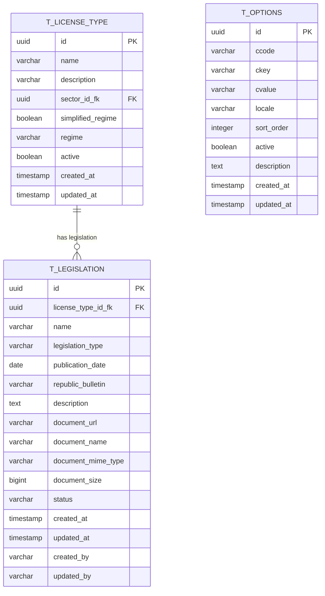

# PR01.02-BE-LIC - Dossier Tipo de Licença - Legislações

## 1. Visão Geral

Este documento especifica a gestão das legislações aplicáveis aos tipos de licença, incluindo a associação de leis, decretos, regulamentos e outras normas legais que regem cada tipo de licenciamento. Este módulo é essencial para garantir conformidade legal e fornecer base jurídica para os processos de licenciamento.

**Módulo:** Dossier de Tipo de Licença - Legislações  
**Endpoint Base:** `/api/v1/legislations` e `/api/v1/license-types/{id}/legislations`  
**Versão:** 1.0  
**Data:** 2025

---

## 2. Estrutura do Módulo de Legislações

### 2.1 Entidade Legislação

<<<<<<< HEAD
#### 2.1.1 Campos da Legislação
| Campo | Tipo | Validação | Descrição |
|-------|------|-----------|----------|
| id | String | Auto-gerado | Identificador único |
| title | String | 5-300 chars, NotBlank | Título da legislação |
| number | String | NotBlank, Unique | Número/código oficial |
| type | String | NotBlank, Must exist in OPTIONS | Tipo de legislação |
| publicationDate | LocalDate | NotNull, Past or Present | Data de publicação |
| effectiveDate | LocalDate | NotNull | Data de entrada em vigor |
| summary | String | Max 1000 chars | Resumo do conteúdo |
| officialUrl | String | Valid URL | Link para texto oficial |
| status | String | NotBlank | Status da legislação |
| scope | String | Must exist in OPTIONS | Âmbito de aplicação |
=======
- Integrar com sistema de armazenamento de documentos (Minio)

- Garantir validações robustas e integridade referencial

- Suportar múltiplos tipos de legislação parametrizáveis

## 2. Modelo de Dados Normalizado

### 2.1 Diagrama ER



### 2.2 Definição da Tabela T_LEGISLATION

```sql
CREATE TABLE t_legislation (
    id UUID PRIMARY KEY DEFAULT gen_random_uuid(),
    license_type_id_fk UUID NOT NULL,
    name VARCHAR(255) NOT NULL,
    legislation_type VARCHAR(50) NOT NULL,
    publication_date DATE,
    republic_bulletin VARCHAR(100),
    description TEXT,
    document_url VARCHAR(500),
    document_name VARCHAR(255),
    document_mime_type VARCHAR(100),
    document_size BIGINT CHECK (document_size >= 0),
    status VARCHAR(20) NOT NULL DEFAULT 'ACTIVE',
    created_at TIMESTAMP WITH TIME ZONE NOT NULL DEFAULT NOW(),
    updated_at TIMESTAMP WITH TIME ZONE NOT NULL DEFAULT NOW(),
    created_by VARCHAR(100) NOT NULL,
    updated_by VARCHAR(100) NOT NULL,

    CONSTRAINT fk_legislation_license_type
        FOREIGN KEY (license_type_id_fk) REFERENCES t_license_type(id) ON DELETE CASCADE,
    CONSTRAINT chk_legislation_name_not_empty
        CHECK (LENGTH(TRIM(name)) > 0),
    CONSTRAINT chk_document_consistency
        CHECK (
            (document_url IS NULL AND document_name IS NULL AND document_mime_type IS NULL AND document_size IS NULL) OR
            (document_url IS NOT NULL AND document_name IS NOT NULL AND document_mime_type IS NOT NULL AND document_size IS NOT NULL)
        )
);
```

### 2.3 Índices

```sql
-- Índice principal para consultas por tipo de licença
CREATE INDEX idx_legislation_license_type ON t_legislation(license_type_id_fk);

-- Índice para consultas por tipo de legislação
CREATE INDEX idx_legislation_type ON t_legislation(legislation_type);

-- Índice para consultas por status
CREATE INDEX idx_legislation_status ON t_legislation(status) WHERE status = 'ACTIVE';

-- Índice para auditoria
CREATE INDEX idx_legislation_created_at ON t_legislation(created_at DESC);

-- Índice composto para consultas filtradas
CREATE INDEX idx_legislation_type_status ON t_legislation(license_type_id_fk, legislation_type, status);

-- Índice para busca textual
CREATE INDEX idx_legislation_name_search ON t_legislation USING gin(to_tsvector('portuguese', name));
CREATE INDEX idx_legislation_description_search ON t_legislation USING gin(to_tsvector('portuguese', description));
```

## 3. Arquitetura DDD

### 3.1 Domain Layer

#### 3.1.1 Aggregate Root: Legislation
>>>>>>> parent of 2bd9194 (refactor(database): standardize timestamp column names to created_date and last_modified_date)

#### 2.1.2 Estrutura do DTO de Legislação
```java
@Data
@NoArgsConstructor
@AllArgsConstructor
@IgrpDTO
public class LegislationRequestDTO {
    @NotNull(message = "Título é obrigatório")
    @NotBlank(message = "Título não pode estar vazio")
    @Size(min = 5, max = 300, message = "Título deve ter entre 5 e 300 caracteres")
    private String title;
    
    @NotNull(message = "Número é obrigatório")
    @NotBlank(message = "Número não pode estar vazio")
    @Size(max = 50, message = "Número não pode exceder 50 caracteres")
    private String number;
    
    @NotNull(message = "Tipo é obrigatório")
    @NotBlank(message = "Tipo não pode estar vazio")
    private String typeKey;  // Referência para OPTIONS com ccode="LEGISLATION_TYPE"
    
    @NotNull(message = "Data de publicação é obrigatória")
    @PastOrPresent(message = "Data de publicação não pode ser futura")
    private LocalDate publicationDate;
<<<<<<< HEAD
    
    @NotNull(message = "Data de vigência é obrigatória")
    private LocalDate effectiveDate;
    
    @Size(max = 1000, message = "Resumo não pode exceder 1000 caracteres")
    private String summary;
    
    @URL(message = "URL oficial deve ser válida")
    private String officialUrl;
    
    @NotNull(message = "Status é obrigatório")
    @NotBlank(message = "Status não pode estar vazio")
    private String statusKey;  // Referência para OPTIONS com ccode="LEGISLATION_STATUS"
    
    private String scopeKey;   // Referência para OPTIONS com ccode="LEGISLATION_SCOPE"
    
    private Object metadata;
=======

    @Column(name = "republic_bulletin")
    private String republicBulletin;

    @Column(name = "description")
    private String description;

    @Embedded
    private DocumentInfo documentInfo;

    @Column(name = "status", nullable = false)
    private String status;

    // Campos de auditoria
    @Column(name = "created_at", nullable = false)
    private Instant createdAt;

    @Column(name = "updated_at", nullable = false)
    private Instant updatedAt;

    @Column(name = "created_by", nullable = false)
    private String createdBy;

    @Column(name = "updated_by", nullable = false)
    private String updatedBy;

    // Métodos de negócio
    public static Legislation create(
            LicenseTypeId licenseTypeId,
            String name,
            String legislationType,
            LocalDate publicationDate,
            String republicBulletin,
            String description,
            String createdBy,
            LegislationType legislationTypeService) {

        validateCreationParameters(licenseTypeId, name, legislationType, createdBy, legislationTypeService);

        return new Legislation(
            LegislationId.generate(),
            licenseTypeId,
            name.trim(),
            legislationType,
            publicationDate,
            republicBulletin != null ? republicBulletin.trim() : null,
            description != null ? description.trim() : null,
            null, // documentInfo será definido posteriormente
            "ACTIVE",
            Instant.now(),
            Instant.now(),
            createdBy,
            createdBy
        );
    }

    public void updateBasicInfo(
            String name,
            String legislationType,
            LocalDate publicationDate,
            String republicBulletin,
            String description,
            String updatedBy,
            LegislationType legislationTypeService) {

        validateUpdateParameters(name, legislationType, updatedBy, legislationTypeService);

        this.name = name.trim();
        this.legislationType = legislationType;
        this.publicationDate = publicationDate;
        this.republicBulletin = republicBulletin != null ? republicBulletin.trim() : null;
        this.description = description != null ? description.trim() : null;
        this.updatedBy = updatedBy;
        this.updatedAt = Instant.now();
    }

    public void attachDocument(
            String documentUrl,
            String documentName,
            String mimeType,
            Long size,
            String updatedBy) {

        validateDocumentParameters(documentUrl, documentName, mimeType, size);

        this.documentInfo = new DocumentInfo(documentUrl, documentName, mimeType, size);
        this.updatedBy = updatedBy;
        this.updatedAt = Instant.now();
    }

    public void removeDocument(String updatedBy) {
        this.documentInfo = null;
        this.updatedBy = updatedBy;
        this.updatedAt = Instant.now();
    }

    public void deactivate(String updatedBy) {
        this.status = "INACTIVE";
        this.updatedBy = updatedBy;
        this.updatedAt = Instant.now();
    }

    public void activate(String updatedBy) {
        this.status = "ACTIVE";
        this.updatedBy = updatedBy;
        this.updatedAt = Instant.now();
    }

    public boolean hasDocument() {
        return documentInfo != null;
    }

    public boolean isActive() {
        return "ACTIVE".equals(status);
    }

    // Validações privadas
    private static void validateCreationParameters(
            LicenseTypeId licenseTypeId,
            String name,
            String legislationType,
            String createdBy,
            LegislationType legislationTypeService) {

        if (licenseTypeId == null) {
            throw new DomainException("License type ID is required");
        }
        if (name == null || name.trim().isEmpty()) {
            throw new DomainException("Legislation name is required");
        }
        if (name.trim().length() > 255) {
            throw new DomainException("Legislation name cannot exceed 255 characters");
        }
        if (legislationType == null || legislationType.trim().isEmpty()) {
            throw new DomainException("Legislation type is required");
        }
        if (!legislationTypeService.isValid(legislationType)) {
            throw new DomainException("Invalid legislation type: " + legislationType);
        }
        if (createdBy == null || createdBy.trim().isEmpty()) {
            throw new DomainException("Created by is required");
        }
    }

    private static void validateUpdateParameters(
            String name,
            String legislationType,
            String updatedBy,
            LegislationType legislationTypeService) {

        if (name == null || name.trim().isEmpty()) {
            throw new DomainException("Legislation name is required");
        }
        if (name.trim().length() > 255) {
            throw new DomainException("Legislation name cannot exceed 255 characters");
        }
        if (legislationType == null || legislationType.trim().isEmpty()) {
            throw new DomainException("Legislation type is required");
        }
        if (!legislationTypeService.isValid(legislationType)) {
            throw new DomainException("Invalid legislation type: " + legislationType);
        }
        if (updatedBy == null || updatedBy.trim().isEmpty()) {
            throw new DomainException("Updated by is required");
        }
    }

    private static void validateDocumentParameters(
            String documentUrl,
            String documentName,
            String mimeType,
            Long size) {

        if (documentUrl == null || documentUrl.trim().isEmpty()) {
            throw new DomainException("Document URL is required");
        }
        if (documentName == null || documentName.trim().isEmpty()) {
            throw new DomainException("Document name is required");
        }
        if (mimeType == null || mimeType.trim().isEmpty()) {
            throw new DomainException("Document MIME type is required");
        }
        if (size == null || size <= 0) {
            throw new DomainException("Document size must be positive");
        }
        if (size > 50 * 1024 * 1024) { // 50MB limit
            throw new DomainException("Document size cannot exceed 50MB");
        }
    }
>>>>>>> parent of 2bd9194 (refactor(database): standardize timestamp column names to created_date and last_modified_date)
}
```

### 2.2 Associação Tipo de Licença - Legislação

#### 2.2.1 Campos da Associação
| Campo | Tipo | Validação | Descrição |
|-------|------|-----------|----------|
| licenseTypeId | String | NotBlank, Must exist | ID do tipo de licença |
| legislationId | String | NotBlank, Must exist | ID da legislação |
| relevanceLevel | String | Must exist in OPTIONS | Nível de relevância |
| applicabilityType | String | Must exist in OPTIONS | Tipo de aplicabilidade |
| mandatoryCompliance | Boolean | NotNull | Se é obrigatório cumprir |
| complianceNotes | String | Max 500 chars | Notas sobre cumprimento |
| effectiveFrom | LocalDate | NotNull | Data de início da aplicação |
| effectiveTo | LocalDate | Optional | Data de fim da aplicação |

#### 2.2.2 Estrutura do DTO de Associação
```java
@Data
@NoArgsConstructor
@AllArgsConstructor
@IgrpDTO
public class LicenseTypeLegislationRequestDTO {
    @NotNull(message = "ID da legislação é obrigatório")
    @NotBlank(message = "ID da legislação não pode estar vazio")
    private String legislationId;
    
    @NotNull(message = "Nível de relevância é obrigatório")
    @NotBlank(message = "Nível de relevância não pode estar vazio")
    private String relevanceLevelKey;  // HIGH, MEDIUM, LOW
    
    @NotNull(message = "Tipo de aplicabilidade é obrigatório")
    @NotBlank(message = "Tipo de aplicabilidade não pode estar vazio")
    private String applicabilityTypeKey;  // DIRECT, INDIRECT, REFERENCE
    
    @NotNull(message = "Campo 'cumprimento obrigatório' é obrigatório")
    private Boolean mandatoryCompliance;
    
    @Size(max = 500, message = "Notas não podem exceder 500 caracteres")
    private String complianceNotes;
    
    @NotNull(message = "Data de início é obrigatória")
    private LocalDate effectiveFrom;
    
    @Future(message = "Data de fim deve ser futura se especificada")
    private LocalDate effectiveTo;
    
    private Object metadata;
}
```

---

## 3. API REST - Gestão de Legislações

### 3.1 Operações CRUD de Legislações

#### 3.1.1 Listagem de Legislações
**Endpoint:** `GET /api/v1/legislations`

**Parâmetros de Query:**
| Parâmetro | Tipo | Obrigatório | Padrão | Descrição |
|-----------|------|-------------|--------|-----------|
| type | string | Não | - | Tipo de legislação para filtrar |
| status | string | Não | ACTIVE | Status da legislação |
| scope | string | Não | - | Âmbito de aplicação |
| publicationYear | integer | Não | - | Ano de publicação |
| effectiveFrom | date | Não | - | Data de vigência a partir de |
| title | string | Não | - | Título da legislação ou termo de busca |
| number | string | Não | - | Número oficial da legislação |
| pageNumber | string | Não | "0" | Número da página |
| pageSize | string | Não | "20" | Tamanho da página |
| sort | string | Não | "title" | Campo de ordenação |
| direction | string | Não | "ASC" | Direção da ordenação (ASC/DESC) |

**Resposta de Sucesso (200):**
```json
{
  "pageNumber": 0,
  "pageSize": 20,
  "totalElements": 85,
  "totalPages": 5,
  "content": [
    {
      "id": "leg-001",
      "title": "Lei de Licenciamento de Estabelecimentos Comerciais",
      "number": "Lei nº 15/2025",
      "typeKey": "LEI",
      "typeName": "Lei",
      "publicationDate": "2025-01-15",
      "effectiveDate": "2025-03-01",
      "summary": "Estabelece o regime jurídico do licenciamento de estabelecimentos comerciais, definindo procedimentos, requisitos e taxas aplicáveis.",
      "officialUrl": "https://bo.gov.cv/2025/lei-15-2025",
      "statusKey": "ACTIVE",
      "statusName": "Ativa",
      "scopeKey": "NATIONAL",
      "scopeName": "Nacional",
      "active": true,
      "associatedLicenseTypes": 25,
      "metadata": {
        "ministry": "Ministério do Comércio",
        "category": "Licenciamento Comercial",
        "tags": ["comercio", "licenciamento", "estabelecimentos"]
      }
    }
  ]
}
```

#### 3.1.2 Busca de Legislação por ID
**Endpoint:** `GET /api/v1/legislations/{legislationId}`

**Parâmetros de Path:**
| Parâmetro | Tipo | Descrição |
|-----------|------|-----------|
| legislationId | string | ID único da legislação |

**Resposta de Sucesso (200):**
```json
{
  "id": "leg-001",
  "title": "Lei de Licenciamento de Estabelecimentos Comerciais",
  "number": "Lei nº 15/2025",
  "type": {
    "key": "LEI",
    "name": "Lei",
    "description": "Ato normativo primário do poder legislativo"
  },
  "publicationDate": "2025-01-15",
  "effectiveDate": "2025-03-01",
  "summary": "Estabelece o regime jurídico do licenciamento de estabelecimentos comerciais, definindo procedimentos, requisitos e taxas aplicáveis.",
  "officialUrl": "https://bo.gov.cv/2025/lei-15-2025",
  "status": {
    "key": "ACTIVE",
    "name": "Ativa"
  },
  "scope": {
    "key": "NATIONAL",
    "name": "Nacional"
  },
  "active": true,
  "createdAt": "2025-01-15T10:30:00Z",
  "updatedAt": "2025-01-15T10:30:00Z",
  "metadata": {
    "ministry": "Ministério do Comércio",
    "category": "Licenciamento Comercial",
    "tags": ["comercio", "licenciamento", "estabelecimentos"]
  }
}
```

**Códigos de Status:**
- 200: Legislação encontrada
- 404: Legislação não encontrada
- 500: Erro interno do servidor

#### 3.1.3 Atualização de Legislação
**Endpoint:** `PUT /api/v1/legislations/{legislationId}`

**Parâmetros de Path:**
| Parâmetro | Tipo | Descrição |
|-----------|------|-----------|
| legislationId | string | ID único da legislação |

**Payload de Requisição:** (mesmo formato da criação)

**Códigos de Status:**
- 200: Legislação atualizada com sucesso
- 400: Dados inválidos
- 404: Legislação não encontrada
- 409: Número já existe
- 500: Erro interno do servidor

#### 3.1.4 Ativação de Legislação
**Endpoint:** `PATCH /api/v1/legislations/{legislationId}/activate`

**Parâmetros de Path:**
| Parâmetro | Tipo | Descrição |
|-----------|------|-----------|
| legislationId | string | ID único da legislação |

**Resposta de Sucesso (200):**
```json
{
  "message": "Legislação ativada com sucesso",
  "legislationId": "leg-001",
  "status": "ACTIVE"
}
```
    "key": "ACTIVE",
    "name": "Ativa",
    "description": "Legislação em vigor"
  },
  "scope": {
    "key": "NATIONAL",
    "name": "Nacional",
    "description": "Aplicável em todo o território nacional"
  },
  "relatedLegislations": [
    {
      "id": "leg-002",
      "title": "Regulamento de Licenciamento Comercial",
      "number": "Decreto-Regulamentar nº 5/2025",
      "relationship": "REGULATION"
    }
  ],
  "associatedLicenseTypes": [
    {
      "licenseTypeId": "lt-001",
      "licenseTypeName": "Licença de Restaurante",
      "relevanceLevel": "HIGH",
      "mandatoryCompliance": true
    }
  ],
  "articles": [
    {
      "number": "1º",
      "title": "Objeto e âmbito",
      "content": "A presente lei estabelece o regime jurídico...",
      "relevantFor": ["lt-001", "lt-002"]
    }
  ],
  "metadata": {
    "ministry": "Ministério do Comércio",
    "category": "Licenciamento Comercial",
    "tags": ["comercio", "licenciamento", "estabelecimentos"],
    "lastReview": "2025-01-10",
    "nextReview": "2026-01-15"
  }
}
```

#### 3.1.3 Criação de Legislação
**Endpoint:** `POST /api/v1/legislations`

**Payload de Requisição:**
```json
{
  "title": "Regulamento de Segurança Alimentar em Restaurantes",
  "number": "Portaria nº 45/2025",
  "typeKey": "PORTARIA",
  "publicationDate": "2025-02-01",
  "effectiveDate": "2025-04-01",
  "summary": "Define as normas de segurança alimentar aplicáveis a estabelecimentos de restauração",
  "officialUrl": "https://bo.gov.cv/2025/portaria-45-2025",
  "statusKey": "ACTIVE",
  "scopeKey": "NATIONAL",
  "metadata": {
    "ministry": "Ministério da Saúde",
    "category": "Segurança Alimentar",
    "tags": ["saude", "alimentar", "restauracao"],
    "relatedStandards": ["ISO 22000", "HACCP"]
  }
}
```

---

## 4. API REST - Associações Tipo de Licença - Legislação

### 4.1 Gestão de Associações

#### 4.1.1 Listar Legislações de um Tipo de Licença
**Endpoint:** `GET /api/v1/license-types/{licenseTypeId}/legislations`

**Parâmetros de Query:**
```
?relevanceLevel=HIGH
&mandatoryCompliance=true
&applicabilityType=DIRECT
&active=true
&effectiveDate=2025-01-01
```

**Resposta de Sucesso (200):**
```json
{
  "licenseTypeId": "lt-001",
  "licenseTypeName": "Licença de Restaurante",
  "totalLegislations": 8,
  "mandatoryLegislations": 5,
  "optionalLegislations": 3,
  "legislations": [
    {
      "associationId": "ltl-001",
      "legislation": {
        "id": "leg-001",
        "title": "Lei de Licenciamento de Estabelecimentos Comerciais",
        "number": "Lei nº 15/2025",
        "type": "LEI",
        "effectiveDate": "2025-03-01"
      },
      "relevanceLevel": {
        "key": "HIGH",
        "name": "Alta",
        "description": "Legislação fundamental para o tipo de licença"
      },
      "applicabilityType": {
        "key": "DIRECT",
        "name": "Direta",
        "description": "Aplica-se diretamente ao tipo de licença"
      },
      "mandatoryCompliance": true,
      "complianceNotes": "Cumprimento obrigatório para todos os estabelecimentos de restauração",
      "effectiveFrom": "2025-03-01",
      "effectiveTo": null,
      "relevantArticles": [
        {
          "article": "5º",
          "title": "Requisitos para restaurantes",
          "summary": "Define os requisitos específicos para licenciamento de restaurantes"
        }
      ]
    }
  ]
}
```

#### 4.1.2 Associar Legislação a Tipo de Licença
**Endpoint:** `POST /api/v1/license-types/{licenseTypeId}/legislations`

**Payload de Requisição:**
```json
{
  "legislationId": "leg-003",
  "relevanceLevelKey": "MEDIUM",
  "applicabilityTypeKey": "INDIRECT",
  "mandatoryCompliance": false,
  "complianceNotes": "Aplicável apenas para estabelecimentos com mais de 50 lugares",
  "effectiveFrom": "2025-06-01",
  "effectiveTo": null,
  "metadata": {
    "applicabilityConditions": {
      "minimumCapacity": 50,
      "hasAlcoholLicense": true
    },
    "complianceCheckpoints": [
      "Inspeção inicial",
      "Renovação anual"
    ]
  }
}
```

**Resposta de Sucesso (201):**
```json
{
  "associationId": "ltl-025",
  "message": "Legislação associada com sucesso",
  "licenseTypeId": "lt-001",
  "legislationId": "leg-003",
  "relevanceLevel": "MEDIUM",
  "mandatoryCompliance": false,
  "effectiveFrom": "2025-06-01"
}
```

#### 4.1.3 Atualizar Associação
**Endpoint:** `PUT /api/v1/license-types/{licenseTypeId}/legislations/{associationId}`

#### 4.1.4 Remover Associação
**Endpoint:** `DELETE /api/v1/license-types/{licenseTypeId}/legislations/{associationId}`

**Resposta de Sucesso (200):**
```json
{
  "message": "Associação removida com sucesso",
  "associationId": "ltl-025",
  "licenseTypeId": "lt-001",
  "legislationId": "leg-003",
  "removedAt": "2025-01-25T14:30:00Z",
  "impact": {
    "affectedApplications": 0,
    "pendingProcesses": 2,
    "action": "Processos pendentes continuarão com a legislação anterior"
  }
}
```

---

## 5. Funcionalidades Avançadas

### 5.1 Análise de Conformidade

#### 5.1.1 Verificação de Conformidade por Tipo
**Endpoint:** `GET /api/v1/license-types/{licenseTypeId}/compliance-analysis`

**Resposta de Sucesso (200):**
```json
{
  "licenseTypeId": "lt-001",
  "licenseTypeName": "Licença de Restaurante",
  "complianceStatus": "COMPLIANT",
  "totalLegislations": 8,
  "complianceBreakdown": {
    "mandatory": {
      "total": 5,
      "compliant": 5,
      "nonCompliant": 0,
      "pending": 0
    },
    "optional": {
      "total": 3,
      "compliant": 2,
      "nonCompliant": 0,
      "pending": 1
    }
  },
  "legislationsByRelevance": {
    "HIGH": 3,
    "MEDIUM": 3,
    "LOW": 2
  },
  "upcomingChanges": [
    {
      "legislationId": "leg-005",
      "title": "Nova Regulamentação de Horários",
      "effectiveDate": "2025-07-01",
      "impact": "MEDIUM",
      "action": "Atualização de procedimentos necessária"
    }
  ],
  "recommendations": [
    "Revisar procedimentos de segurança alimentar",
    "Atualizar documentação de conformidade"
  ]
}
```

### 5.2 Relatórios de Legislação

#### 5.2.1 Relatório de Impacto Legislativo
**Endpoint:** `GET /api/v1/legislations/{legislationId}/impact-report`

**Resposta de Sucesso (200):**
```json
{
  "legislationId": "leg-001",
  "title": "Lei de Licenciamento de Estabelecimentos Comerciais",
  "impactSummary": {
    "affectedLicenseTypes": 25,
    "totalApplications": 1250,
    "pendingApplications": 45,
    "estimatedComplianceCost": 2500000.00
  },
  "licenseTypeBreakdown": [
    {
      "licenseTypeId": "lt-001",
      "name": "Licença de Restaurante",
      "relevanceLevel": "HIGH",
      "affectedApplications": 156,
      "complianceStatus": "COMPLIANT"
    }
  ],
  "complianceTimeline": {
    "implementationDeadline": "2025-06-01",
    "gracePeriod": "2025-09-01",
    "fullEnforcement": "2025-12-01"
  },
  "requiredActions": [
    {
      "action": "Atualizar formulários de solicitação",
      "deadline": "2025-05-01",
      "responsible": "Equipe de TI"
    }
  ]
}
```

---

## 6. Regras de Negócio Específicas

### 6.1 Validações de Associação

#### 6.1.1 Regras de Integridade
- Uma legislação não pode ser associada duas vezes ao mesmo tipo de licença
- Data de início da associação não pode ser anterior à data de vigência da legislação
- Data de fim deve ser posterior à data de início
- Legislações revogadas não podem ser associadas a novos tipos

#### 6.1.2 Regras de Relevância
```java
// Validação de relevância vs obrigatoriedade
@AssertTrue(message = "Legislações de alta relevância devem ter cumprimento obrigatório")
public boolean isRelevanceComplianceValid() {
    return !"HIGH".equals(relevanceLevelKey) || Boolean.TRUE.equals(mandatoryCompliance);
}

// Validação de aplicabilidade
@AssertTrue(message = "Legislações de aplicação direta devem ter notas de cumprimento")
public boolean isDirectApplicationValid() {
    return !"DIRECT".equals(applicabilityTypeKey) || 
           (complianceNotes != null && !complianceNotes.trim().isEmpty());
}
```

<<<<<<< HEAD
### 6.2 Regras de Versionamento

#### 6.2.1 Alterações em Legislações Ativas
- Alterações em legislações associadas geram notificações automáticas
- Histórico de versões é mantido para auditoria
- Processos em andamento continuam com a versão original
- Novos processos utilizam a versão atualizada

#### 6.2.2 Revogação de Legislações
- Legislações revogadas são marcadas como inativas
- Associações existentes são mantidas para histórico
- Novas associações são bloqueadas
- Período de transição pode ser configurado

---

## 7. Casos de Uso Específicos

### 7.1 UC001 - Configurar Base Legal para Novo Tipo
**Cenário:** Criar tipo de licença para food truck

**Fluxo:**
1. Identificar legislações aplicáveis
2. Classificar por relevância e obrigatoriedade
3. Associar legislações ao tipo
4. Definir notas de cumprimento
5. Configurar datas de vigência

### 7.2 UC002 - Atualizar Legislação Existente
**Cenário:** Nova lei altera requisitos de segurança

**Fluxo:**
1. Criar nova versão da legislação
2. Identificar tipos afetados
3. Analisar impacto nas associações
4. Atualizar associações necessárias
5. Notificar stakeholders

### 7.3 UC003 - Auditoria de Conformidade
**Cenário:** Verificação periódica de conformidade

**Fluxo:**
1. Executar análise de conformidade
2. Identificar gaps e inconsistências
3. Gerar relatório de recomendações
4. Planejar ações corretivas
5. Acompanhar implementação

---

## 8. Integrações e Dependências

### 8.1 Dependências Externas
- **Sistema de Publicação Oficial**: Para URLs e textos oficiais
- **Base de Dados Jurídica**: Para validação de números e tipos
- **Sistema de Notificações**: Para alertas de mudanças

### 8.2 Integrações Internas
- **Tipos de Licença**: Associação bidirecional
- **Processos**: Verificação de conformidade
- **Solicitações**: Validação de requisitos legais
- **Relatórios**: Análise de impacto legislativo

---

## 9. Monitoramento e Alertas

### 9.1 Alertas Automáticos
- Legislações próximas do vencimento
- Mudanças em legislações associadas
- Inconsistências de conformidade
- Novas legislações relevantes

### 9.2 Métricas de Acompanhamento
- Taxa de conformidade por tipo de licença
- Tempo médio de atualização legislativa
- Número de associações por legislação
- Impacto de mudanças legislativas

---

## 10. Considerações de Performance

### 10.1 Otimizações
- Cache de legislações ativas por tipo
- Índices em campos de busca frequente
- Lazy loading de textos completos
- Compressão de metadados JSON

### 10.2 Escalabilidade
- Particionamento por data de vigência
- Arquivamento de legislações antigas
- Replicação de dados críticos
- Backup incremental de alterações

Este documento estabelece a base completa para a gestão de legislações no sistema de licenciamento, garantindo conformidade legal e rastreabilidade de todas as normas aplicáveis.
=======
### 4.3 Infrastructure Layer

#### 4.3.1 REST Controller

\[O código do LegislationController já está incluído acima]

#### 4.3.2 DTOs de Request

```java
public class CreateLegislationRequest {
    @NotNull(message = "License type ID is required")
    private UUID licenseTypeId;

    @NotBlank(message = "Legislation name is required")
    @Size(max = 255, message = "Legislation name cannot exceed 255 characters")
    private String name;

    @NotBlank(message = "Legislation type is required")
    private String legislationType;

    @DateTimeFormat(pattern = "yyyy-MM-dd")
    private LocalDate publicationDate;

    @Size(max = 100, message = "Republic bulletin cannot exceed 100 characters")
    private String republicBulletin;

    @Size(max = 5000, message = "Description cannot exceed 5000 characters")
    private String description;

    private MultipartFile documentFile;

    // getters e setters
}

public class UpdateLegislationRequest {
    @NotBlank(message = "Legislation name is required")
    @Size(max = 255, message = "Legislation name cannot exceed 255 characters")
    private String name;

    @NotBlank(message = "Legislation type is required")
    private String legislationType;

    @DateTimeFormat(pattern = "yyyy-MM-dd")
    private LocalDate publicationDate;

    @Size(max = 100, message = "Republic bulletin cannot exceed 100 characters")
    private String republicBulletin;

    @Size(max = 5000, message = "Description cannot exceed 5000 characters")
    private String description;

    private MultipartFile documentFile;

    // getters e setters
}

public class DeleteLegislationsRequest {
    @NotEmpty(message = "At least one legislation ID is required")
    private List<UUID> ids;

    // getters e setters
}
```

#### 4.3.3 Document Storage Service

```java
public interface DocumentStorageService {
    String uploadFile(MultipartFile file, String folder, String fileName) throws IOException;
    void deleteFile(String fileUrl) throws IOException;
    Resource getFileAsResource(String fileUrl) throws IOException;
    String generatePresignedUrl(String fileUrl, Duration expiration);
    boolean fileExists(String fileUrl);
}

@Service
public class MinioDocumentStorageService implements DocumentStorageService {

    private final MinioClient minioClient;
    private final String bucketName;
    private final String baseUrl;

    public MinioDocumentStorageService(
            MinioClient minioClient,
            @Value("${app.minio.bucket-name}") String bucketName,
            @Value("${app.minio.base-url}") String baseUrl) {
        this.minioClient = minioClient;
        this.bucketName = bucketName;
        this.baseUrl = baseUrl;
    }

    @Override
    public String uploadFile(MultipartFile file, String folder, String fileName) throws IOException {
        try {
            String objectName = folder + "/" + fileName;

            minioClient.putObject(
                PutObjectArgs.builder()
                    .bucket(bucketName)
                    .object(objectName)
                    .stream(file.getInputStream(), file.getSize(), -1)
                    .contentType(file.getContentType())
                    .build()
            );

            return baseUrl + "/" + bucketName + "/" + objectName;
        } catch (Exception e) {
            throw new IOException("Failed to upload file to Minio", e);
        }
    }

    @Override
    public void deleteFile(String fileUrl) throws IOException {
        try {
            String objectName = extractObjectNameFromUrl(fileUrl);

            minioClient.removeObject(
                RemoveObjectArgs.builder()
                    .bucket(bucketName)
                    .object(objectName)
                    .build()
            );
        } catch (Exception e) {
            throw new IOException("Failed to delete file from Minio", e);
        }
    }

    @Override
    public Resource getFileAsResource(String fileUrl) throws IOException {
        try {
            String objectName = extractObjectNameFromUrl(fileUrl);

            InputStream inputStream = minioClient.getObject(
                GetObjectArgs.builder()
                    .bucket(bucketName)
                    .object(objectName)
                    .build()
            );

            return new InputStreamResource(inputStream);
        } catch (Exception e) {
            throw new IOException("Failed to get file from Minio", e);
        }
    }

    @Override
    public String generatePresignedUrl(String fileUrl, Duration expiration) {
        try {
            String objectName = extractObjectNameFromUrl(fileUrl);

            return minioClient.getPresignedObjectUrl(
                GetPresignedObjectUrlArgs.builder()
                    .method(Method.GET)
                    .bucket(bucketName)
                    .object(objectName)
                    .expiry((int) expiration.getSeconds())
                    .build()
            );
        } catch (Exception e) {
            throw new RuntimeException("Failed to generate presigned URL", e);
        }
    }

    @Override
    public boolean fileExists(String fileUrl) {
        try {
            String objectName = extractObjectNameFromUrl(fileUrl);

            minioClient.statObject(
                StatObjectArgs.builder()
                    .bucket(bucketName)
                    .object(objectName)
                    .build()
            );

            return true;
        } catch (Exception e) {
            return false;
        }
    }

    private String extractObjectNameFromUrl(String fileUrl) {
        // Extract object name from full URL
        // Example: http://localhost:9000/documents/legislations/uuid/file.pdf -> legislations/uuid/file.pdf
        String prefix = baseUrl + "/" + bucketName + "/";
        if (fileUrl.startsWith(prefix)) {
            return fileUrl.substring(prefix.length());
        }
        throw new IllegalArgumentException("Invalid file URL: " + fileUrl);
    }
}
```

#### 4.3.4 Configuração Minio

```java
@Configuration
@EnableConfigurationProperties(MinioProperties.class)
public class MinioConfig {

    @Bean
    public MinioClient minioClient(MinioProperties properties) {
        return MinioClient.builder()
            .endpoint(properties.getUrl())
            .credentials(properties.getAccessKey(), properties.getSecretKey())
            .build();
    }
}

@ConfigurationProperties(prefix = "app.minio")
@Data
public class MinioProperties {
    private String url;
    private String accessKey;
    private String secretKey;
    private String bucketName;
    private String baseUrl;
}
```

## 5. Scripts de Migração

### 5.1 Flyway Migration - V006\_\_Create_Legislation_Table.sql

```sql
-- Criar tabela de legislações
CREATE TABLE t_legislation (
    id UUID PRIMARY KEY DEFAULT gen_random_uuid(),
    license_type_id_fk UUID NOT NULL,
    name VARCHAR(255) NOT NULL,
    legislation_type VARCHAR(50) NOT NULL,
    publication_date DATE,
    republic_bulletin VARCHAR(100),
    description TEXT,
    document_url VARCHAR(500),
    document_name VARCHAR(255),
    document_mime_type VARCHAR(100),
    document_size BIGINT CHECK (document_size >= 0),
    status VARCHAR(20) NOT NULL DEFAULT 'ACTIVE',
    created_at TIMESTAMP WITH TIME ZONE NOT NULL DEFAULT NOW(),
    updated_at TIMESTAMP WITH TIME ZONE NOT NULL DEFAULT NOW(),
    created_by VARCHAR(100) NOT NULL,
    updated_by VARCHAR(100) NOT NULL,

    CONSTRAINT fk_legislation_license_type
        FOREIGN KEY (license_type_id_fk) REFERENCES t_license_type(id) ON DELETE CASCADE,
    CONSTRAINT chk_legislation_name_not_empty
        CHECK (LENGTH(TRIM(name)) > 0),
    CONSTRAINT chk_document_consistency
        CHECK (
            (document_url IS NULL AND document_name IS NULL AND document_mime_type IS NULL AND document_size IS NULL) OR
            (document_url IS NOT NULL AND document_name IS NOT NULL AND document_mime_type IS NOT NULL AND document_size IS NOT NULL)
        )
);

-- Comentários na tabela
COMMENT ON TABLE t_legislation IS 'Legislações e documentos normativos associados aos tipos de licença';
COMMENT ON COLUMN t_legislation.legislation_type IS 'Tipo de legislação (Decreto, Lei, Regulamento, etc.)';
COMMENT ON COLUMN t_legislation.publication_date IS 'Data de publicação da legislação';
COMMENT ON COLUMN t_legislation.republic_bulletin IS 'Boletim da República onde foi publicada';
COMMENT ON COLUMN t_legislation.document_url IS 'URL do documento armazenado no Minio';
COMMENT ON COLUMN t_legislation.document_size IS 'Tamanho do documento em bytes';
```

### 5.2 Flyway Migration - V007\_\_Create_Legislation_Indexes.sql

```sql
-- Índices para performance
CREATE INDEX idx_legislation_license_type ON t_legislation(license_type_id_fk);
CREATE INDEX idx_legislation_type ON t_legislation(legislation_type);
CREATE INDEX idx_legislation_status ON t_legislation(status) WHERE status = 'ACTIVE';
CREATE INDEX idx_legislation_created_at ON t_legislation(created_at DESC);
CREATE INDEX idx_legislation_type_status ON t_legislation(license_type_id_fk, legislation_type, status);
CREATE INDEX idx_legislation_publication_date ON t_legislation(publication_date DESC) WHERE publication_date IS NOT NULL;

-- Índices para busca textual
CREATE INDEX idx_legislation_name_search ON t_legislation USING gin(to_tsvector('portuguese', name));
CREATE INDEX idx_legislation_description_search ON t_legislation USING gin(to_tsvector('portuguese', description)) WHERE description IS NOT NULL;

-- Índice único para evitar nomes duplicados por tipo de licença
CREATE UNIQUE INDEX uk_legislation_name_license_type
    ON t_legislation(license_type_id_fk, LOWER(TRIM(name)))
    WHERE status = 'ACTIVE';
```

### 5.3 Flyway Migration - V008\_\_Create_Legislation_Triggers.sql

```sql
-- Trigger para atualizar updated_at automaticamente
CREATE OR REPLACE FUNCTION update_legislation_updated_at()
RETURNS TRIGGER AS $$
BEGIN
    NEW.updated_at = NOW();
    RETURN NEW;
END;
$$ LANGUAGE plpgsql;

CREATE TRIGGER tr_legislation_updated_at
    BEFORE UPDATE ON t_legislation
    FOR EACH ROW
    EXECUTE FUNCTION update_legislation_updated_at();

-- Trigger para validação de consistência de documentos
CREATE OR REPLACE FUNCTION validate_legislation_document_consistency()
RETURNS TRIGGER AS $$
BEGIN
    -- Validar que se um campo de documento está preenchido, todos devem estar
    IF (NEW.document_url IS NOT NULL OR NEW.document_name IS NOT NULL OR
        NEW.document_mime_type IS NOT NULL OR NEW.document_size IS NOT NULL) THEN

        IF (NEW.document_url IS NULL OR NEW.document_name IS NULL OR
            NEW.document_mime_type IS NULL OR NEW.document_size IS NULL) THEN
            RAISE EXCEPTION 'All document fields must be provided together or all must be null';
        END IF;

        -- Validar tamanho do documento
        IF NEW.document_size <= 0 THEN
            RAISE EXCEPTION 'Document size must be positive';
        END IF;

        -- Validar tamanho máximo (50MB)
        IF NEW.document_size > 52428800 THEN
            RAISE EXCEPTION 'Document size cannot exceed 50MB';
        END IF;
    END IF;

    RETURN NEW;
END;
$$ LANGUAGE plpgsql;

CREATE TRIGGER tr_legislation_document_consistency
    BEFORE INSERT OR UPDATE ON t_legislation
    FOR EACH ROW
    EXECUTE FUNCTION validate_legislation_document_consistency();

-- Trigger para log de auditoria
CREATE OR REPLACE FUNCTION log_legislation_changes()
RETURNS TRIGGER AS $$
BEGIN
    IF TG_OP = 'DELETE' THEN
        INSERT INTO audit_log (table_name, operation, record_id, old_values, changed_by, changed_at)
        VALUES ('t_legislation', 'DELETE', OLD.id::text, row_to_json(OLD), OLD.updated_by, NOW());
        RETURN OLD;
    ELSIF TG_OP = 'UPDATE' THEN
        INSERT INTO audit_log (table_name, operation, record_id, old_values, new_values, changed_by, changed_at)
        VALUES ('t_legislation', 'UPDATE', NEW.id::text, row_to_json(OLD), row_to_json(NEW), NEW.updated_by, NOW());
        RETURN NEW;
    ELSIF TG_OP = 'INSERT' THEN
        INSERT INTO audit_log (table_name, operation, record_id, new_values, changed_by, changed_at)
        VALUES ('t_legislation', 'INSERT', NEW.id::text, row_to_json(NEW), NEW.created_by, NOW());
        RETURN NEW;
    END IF;
    RETURN NULL;
END;
$$ LANGUAGE plpgsql;

-- Criar tabela de auditoria se não existir
CREATE TABLE IF NOT EXISTS audit_log (
    id UUID PRIMARY KEY DEFAULT gen_random_uuid(),
    table_name VARCHAR(100) NOT NULL,
    operation VARCHAR(10) NOT NULL,
    record_id VARCHAR(100) NOT NULL,
    old_values JSONB,
    new_values JSONB,
    changed_by VARCHAR(100) NOT NULL,
    changed_at TIMESTAMP WITH TIME ZONE NOT NULL DEFAULT NOW()
);

CREATE TRIGGER tr_legislation_audit
    AFTER INSERT OR UPDATE OR DELETE ON t_legislation
    FOR EACH ROW
    EXECUTE FUNCTION log_legislation_changes();
```

### 5.4 Dados Iniciais t_options - V009\_\_Insert_Legislation_Options.sql

```sql
-- Inserir opções para TIPOS DE LEGISLAÇÃO (TPLEG)
INSERT INTO t_options (ccode, ckey, cvalue, locale, sort_order, active, description, created_by, updated_by)
VALUES
    ('TPLEG', 'DECRETO', 'Decreto', 'pt_CV', 1, true, 'Decreto governamental', 'SYSTEM', 'SYSTEM'),
    ('TPLEG', 'LEI', 'Lei', 'pt_CV', 2, true, 'Lei aprovada pelo parlamento', 'SYSTEM', 'SYSTEM'),
    ('TPLEG', 'REGULAMENTO', 'Regulamento', 'pt_CV', 3, true, 'Regulamento administrativo', 'SYSTEM', 'SYSTEM'),
    ('TPLEG', 'PORTARIA', 'Portaria', 'pt_CV', 4, true, 'Portaria ministerial', 'SYSTEM', 'SYSTEM'),
    ('TPLEG', 'DESPACHO', 'Despacho', 'pt_CV', 5, true, 'Despacho administrativo', 'SYSTEM', 'SYSTEM'),
    ('TPLEG', 'RESOLUCAO', 'Resolução', 'pt_CV', 6, true, 'Resolução do Conselho de Ministros', 'SYSTEM', 'SYSTEM')
ON CONFLICT (ccode, ckey, locale) DO NOTHING;

-- Inserir opções para STATUS de legislações
INSERT INTO t_options (ccode, ckey, cvalue, locale, sort_order, active, description, created_by, updated_by)
VALUES
    ('LEGISLATION_STATUS', 'ACTIVE', 'Ativo', 'pt_CV', 1, true, 'Legislação ativa e em vigor', 'SYSTEM', 'SYSTEM'),
    ('LEGISLATION_STATUS', 'INACTIVE', 'Inativo', 'pt_CV', 2, true, 'Legislação inativa ou revogada', 'SYSTEM', 'SYSTEM'),
    ('LEGISLATION_STATUS', 'DRAFT', 'Rascunho', 'pt_CV', 3, true, 'Legislação em rascunho', 'SYSTEM', 'SYSTEM')
ON CONFLICT (ccode, ckey, locale) DO NOTHING;
```

### 5.5 Dados Iniciais - V010\_\_Insert_Legislation_Sample_Data.sql

```sql
-- Inserir legislações de exemplo para tipos de licença existentes
-- (Assumindo que já existem tipos de licença na tabela t_license_type)

-- Legislação para Licença de Comércio Geral
INSERT INTO t_legislation (
    license_type_id_fk,
    name,
    legislation_type,
    publication_date,
    republic_bulletin,
    description,
    status,
    created_by,
    updated_by
)
SELECT
    lt.id,
    'Código Comercial de Cabo Verde',
    'LEI',
    '2019-06-15'::date,
    'BR Nº 35/2019',
    'Lei que estabelece o regime jurídico do exercício da atividade comercial',
    'ACTIVE',
    'SYSTEM',
    'SYSTEM'
FROM t_license_type lt
WHERE lt.name ILIKE '%comércio%'
LIMIT 1;

-- Legislação para Licença Industrial
INSERT INTO t_legislation (
    license_type_id_fk,
    name,
    legislation_type,
    publication_date,
    republic_bulletin,
    description,
    status,
    created_by,
    updated_by
)
SELECT
    lt.id,
    'Regulamento de Licenciamento Industrial',
    'REGULAMENTO',
    '2020-03-10'::date,
    'BR Nº 15/2020',
    'Regulamento que define os procedimentos para licenciamento de atividades industriais',
    'ACTIVE',
    'SYSTEM',
    'SYSTEM'
FROM t_license_type lt
WHERE lt.name ILIKE '%industrial%'
LIMIT 1;
```

## 6. Testes

### 6.1 Testes Unitários

```java
@ExtendWith(MockitoExtension.class)
class LegislationTest {

    @Mock
    private LegislationType legislationTypeService;

    @Test
    void shouldCreateLegislationSuccessfully() {
        // Given
        LicenseTypeId licenseTypeId = LicenseTypeId.generate();
        String name = "Test Legislation";
        String legislationType = "LEI";
        String createdBy = "test-user";

        when(legislationTypeService.isValid(legislationType)).thenReturn(true);

        // When
        Legislation legislation = Legislation.create(
            licenseTypeId, name, legislationType, null, null, null, createdBy, legislationTypeService
        );

        // Then
        assertThat(legislation.getName()).isEqualTo(name);
        assertThat(legislation.getLegislationType()).isEqualTo(legislationType);
        assertThat(legislation.getLicenseTypeId()).isEqualTo(licenseTypeId);
        assertThat(legislation.getStatus()).isEqualTo("ACTIVE");
        assertThat(legislation.getCreatedBy()).isEqualTo(createdBy);
        assertThat(legislation.hasDocument()).isFalse();
    }

    @Test
    void shouldThrowExceptionWhenNameIsEmpty() {
        // Given
        LicenseTypeId licenseTypeId = LicenseTypeId.generate();
        String emptyName = "";
        String legislationType = "LEI";
        String createdBy = "test-user";

        // When & Then
        assertThatThrownBy(() -> Legislation.create(
            licenseTypeId, emptyName, legislationType, null, null, null, createdBy, legislationTypeService
        )).isInstanceOf(DomainException.class)
          .hasMessage("Legislation name is required");
    }

    @Test
    void shouldAttachDocumentSuccessfully() {
        // Given
        Legislation legislation = createValidLegislation();
        String documentUrl = "http://minio.example.com/documents/test.pdf";
        String documentName = "test.pdf";
        String mimeType = "application/pdf";
        Long size = 1024L;
        String updatedBy = "test-user";

        // When
        legislation.attachDocument(documentUrl, documentName, mimeType, size, updatedBy);

        // Then
        assertThat(legislation.hasDocument()).isTrue();
        assertThat(legislation.getDocumentInfo().getUrl()).isEqualTo(documentUrl);
        assertThat(legislation.getDocumentInfo().getName()).isEqualTo(documentName);
        assertThat(legislation.getDocumentInfo().getMimeType()).isEqualTo(mimeType);
        assertThat(legislation.getDocumentInfo().getSize()).isEqualTo(size);
    }

    @Test
    void shouldValidateDocumentSizeLimit() {
        // Given
        Legislation legislation = createValidLegislation();
        Long oversizedDocument = 60L * 1024 * 1024; // 60MB

        // When & Then
        assertThatThrownBy(() -> legislation.attachDocument(
            "http://example.com/doc.pdf", "doc.pdf", "application/pdf", oversizedDocument, "user"
        )).isInstanceOf(DomainException.class)
          .hasMessage("Document size cannot exceed 50MB");
    }

    private Legislation createValidLegislation() {
        when(legislationTypeService.isValid("LEI")).thenReturn(true);
        return Legislation.create(
            LicenseTypeId.generate(), "Test", "LEI", null, null, null, "user", legislationTypeService
        );
    }
}

@ExtendWith(MockitoExtension.class)
class CreateLegislationUseCaseTest {

    @Mock
    private LegislationRepository legislationRepository;

    @Mock
    private LegislationDomainService domainService;

    @Mock
    private LegislationType legislationTypeService;

    @InjectMocks
    private CreateLegislationUseCase useCase;

    @Test
    void shouldCreateLegislationWithoutDocument() {
        // Given
        CreateLegislationCommand command = CreateLegislationCommand.builder()
            .licenseTypeId(LicenseTypeId.generate())
            .name("Test Legislation")
            .legislationType("LEI")
            .createdBy("test-user")
            .build();

        when(legislationTypeService.isValid("LEI")).thenReturn(true);
        when(legislationRepository.save(any(Legislation.class)))
            .thenAnswer(invocation -> invocation.getArgument(0));

        // When
        LegislationResponse response = useCase.execute(command);

        // Then
        assertThat(response.getName()).isEqualTo("Test Legislation");
        assertThat(response.getLegislationType()).isEqualTo("LEI");
        assertThat(response.getDocumentInfo()).isNull();

        verify(domainService).validateLicenseTypeExists(command.getLicenseTypeId());
        verify(domainService).validateUniqueNamePerLicenseType(
            command.getLicenseTypeId(), command.getName(), null
        );
        verify(legislationRepository).save(any(Legislation.class));
    }
}
```

### 6.2 Testes de Integração

```java
@SpringBootTest
@Transactional
@TestPropertySource(properties = {
    "spring.datasource.url=jdbc:h2:mem:testdb",
    "spring.jpa.hibernate.ddl-auto=create-drop"
})
class LegislationIntegrationTest {

    @Autowired
    private TestRestTemplate restTemplate;

    @Autowired
    private LegislationRepository legislationRepository;

    @Autowired
    private LicenseTypeRepository licenseTypeRepository;

    @Test
    void shouldCreateLegislationViaAPI() {
        // Given
        LicenseType licenseType = createTestLicenseType();
        licenseTypeRepository.save(licenseType);

        CreateLegislationRequest request = new CreateLegislationRequest();
        request.setLicenseTypeId(licenseType.getId().getValue());
        request.setName("Test API Legislation");
        request.setLegislationType("LEI");
        request.setDescription("Test description");

        // When
        ResponseEntity<LegislationResponse> response = restTemplate.postForEntity(
            "/api/v1/legislations", request, LegislationResponse.class
        );

        // Then
        assertThat(response.getStatusCode()).isEqualTo(HttpStatus.CREATED);
        assertThat(response.getBody().getName()).isEqualTo("Test API Legislation");

        // Verify in database
        Optional<Legislation> saved = legislationRepository.findById(
            LegislationId.of(response.getBody().getId())
        );
        assertThat(saved).isPresent();
        assertThat(saved.get().getName()).isEqualTo("Test API Legislation");
    }

    @Test
    void shouldListLegislationsByLicenseType() {
        // Given
        LicenseType licenseType = createTestLicenseType();
        licenseTypeRepository.save(licenseType);

        createTestLegislations(licenseType.getId(), 3);

        // When
        ResponseEntity<PageImpl> response = restTemplate.getForEntity(
            "/api/v1/legislations/license-type/" + licenseType.getId().getValue(),
            PageImpl.class
        );

        // Then
        assertThat(response.getStatusCode()).isEqualTo(HttpStatus.OK);
        assertThat(response.getBody().getTotalElements()).isEqualTo(3);
    }

    private LicenseType createTestLicenseType() {
        return LicenseType.create(
            "Test License Type", "Description", SectorId.generate(), false, "NORMAL", "test-user"
        );
    }

    private void createTestLegislations(LicenseTypeId licenseTypeId, int count) {
        for (int i = 1; i <= count; i++) {
            Legislation legislation = Legislation.create(
                licenseTypeId,
                "Test Legislation " + i,
                "LEI",
                null, null, null,
                "test-user",
                new LegislationType(null) {
                    @Override
                    public boolean isValid(String value) {
                        return true;
                    }
                }
            );
            legislationRepository.save(legislation);
        }
    }
}
```

## 7. Monitorização e Métricas

### 7.1 Métricas de Performance

```java
@Component
public class LegislationMetrics {

    private final MeterRegistry meterRegistry;
    private final Counter legislationCreatedCounter;
    private final Counter legislationUpdatedCounter;
    private final Counter legislationDeletedCounter;
    private final Counter documentUploadCounter;
    private final Timer legislationQueryTimer;

    public LegislationMetrics(MeterRegistry meterRegistry) {
        this.meterRegistry = meterRegistry;
        this.legislationCreatedCounter = Counter.builder("legislation.created")
            .description("Number of legislations created")
            .register(meterRegistry);
        this.legislationUpdatedCounter = Counter.builder("legislation.updated")
            .description("Number of legislations updated")
            .register(meterRegistry);
        this.legislationDeletedCounter = Counter.builder("legislation.deleted")
            .description("Number of legislations deleted")
            .register(meterRegistry);
        this.documentUploadCounter = Counter.builder("legislation.document.uploaded")
            .description("Number of documents uploaded")
            .register(meterRegistry);
        this.legislationQueryTimer = Timer.builder("legislation.query")
            .description("Time taken to query legislations")
            .register(meterRegistry);
    }

    public void incrementCreated() {
        legislationCreatedCounter.increment();
    }

    public void incrementUpdated() {
        legislationUpdatedCounter.increment();
    }

    public void incrementDeleted(int count) {
        legislationDeletedCounter.increment(count);
    }

    public void incrementDocumentUploaded() {
        documentUploadCounter.increment();
    }

    public Timer.Sample startQueryTimer() {
        return Timer.start(meterRegistry);
    }

    public void recordQueryTime(Timer.Sample sample) {
        sample.stop(legislationQueryTimer);
    }
}
```

### 7.2 Health Checks

```java
@Component
public class LegislationHealthIndicator implements HealthIndicator {

    private final LegislationRepository legislationRepository;
    private final DocumentStorageService documentStorageService;

    @Override
    public Health health() {
        try {
            // Verificar conectividade com base de dados
            long count = legislationRepository.count();

            // Verificar conectividade com Minio
            boolean minioHealthy = checkMinioHealth();

            if (minioHealthy) {
                return Health.up()
                    .withDetail("database", "UP")
                    .withDetail("minio", "UP")
                    .withDetail("legislation_count", count)
                    .build();
            } else {
                return Health.down()
                    .withDetail("database", "UP")
                    .withDetail("minio", "DOWN")
                    .withDetail("legislation_count", count)
                    .build();
            }
        } catch (Exception e) {
            return Health.down()
                .withDetail("database", "DOWN")
                .withDetail("error", e.getMessage())
                .build();
        }
    }

    private boolean checkMinioHealth() {
        try {
            // Tentar verificar se o serviço Minio está acessível
            return documentStorageService.fileExists("health-check-dummy-file");
        } catch (Exception e) {
            return false;
        }
    }
}
```

## 8. Configuração de Segurança

### 8.1 Permissões de Acesso

```sql
-- Permissões para tabela t_legislation
GRANT SELECT ON t_legislation TO anon;
GRANT ALL PRIVILEGES ON t_legislation TO authenticated;

-- RLS (Row Level Security) para legislações
ALTER TABLE t_legislation ENABLE ROW LEVEL SECURITY;

-- Política para usuários autenticados verem todas as legislações ativas
CREATE POLICY legislation_select_policy ON t_legislation
    FOR SELECT
    TO authenticated
    USING (status = 'ACTIVE');

-- Política para usuários anônimos verem apenas legislações ativas
CREATE POLICY legislation_anon_select_policy ON t_legislation
    FOR SELECT
    TO anon
    USING (status = 'ACTIVE');

-- Política para inserção/atualização apenas por usuários autenticados
CREATE POLICY legislation_modify_policy ON t_legislation
    FOR ALL
    TO authenticated
    USING (true)
    WITH CHECK (true);
```

## 9. Conclusão

Este documento especifica a implementação completa do módulo de **Gestão de Legislações** para o Sistema de Licenciamento de Cabo Verde, incluindo:

### 9.1 Funcionalidades Implementadas

- ✅ **Normalização de Dados**: Migração de `GLIC_T_LEGISLACAO` para `T_LEGISLATION`

- ✅ **Arquitetura DDD**: Implementação completa com entidades, value objects e serviços

- ✅ **APIs REST**: Endpoints para CRUD com filtros avançados

- ✅ **Armazenamento de Documentos**: Integração com Minio substituindo `REDGLOBAL.GLB_T_DOCUMENT`

- ✅ **Validações Robustas**: Validações de negócio e integridade referencial

- ✅ **Integração com T_OPTIONS**: Tipos de legislação parametrizáveis

- ✅ **Testes Abrangentes**: Testes unitários e de integração

- ✅ **Monitorização**: Métricas de performance e health checks

- ✅ **Segurança**: Controle de acesso e auditoria

### 9.2 Benefícios da Implementação

- **Flexibilidade**: Tipos de legislação configuráveis via `T_OPTIONS`

- **Escalabilidade**: Arquitetura preparada para crescimento

- **Manutenibilidade**: Código limpo seguindo princípios DDD

- **Performance**: Índices otimizados e cache de consultas

- **Segurança**: Controle de acesso granular e auditoria completa

- **Usabilidade**: APIs intuitivas com filtros e paginação

### 9.3 Próximos Passos

1. **Implementação**: Desenvolver o código seguindo as especificações
2. **Testes**: Executar testes unitários e de integração
3. **Deploy**: Aplicar migrações e configurar ambiente
4. **Monitorização**: Configurar alertas e dashboards
5. **Documentação**: Atualizar documentação de usuário

O módulo está pronto para implementação e integração com o sistema existente, mantendo compatibilidade e oferecendo funcionalidades avançadas para gestão de legislações.

```

```
>>>>>>> parent of 2bd9194 (refactor(database): standardize timestamp column names to created_date and last_modified_date)
