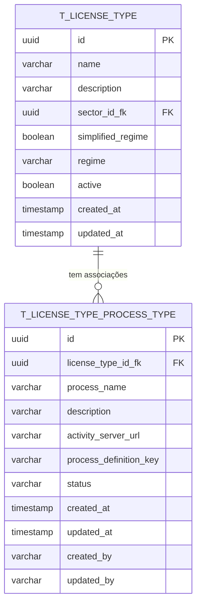

# PR01.04-BE-LIC - Dossier Tipo de Licença - Associação Tipo de Processos

## 1. Visão Geral

Este documento especifica a gestão da associação entre tipos de licença e tipos de processos, definindo quais processos são aplicáveis a cada tipo de licenciamento. Este módulo é fundamental para estabelecer os fluxos processuais específicos, etapas obrigatórias, documentação necessária e critérios de avaliação para cada tipo de licença.

**Módulo:** Dossier de Tipo de Licença - Associação Tipo de Processos  
**Endpoint Base:** `/api/v1/license-types/{id}/process-type`  
**Versão:** 1.0  
**Data:** 2025

<<<<<<< HEAD
---

## 2. Estrutura do Módulo de Tipos de Processo

### 2.1 Tipo de Processo de Licença

#### 2.1.1 Campos do Tipo de Processo
| Campo | Tipo | Validação | Descrição |
|-------|------|-----------|----------|
| id | String | Auto-gerado | Identificador único |
| name | String | 2-200 chars, NotBlank | Nome do tipo de processo |
| code | String | NotBlank, Unique | Código identificador |
| category | String | Must exist in OPTIONS | Categoria do processo |
| complexity | String | Must exist in OPTIONS | Nível de complexidade |
| description | String | Max 1000 chars | Descrição detalhada |
| estimatedDuration | Integer | Min: 1 | Duração estimada em dias |
| requiresInspection | Boolean | NotNull | Se requer inspeção |
| requiresPublicHearing | Boolean | NotNull | Se requer audiência pública |
| requiresEnvironmentalAnalysis | Boolean | NotNull | Se requer análise ambiental |
| isRenewalProcess | Boolean | NotNull | Se é processo de renovação |
| parentProcessId | String | Optional | Processo pai (subprocessos) |
=======
- Normalizar o modelo de dados para associações tipo licença - tipo processo

- Implementar arquitetura DDD para gestão de associações de processos

- Fornecer APIs REST para CRUD de associações com filtros avançados

- Integrar com servidores Activity externos para definições de processos

- Garantir validações robustas e integridade referencial

- Suportar múltiplos servidores Activity configuráveis

## 2. Modelo de Dados Normalizado

### 2.1 Diagrama ER



### 2.2 Definição da Tabela T_LICENSE_TYPE_PROCESS_TYPE

```sql
CREATE TABLE t_license_type_process_type (
    id UUID PRIMARY KEY DEFAULT gen_random_uuid(),
    license_type_id_fk UUID NOT NULL,
    process_name VARCHAR(255) NOT NULL,
    description TEXT,
    activity_server_url VARCHAR(500) NOT NULL,
    process_definition_key VARCHAR(255) NOT NULL,
    status VARCHAR(20) NOT NULL DEFAULT 'ACTIVE',
    created_at TIMESTAMP WITH TIME ZONE NOT NULL DEFAULT NOW(),
    updated_at TIMESTAMP WITH TIME ZONE NOT NULL DEFAULT NOW(),
    created_by VARCHAR(100) NOT NULL,
    updated_by VARCHAR(100) NOT NULL,

    CONSTRAINT fk_license_type_process_type_license_type
        FOREIGN KEY (license_type_id_fk) REFERENCES t_license_type(id) ON DELETE CASCADE,
    CONSTRAINT chk_process_name_not_empty
        CHECK (LENGTH(TRIM(process_name)) > 0),
    CONSTRAINT chk_activity_server_url_not_empty
        CHECK (LENGTH(TRIM(activity_server_url)) > 0),
    CONSTRAINT chk_process_definition_key_not_empty
        CHECK (LENGTH(TRIM(process_definition_key)) > 0),
    CONSTRAINT chk_license_type_process_type_status
        CHECK (status IN ('ACTIVE', 'INACTIVE')),
    CONSTRAINT uq_license_type_process_definition_key
        UNIQUE (license_type_id_fk, process_definition_key)
);
```

### 2.3 Índices

```sql
-- Índice principal para consultas por tipo de licença
CREATE INDEX idx_license_type_process_type_license_type ON t_license_type_process_type(license_type_id_fk);

-- Índice para consultas por status
CREATE INDEX idx_license_type_process_type_status ON t_license_type_process_type(status) WHERE status = 'ACTIVE';

-- Índice para consultas por chave de definição do processo
CREATE INDEX idx_license_type_process_type_process_key ON t_license_type_process_type(process_definition_key);

-- Índice para auditoria
CREATE INDEX idx_license_type_process_type_created_at ON t_license_type_process_type(created_at DESC);

-- Índice composto para consultas filtradas
CREATE INDEX idx_license_type_process_type_license_status ON t_license_type_process_type(license_type_id_fk, status);

-- Índice para busca textual por nome do processo
CREATE INDEX idx_license_type_process_type_name_search ON t_license_type_process_type USING gin(to_tsvector('portuguese', process_name));

-- Índice para consultas por URL do servidor Activity
CREATE INDEX idx_license_type_process_type_server_url ON t_license_type_process_type(activity_server_url);
```

## 3. Arquitetura DDD

### 3.1 Domain Layer

#### 3.1.1 Aggregate Root: LicenseTypeProcessType
>>>>>>> parent of 2bd9194 (refactor(database): standardize timestamp column names to created_date and last_modified_date)

#### 2.1.2 Estrutura do DTO de Tipo de Processo
```java
@Data
@NoArgsConstructor
@AllArgsConstructor
@IgrpDTO
public class LicenseProcessTypeRequestDTO {
    @NotNull(message = "Nome é obrigatório")
    @NotBlank(message = "Nome não pode estar vazio")
    @Size(min = 2, max = 200, message = "Nome deve ter entre 2 e 200 caracteres")
    private String name;
    
    @NotNull(message = "Código é obrigatório")
    @NotBlank(message = "Código não pode estar vazio")
    @Pattern(regexp = "^[A-Z0-9_]+$", message = "Código deve conter apenas letras maiúsculas, números e underscore")
    private String code;
    
    @NotNull(message = "Categoria é obrigatória")
    @NotBlank(message = "Categoria não pode estar vazia")
    private String categoryKey;  // Referência para OPTIONS com ccode="PROCESS_CATEGORY"
    
    @NotNull(message = "Complexidade é obrigatória")
    @NotBlank(message = "Complexidade não pode estar vazia")
    private String complexityKey;  // Referência para OPTIONS com ccode="PROCESS_COMPLEXITY"
    
    @Size(max = 1000, message = "Descrição não pode exceder 1000 caracteres")
    private String description;
<<<<<<< HEAD
    
    @NotNull(message = "Duração estimada é obrigatória")
    @Min(value = 1, message = "Duração estimada deve ser pelo menos 1 dia")
    private Integer estimatedDuration;
    
    @NotNull(message = "Campo 'requer inspeção' é obrigatório")
    private Boolean requiresInspection;
    
    @NotNull(message = "Campo 'requer audiência pública' é obrigatório")
    private Boolean requiresPublicHearing;
    
    @NotNull(message = "Campo 'requer análise ambiental' é obrigatório")
    private Boolean requiresEnvironmentalAnalysis;
    
    @NotNull(message = "Campo 'é processo de renovação' é obrigatório")
    private Boolean isRenewalProcess;
    
    private String parentProcessId;
    
    private Object metadata;
=======

    @Column(name = "activity_server_url", nullable = false, length = 500)
    private String activityServerUrl;

    @Column(name = "process_definition_key", nullable = false, length = 255)
    private String processDefinitionKey;

    @Column(name = "status", nullable = false)
    private String status;

    // Campos de auditoria
    @Column(name = "created_at", nullable = false)
    private Instant createdAt;

    @Column(name = "updated_at", nullable = false)
    private Instant updatedAt;

    @Column(name = "created_by", nullable = false)
    private String createdBy;

    @Column(name = "updated_by", nullable = false)
    private String updatedBy;

    // Métodos de negócio
    public static LicenseTypeProcessType create(
            LicenseTypeId licenseTypeId,
            String processName,
            String description,
            String activityServerUrl,
            String processDefinitionKey,
            String createdBy,
            ActivityServerValidator activityServerValidator) {

        validateCreationParameters(licenseTypeId, processName, activityServerUrl, processDefinitionKey, createdBy, activityServerValidator);

        return new LicenseTypeProcessType(
            LicenseTypeProcessTypeId.generate(),
            licenseTypeId,
            processName.trim(),
            description != null ? description.trim() : null,
            activityServerUrl.trim(),
            processDefinitionKey.trim(),
            "ACTIVE",
            createdBy
        );
    }

    public void updateProcessInfo(
            String processName,
            String description,
            String activityServerUrl,
            String processDefinitionKey,
            String updatedBy,
            ActivityServerValidator activityServerValidator) {

        validateUpdateParameters(processName, activityServerUrl, processDefinitionKey, updatedBy, activityServerValidator);

        this.processName = processName.trim();
        this.description = description != null ? description.trim() : null;
        this.activityServerUrl = activityServerUrl.trim();
        this.processDefinitionKey = processDefinitionKey.trim();
        this.updatedBy = updatedBy;
        this.updatedAt = Instant.now();
    }

    public void activate(String updatedBy) {
        this.status = "ACTIVE";
        this.updatedBy = updatedBy;
        this.updatedAt = Instant.now();
    }

    public void deactivate(String updatedBy) {
        this.status = "INACTIVE";
        this.updatedBy = updatedBy;
        this.updatedAt = Instant.now();
    }

    // Métodos de validação
    private static void validateCreationParameters(
            LicenseTypeId licenseTypeId,
            String processName,
            String activityServerUrl,
            String processDefinitionKey,
            String createdBy,
            ActivityServerValidator activityServerValidator) {

        if (licenseTypeId == null) {
            throw new IllegalArgumentException("License type ID cannot be null");
        }

        if (processName == null || processName.trim().isEmpty()) {
            throw new IllegalArgumentException("Process name cannot be null or empty");
        }

        if (processName.trim().length() > 255) {
            throw new IllegalArgumentException("Process name cannot exceed 255 characters");
        }

        if (activityServerUrl == null || activityServerUrl.trim().isEmpty()) {
            throw new IllegalArgumentException("Activity server URL cannot be null or empty");
        }

        if (activityServerUrl.trim().length() > 500) {
            throw new IllegalArgumentException("Activity server URL cannot exceed 500 characters");
        }

        if (!activityServerValidator.isValidUrl(activityServerUrl)) {
            throw new IllegalArgumentException("Invalid Activity server URL format");
        }

        if (processDefinitionKey == null || processDefinitionKey.trim().isEmpty()) {
            throw new IllegalArgumentException("Process definition key cannot be null or empty");
        }

        if (processDefinitionKey.trim().length() > 255) {
            throw new IllegalArgumentException("Process definition key cannot exceed 255 characters");
        }

        if (createdBy == null || createdBy.trim().isEmpty()) {
            throw new IllegalArgumentException("Created by cannot be null or empty");
        }
    }

    private static void validateUpdateParameters(
            String processName,
            String activityServerUrl,
            String processDefinitionKey,
            String updatedBy,
            ActivityServerValidator activityServerValidator) {

        if (processName == null || processName.trim().isEmpty()) {
            throw new IllegalArgumentException("Process name cannot be null or empty");
        }

        if (processName.trim().length() > 255) {
            throw new IllegalArgumentException("Process name cannot exceed 255 characters");
        }

        if (activityServerUrl == null || activityServerUrl.trim().isEmpty()) {
            throw new IllegalArgumentException("Activity server URL cannot be null or empty");
        }

        if (activityServerUrl.trim().length() > 500) {
            throw new IllegalArgumentException("Activity server URL cannot exceed 500 characters");
        }

        if (!activityServerValidator.isValidUrl(activityServerUrl)) {
            throw new IllegalArgumentException("Invalid Activity server URL format");
        }

        if (processDefinitionKey == null || processDefinitionKey.trim().isEmpty()) {
            throw new IllegalArgumentException("Process definition key cannot be null or empty");
        }

        if (processDefinitionKey.trim().length() > 255) {
            throw new IllegalArgumentException("Process definition key cannot exceed 255 characters");
        }

        if (updatedBy == null || updatedBy.trim().isEmpty()) {
            throw new IllegalArgumentException("Updated by cannot be null or empty");
        }
    }

    // Getters
    public LicenseTypeProcessTypeId getId() { return id; }
    public LicenseTypeId getLicenseTypeId() { return licenseTypeId; }
    public String getProcessName() { return processName; }
    public String getDescription() { return description; }
    public String getActivityServerUrl() { return activityServerUrl; }
    public String getProcessDefinitionKey() { return processDefinitionKey; }
    public String getStatus() { return status; }
    public Instant getCreatedAt() { return createdAt; }
    public Instant getUpdatedAt() { return updatedAt; }
    public String getCreatedBy() { return createdBy; }
    public String getUpdatedBy() { return updatedBy; }
>>>>>>> parent of 2bd9194 (refactor(database): standardize timestamp column names to created_date and last_modified_date)
}
```

### 2.2 Associação Tipo de Licença - Tipo de Processo

#### 2.2.1 Campos da Associação
| Campo | Tipo | Validação | Descrição |
|-------|------|-----------|----------|
| licenseTypeId | String | NotBlank, Must exist | ID do tipo de licença |
| processTypeId | String | NotBlank, Must exist | ID do tipo de processo |
| isRequired | Boolean | NotNull | Se o processo é obrigatório |
| executionOrder | Integer | Min: 1 | Ordem de execução |
| canRunInParallel | Boolean | NotNull | Se pode executar em paralelo |
| triggerConditions | String | JSON válido | Condições para ativação |
| maxDuration | Integer | Min: 1 | Duração máxima permitida |
| canBeSkipped | Boolean | NotNull | Se pode ser pulado |
| skipConditions | String | JSON válido | Condições para pular |
| requiredDocuments | Array | Valid list | Documentos obrigatórios |
| outputDocuments | Array | Valid list | Documentos gerados |

#### 2.2.2 Estrutura do DTO de Associação
```java
@Data
@NoArgsConstructor
@AllArgsConstructor
@IgrpDTO
public class LicenseTypeProcessAssociationRequestDTO {
    @NotNull(message = "ID do tipo de processo é obrigatório")
    @NotBlank(message = "ID do tipo de processo não pode estar vazio")
    private String processTypeId;
    
    @NotNull(message = "Campo 'obrigatório' é obrigatório")
    private Boolean isRequired;
    
    @NotNull(message = "Ordem de execução é obrigatória")
    @Min(value = 1, message = "Ordem de execução deve ser pelo menos 1")
    private Integer executionOrder;
    
    @NotNull(message = "Campo 'pode executar em paralelo' é obrigatório")
    private Boolean canRunInParallel;
    
    @Valid
    private TriggerConditionsDTO triggerConditions;
    
    @Min(value = 1, message = "Duração máxima deve ser pelo menos 1 dia")
    private Integer maxDuration;
    
    @NotNull(message = "Campo 'pode ser pulado' é obrigatório")
    private Boolean canBeSkipped;
    
    @Valid
    private SkipConditionsDTO skipConditions;
    
    private List<String> requiredDocumentKeys;
    
    private List<String> outputDocumentKeys;
    
    private Object metadata;
}

@Data
@NoArgsConstructor
@AllArgsConstructor
public class TriggerConditionsDTO {
    private String applicantType;  // INDIVIDUAL, COMPANY, NGO
    private BigDecimal minimumInvestment;
    private Integer minimumEmployees;
    private String locationZone;   // URBAN, RURAL, INDUSTRIAL
    private Boolean hasEnvironmentalImpact;
    private List<String> requiredLicenses;
    private Object customConditions;
}

@Data
@NoArgsConstructor
@AllArgsConstructor
public class SkipConditionsDTO {
    private Boolean hasValidPreviousLicense;
    private String previousLicenseType;
    private Integer daysSincePreviousApproval;
    private Boolean isRenewalWithoutChanges;
    private List<String> exemptionCriteria;
    private Object customConditions;
}
```

---

## 3. API REST - Gestão de Tipos de Processo

### 3.1 Operações CRUD de Tipos de Processo

#### 3.1.1 Listagem de Tipos de Processo
**Endpoint:** `GET /api/v1/license-process-types`

**Parâmetros de Query:**
| Parâmetro | Tipo | Obrigatório | Padrão | Descrição |
|-----------|------|-------------|--------|-----------|
| category | string | Não | - | Categoria do processo (INITIAL_LICENSING, RENEWAL, etc.) |
| complexity | string | Não | - | Nível de complexidade (LOW, MEDIUM, HIGH) |
| requiresInspection | boolean | Não | - | Se requer inspeção |
| requiresPublicHearing | boolean | Não | - | Se requer audiência pública |
| requiresEnvironmentalAnalysis | boolean | Não | - | Se requer análise ambiental |
| isRenewalProcess | boolean | Não | - | Se é processo de renovação |
| name | string | Não | - | Filtro por nome (busca parcial) |
| code | string | Não | - | Filtro por código (busca parcial) |
| pageNumber | string | Não | "0" | Número da página |
| pageSize | string | Não | "20" | Tamanho da página |
| sort | string | Não | "name" | Campo de ordenação |
| direction | string | Não | "ASC" | Direção da ordenação (ASC/DESC) |

**Resposta de Sucesso (200):**
```json
{
  "pageNumber": 0,
  "pageSize": 20,
  "totalElements": 35,
  "totalPages": 2,
  "content": [
    {
      "id": "pt-001",
      "name": "Análise Técnica Inicial",
      "code": "PROC_ANALISE_INICIAL",
      "category": {
        "key": "INITIAL_LICENSING",
        "name": "Licenciamento Inicial"
      },
      "complexity": {
        "key": "MEDIUM",
        "name": "Média"
      },
      "description": "Processo de análise técnica para licenciamento inicial",
      "estimatedDuration": 30,
      "requiresInspection": true,
      "requiresPublicHearing": false,
      "requiresEnvironmentalAnalysis": true,
      "isRenewalProcess": false,
      "parentProcessId": null,
      "isActive": true,
      "createdAt": "2025-01-15T10:30:00Z",
      "updatedAt": "2025-01-15T10:30:00Z"
    }
  ]
}
```

#### 3.1.2 Busca de Tipo de Processo por ID
**Endpoint:** `GET /api/v1/license-process-types/{processTypeId}`

**Parâmetros de Path:**
| Parâmetro | Tipo | Descrição |
|-----------|------|-----------|
| processTypeId | string | ID único do tipo de processo |

**Resposta de Sucesso (200):**
```json
{
  "id": "pt-001",
  "name": "Análise Técnica Inicial",
  "code": "PROC_ANALISE_INICIAL",
  "category": {
    "key": "INITIAL_LICENSING",
    "name": "Licenciamento Inicial",
    "description": "Processos para licenciamento inicial"
  },
  "complexity": {
    "key": "MEDIUM",
    "name": "Média",
    "description": "Complexidade média"
  },
  "description": "Processo de análise técnica para licenciamento inicial de atividades econômicas",
  "estimatedDuration": 30,
  "requiresInspection": true,
  "requiresPublicHearing": false,
  "requiresEnvironmentalAnalysis": true,
  "isRenewalProcess": false,
  "parentProcessId": null,
  "subProcesses": [],
  "requiredDocuments": [
    {
      "key": "BUSINESS_PLAN",
      "name": "Plano de Negócios",
      "required": true
    }
  ],
  "outputDocuments": [
    {
      "key": "TECHNICAL_REPORT",
      "name": "Relatório Técnico"
    }
  ],
  "isActive": true,
  "createdAt": "2025-01-15T10:30:00Z",
  "updatedAt": "2025-01-15T10:30:00Z",
  "metadata": {
    "department": "Licenciamento",
    "responsibleTeam": "Análise Técnica"
  }
}
```

**Códigos de Status:**
- 200: Tipo de processo encontrado
- 404: Tipo de processo não encontrado
- 500: Erro interno do servidor

#### 3.1.3 Criação de Tipo de Processo
**Endpoint:** `POST /api/v1/license-process-types`

**Payload de Requisição:** (formato do LicenseProcessTypeRequestDTO)

**Validações:**
- Nome: obrigatório, 2-200 caracteres
- Código: obrigatório, único, formato [A-Z0-9_]+
- Categoria: deve existir nas opções
- Complexidade: deve existir nas opções
- Duração estimada: mínimo 1 dia

**Códigos de Status:**
- 201: Tipo de processo criado com sucesso
- 400: Dados inválidos
- 409: Conflito (código já existe)
- 500: Erro interno do servidor

#### 3.1.4 Atualização de Tipo de Processo
**Endpoint:** `PUT /api/v1/license-process-types/{processTypeId}`

**Parâmetros de Path:**
| Parâmetro | Tipo | Descrição |
|-----------|------|-----------|
| processTypeId | string | ID único do tipo de processo |

**Payload de Requisição:** (mesmo formato da criação)

**Códigos de Status:**
- 200: Tipo de processo atualizado com sucesso
- 400: Dados inválidos
- 404: Tipo de processo não encontrado
- 500: Erro interno do servidor

#### 3.1.5 Ativação/Desativação de Tipo de Processo
**Endpoint:** `PATCH /api/v1/license-process-types/{processTypeId}/status`

**Parâmetros de Path:**
| Parâmetro | Tipo | Descrição |
|-----------|------|-----------|
| processTypeId | string | ID único do tipo de processo |

**Payload de Requisição:**
```json
{
  "isActive": false
}
```

**Códigos de Status:**
- 200: Status atualizado com sucesso
- 404: Tipo de processo não encontrado
- 500: Erro interno do servidor

---

### 3.2 Operações CRUD de Associações Tipo de Licença - Tipo de Processo

#### 3.2.1 Listagem de Associações
**Endpoint:** `GET /api/v1/license-types/{licenseTypeId}/process-types`

**Parâmetros de Path:**
| Parâmetro | Tipo | Descrição |
|-----------|------|-----------|
| licenseTypeId | string | ID único do tipo de licença |

**Parâmetros de Query:**
| Parâmetro | Tipo | Obrigatório | Padrão | Descrição |
|-----------|------|-------------|--------|-----------|
| isRequired | boolean | Não | - | Se o processo é obrigatório |
| canRunInParallel | boolean | Não | - | Se pode executar em paralelo |
| canBeSkipped | boolean | Não | - | Se pode ser pulado |
| executionOrder | integer | Não | - | Filtro por ordem de execução |
| processCategory | string | Não | - | Categoria do processo |
| pageNumber | string | Não | "0" | Número da página |
| pageSize | string | Não | "20" | Tamanho da página |
| sort | string | Não | "executionOrder" | Campo de ordenação |
| direction | string | Não | "ASC" | Direção da ordenação (ASC/DESC) |

**Resposta de Sucesso (200):**
```json
{
  "pageNumber": 0,
  "pageSize": 20,
  "totalElements": 8,
  "totalPages": 1,
  "content": [
    {
      "id": "lpta-001",
      "licenseTypeId": "lt-001",
      "processType": {
        "id": "pt-001",
        "name": "Análise Técnica Inicial",
        "code": "PROC_ANALISE_INICIAL",
        "category": {
          "key": "INITIAL_LICENSING",
          "name": "Licenciamento Inicial"
        },
        "complexity": {
          "key": "MEDIUM",
          "name": "Média"
        },
        "estimatedDuration": 30
      },
      "isRequired": true,
      "executionOrder": 1,
      "canRunInParallel": false,
      "maxDuration": 30,
      "canBeSkipped": false,
      "triggerConditions": {
        "applicantType": "COMPANY",
        "minimumInvestment": 100000.00,
        "hasEnvironmentalImpact": true
      },
      "skipConditions": null,
      "requiredDocuments": [
        {
          "key": "BUSINESS_PLAN",
          "name": "Plano de Negócios"
        }
      ],
      "outputDocuments": [
        {
          "key": "TECHNICAL_REPORT",
          "name": "Relatório Técnico"
        }
      ],
      "isActive": true,
      "createdAt": "2025-01-15T10:30:00Z",
      "updatedAt": "2025-01-15T10:30:00Z"
    }
  ]
}
```

#### 3.2.2 Busca de Associação por ID
**Endpoint:** `GET /api/v1/license-types/{licenseTypeId}/process-types/{processTypeId}`

**Parâmetros de Path:**
| Parâmetro | Tipo | Descrição |
|-----------|------|-----------|
| licenseTypeId | string | ID único do tipo de licença |
| processTypeId | string | ID único do tipo de processo |

**Resposta de Sucesso (200):**
```json
{
  "id": "lpta-001",
  "licenseType": {
    "id": "lt-001",
    "name": "Licença de Atividade Econômica",
    "code": "LAE"
  },
  "processType": {
    "id": "pt-001",
    "name": "Análise Técnica Inicial",
    "code": "PROC_ANALISE_INICIAL",
    "category": {
      "key": "INITIAL_LICENSING",
      "name": "Licenciamento Inicial"
    },
    "complexity": {
      "key": "MEDIUM",
      "name": "Média"
    },
    "description": "Processo de análise técnica para licenciamento inicial",
    "estimatedDuration": 30,
    "requiresInspection": true,
    "requiresPublicHearing": false,
    "requiresEnvironmentalAnalysis": true
  },
  "isRequired": true,
  "executionOrder": 1,
  "canRunInParallel": false,
  "maxDuration": 30,
  "canBeSkipped": false,
  "triggerConditions": {
    "applicantType": "COMPANY",
    "minimumInvestment": 100000.00,
    "minimumEmployees": 5,
    "locationZone": "INDUSTRIAL",
    "hasEnvironmentalImpact": true,
    "requiredLicenses": ["ENVIRONMENTAL_LICENSE"],
    "customConditions": {
      "businessArea": ">= 500m2",
      "operatingHours": "24H"
    }
  },
  "skipConditions": null,
  "requiredDocuments": [
    {
      "key": "BUSINESS_PLAN",
      "name": "Plano de Negócios",
      "required": true
    },
    {
      "key": "ENVIRONMENTAL_STUDY",
      "name": "Estudo de Impacto Ambiental",
      "required": true
    }
  ],
  "outputDocuments": [
    {
      "key": "TECHNICAL_REPORT",
      "name": "Relatório Técnico"
    },
    {
      "key": "APPROVAL_CERTIFICATE",
      "name": "Certificado de Aprovação"
    }
  ],
  "isActive": true,
  "createdAt": "2025-01-15T10:30:00Z",
  "updatedAt": "2025-01-15T10:30:00Z",
  "metadata": {
    "department": "Licenciamento",
    "responsibleTeam": "Análise Técnica",
    "priority": "HIGH"
  }
}
```

**Códigos de Status:**
- 200: Associação encontrada
- 404: Associação não encontrada
- 500: Erro interno do servidor

#### 3.2.3 Criação de Associação
**Endpoint:** `POST /api/v1/license-types/{licenseTypeId}/process-types`

**Payload de Requisição:** (formato do LicenseTypeProcessAssociationRequestDTO)

**Códigos de Status:**
- 201: Associação criada com sucesso
- 400: Dados inválidos
- 409: Conflito (associação já existe)
- 500: Erro interno do servidor

#### 3.2.4 Atualização de Associação
**Endpoint:** `PUT /api/v1/license-types/{licenseTypeId}/process-types/{processTypeId}`

**Parâmetros de Path:**
| Parâmetro | Tipo | Descrição |
|-----------|------|-----------|
| licenseTypeId | string | ID único do tipo de licença |
| processTypeId | string | ID único do tipo de processo |

**Payload de Requisição:** (mesmo formato da criação)

**Códigos de Status:**
- 200: Associação atualizada com sucesso
- 400: Dados inválidos
- 404: Associação não encontrada
- 500: Erro interno do servidor

#### 3.2.5 Remoção de Associação
**Endpoint:** `DELETE /api/v1/license-types/{licenseTypeId}/process-types/{processTypeId}`

**Parâmetros de Path:**
| Parâmetro | Tipo | Descrição |
|-----------|------|-----------|
| licenseTypeId | string | ID único do tipo de licença |
| processTypeId | string | ID único do tipo de processo |

**Códigos de Status:**
- 204: Associação removida com sucesso
- 404: Associação não encontrada
- 409: Conflito (associação em uso)
- 500: Erro interno do servidor
```

#### 3.1.2 Busca de Tipo de Processo por ID
**Endpoint:** `GET /api/v1/license-process-types/{processTypeId}`

**Resposta de Sucesso (200):**
```json
{
  "id": "pt-001",
  "name": "Análise Técnica Inicial",
  "code": "PROC_ANALISE_INICIAL",
  "category": {
    "key": "INITIAL_LICENSING",
    "name": "Licenciamento Inicial",
    "description": "Processos para obtenção de nova licença"
  },
  "complexity": {
    "key": "MEDIUM",
    "name": "Média",
    "description": "Processo com complexidade moderada",
    "estimatedHours": 40
  },
  "description": "Processo de análise técnica inicial para verificação de conformidade básica com regulamentações municipais e setoriais",
  "estimatedDuration": 10,
  "requirements": {
    "requiresInspection": true,
    "requiresPublicHearing": false,
    "requiresEnvironmentalAnalysis": false,
    "isRenewalProcess": false
  },
  "processHierarchy": {
    "parentProcess": null,
    "subProcesses": [
      {
        "id": "pt-002",
        "name": "Verificação Documental",
        "code": "PROC_VERIF_DOC",
        "order": 1
      },
      {
        "id": "pt-003",
        "name": "Análise de Conformidade",
        "code": "PROC_ANALISE_CONF",
        "order": 2
      }
    ]
  },
  "processSteps": [
    {
      "stepNumber": 1,
      "name": "Recepção e Triagem",
      "description": "Recepção da solicitação e triagem inicial",
      "estimatedDuration": 1,
      "responsible": "Atendimento",
      "automated": true
    },
    {
      "stepNumber": 2,
      "name": "Análise Documental",
      "description": "Verificação da completude e validade dos documentos",
      "estimatedDuration": 3,
      "responsible": "Técnico Administrativo",
      "automated": false
    },
    {
      "stepNumber": 3,
      "name": "Análise Técnica",
      "description": "Avaliação técnica da conformidade",
      "estimatedDuration": 5,
      "responsible": "Técnico Especialista",
      "automated": false
    },
    {
      "stepNumber": 4,
      "name": "Inspeção Local",
      "description": "Inspeção física do estabelecimento",
      "estimatedDuration": 1,
      "responsible": "Inspetor",
      "automated": false
    }
  ],
  "requiredDocuments": [
    {
      "documentType": "IDENTITY_DOCUMENT",
      "name": "Documento de Identidade",
      "required": true,
      "format": "PDF",
      "maxSize": "5MB"
    },
    {
      "documentType": "BUSINESS_PLAN",
      "name": "Plano de Negócio",
      "required": true,
      "format": "PDF",
      "maxSize": "10MB"
    }
  ],
  "outputDocuments": [
    {
      "documentType": "TECHNICAL_REPORT",
      "name": "Relatório de Análise Técnica",
      "generatedBy": "SYSTEM",
      "template": "technical_analysis_template.pdf"
    }
  ],
  "statistics": {
    "totalExecutions": 1250,
    "averageCompletionTime": 8.5,
    "successRate": 92.3,
    "commonRejectionReasons": [
      "Documentação incompleta (35%)",
      "Não conformidade técnica (28%)",
      "Localização inadequada (15%)"
    ]
  },
  "metadata": {
    "requiredSpecialists": ["Técnico Urbanístico", "Engenheiro Civil"],
    "checkpoints": ["Documentação", "Conformidade", "Segurança"],
    "automationLevel": "PARTIAL",
    "qualityMetrics": {
      "accuracyRate": 96.5,
      "customerSatisfaction": 4.2
    }
  }
}
```

#### 3.1.3 Criação de Tipo de Processo
**Endpoint:** `POST /api/v1/license-process-types`

**Payload de Requisição:**
```json
{
  "name": "Análise de Impacto Ambiental",
  "code": "PROC_IMPACTO_AMB",
  "categoryKey": "ENVIRONMENTAL_ANALYSIS",
  "complexityKey": "HIGH",
  "description": "Processo de avaliação de impacto ambiental para estabelecimentos com potencial impacto significativo",
  "estimatedDuration": 30,
  "requiresInspection": true,
  "requiresPublicHearing": true,
  "requiresEnvironmentalAnalysis": true,
  "isRenewalProcess": false,
  "parentProcessId": null,
  "metadata": {
    "requiredSpecialists": ["Engenheiro Ambiental", "Biólogo"],
    "checkpoints": ["Impacto Hídrico", "Impacto Atmosférico", "Gestão de Resíduos"],
    "automationLevel": "LOW",
    "regulatoryFramework": ["Lei Ambiental nº 86/2010", "Decreto-Lei nº 29/2006"]
  }
}
```

---

## 4. API REST - Associações Tipo de Licença - Tipo de Processo

### 4.1 Gestão de Associações

#### 4.1.1 Listar Processos de um Tipo de Licença
**Endpoint:** `GET /api/v1/license-types/{licenseTypeId}/process-type`

**Parâmetros de Query:**
```
?required=true
&category=INITIAL_LICENSING
&complexity=MEDIUM
&canRunInParallel=false
&executionOrder=1
```

**Resposta de Sucesso (200):**
```json
{
  "licenseTypeId": "lt-001",
  "licenseTypeName": "Licença de Restaurante",
  "totalProcesses": 6,
  "requiredProcesses": 4,
  "optionalProcesses": 2,
  "estimatedTotalDuration": 45,
  "processes": [
    {
      "associationId": "ltp-001",
      "processType": {
        "id": "pt-001",
        "name": "Análise Técnica Inicial",
        "code": "PROC_ANALISE_INICIAL",
        "category": "INITIAL_LICENSING",
        "complexity": "MEDIUM",
        "estimatedDuration": 10
      },
      "associationDetails": {
        "isRequired": true,
        "executionOrder": 1,
        "canRunInParallel": false,
        "maxDuration": 15,
        "canBeSkipped": false
      },
      "triggerConditions": {
        "applicantType": "ANY",
        "minimumInvestment": null,
        "locationZone": "ANY",
        "hasEnvironmentalImpact": false,
        "customConditions": {
          "alwaysRequired": true
        }
      },
      "skipConditions": null,
      "requiredDocuments": [
        {
          "documentKey": "IDENTITY_DOCUMENT",
          "documentName": "Documento de Identidade",
          "required": true
        },
        {
          "documentKey": "BUSINESS_PLAN",
          "documentName": "Plano de Negócio",
          "required": true
        }
      ],
      "outputDocuments": [
        {
          "documentKey": "TECHNICAL_REPORT",
          "documentName": "Relatório de Análise Técnica"
        }
      ]
    },
    {
      "associationId": "ltp-002",
      "processType": {
        "id": "pt-005",
        "name": "Análise de Impacto Ambiental",
        "code": "PROC_IMPACTO_AMB",
        "category": "ENVIRONMENTAL_ANALYSIS",
        "complexity": "HIGH",
        "estimatedDuration": 30
      },
      "associationDetails": {
        "isRequired": false,
        "executionOrder": 3,
        "canRunInParallel": true,
        "maxDuration": 45,
        "canBeSkipped": true
      },
      "triggerConditions": {
        "applicantType": "COMPANY",
        "minimumInvestment": 1000000.00,
        "locationZone": "INDUSTRIAL",
        "hasEnvironmentalImpact": true,
        "customConditions": {
          "capacityThreshold": 100,
          "nearWaterSource": true
        }
      },
      "skipConditions": {
        "hasValidPreviousLicense": true,
        "previousLicenseType": "ENVIRONMENTAL_LICENSE",
        "daysSincePreviousApproval": 365,
        "exemptionCriteria": ["LOW_IMPACT_ACTIVITY"]
      }
    }
  ],
  "processFlow": {
    "sequentialSteps": [
      {
        "order": 1,
        "processes": ["pt-001"],
        "canRunInParallel": false
      },
      {
        "order": 2,
        "processes": ["pt-002", "pt-003"],
        "canRunInParallel": true
      },
      {
        "order": 3,
        "processes": ["pt-005"],
        "canRunInParallel": false,
        "conditional": true
      }
    ],
    "criticalPath": ["pt-001", "pt-002", "pt-004"],
    "estimatedMinDuration": 25,
    "estimatedMaxDuration": 60
  }
}
```

#### 4.1.2 Associar Processo a Tipo de Licença
**Endpoint:** `POST /api/v1/license-types/{licenseTypeId}/process-type`

**Payload de Requisição:**
```json
{
  "processTypeId": "pt-006",
  "isRequired": false,
  "executionOrder": 4,
  "canRunInParallel": true,
  "triggerConditions": {
    "applicantType": "COMPANY",
    "minimumInvestment": 500000.00,
    "minimumEmployees": 20,
    "locationZone": "COMMERCIAL",
    "hasEnvironmentalImpact": false,
    "requiredLicenses": ["FIRE_SAFETY_LICENSE"],
    "customConditions": {
      "hasAlcoholSales": true,
      "operatesAfterMidnight": true
    }
  },
  "maxDuration": 20,
  "canBeSkipped": true,
  "skipConditions": {
    "hasValidPreviousLicense": true,
    "previousLicenseType": "ALCOHOL_LICENSE",
    "daysSincePreviousApproval": 180,
    "isRenewalWithoutChanges": true,
    "exemptionCriteria": ["FAMILY_BUSINESS", "SMALL_SCALE"]
  },
  "requiredDocumentKeys": [
    "ALCOHOL_HANDLING_CERTIFICATE",
    "SECURITY_PLAN",
    "NOISE_IMPACT_STUDY"
  ],
  "outputDocumentKeys": [
    "ALCOHOL_COMPLIANCE_REPORT",
    "SECURITY_APPROVAL"
  ],
  "metadata": {
    "specialRequirements": {
      "securityPersonnel": true,
      "soundproofing": true,
      "emergencyExits": 2
    },
    "inspectionFrequency": "QUARTERLY",
    "renewalPeriod": 12
  }
}
```

**Resposta de Sucesso (201):**
```json
{
  "associationId": "ltp-025",
  "message": "Processo associado com sucesso",
  "licenseTypeId": "lt-001",
  "processTypeId": "pt-006",
  "executionOrder": 4,
  "isRequired": false,
  "estimatedImpact": {
    "additionalDuration": 20,
    "newTotalDuration": 65,
    "affectedApplications": 0,
    "triggerRate": "Estimado 30% das solicitações"
  }
}
```

#### 4.1.3 Simulação de Fluxo de Processo
**Endpoint:** `POST /api/v1/license-types/{licenseTypeId}/process-type/simulate`

**Payload de Requisição:**
```json
{
  "applicantProfile": {
    "type": "COMPANY",
    "investment": 750000.00,
    "employees": 25,
    "locationZone": "COMMERCIAL",
    "hasEnvironmentalImpact": false,
    "existingLicenses": ["FIRE_SAFETY_LICENSE"],
    "businessCharacteristics": {
      "hasAlcoholSales": true,
      "operatesAfterMidnight": false,
      "capacity": 80
    }
  },
  "previousLicenses": [
    {
      "type": "ALCOHOL_LICENSE",
      "approvalDate": "2023-06-15",
      "status": "ACTIVE"
    }
  ]
}
```

**Resposta de Sucesso (200):**
```json
{
  "simulationId": "sim-001",
  "licenseTypeId": "lt-001",
  "applicantProfile": {
    "type": "COMPANY",
    "matchedCriteria": ["COMMERCIAL_ZONE", "MEDIUM_INVESTMENT", "ALCOHOL_SALES"]
  },
  "applicableProcesses": [
    {
      "processTypeId": "pt-001",
      "name": "Análise Técnica Inicial",
      "required": true,
      "triggered": true,
      "reason": "Sempre obrigatório",
      "estimatedDuration": 10,
      "canBeSkipped": false
    },
    {
      "processTypeId": "pt-002",
      "name": "Inspeção de Segurança",
      "required": true,
      "triggered": true,
      "reason": "Estabelecimento comercial",
      "estimatedDuration": 7,
      "canBeSkipped": false
    },
    {
      "processTypeId": "pt-006",
      "name": "Análise de Licença de Álcool",
      "required": false,
      "triggered": false,
      "reason": "Possui licença válida (aprovada em 2023-06-15)",
      "estimatedDuration": 0,
      "canBeSkipped": true,
      "skipReason": "Licença anterior ainda válida"
    }
  ],
  "processFlow": {
    "totalSteps": 3,
    "parallelSteps": 1,
    "sequentialSteps": 2,
    "estimatedDuration": 17,
    "criticalPath": ["pt-001", "pt-002", "pt-004"]
  },
  "requiredDocuments": [
    {
      "documentKey": "IDENTITY_DOCUMENT",
      "documentName": "Documento de Identidade",
      "source": "pt-001"
    },
    {
      "documentKey": "FIRE_SAFETY_CERTIFICATE",
      "documentName": "Certificado de Segurança contra Incêndios",
      "source": "pt-002"
    }
  ],
  "estimatedCosts": {
    "processingFees": 15000.00,
    "inspectionFees": 5000.00,
    "documentationFees": 2000.00,
    "totalEstimated": 22000.00
  },
  "recommendations": [
    "Preparar documentação de segurança contra incêndios",
    "Agendar inspeção prévia para identificar possíveis não conformidades",
    "Considerar renovação antecipada da licença de álcool para evitar interrupções"
  ]
}
```

---

## 5. Funcionalidades Avançadas

### 5.1 Otimização de Fluxos

#### 5.1.1 Análise de Otimização
**Endpoint:** `GET /api/v1/license-types/{licenseTypeId}/process-optimization`

**Resposta de Sucesso (200):**
```json
{
  "licenseTypeId": "lt-001",
  "currentFlow": {
    "totalProcesses": 6,
    "averageDuration": 45,
    "bottlenecks": [
      {
        "processId": "pt-005",
        "processName": "Análise de Impacto Ambiental",
        "averageDelay": 15,
        "frequency": 0.3
      }
    ]
  },
  "optimizationSuggestions": [
    {
      "type": "PARALLELIZATION",
      "description": "Executar análise técnica e inspeção de segurança em paralelo",
      "affectedProcesses": ["pt-001", "pt-002"],
      "potentialSaving": 7,
      "feasibility": "HIGH",
      "requirements": ["Coordenação entre equipes", "Compartilhamento de cronograma"]
    },
    {
      "type": "CONDITIONAL_SKIP",
      "description": "Pular análise ambiental para estabelecimentos pequenos",
      "affectedProcesses": ["pt-005"],
      "potentialSaving": 30,
      "feasibility": "MEDIUM",
      "requirements": ["Definir critérios claros", "Aprovação regulatória"]
    },
    {
      "type": "AUTOMATION",
      "description": "Automatizar verificação documental inicial",
      "affectedProcesses": ["pt-002"],
      "potentialSaving": 3,
      "feasibility": "HIGH",
      "requirements": ["Desenvolvimento de sistema", "Treinamento de equipe"]
    }
  ],
  "optimizedFlow": {
    "estimatedDuration": 28,
    "improvementPercentage": 37.8,
    "riskFactors": [
      "Possível redução na qualidade da análise",
      "Necessidade de coordenação adicional"
    ]
  }
}
```

### 5.2 Análise de Conformidade

#### 5.2.1 Verificação de Conformidade Processual
**Endpoint:** `GET /api/v1/license-types/{licenseTypeId}/process-compliance`

**Resposta de Sucesso (200):**
```json
{
  "licenseTypeId": "lt-001",
  "complianceStatus": "COMPLIANT",
  "totalProcesses": 6,
  "complianceBreakdown": {
    "compliant": 5,
    "nonCompliant": 0,
    "warnings": 1
  },
  "processAnalysis": [
    {
      "processId": "pt-001",
      "processName": "Análise Técnica Inicial",
      "status": "COMPLIANT",
      "checks": [
        {
          "rule": "Duração máxima respeitada",
          "status": "PASS",
          "details": "10 dias <= 15 dias (limite)"
        },
        {
          "rule": "Documentos obrigatórios definidos",
          "status": "PASS",
          "details": "3 documentos obrigatórios configurados"
        }
      ]
    },
    {
      "processId": "pt-005",
      "processName": "Análise de Impacto Ambiental",
      "status": "WARNING",
      "checks": [
        {
          "rule": "Condições de ativação bem definidas",
          "status": "WARNING",
          "details": "Critério 'impacto significativo' pode ser ambíguo"
        }
      ],
      "recommendations": [
        "Definir critérios quantitativos para 'impacto significativo'",
        "Criar checklist de avaliação prévia"
      ]
    }
  ],
  "overallRecommendations": [
    "Revisar critérios de ativação de processos condicionais",
    "Implementar sistema de pré-avaliação automática",
    "Criar templates padronizados para documentos de saída"
  ]
}
```

---

## 6. Regras de Negócio Específicas

### 6.1 Validações de Associação

#### 6.1.1 Regras de Integridade
```java
// Validação de ordem de execução
@AssertTrue(message = "Ordem de execução deve ser única por tipo de licença")
public boolean isExecutionOrderUnique() {
    // Implementação da validação
    return true;
}

// Validação de processos paralelos
@AssertTrue(message = "Processos paralelos devem ter a mesma ordem de execução")
public boolean isParallelExecutionValid() {
    return !canRunInParallel || executionOrder != null;
}

// Validação de condições de skip
@AssertTrue(message = "Processos obrigatórios não podem ter condições de skip")
public boolean isSkipConditionValid() {
    return !isRequired || !canBeSkipped || skipConditions == null;
}
```

#### 6.1.2 Regras de Fluxo
- Processos com `executionOrder` menor devem completar antes dos posteriores
- Processos com `canRunInParallel=true` e mesma `executionOrder` podem executar simultaneamente
- Processos com `isRequired=true` não podem ser removidos se houver solicitações ativas
- Alterações em `maxDuration` afetam apenas novos processos

### 6.2 Regras de Ativação

#### 6.2.1 Avaliação de Condições de Trigger
```java
// Lógica de avaliação de condições
public boolean evaluateTriggerConditions(ApplicantProfile profile, TriggerConditionsDTO conditions) {
    boolean matches = true;
    
    if (conditions.getApplicantType() != null && !"ANY".equals(conditions.getApplicantType())) {
        matches &= conditions.getApplicantType().equals(profile.getType());
    }
    
    if (conditions.getMinimumInvestment() != null) {
        matches &= profile.getInvestment().compareTo(conditions.getMinimumInvestment()) >= 0;
    }
    
    if (conditions.getLocationZone() != null && !"ANY".equals(conditions.getLocationZone())) {
        matches &= conditions.getLocationZone().equals(profile.getLocationZone());
    }
    
    // Avaliação de condições customizadas
    if (conditions.getCustomConditions() != null) {
        matches &= evaluateCustomConditions(profile, conditions.getCustomConditions());
    }
    
    return matches;
}
```

#### 6.2.2 Avaliação de Condições de Skip
```java
// Lógica de avaliação de condições de skip
public boolean evaluateSkipConditions(ApplicantProfile profile, List<PreviousLicense> licenses, SkipConditionsDTO conditions) {
    if (conditions == null) return false;
    
    boolean canSkip = false;
    
    if (conditions.getHasValidPreviousLicense() != null && conditions.getHasValidPreviousLicense()) {
        canSkip |= hasValidLicense(licenses, conditions.getPreviousLicenseType(), conditions.getDaysSincePreviousApproval());
    }
    
    if (conditions.getIsRenewalWithoutChanges() != null && conditions.getIsRenewalWithoutChanges()) {
        canSkip |= isRenewalWithoutChanges(profile);
    }
    
    if (conditions.getExemptionCriteria() != null && !conditions.getExemptionCriteria().isEmpty()) {
        canSkip |= hasExemptionCriteria(profile, conditions.getExemptionCriteria());
    }
    
    return canSkip;
}
```

<<<<<<< HEAD
---

## 7. Casos de Uso Específicos

### 7.1 UC001 - Configurar Fluxo Complexo
**Cenário:** Restaurante com venda de álcool em zona turística

**Processos Aplicáveis:**
1. Análise Técnica Inicial (Obrigatório, Ordem 1)
2. Inspeção de Segurança (Obrigatório, Ordem 2, Paralelo com 3)
3. Análise Sanitária (Obrigatório, Ordem 2, Paralelo com 2)
4. Licença de Álcool (Condicional, Ordem 3)
5. Análise de Impacto Turístico (Condicional, Ordem 4)
6. Aprovação Final (Obrigatório, Ordem 5)

**Condições:**
- Processo 4: Se `hasAlcoholSales = true`
- Processo 5: Se `locationZone = TOURIST` AND `capacity > 50`

### 7.2 UC002 - Otimização por Perfil
**Cenário:** Pequeno café familiar (simplificação)

**Otimizações:**
- Skip: Análise de Impacto Ambiental (baixo impacto)
- Skip: Análise de Impacto Turístico (não aplicável)
- Simplificação: Inspeção de Segurança (checklist reduzido)
- Paralelização: Análise Técnica + Análise Sanitária

**Resultado:** 45 dias → 15 dias (67% redução)

### 7.3 UC003 - Renovação Inteligente
**Cenário:** Renovação sem alterações

**Condições de Skip:**
- Licença anterior válida há menos de 2 anos
- Sem alterações na estrutura física
- Sem mudança de atividade
- Histórico de conformidade

**Processos Mantidos:**
- Verificação documental (automatizada)
- Inspeção simplificada (checklist reduzido)
- Aprovação final

---

## 8. Integrações e Dependências

### 8.1 Sistemas Externos
- **Sistema de Workflow**: Para execução dos processos
- **Sistema de Documentos**: Para gestão de documentos
- **Sistema de Agenda**: Para agendamento de inspeções
- **Sistema de Notificações**: Para comunicação de status

### 8.2 Módulos Internos
- **Tipos de Licença**: Definição de processos aplicáveis
- **Entidades**: Responsáveis pela execução
- **Solicitações**: Instanciação dos processos
- **Taxas**: Cálculo de custos por processo
- **Relatórios**: Análise de performance

---

## 9. Monitoramento e Métricas

### 9.1 KPIs por Processo
- Tempo médio de execução
- Taxa de conclusão no prazo
- Taxa de aprovação/rejeição
- Frequência de ativação (para condicionais)
- Custo médio por execução

### 9.2 Alertas Automáticos
- Processos com atraso > 20%
- Taxa de rejeição > 15%
- Gargalos identificados
- Condições de trigger ambíguas
- Processos nunca ativados

---

## 10. Considerações de Performance

### 10.1 Otimizações
- Cache de condições de trigger avaliadas
- Pré-cálculo de fluxos comuns
- Índices em campos de busca
- Compressão de metadados JSON

### 10.2 Escalabilidade
- Particionamento por tipo de licença
- Processamento assíncrono de simulações
- Cache distribuído para configurações
- Backup incremental de alterações

Este documento estabelece a base completa para a gestão de processos no sistema de licenciamento, garantindo flexibilidade, eficiência e adaptabilidade aos diferentes cenários de negócio.
=======
### 5.3 Testes de API (Integration Tests)

```java
@SpringBootTest(webEnvironment = SpringBootTest.WebEnvironment.RANDOM_PORT)
@AutoConfigureTestDatabase(replace = AutoConfigureTestDatabase.Replace.NONE)
@Testcontainers
class LicenseTypeProcessTypeControllerIntegrationTest {

    @Container
    static PostgreSQLContainer<?> postgres = new PostgreSQLContainer<>("postgres:13")
            .withDatabaseName("testdb")
            .withUsername("test")
            .withPassword("test");

    @Autowired
    private TestRestTemplate restTemplate;

    @Autowired
    private LicenseTypeProcessTypeRepository repository;

    @MockBean
    private ActivityServerValidator activityServerValidator;

    private String baseUrl;
    private String licenseTypeId;
    private HttpHeaders headers;

    @DynamicPropertySource
    static void configureProperties(DynamicPropertyRegistry registry) {
        registry.add("spring.datasource.url", postgres::getJdbcUrl);
        registry.add("spring.datasource.username", postgres::getUsername);
        registry.add("spring.datasource.password", postgres::getPassword);
    }

    @BeforeEach
    void setUp() {
        licenseTypeId = UUID.randomUUID().toString();
        baseUrl = "/api/v1/license-types/" + licenseTypeId + "/process-types";

        headers = new HttpHeaders();
        headers.setContentType(MediaType.APPLICATION_JSON);
        headers.setBearerAuth("test-token");

        // Mock Activity Server Validator
        when(activityServerValidator.isValidUrl(anyString())).thenReturn(true);
        when(activityServerValidator.isServerAccessible(anyString())).thenReturn(true);
        when(activityServerValidator.isValidProcessDefinition(anyString(), anyString())).thenReturn(true);

        // Clean database
        repository.deleteAll();
    }

    @Test
    @DisplayName("Deve criar nova associação com sucesso")
    void shouldCreateNewAssociationSuccessfully() {
        // Given
        CreateLicenseTypeProcessTypeDTO createDTO = new CreateLicenseTypeProcessTypeDTO(
            "Processo de Aprovação Ambiental",
            "Processo para aprovação de licenças ambientais",
            "https://activity.example.com",
            "environmental-approval-process"
        );

        HttpEntity<CreateLicenseTypeProcessTypeDTO> request = new HttpEntity<>(createDTO, headers);

        // When
        ResponseEntity<LicenseTypeProcessTypeDTO> response = restTemplate.postForEntity(
            baseUrl, request, LicenseTypeProcessTypeDTO.class
        );

        // Then
        assertThat(response.getStatusCode()).isEqualTo(HttpStatus.CREATED);
        assertThat(response.getBody()).isNotNull();
        assertThat(response.getBody().processName()).isEqualTo("Processo de Aprovação Ambiental");
        assertThat(response.getBody().licenseTypeId()).isEqualTo(licenseTypeId);
        assertThat(response.getBody().status()).isEqualTo("ACTIVE");

        // Verify in database
        List<LicenseTypeProcessType> associations = repository.findAll();
        assertThat(associations).hasSize(1);
    }

    @Test
    @DisplayName("Deve retornar erro 400 quando dados de criação forem inválidos")
    void shouldReturn400WhenCreateDataIsInvalid() {
        // Given
        CreateLicenseTypeProcessTypeDTO createDTO = new CreateLicenseTypeProcessTypeDTO(
            "", // Nome vazio
            "Descrição",
            "invalid-url", // URL inválida
            "process-key"
        );

        HttpEntity<CreateLicenseTypeProcessTypeDTO> request = new HttpEntity<>(createDTO, headers);

        // When
        ResponseEntity<String> response = restTemplate.postForEntity(
            baseUrl, request, String.class
        );

        // Then
        assertThat(response.getStatusCode()).isEqualTo(HttpStatus.BAD_REQUEST);
    }

    @Test
    @DisplayName("Deve listar associações com paginação")
    void shouldListAssociationsWithPagination() {
        // Given
        createTestAssociation("Processo 1", "process-1");
        createTestAssociation("Processo 2", "process-2");

        // When
        ResponseEntity<String> response = restTemplate.exchange(
            baseUrl + "?page=0&size=1",
            HttpMethod.GET,
            new HttpEntity<>(headers),
            String.class
        );

        // Then
        assertThat(response.getStatusCode()).isEqualTo(HttpStatus.OK);
        assertThat(response.getBody()).contains("\"totalElements\":2");
        assertThat(response.getBody()).contains("\"size\":1");
    }

    @Test
    @DisplayName("Deve buscar associação por ID")
    void shouldFindAssociationById() {
        // Given
        LicenseTypeProcessType association = createTestAssociation("Processo Teste", "test-process");

        // When
        ResponseEntity<LicenseTypeProcessTypeDTO> response = restTemplate.exchange(
            baseUrl + "/" + association.getId().getValue(),
            HttpMethod.GET,
            new HttpEntity<>(headers),
            LicenseTypeProcessTypeDTO.class
        );

        // Then
        assertThat(response.getStatusCode()).isEqualTo(HttpStatus.OK);
        assertThat(response.getBody()).isNotNull();
        assertThat(response.getBody().processName()).isEqualTo("Processo Teste");
    }

    @Test
    @DisplayName("Deve retornar 404 quando associação não for encontrada")
    void shouldReturn404WhenAssociationNotFound() {
        // Given
        String nonExistentId = UUID.randomUUID().toString();

        // When
        ResponseEntity<String> response = restTemplate.exchange(
            baseUrl + "/" + nonExistentId,
            HttpMethod.GET,
            new HttpEntity<>(headers),
            String.class
        );

        // Then
        assertThat(response.getStatusCode()).isEqualTo(HttpStatus.NOT_FOUND);
    }

    @Test
    @DisplayName("Deve atualizar associação com sucesso")
    void shouldUpdateAssociationSuccessfully() {
        // Given
        LicenseTypeProcessType association = createTestAssociation("Processo Original", "original-process");

        UpdateLicenseTypeProcessTypeDTO updateDTO = new UpdateLicenseTypeProcessTypeDTO(
            "Processo Atualizado",
            "Descrição atualizada",
            "https://activity-updated.example.com",
            "updated-process"
        );

        HttpEntity<UpdateLicenseTypeProcessTypeDTO> request = new HttpEntity<>(updateDTO, headers);

        // When
        ResponseEntity<LicenseTypeProcessTypeDTO> response = restTemplate.exchange(
            baseUrl + "/" + association.getId().getValue(),
            HttpMethod.PUT,
            request,
            LicenseTypeProcessTypeDTO.class
        );

        // Then
        assertThat(response.getStatusCode()).isEqualTo(HttpStatus.OK);
        assertThat(response.getBody()).isNotNull();
        assertThat(response.getBody().processName()).isEqualTo("Processo Atualizado");
        assertThat(response.getBody().activityServerUrl()).isEqualTo("https://activity-updated.example.com");
    }

    @Test
    @DisplayName("Deve ativar associação com sucesso")
    void shouldActivateAssociationSuccessfully() {
        // Given
        LicenseTypeProcessType association = createTestAssociation("Processo Teste", "test-process");
        association.deactivate("admin");
        repository.save(association);

        // When
        ResponseEntity<LicenseTypeProcessTypeDTO> response = restTemplate.exchange(
            baseUrl + "/" + association.getId().getValue() + "/activate",
            HttpMethod.PATCH,
            new HttpEntity<>(headers),
            LicenseTypeProcessTypeDTO.class
        );

        // Then
        assertThat(response.getStatusCode()).isEqualTo(HttpStatus.OK);
        assertThat(response.getBody()).isNotNull();
        assertThat(response.getBody().status()).isEqualTo("ACTIVE");
    }

    @Test
    @DisplayName("Deve desativar associação com sucesso")
    void shouldDeactivateAssociationSuccessfully() {
        // Given
        LicenseTypeProcessType association = createTestAssociation("Processo Teste", "test-process");

        // When
        ResponseEntity<LicenseTypeProcessTypeDTO> response = restTemplate.exchange(
            baseUrl + "/" + association.getId().getValue() + "/deactivate",
            HttpMethod.PATCH,
            new HttpEntity<>(headers),
            LicenseTypeProcessTypeDTO.class
        );

        // Then
        assertThat(response.getStatusCode()).isEqualTo(HttpStatus.OK);
        assertThat(response.getBody()).isNotNull();
        assertThat(response.getBody().status()).isEqualTo("INACTIVE");
    }

    @Test
    @DisplayName("Deve remover associação com sucesso")
    void shouldDeleteAssociationSuccessfully() {
        // Given
        LicenseTypeProcessType association = createTestAssociation("Processo Teste", "test-process");

        // When
        ResponseEntity<Void> response = restTemplate.exchange(
            baseUrl + "/" + association.getId().getValue(),
            HttpMethod.DELETE,
            new HttpEntity<>(headers),
            Void.class
        );

        // Then
        assertThat(response.getStatusCode()).isEqualTo(HttpStatus.NO_CONTENT);

        // Verify deletion
        Optional<LicenseTypeProcessType> deletedAssociation = repository.findById(association.getId());
        assertThat(deletedAssociation).isEmpty();
    }

    private LicenseTypeProcessType createTestAssociation(String processName, String processDefinitionKey) {
        LicenseTypeProcessType association = new LicenseTypeProcessType();
        association.setId(new LicenseTypeProcessTypeId(UUID.randomUUID()));
        association.setLicenseTypeId(new LicenseTypeId(UUID.fromString(licenseTypeId)));
        association.setProcessName(processName);
        association.setDescription("Descrição do " + processName);
        association.setActivityServerUrl("https://activity.example.com");
        association.setProcessDefinitionKey(processDefinitionKey);
        association.setStatus("ACTIVE");
        association.setCreatedAt(Instant.now());
        association.setUpdatedAt(Instant.now());
        association.setCreatedBy("test-user");
        association.setUpdatedBy("test-user");

        return repository.save(association);
    }
}
```

### 5.4 Configuração de Testes

#### 5.4.1 application-test.yml

```yaml
spring:
  datasource:
    url: jdbc:h2:mem:testdb;DB_CLOSE_DELAY=-1;DB_CLOSE_ON_EXIT=FALSE
    driver-class-name: org.h2.Driver
    username: sa
    password:

  jpa:
    hibernate:
      ddl-auto: create-drop
    show-sql: true
    properties:
      hibernate:
        format_sql: true
        dialect: org.hibernate.dialect.H2Dialect

  h2:
    console:
      enabled: true

logging:
  level:
    org.hibernate.SQL: DEBUG
    org.hibernate.type.descriptor.sql.BasicBinder: TRACE
    com.example.licensing: DEBUG
```

#### 5.4.2 TestConfiguration

```java
@TestConfiguration
public class TestConfig {

    @Bean
    @Primary
    public ActivityServerValidator mockActivityServerValidator() {
        ActivityServerValidator mock = Mockito.mock(ActivityServerValidator.class);
        when(mock.isValidUrl(anyString())).thenReturn(true);
        when(mock.isServerAccessible(anyString())).thenReturn(true);
        when(mock.isValidProcessDefinition(anyString(), anyString())).thenReturn(true);
        return mock;
    }

    @Bean
    @Primary
    public Clock testClock() {
        return Clock.fixed(Instant.parse("2024-01-15T10:30:00Z"), ZoneOffset.UTC);
    }
}
```

### 5.5 Cobertura de Testes

Os testes devem cobrir:

- **Testes Unitários (>90% cobertura)**:
  - Todas as regras de negócio do Domain Layer

  - Validações de entrada e saída

  - Casos de erro e exceções

  - Value Objects e Domain Services

- **Testes de Integração (>80% cobertura)**:
  - Operações de banco de dados

  - Integração entre camadas

  - Configurações do Spring

- **Testes de API (>85% cobertura)**:
  - Todos os endpoints REST

  - Códigos de status HTTP

  - Serialização/deserialização JSON

  - Autenticação e autorização

  - Validações de entrada

### 5.6 Execução dos Testes

```bash
# Executar todos os testes
./mvnw test

# Executar apenas testes unitários
./mvnw test -Dtest="*Test"

# Executar apenas testes de integração
./mvnw test -Dtest="*IntegrationTest"

# Executar com relatório de cobertura
./mvnw test jacoco:report

# Executar testes em modo contínuo
./mvnw test -Dspring.profiles.active=test -Dtest.continuous=true
```
>>>>>>> parent of 2bd9194 (refactor(database): standardize timestamp column names to created_date and last_modified_date)
