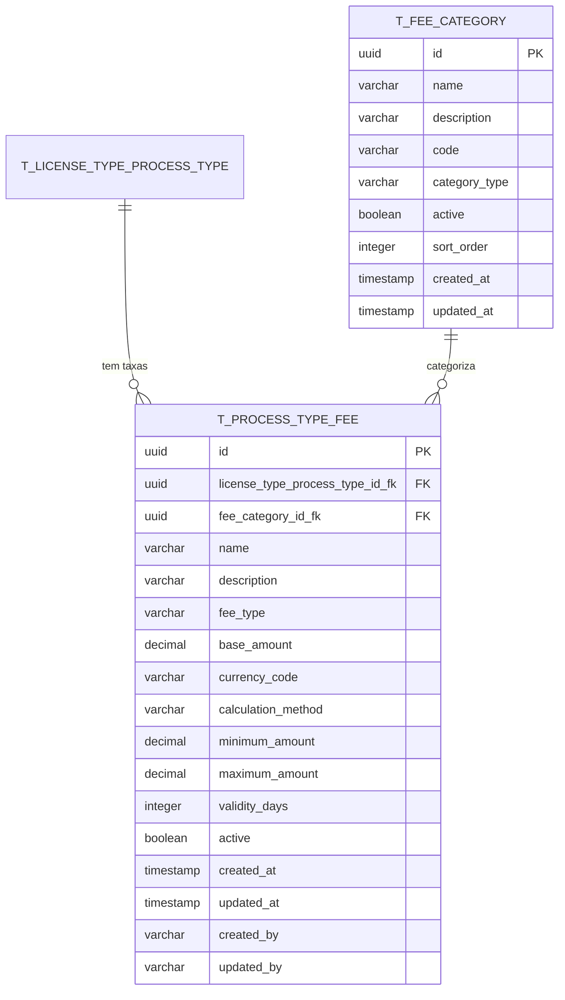

# PR01.05-BE-LIC - Dossier Tipo de Licença - Associação de Taxas

## 1. Visão Geral

Este documento especifica a gestão da associação entre tipos de licença e taxas aplicáveis, definindo a estrutura de custos, regras de cálculo, descontos, isenções e formas de pagamento para cada tipo de licenciamento. Este módulo é essencial para garantir transparência, conformidade regulatória e eficiência na cobrança de taxas do sistema de licenciamento.

<<<<<<< HEAD
**Módulo:** Dossier de Tipo de Licença - Associação de Taxas  
**Endpoint Base:** `/api/v1/process-type-fees` e `/api/v1/fee-categories`  
**Versão:** 1.0  
**Data:** 2025
=======
### 1.1 Objetivos

- Normalizar o modelo de dados para associação de taxas por tipo de processo

- Implementar arquitetura DDD para gestão de taxas de licenciamento

- Fornecer APIs REST para CRUD de taxas com filtros avançados

- Integrar com módulos de tipos de licenças e processos existentes

- Garantir validações robustas e integridade referencial

- Suportar múltiplas categorias de taxas e regras de cálculo

- Implementar sistema de auditoria completo para alterações de taxas

## 2. Modelo de Dados Normalizado

### 2.1 Diagrama ER

> **Nota**: Este diagrama mostra apenas as novas tabelas específicas para associação de taxas. As tabelas `T_LICENSE_TYPE` e `T_LICENSE_TYPE_PROCESS_TYPE` estão definidas nos documentos `PR01-BE-LIC-Parametrizacao-Licenciamento-Sector-Categoria-Tipos-Licencas.md` e `PR01.04-BE-LIC-Dossier-Tipo-Licenca-Associacao-Tipo-Processos.md` respectivamente.



### 5.3 DTOs e Request/Response Objects

```java
// Request DTOs
public record CreateProcessTypeFeeRequest(
    @NotNull @NotBlank String licenseTypeProcessTypeId,
    @NotNull @NotBlank String feeCategoryId,
    @NotNull @NotBlank @Size(max = 255) String name,
    @Size(max = 1000) String description,
    @NotNull @Pattern(regexp = "FIXED|PERCENTAGE|VARIABLE|TIERED") String feeType,
    @NotNull @DecimalMin("0.00") @Digits(integer = 13, fraction = 2) BigDecimal baseAmount,
    @NotNull @Pattern(regexp = "CVE|EUR|USD") String currencyCode,
    @NotNull @Pattern(regexp = "FIXED|PERCENTAGE|FORMULA|LOOKUP_TABLE") String calculationMethod
) {}

public record UpdateProcessTypeFeeRequest(
    @NotNull @NotBlank @Size(max = 255) String name,
    @Size(max = 1000) String description,
    @NotNull @Pattern(regexp = "FIXED|PERCENTAGE|VARIABLE|TIERED") String feeType,
    @NotNull @DecimalMin("0.00") @Digits(integer = 13, fraction = 2) BigDecimal baseAmount,
    @NotNull @Pattern(regexp = "CVE|EUR|USD") String currencyCode,
    @NotNull @Pattern(regexp = "FIXED|PERCENTAGE|FORMULA|LOOKUP_TABLE") String calculationMethod,
    @DecimalMin("0.00") @Digits(integer = 13, fraction = 2) BigDecimal minimumAmount,
    @DecimalMin("0.00") @Digits(integer = 13, fraction = 2) BigDecimal maximumAmount,
    @Min(1) @Max(3650) Integer validityDays
) {}

public record CreateFeeCategoryRequest(
    @NotNull @NotBlank @Size(max = 100) String name,
    @Size(max = 1000) String description,
    @NotNull @NotBlank @Size(max = 20) @Pattern(regexp = "[A-Z0-9_]+") String code,
    @NotNull @Pattern(regexp = "ADMINISTRATIVE|INSPECTION|PROCESSING|RENEWAL|PENALTY|OTHER") String categoryType,
    @Min(1) @Max(999) Integer sortOrder
) {}

public record UpdateFeeCategoryRequest(
    @NotNull @NotBlank @Size(max = 100) String name,
    @Size(max = 1000) String description,
    @NotNull @Pattern(regexp = "ADMINISTRATIVE|INSPECTION|PROCESSING|RENEWAL|PENALTY|OTHER") String categoryType,
    @Min(1) @Max(999) Integer sortOrder
) {}

public record FeeCalculationRequest(
    @NotNull @NotBlank String licenseTypeProcessTypeId,
    @NotNull Map<String, Object> calculationParameters
) {}

// Response DTOs
public record ProcessTypeFeeResponse(
    String id,
    String licenseTypeProcessTypeId,
    String feeCategoryId,
    String name,
    String description,
    String feeType,
    BigDecimal baseAmount,
    String currencyCode,
    String calculationMethod,
    BigDecimal minimumAmount,
    BigDecimal maximumAmount,
    Integer validityDays,
    Boolean active,
    FeeCategoryResponse feeCategory,
    Instant createdAt,
    Instant updatedAt
) {}

public record FeeCategoryResponse(
    String id,
    String name,
    String description,
    String code,
    String categoryType,
    Boolean active,
    Integer sortOrder,
    Instant createdAt
) {}

public record FeeCalculationResponse(
    BigDecimal totalAmount,
    String currencyCode,
    LocalDateTime calculationDate,
    List<FeeCalculationDetailResponse> feeDetails
) {}

public record FeeCalculationDetailResponse(
    String feeId,
    String feeName,
    String feeType,
    BigDecimal amount,
    String calculationMethod
) {}
```

### 5.4 Query Services

```java
@Service
@Transactional(readOnly = true)
public class ProcessTypeFeeQueryService {

    private final ProcessTypeFeeRepository repository;
    private final FeeCategoryRepository feeCategoryRepository;

    public ProcessTypeFeeQueryService(
            ProcessTypeFeeRepository repository,
            FeeCategoryRepository feeCategoryRepository) {
        this.repository = repository;
        this.feeCategoryRepository = feeCategoryRepository;
    }

    public Optional<ProcessTypeFeeResponse> findById(String id) {
        return repository.findById(ProcessTypeFeeId.of(id))
            .map(this::toResponse);
    }

    public Page<ProcessTypeFeeResponse> findAll(
            String licenseTypeProcessTypeId,
            String feeCategoryId,
            String feeType,
            Boolean active,
            Pageable pageable) {

        Specification<ProcessTypeFee> spec = Specification.where(null);

        if (licenseTypeProcessTypeId != null) {
            spec = spec.and((root, query, cb) ->
                cb.equal(root.get("licenseTypeProcessTypeId"),
                        LicenseTypeProcessTypeId.of(licenseTypeProcessTypeId)));
        }

        if (feeCategoryId != null) {
            spec = spec.and((root, query, cb) ->
                cb.equal(root.get("feeCategoryId"),
                        FeeCategoryId.of(feeCategoryId)));
        }

        if (feeType != null) {
            spec = spec.and((root, query, cb) ->
                cb.equal(root.get("feeType"), feeType));
        }

        if (active != null) {
            spec = spec.and((root, query, cb) ->
                cb.equal(root.get("active"), active));
        }

        return repository.findAll(spec, pageable)
            .map(this::toResponse);
    }

    private ProcessTypeFeeResponse toResponse(ProcessTypeFee fee) {
        FeeCategoryResponse categoryResponse = feeCategoryRepository
            .findById(fee.getFeeCategoryId())
            .map(this::toCategoryResponse)
            .orElse(null);

        return new ProcessTypeFeeResponse(
            fee.getId().getValue().toString(),
            fee.getLicenseTypeProcessTypeId().getValue().toString(),
            fee.getFeeCategoryId().getValue().toString(),
            fee.getName(),
            fee.getDescription(),
            fee.getFeeType(),
            fee.getBaseAmount(),
            fee.getCurrencyCode(),
            fee.getCalculationMethod(),
            fee.getMinimumAmount(),
            fee.getMaximumAmount(),
            fee.getValidityDays(),
            fee.getActive(),
            categoryResponse,
            fee.getCreatedAt(),
            fee.getUpdatedAt()
        );
    }

    private FeeCategoryResponse toCategoryResponse(FeeCategory category) {
        return new FeeCategoryResponse(
            category.getId().getValue().toString(),
            category.getName(),
            category.getDescription(),
            category.getCode(),
            category.getCategoryType(),
            category.getActive(),
            category.getSortOrder(),
            category.getCreatedAt()
        );
    }
}

@Service
@Transactional(readOnly = true)
public class FeeCategoryQueryService {

    private final FeeCategoryRepository repository;

    public FeeCategoryQueryService(FeeCategoryRepository repository) {
        this.repository = repository;
    }

    public Optional<FeeCategoryResponse> findById(String id) {
        return repository.findById(FeeCategoryId.of(id))
            .map(this::toResponse);
    }

    public Page<FeeCategoryResponse> findAll(
            String categoryType,
            Boolean active,
            Pageable pageable) {

        Specification<FeeCategory> spec = Specification.where(null);

        if (categoryType != null) {
            spec = spec.and((root, query, cb) ->
                cb.equal(root.get("categoryType"), categoryType));
        }

        if (active != null) {
            spec = spec.and((root, query, cb) ->
                cb.equal(root.get("active"), active));
        }

        return repository.findAll(spec, pageable)
            .map(this::toResponse);
    }

    public List<FeeCategoryResponse> findAllActive() {
        return repository.findByActiveTrueOrderBySortOrderAsc()
            .stream()
            .map(this::toResponse)
            .collect(Collectors.toList());
    }

    private FeeCategoryResponse toResponse(FeeCategory category) {
        return new FeeCategoryResponse(
            category.getId().getValue().toString(),
            category.getName(),
            category.getDescription(),
            category.getCode(),
            category.getCategoryType(),
            category.getActive(),
            category.getSortOrder(),
            category.getCreatedAt()
        );
    }
}
```

## 6. Regras de Negócio

### 6.1 Validações de Domínio

1. **Unicidade de Nome por Processo**: Cada tipo de processo pode ter apenas uma taxa com o mesmo nome
2. **Validação de Moeda**: Apenas CVE, EUR e USD são aceites como moedas válidas
3. **Consistência de Valores**: O valor mínimo não pode ser superior ao valor máximo
4. **Combinações Válidas**: Tipos de taxa e métodos de cálculo devem ser compatíveis
5. **Categoria Ativa**: Apenas categorias ativas podem ser associadas a novas taxas
6. **Integridade Referencial**: Não é possível eliminar categorias com taxas associadas

### 6.2 Regras de Cálculo

1. **Taxa Fixa**: Valor fixo independente de parâmetros externos
2. **Taxa Percentual**: Calculada como percentagem de um valor base
3. **Taxa Variável**: Calculada através de fórmula ou tabela de consulta
4. **Taxa Escalonada**: Diferentes valores baseados em escalões predefinidos

### 6.3 Regras de Ativação/Desativação

1. **Desativação de Taxa**: Taxa desativada não é incluída em cálculos futuros
2. **Desativação de Categoria**: Categoria desativada não aceita novas taxas
3. **Auditoria**: Todas as alterações de estado são registadas com utilizador e timestamp

## 7. Integração com Outros Módulos

### 7.1 Dependências

- **PR01.04 - Tipos de Processo**: Referência aos tipos de processo de licenciamento

- **PR01 - Tipos de Licença**: Integração com categorias e setores de licenciamento

- **Sistema de Utilizadores**: Auditoria de criação e modificação

- **Sistema de Pagamentos**: Cálculo de taxas para processamento de pagamentos

### 7.2 Eventos de Domínio

```java
public record ProcessTypeFeeCreatedEvent(
    ProcessTypeFeeId feeId,
    LicenseTypeProcessTypeId processTypeId,
    String feeName,
    Money baseAmount,
    Instant occurredAt
) implements DomainEvent {}

public record ProcessTypeFeeUpdatedEvent(
    ProcessTypeFeeId feeId,
    String previousName,
    String newName,
    Money previousAmount,
    Money newAmount,
    Instant occurredAt
) implements DomainEvent {}

public record ProcessTypeFeeActivatedEvent(
    ProcessTypeFeeId feeId,
    Instant occurredAt
) implements DomainEvent {}

public record ProcessTypeFeeDeactivatedEvent(
    ProcessTypeFeeId feeId,
    Instant occurredAt
) implements DomainEvent {}
```

### 7.3 Integração com Sistema de Pagamentos

```java
@Component
public class PaymentIntegrationService {

    private final ProcessTypeFeeApplicationService feeService;

    public PaymentCalculationResult calculatePaymentAmount(
            String licenseTypeProcessTypeId,
            Map<String, Object> applicationData) {

        Money totalFees = feeService.calculateTotalFees(
            licenseTypeProcessTypeId, applicationData);

        List<FeeCalculationResult> feeDetails = feeService.calculateFeesWithDetails(
            licenseTypeProcessTypeId, applicationData);

        return new PaymentCalculationResult(
            totalFees,
            feeDetails,
            LocalDateTime.now()
        );
    }
}
```

## 8. Considerações de Segurança

### 8.1 Autorização

- **Criação/Edição**: Apenas utilizadores com perfil administrativo

- **Consulta**: Todos os utilizadores autenticados

- **Eliminação**: Apenas super-administradores

- **Cálculo**: Disponível para utilizadores do sistema de licenciamento

### 8.2 Validação de Entrada

- Validação de todos os parâmetros de entrada

- Sanitização de strings para prevenir injeção

- Validação de tipos de dados e formatos

- Verificação de limites de valores monetários

### 8.3 Auditoria

- Registo completo de todas as operações CRUD

- Tracking de alterações de valores de taxas

- Identificação do utilizador responsável por cada alteração

- Timestamp preciso de todas as operações

## 9. Testes

### 9.1 Testes Unitários

```java
@ExtendWith(MockitoExtension.class)
class ProcessTypeFeeTest {

    @Mock
    private FeeValidator feeValidator;

    @Test
    void shouldCreateProcessTypeFeeWithValidData() {
        // Given
        when(feeValidator.isValidFeeConfiguration(any(), any(), any()))
            .thenReturn(true);

        // When
        ProcessTypeFee fee = ProcessTypeFee.create(
            LicenseTypeProcessTypeId.generate(),
            FeeCategoryId.generate(),
            "Taxa Teste",
            "Descrição teste",
            FeeType.FIXED,
            Money.cvEscudos(new BigDecimal("1000.00")),
            CalculationMethod.FIXED,
            "test-user",
            feeValidator
        );

        // Then
        assertThat(fee.getName()).isEqualTo("Taxa Teste");
        assertThat(fee.getBaseAmount()).isEqualTo(new BigDecimal("1000.00"));
        assertThat(fee.getActive()).isTrue();
    }

    @Test
    void shouldThrowExceptionWhenCreatingFeeWithInvalidData() {
        // Given
        when(feeValidator.isValidFeeConfiguration(any(), any(), any()))
            .thenReturn(false);

        // When & Then
        assertThatThrownBy(() -> ProcessTypeFee.create(
            LicenseTypeProcessTypeId.generate(),
            FeeCategoryId.generate(),
            "Taxa Teste",
            "Descrição teste",
            FeeType.FIXED,
            Money.cvEscudos(new BigDecimal("1000.00")),
            CalculationMethod.PERCENTAGE, // Incompatível com FIXED
            "test-user",
            feeValidator
        )).isInstanceOf(IllegalArgumentException.class)
          .hasMessageContaining("Invalid fee configuration");
    }
}
```

### 9.2 Testes de Integração

```java
@SpringBootTest
@Transactional
class ProcessTypeFeeIntegrationTest {

    @Autowired
    private ProcessTypeFeeApplicationService applicationService;

    @Autowired
    private TestEntityManager entityManager;

    @Test
    void shouldCreateAndRetrieveProcessTypeFee() {
        // Given
        CreateProcessTypeFeeCommand command = new CreateProcessTypeFeeCommand(
            UUID.randomUUID().toString(),
            UUID.randomUUID().toString(),
            "Taxa Integração",
            "Teste de integração",
            "FIXED",
            new BigDecimal("2000.00"),
            "CVE",
            "FIXED",
            "test-user"
        );

        // When
        ProcessTypeFeeId feeId = applicationService.createFee(command);

        // Then
        Optional<ProcessTypeFee> retrievedFee = applicationService.findById(
            feeId.getValue().toString());

        assertThat(retrievedFee).isPresent();
        assertThat(retrievedFee.get().getName()).isEqualTo("Taxa Integração");
    }
}
```

## 10. Considerações de Performance

### 10.1 Otimizações de Base de Dados

- Índices em campos frequentemente consultados

- Paginação obrigatória em listagens

- Cache de categorias de taxas (dados relativamente estáticos)

- Queries otimizadas para cálculos de taxas

### 10.2 Cache Strategy

```java
@Service
public class FeeCategoryCache {

    @Cacheable(value = "fee-categories", key = "'active'")
    public List<FeeCategoryResponse> getActiveCategories() {
        return feeCategoryQueryService.findAllActive();
    }

    @CacheEvict(value = "fee-categories", allEntries = true)
    public void evictCache() {
        // Cache invalidation when categories are modified
    }
}
```

## 11. Monitorização e Logging

### 11.1 Métricas

- Número de taxas criadas por dia

- Tempo médio de cálculo de taxas

- Taxas mais utilizadas

- Erros de validação mais frequentes

### 11.2 Logging

```java
@Slf4j
@Component
public class FeeAuditLogger {

    public void logFeeCreation(ProcessTypeFeeId feeId, String createdBy) {
        log.info("Fee created: id={}, createdBy={}", feeId.getValue(), createdBy);
    }

    public void logFeeCalculation(String processTypeId, Money totalAmount) {
        log.info("Fee calculation: processType={}, total={} {}",
                processTypeId, totalAmount.getAmount(), totalAmount.getCurrency());
    }

    public void logFeeValidationError(String error, String context) {
        log.warn("Fee validation error: {} in context: {}", error, context);
    }
}
```

## 12. Roadmap e Melhorias Futuras

### 12.1 Funcionalidades Planeadas

1. **Histórico de Taxas**: Manter histórico de alterações de valores
2. **Taxas Condicionais**: Taxas baseadas em condições complexas
3. **Descontos e Promoções**: Sistema de descontos automáticos
4. **Integração com Câmbio**: Conversão automática de moedas
5. **Dashboard de Análise**: Relatórios e análises de taxas

### 12.2 Otimizações Técnicas

1. **Event Sourcing**: Para auditoria completa de alterações
2. **CQRS**: Separação de comandos e consultas
3. **Microserviços**: Separação em serviço independente
4. **GraphQL**: API mais flexível para consultas
>>>>>>> parent of 2bd9194 (refactor(database): standardize timestamp column names to created_date and last_modified_date)

---

## 2. Estrutura do Módulo de Taxas

<<<<<<< HEAD
### 2.1 Categoria de Taxa (Fee Category)
=======
```
T_FEE_CATEGORY {
    uuid id PK
    varchar name
    varchar description
    varchar code
    varchar category_type
    boolean active
    integer sort_order
    timestamp created_at
    timestamp updated_at
    varchar created_by
    varchar updated_by
}
>>>>>>> parent of 2bd9194 (refactor(database): standardize timestamp column names to created_date and last_modified_date)

#### 2.1.1 Campos da Categoria de Taxa
| Campo | Tipo | Validação | Descrição |
|-------|------|-----------|----------|
| id | String | Auto-gerado | Identificador único |
| name | String | 2-200 chars, NotBlank | Nome da categoria |
| code | String | NotBlank, Unique | Código identificador |
| description | String | Max 1000 chars | Descrição detalhada |
| feeType | String | Must exist in OPTIONS | Tipo de taxa (FIXED, PERCENTAGE, VARIABLE) |
| calculationBasis | String | Must exist in OPTIONS | Base de cálculo |
| isRecurring | Boolean | NotNull | Se é taxa recorrente |
| recurringPeriod | String | Required if recurring | Período de recorrência |
| isRefundable | Boolean | NotNull | Se é reembolsável |
| refundConditions | String | JSON válido | Condições para reembolso |
| paymentMethods | Array | Valid list | Métodos de pagamento aceitos |
| currency | String | NotBlank | Moeda (CVE, EUR, USD) |

<<<<<<< HEAD
#### 2.1.2 Estrutura do DTO de Categoria de Taxa
=======
```

````

### 2.2 Definição da Tabela T\_PROCESS\_TYPE\_FEE

```sql
CREATE TABLE t_process_type_fee (
    id UUID PRIMARY KEY DEFAULT gen_random_uuid(),
    license_type_process_type_id_fk UUID NOT NULL,
    fee_category_id_fk UUID NOT NULL,
    name VARCHAR(255) NOT NULL,
    description TEXT,
    fee_type VARCHAR(50) NOT NULL DEFAULT 'FIXED',
    base_amount DECIMAL(15,2) NOT NULL DEFAULT 0.00,
    currency_code VARCHAR(3) NOT NULL DEFAULT 'CVE',
    calculation_method VARCHAR(50) NOT NULL DEFAULT 'FIXED',
    minimum_amount DECIMAL(15,2),
    maximum_amount DECIMAL(15,2),
    validity_days INTEGER,
    active BOOLEAN NOT NULL DEFAULT TRUE,
    created_at TIMESTAMP WITH TIME ZONE NOT NULL DEFAULT NOW(),
    updated_at TIMESTAMP WITH TIME ZONE NOT NULL DEFAULT NOW(),
    created_by VARCHAR(100) NOT NULL,
    updated_by VARCHAR(100) NOT NULL,

    CONSTRAINT fk_process_type_fee_license_type_process_type
        FOREIGN KEY (license_type_process_type_id_fk)
        REFERENCES t_license_type_process_type(id) ON DELETE CASCADE,
    CONSTRAINT fk_process_type_fee_category
        FOREIGN KEY (fee_category_id_fk)
        REFERENCES t_fee_category(id) ON DELETE RESTRICT,
    CONSTRAINT chk_process_type_fee_name_not_empty
        CHECK (LENGTH(TRIM(name)) > 0),
    CONSTRAINT chk_process_type_fee_base_amount_positive
        CHECK (base_amount >= 0),
    CONSTRAINT chk_process_type_fee_type
        CHECK (fee_type IN ('FIXED', 'PERCENTAGE', 'VARIABLE', 'TIERED')),
    CONSTRAINT chk_process_type_fee_calculation_method
        CHECK (calculation_method IN ('FIXED', 'PERCENTAGE', 'FORMULA', 'LOOKUP_TABLE')),
    CONSTRAINT chk_process_type_fee_currency
        CHECK (currency_code IN ('CVE', 'EUR', 'USD')),
    CONSTRAINT chk_process_type_fee_amount_range
        CHECK (minimum_amount IS NULL OR maximum_amount IS NULL OR minimum_amount <= maximum_amount),
    CONSTRAINT uq_process_type_fee_name_process
        UNIQUE (license_type_process_type_id_fk, name)
);
````

### 2.3 Definição da Tabela T_FEE_CATEGORY

```sql
CREATE TABLE t_fee_category (
    id UUID PRIMARY KEY DEFAULT gen_random_uuid(),
    name VARCHAR(100) NOT NULL,
    description TEXT,
    code VARCHAR(20) UNIQUE NOT NULL,
    category_type VARCHAR(50) NOT NULL DEFAULT 'ADMINISTRATIVE',
    active BOOLEAN NOT NULL DEFAULT TRUE,
    sort_order INTEGER,
    created_at TIMESTAMP WITH TIME ZONE NOT NULL DEFAULT NOW(),
    updated_at TIMESTAMP WITH TIME ZONE NOT NULL DEFAULT NOW(),
    created_by VARCHAR(100) NOT NULL,
    updated_by VARCHAR(100) NOT NULL,

    CONSTRAINT chk_fee_category_name_not_empty
        CHECK (LENGTH(TRIM(name)) > 0),
    CONSTRAINT chk_fee_category_code_not_empty
        CHECK (LENGTH(TRIM(code)) > 0),
    CONSTRAINT chk_fee_category_type
        CHECK (category_type IN ('ADMINISTRATIVE', 'INSPECTION', 'PROCESSING', 'RENEWAL', 'PENALTY', 'OTHER'))
);
```

### 2.4 Índices

```sql
-- Índices para T_PROCESS_TYPE_FEE
CREATE INDEX idx_process_type_fee_license_type_process ON t_process_type_fee(license_type_process_type_id_fk);
CREATE INDEX idx_process_type_fee_category ON t_process_type_fee(fee_category_id_fk);
CREATE INDEX idx_process_type_fee_active ON t_process_type_fee(active) WHERE active = TRUE;
CREATE INDEX idx_process_type_fee_fee_type ON t_process_type_fee(fee_type);
CREATE INDEX idx_process_type_fee_amount ON t_process_type_fee(base_amount);
CREATE INDEX idx_process_type_fee_created_at ON t_process_type_fee(created_at DESC);
CREATE INDEX idx_process_type_fee_name_search ON t_process_type_fee USING gin(to_tsvector('portuguese', name));

-- Índices para T_FEE_CATEGORY
CREATE INDEX idx_fee_category_code ON t_fee_category(code);
CREATE INDEX idx_fee_category_type ON t_fee_category(category_type);
CREATE INDEX idx_fee_category_active ON t_fee_category(active) WHERE active = TRUE;
CREATE INDEX idx_fee_category_sort_order ON t_fee_category(sort_order NULLS LAST);
```

### 2.5 Dados Iniciais para Categorias de Taxas

```sql
-- Inserir categorias de taxas baseadas no sistema legacy
INSERT INTO t_fee_category (name, description, code, category_type, sort_order, created_by, updated_by) VALUES
('Taxa de Processamento', 'Taxa básica para processamento do pedido de licença', 'PROC', 'PROCESSING', 1, 'SYSTEM', 'SYSTEM'),
('Taxa de Inspeção', 'Taxa para inspeções técnicas obrigatórias', 'INSP', 'INSPECTION', 2, 'SYSTEM', 'SYSTEM'),
('Taxa Administrativa', 'Taxa para serviços administrativos', 'ADM', 'ADMINISTRATIVE', 3, 'SYSTEM', 'SYSTEM'),
('Taxa de Renovação', 'Taxa para renovação de licenças', 'REN', 'RENEWAL', 4, 'SYSTEM', 'SYSTEM'),
('Taxa de Urgência', 'Taxa adicional para processamento urgente', 'URG', 'PROCESSING', 5, 'SYSTEM', 'SYSTEM'),
('Taxa de Penalização', 'Taxa aplicada por infrações ou atrasos', 'PEN', 'PENALTY', 6, 'SYSTEM', 'SYSTEM'),
('Taxa de Vistoria', 'Taxa para vistorias técnicas especializadas', 'VIST', 'INSPECTION', 7, 'SYSTEM', 'SYSTEM'),
('Taxa de Emissão', 'Taxa para emissão de documentos oficiais', 'EMIS', 'ADMINISTRATIVE', 8, 'SYSTEM', 'SYSTEM');
```

## 3. Arquitetura DDD

### 3.1 Domain Layer

#### 3.1.1 Aggregate Root: ProcessTypeFee

>>>>>>> parent of 2bd9194 (refactor(database): standardize timestamp column names to created_date and last_modified_date)
```java
@Data
@NoArgsConstructor
@AllArgsConstructor
@IgrpDTO
public class FeeCategoryRequestDTO {
    @NotNull(message = "Nome é obrigatório")
    @NotBlank(message = "Nome não pode estar vazio")
    @Size(min = 2, max = 200, message = "Nome deve ter entre 2 e 200 caracteres")
    private String name;
<<<<<<< HEAD
    
    @NotNull(message = "Código é obrigatório")
    @NotBlank(message = "Código não pode estar vazio")
    @Pattern(regexp = "^[A-Z0-9_]+$", message = "Código deve conter apenas letras maiúsculas, números e underscore")
=======

    @Column(name = "description")
    private String description;

    @Column(name = "fee_type", nullable = false)
    private String feeType;

    @Column(name = "base_amount", nullable = false, precision = 15, scale = 2)
    private BigDecimal baseAmount;

    @Column(name = "currency_code", nullable = false, length = 3)
    private String currencyCode;

    @Column(name = "calculation_method", nullable = false)
    private String calculationMethod;

    @Column(name = "minimum_amount", precision = 15, scale = 2)
    private BigDecimal minimumAmount;

    @Column(name = "maximum_amount", precision = 15, scale = 2)
    private BigDecimal maximumAmount;

    @Column(name = "validity_days")
    private Integer validityDays;

    @Column(name = "active", nullable = false)
    private Boolean active;

    // Campos de auditoria
    @Column(name = "created_at", nullable = false)
    private Instant createdAt;

    @Column(name = "updated_at", nullable = false)
    private Instant updatedAt;

    @Column(name = "created_by", nullable = false)
    private String createdBy;

    @Column(name = "updated_by", nullable = false)
    private String updatedBy;

    // Métodos de negócio
    public static ProcessTypeFee create(
            LicenseTypeProcessTypeId licenseTypeProcessTypeId,
            FeeCategoryId feeCategoryId,
            String name,
            String description,
            FeeType feeType,
            Money baseAmount,
            CalculationMethod calculationMethod,
            String createdBy,
            FeeValidator feeValidator) {

        validateCreationParameters(licenseTypeProcessTypeId, feeCategoryId, name,
                                 feeType, baseAmount, calculationMethod, createdBy, feeValidator);

        return new ProcessTypeFee(
            ProcessTypeFeeId.generate(),
            licenseTypeProcessTypeId,
            feeCategoryId,
            name.trim(),
            description != null ? description.trim() : null,
            feeType.getValue(),
            baseAmount.getAmount(),
            baseAmount.getCurrency().getCurrencyCode(),
            calculationMethod.getValue(),
            null,
            null,
            null,
            true,
            createdBy
        );
    }

    public void updateFeeConfiguration(
            String name,
            String description,
            FeeType feeType,
            Money baseAmount,
            CalculationMethod calculationMethod,
            Money minimumAmount,
            Money maximumAmount,
            Integer validityDays,
            String updatedBy,
            FeeValidator feeValidator) {

        validateUpdateParameters(name, feeType, baseAmount, calculationMethod,
                               minimumAmount, maximumAmount, updatedBy, feeValidator);

        this.name = name.trim();
        this.description = description != null ? description.trim() : null;
        this.feeType = feeType.getValue();
        this.baseAmount = baseAmount.getAmount();
        this.currencyCode = baseAmount.getCurrency().getCurrencyCode();
        this.calculationMethod = calculationMethod.getValue();
        this.minimumAmount = minimumAmount != null ? minimumAmount.getAmount() : null;
        this.maximumAmount = maximumAmount != null ? maximumAmount.getAmount() : null;
        this.validityDays = validityDays;
        this.updatedBy = updatedBy;
        this.updatedAt = Instant.now();
    }

    public void activate(String updatedBy) {
        this.active = true;
        this.updatedBy = updatedBy;
        this.updatedAt = Instant.now();
    }

    public void deactivate(String updatedBy) {
        this.active = false;
        this.updatedBy = updatedBy;
        this.updatedAt = Instant.now();
    }

    public Money calculateFee(FeeCalculationContext context) {
        FeeCalculationMethod method = FeeCalculationMethodFactory.create(this.calculationMethod);
        return method.calculate(this, context);
    }

    // Métodos de validação
    private static void validateCreationParameters(
            LicenseTypeProcessTypeId licenseTypeProcessTypeId,
            FeeCategoryId feeCategoryId,
            String name,
            FeeType feeType,
            Money baseAmount,
            CalculationMethod calculationMethod,
            String createdBy,
            FeeValidator feeValidator) {

        if (licenseTypeProcessTypeId == null) {
            throw new IllegalArgumentException("License type process type ID cannot be null");
        }

        if (feeCategoryId == null) {
            throw new IllegalArgumentException("Fee category ID cannot be null");
        }

        if (name == null || name.trim().isEmpty()) {
            throw new IllegalArgumentException("Fee name cannot be null or empty");
        }

        if (name.trim().length() > 255) {
            throw new IllegalArgumentException("Fee name cannot exceed 255 characters");
        }

        if (feeType == null) {
            throw new IllegalArgumentException("Fee type cannot be null");
        }

        if (baseAmount == null) {
            throw new IllegalArgumentException("Base amount cannot be null");
        }

        if (baseAmount.getAmount().compareTo(BigDecimal.ZERO) < 0) {
            throw new IllegalArgumentException("Base amount cannot be negative");
        }

        if (calculationMethod == null) {
            throw new IllegalArgumentException("Calculation method cannot be null");
        }

        if (createdBy == null || createdBy.trim().isEmpty()) {
            throw new IllegalArgumentException("Created by cannot be null or empty");
        }

        if (!feeValidator.isValidFeeConfiguration(feeType, calculationMethod, baseAmount)) {
            throw new IllegalArgumentException("Invalid fee configuration");
        }
    }

    private static void validateUpdateParameters(
            String name,
            FeeType feeType,
            Money baseAmount,
            CalculationMethod calculationMethod,
            Money minimumAmount,
            Money maximumAmount,
            String updatedBy,
            FeeValidator feeValidator) {

        if (name == null || name.trim().isEmpty()) {
            throw new IllegalArgumentException("Fee name cannot be null or empty");
        }

        if (name.trim().length() > 255) {
            throw new IllegalArgumentException("Fee name cannot exceed 255 characters");
        }

        if (feeType == null) {
            throw new IllegalArgumentException("Fee type cannot be null");
        }

        if (baseAmount == null) {
            throw new IllegalArgumentException("Base amount cannot be null");
        }

        if (baseAmount.getAmount().compareTo(BigDecimal.ZERO) < 0) {
            throw new IllegalArgumentException("Base amount cannot be negative");
        }

        if (calculationMethod == null) {
            throw new IllegalArgumentException("Calculation method cannot be null");
        }

        if (minimumAmount != null && maximumAmount != null &&
            minimumAmount.getAmount().compareTo(maximumAmount.getAmount()) > 0) {
            throw new IllegalArgumentException("Minimum amount cannot be greater than maximum amount");
        }

        if (updatedBy == null || updatedBy.trim().isEmpty()) {
            throw new IllegalArgumentException("Updated by cannot be null or empty");
        }

        if (!feeValidator.isValidFeeConfiguration(feeType, calculationMethod, baseAmount)) {
            throw new IllegalArgumentException("Invalid fee configuration");
        }
    }

    // Getters
    public ProcessTypeFeeId getId() { return id; }
    public LicenseTypeProcessTypeId getLicenseTypeProcessTypeId() { return licenseTypeProcessTypeId; }
    public FeeCategoryId getFeeCategoryId() { return feeCategoryId; }
    public String getName() { return name; }
    public String getDescription() { return description; }
    public String getFeeType() { return feeType; }
    public BigDecimal getBaseAmount() { return baseAmount; }
    public String getCurrencyCode() { return currencyCode; }
    public String getCalculationMethod() { return calculationMethod; }
    public BigDecimal getMinimumAmount() { return minimumAmount; }
    public BigDecimal getMaximumAmount() { return maximumAmount; }
    public Integer getValidityDays() { return validityDays; }
    public Boolean getActive() { return active; }
    public Instant getCreatedAt() { return createdAt; }
    public Instant getUpdatedAt() { return updatedAt; }
    public String getCreatedBy() { return createdBy; }
    public String getUpdatedBy() { return updatedBy; }
}
```

#### 3.1.2 Aggregate Root: FeeCategory

```java
@Entity
@Table(name = "t_fee_category")
public class FeeCategory {
    @Id
    private FeeCategoryId id;

    @Column(name = "name", nullable = false, length = 100)
    private String name;

    @Column(name = "description")
    private String description;

    @Column(name = "code", nullable = false, length = 20)
>>>>>>> parent of 2bd9194 (refactor(database): standardize timestamp column names to created_date and last_modified_date)
    private String code;
    
    @Size(max = 1000, message = "Descrição não pode exceder 1000 caracteres")
    private String description;
    
    @NotNull(message = "Tipo de taxa é obrigatório")
    @NotBlank(message = "Tipo de taxa não pode estar vazio")
    private String feeTypeKey;  // Referência para OPTIONS com ccode="FEE_TYPE"
    
    @NotNull(message = "Base de cálculo é obrigatória")
    @NotBlank(message = "Base de cálculo não pode estar vazia")
    private String calculationBasisKey;  // Referência para OPTIONS com ccode="CALCULATION_BASIS"
    
    @NotNull(message = "Campo 'é recorrente' é obrigatório")
    private Boolean isRecurring;
    
    private String recurringPeriodKey;  // Referência para OPTIONS com ccode="RECURRING_PERIOD"
    
    @NotNull(message = "Campo 'é reembolsável' é obrigatório")
    private Boolean isRefundable;
    
    @Valid
    private RefundConditionsDTO refundConditions;
    
    @NotEmpty(message = "Pelo menos um método de pagamento deve ser especificado")
    private List<String> paymentMethodKeys;  // Referência para OPTIONS com ccode="PAYMENT_METHOD"
    
    @NotNull(message = "Moeda é obrigatória")
    @NotBlank(message = "Moeda não pode estar vazia")
    @Pattern(regexp = "^(CVE|EUR|USD)$", message = "Moeda deve ser CVE, EUR ou USD")
    private String currency;
    
    private Object metadata;
}

<<<<<<< HEAD
@Data
@NoArgsConstructor
@AllArgsConstructor
public class RefundConditionsDTO {
    private Integer refundPeriodDays;
    private BigDecimal refundPercentage;
    private List<String> refundReasons;
    private Boolean requiresApproval;
    private String approvalLevel;
    private Object customConditions;
=======
    @Column(name = "category_type", nullable = false)
    private String categoryType;

    @Column(name = "active", nullable = false)
    private Boolean active;

    @Column(name = "sort_order")
    private Integer sortOrder;

    // Campos de auditoria
    @Column(name = "created_at", nullable = false)
    private Instant createdAt;

    @Column(name = "updated_at", nullable = false)
    private Instant updatedAt;

    @Column(name = "created_by", nullable = false)
    private String createdBy;

    @Column(name = "updated_by", nullable = false)
    private String updatedBy;

    // Factory method
    public static FeeCategory create(
            String name,
            String description,
            String code,
            FeeCategoryType categoryType,
            Integer sortOrder,
            String createdBy) {

        validateCreationParameters(name, code, categoryType, createdBy);

        return new FeeCategory(
            FeeCategoryId.generate(),
            name.trim(),
            description != null ? description.trim() : null,
            code.trim().toUpperCase(),
            categoryType.getValue(),
            true,
            sortOrder,
            createdBy
        );
    }

    // Business methods
    public void updateInfo(
            String name,
            String description,
            FeeCategoryType categoryType,
            Integer sortOrder,
            String updatedBy) {

        validateUpdateParameters(name, categoryType, updatedBy);

        this.name = name.trim();
        this.description = description != null ? description.trim() : null;
        this.categoryType = categoryType.getValue();
        this.sortOrder = sortOrder;
        this.updatedBy = updatedBy;
        this.updatedAt = Instant.now();
    }

    public void activate(String updatedBy) {
        this.active = true;
        this.updatedBy = updatedBy;
        this.updatedAt = Instant.now();
    }

    public void deactivate(String updatedBy) {
        this.active = false;
        this.updatedBy = updatedBy;
        this.updatedAt = Instant.now();
    }

    // Validation methods
    private static void validateCreationParameters(
            String name,
            String code,
            FeeCategoryType categoryType,
            String createdBy) {

        if (name == null || name.trim().isEmpty()) {
            throw new IllegalArgumentException("Category name cannot be null or empty");
        }

        if (name.trim().length() > 100) {
            throw new IllegalArgumentException("Category name cannot exceed 100 characters");
        }

        if (code == null || code.trim().isEmpty()) {
            throw new IllegalArgumentException("Category code cannot be null or empty");
        }

        if (code.trim().length() > 20) {
            throw new IllegalArgumentException("Category code cannot exceed 20 characters");
        }

        if (categoryType == null) {
            throw new IllegalArgumentException("Category type cannot be null");
        }

        if (createdBy == null || createdBy.trim().isEmpty()) {
            throw new IllegalArgumentException("Created by cannot be null or empty");
        }
    }

    private static void validateUpdateParameters(
            String name,
            FeeCategoryType categoryType,
            String updatedBy) {

        if (name == null || name.trim().isEmpty()) {
            throw new IllegalArgumentException("Category name cannot be null or empty");
        }

        if (name.trim().length() > 100) {
            throw new IllegalArgumentException("Category name cannot exceed 100 characters");
        }

        if (categoryType == null) {
            throw new IllegalArgumentException("Category type cannot be null");
        }

        if (updatedBy == null || updatedBy.trim().isEmpty()) {
            throw new IllegalArgumentException("Updated by cannot be null or empty");
        }
    }

    // Getters
    public FeeCategoryId getId() { return id; }
    public String getName() { return name; }
    public String getDescription() { return description; }
    public String getCode() { return code; }
    public String getCategoryType() { return categoryType; }
    public Boolean getActive() { return active; }
    public Integer getSortOrder() { return sortOrder; }
    public Instant getCreatedAt() { return createdAt; }
    public Instant getUpdatedAt() { return updatedAt; }
    public String getCreatedBy() { return createdBy; }
    public String getUpdatedBy() { return updatedBy; }
>>>>>>> parent of 2bd9194 (refactor(database): standardize timestamp column names to created_date and last_modified_date)
}
```

### 2.2 Taxa por Tipo de Processo (Process Type Fee)

#### 2.2.1 Campos da Taxa por Tipo de Processo
| Campo | Tipo | Validação | Descrição |
|-------|------|-----------|----------|
| id | String | Auto-gerado | Identificador único |
| processTypeId | String | NotBlank, Must exist | ID do tipo de processo |
| feeCategoryId | String | NotBlank, Must exist | ID da categoria de taxa |
| baseAmount | BigDecimal | Min: 0, Scale: 2 | Valor base da taxa |
| minimumAmount | BigDecimal | Min: 0, Scale: 2 | Valor mínimo |
| maximumAmount | BigDecimal | Min: 0, Scale: 2 | Valor máximo |
| calculationFormula | String | Valid expression | Fórmula de cálculo |
| discountRules | Array | Valid list | Regras de desconto |
| exemptionCriteria | Array | Valid list | Critérios de isenção |
| effectiveDate | LocalDate | NotNull | Data de vigência |
| expirationDate | LocalDate | After effective | Data de expiração |
| isActive | Boolean | NotNull | Se está ativa |

#### 2.2.2 Estrutura do DTO de Taxa por Tipo de Processo
```java
@Data
@NoArgsConstructor
@AllArgsConstructor
@IgrpDTO
public class ProcessTypeFeeRequestDTO {
    @NotNull(message = "ID do tipo de processo é obrigatório")
    @NotBlank(message = "ID do tipo de processo não pode estar vazio")
    private String processTypeId;
    
    @NotNull(message = "ID da categoria de taxa é obrigatório")
    @NotBlank(message = "ID da categoria de taxa não pode estar vazio")
    private String feeCategoryId;
    
    @NotNull(message = "Valor base é obrigatório")
    @DecimalMin(value = "0.0", message = "Valor base deve ser maior ou igual a zero")
    @Digits(integer = 10, fraction = 2, message = "Valor base deve ter no máximo 10 dígitos inteiros e 2 decimais")
    private BigDecimal baseAmount;
    
    @DecimalMin(value = "0.0", message = "Valor mínimo deve ser maior ou igual a zero")
    @Digits(integer = 10, fraction = 2, message = "Valor mínimo deve ter no máximo 10 dígitos inteiros e 2 decimais")
    private BigDecimal minimumAmount;
    
    @DecimalMin(value = "0.0", message = "Valor máximo deve ser maior ou igual a zero")
    @Digits(integer = 10, fraction = 2, message = "Valor máximo deve ter no máximo 10 dígitos inteiros e 2 decimais")
    private BigDecimal maximumAmount;
    
    @Size(max = 500, message = "Fórmula de cálculo não pode exceder 500 caracteres")
    private String calculationFormula;
    
    @Valid
    private List<DiscountRuleDTO> discountRules;
    
    @Valid
    private List<ExemptionCriteriaDTO> exemptionCriteria;
    
    @NotNull(message = "Data de vigência é obrigatória")
    @FutureOrPresent(message = "Data de vigência deve ser presente ou futura")
    private LocalDate effectiveDate;
    
    @Future(message = "Data de expiração deve ser futura")
    private LocalDate expirationDate;
    
    private Object metadata;
}

@Data
@NoArgsConstructor
@AllArgsConstructor
public class DiscountRuleDTO {
    @NotNull(message = "Nome da regra é obrigatório")
    @NotBlank(message = "Nome da regra não pode estar vazio")
    private String ruleName;
    
    @NotNull(message = "Tipo de desconto é obrigatório")
    private String discountType;  // PERCENTAGE, FIXED_AMOUNT, FORMULA
    
    @NotNull(message = "Valor do desconto é obrigatório")
    @DecimalMin(value = "0.0", message = "Valor do desconto deve ser maior ou igual a zero")
    private BigDecimal discountValue;
    
    @Valid
    private DiscountConditionsDTO conditions;
    
    private Integer priority;
    private Boolean stackable;
    private LocalDate validFrom;
    private LocalDate validUntil;
}

@Data
@NoArgsConstructor
@AllArgsConstructor
public class DiscountConditionsDTO {
    private String applicantType;  // INDIVIDUAL, COMPANY, NGO
    private BigDecimal minimumInvestment;
    private BigDecimal maximumInvestment;
    private Integer minimumEmployees;
    private String locationZone;
    private Boolean isFirstTime;
    private Boolean isRenewal;
    private List<String> requiredCertifications;
    private Object customConditions;
}

@Data
@NoArgsConstructor
@AllArgsConstructor
public class ExemptionCriteriaDTO {
    @NotNull(message = "Nome do critério é obrigatório")
    @NotBlank(message = "Nome do critério não pode estar vazio")
    private String criteriaName;
    
    @NotNull(message = "Tipo de isenção é obrigatório")
    private String exemptionType;  // TOTAL, PARTIAL, CONDITIONAL
    
    @DecimalMin(value = "0.0", message = "Percentual de isenção deve ser maior ou igual a zero")
    @DecimalMax(value = "100.0", message = "Percentual de isenção deve ser menor ou igual a 100")
    private BigDecimal exemptionPercentage;
    
    @Valid
    private ExemptionConditionsDTO conditions;
    
    private Boolean requiresApproval;
    private String approvalLevel;
    private LocalDate validFrom;
    private LocalDate validUntil;
}

@Data
@NoArgsConstructor
@AllArgsConstructor
public class ExemptionConditionsDTO {
    private String applicantCategory;  // STARTUP, NGO, GOVERNMENT, DISABLED
    private String businessSector;
    private String socialImpactLevel;
    private Boolean isPublicInterest;
    private Boolean hasDisabilitySupport;
    private List<String> requiredDocuments;
    private Object customConditions;
}
```

---

## 3. API REST - Gestão de Categorias de Taxa

### 3.1 Operações CRUD de Categorias de Taxa

#### 3.1.1 Listagem de Categorias de Taxa
**Endpoint:** `GET /api/v1/fee-categories`

**Parâmetros de Query:**
| Parâmetro | Tipo | Obrigatório | Padrão | Descrição |
|-----------|------|-------------|--------|-----------|
| feeType | string | Não | - | Tipo de taxa para filtrar |
| calculationBasis | string | Não | - | Base de cálculo |
| isRecurring | boolean | Não | - | Se é taxa recorrente |
| currency | string | Não | - | Moeda (CVE, EUR, USD) |
| name | string | Não | - | Nome da categoria ou termo de busca |
| code | string | Não | - | Código da categoria |
| pageNumber | string | Não | "0" | Número da página |
| pageSize | string | Não | "20" | Tamanho da página |
| sort | string | Não | "name" | Campo de ordenação |
| direction | string | Não | "ASC" | Direção da ordenação (ASC/DESC) |

**Resposta de Sucesso (200):**
```json
{
  "pageNumber": 0,
  "pageSize": 20,
  "totalElements": 15,
  "totalPages": 1,
  "content": [
    {
      "id": "fc-001",
      "name": "Taxa de Licenciamento Inicial",
      "code": "LIC_INICIAL",
      "description": "Taxa cobrada para o licenciamento inicial de estabelecimentos comerciais",
      "feeType": {
        "key": "FIXED",
        "name": "Taxa Fixa"
      },
      "calculationBasis": {
        "key": "FLAT_RATE",
        "name": "Taxa Única"
      },
      "isRecurring": false,
      "isRefundable": true,
      "currency": "CVE",
      "paymentMethods": [
        {
          "key": "BANK_TRANSFER",
          "name": "Transferência Bancária"
        },
        {
          "key": "CASH",
          "name": "Dinheiro"
        }
      ],
      "active": true,
      "createdAt": "2025-01-15T10:30:00Z",
      "updatedAt": "2025-01-15T10:30:00Z"
    }
  ]
}
```

#### 3.1.2 Busca de Categoria de Taxa por ID
**Endpoint:** `GET /api/v1/fee-categories/{feeCategoryId}`

**Parâmetros de Path:**
| Parâmetro | Tipo | Descrição |
|-----------|------|-----------|
| feeCategoryId | string | ID único da categoria de taxa |

**Resposta de Sucesso (200):**
```json
{
  "id": "fc-001",
  "name": "Taxa de Licenciamento Inicial",
  "code": "LIC_INICIAL",
  "description": "Taxa cobrada para o licenciamento inicial de estabelecimentos comerciais",
  "feeType": {
    "key": "FIXED",
    "name": "Taxa Fixa",
    "description": "Valor fixo independente de variáveis"
  },
  "calculationBasis": {
    "key": "FLAT_RATE",
    "name": "Taxa Única",
    "description": "Valor único aplicado"
  },
  "isRecurring": false,
  "recurringPeriod": null,
  "isRefundable": true,
  "refundConditions": {
    "refundPeriodDays": 30,
    "refundPercentage": 100.00,
    "refundReasons": ["PROCESS_CANCELLED", "DUPLICATE_PAYMENT"],
    "requiresApproval": true,
    "approvalLevel": "MANAGER"
  },
  "paymentMethods": [
    {
      "key": "BANK_TRANSFER",
      "name": "Transferência Bancária"
    },
    {
      "key": "CASH",
      "name": "Dinheiro"
    }
  ],
  "currency": "CVE",
  "active": true,
  "createdAt": "2025-01-15T10:30:00Z",
  "updatedAt": "2025-01-15T10:30:00Z",
  "metadata": {
    "department": "Licenciamento",
    "approvalRequired": false
  }
}
```

**Códigos de Status:**
- 200: Categoria de taxa encontrada
- 404: Categoria de taxa não encontrada
- 500: Erro interno do servidor

#### 3.1.4 Atualização de Categoria de Taxa
**Endpoint:** `PUT /api/v1/fee-categories/{feeCategoryId}`

**Parâmetros de Path:**
| Parâmetro | Tipo | Descrição |
|-----------|------|-----------|
| feeCategoryId | string | ID único da categoria de taxa |

**Payload de Requisição:** (mesmo formato da criação)

**Códigos de Status:**
- 200: Categoria de taxa atualizada com sucesso
- 400: Dados inválidos
- 404: Categoria de taxa não encontrada
- 409: Código já existe
- 500: Erro interno do servidor

#### 3.1.5 Detalhes de Categoria de Taxa
**Endpoint:** `GET /api/v1/fee-categories/{feeCategoryId}`

**Resposta de Sucesso (200):**
```json
{
  "id": "fc-001",
  "name": "Taxa de Licenciamento Inicial",
  "code": "LIC_INICIAL",
  "description": "Taxa aplicada para obtenção de nova licença de funcionamento, calculada com base no tipo de estabelecimento e complexidade do processo",
  "feeType": {
    "key": "FIXED",
    "name": "Taxa Fixa",
    "description": "Valor fixo independente de variáveis externas"
  },
  "calculationBasis": {
    "key": "FLAT_RATE",
    "name": "Taxa Única",
    "description": "Valor único por solicitação, independente de características específicas"
  },
  "recurringDetails": {
    "isRecurring": false,
    "recurringPeriod": null,
    "nextDueCalculation": null
  },
  "refundPolicy": {
    "isRefundable": true,
    "refundConditions": {
      "refundPeriodDays": 30,
      "refundPercentage": 80.0,
      "refundReasons": [
        "CANCELAMENTO_VOLUNTARIO",
        "INDEFERIMENTO",
        "ERRO_ADMINISTRATIVO"
      ],
      "requiresApproval": true,
      "approvalLevel": "SUPERVISOR",
      "customConditions": {
        "excludeProcessingCosts": true,
        "proRataCalculation": false
      }
    },
    "refundStatistics": {
      "totalRefunds": 45,
      "totalRefundAmount": 540000.00,
      "averageRefundTime": 7.5,
      "refundRate": 3.2
    }
  },
  "paymentOptions": {
    "acceptedMethods": [
      {
        "key": "BANK_TRANSFER",
        "name": "Transferência Bancária",
        "processingTime": "1-2 dias úteis",
        "additionalFee": 0.00
      },
      {
        "key": "CREDIT_CARD",
        "name": "Cartão de Crédito",
        "processingTime": "Imediato",
        "additionalFee": 150.00
      },
      {
        "key": "CASH",
        "name": "Dinheiro",
        "processingTime": "Imediato",
        "additionalFee": 0.00,
        "restrictions": "Apenas até 50.000 CVE"
      }
    ],
    "installmentOptions": {
      "available": true,
      "maxInstallments": 3,
      "minimumAmount": 30000.00,
      "interestRate": 0.0
    }
  },
  "currency": "CVE",
  "associatedProcessTypes": [
    {
      "processTypeId": "pt-001",
      "processTypeName": "Análise Técnica Inicial",
      "baseAmount": 15000.00,
      "averageAmount": 15000.00,
      "applicationsCount": 450
    },
    {
      "processTypeId": "pt-002",
      "processTypeName": "Inspeção de Segurança",
      "baseAmount": 12000.00,
      "averageAmount": 11500.00,
      "applicationsCount": 380
    }
  ],
  "financialSummary": {
    "totalRevenue": 2450000.00,
    "averageFeeAmount": 15000.00,
    "totalApplications": 1630,
    "collectionRate": 96.8,
    "outstandingAmount": 78400.00
  },
  "regulatoryInfo": {
    "legalBasis": "Decreto-Lei nº 45/2019, Artigo 15º",
    "lastReview": "2025-01-15",
    "nextReview": "2025-01-15",
    "approvalAuthority": "Ministério das Finanças",
    "publicationDate": "2019-08-20"
  },
  "metadata": {
    "category": "LICENSING",
    "priority": "HIGH",
    "automationLevel": "FULL",
    "qualityMetrics": {
      "accuracyRate": 99.2,
      "disputeRate": 0.8,
      "customerSatisfaction": 4.3
    }
  }
}
```

#### 3.1.3 Criação de Categoria de Taxa
**Endpoint:** `POST /api/v1/fee-categories`

**Payload de Requisição:**
```json
{
  "name": "Taxa de Renovação Anual",
  "code": "LIC_RENOVACAO_ANUAL",
  "description": "Taxa aplicada para renovação anual de licenças de funcionamento, com desconto para renovações antecipadas",
  "feeTypeKey": "PERCENTAGE",
  "calculationBasisKey": "BUSINESS_REVENUE",
  "isRecurring": true,
  "recurringPeriodKey": "ANNUAL",
  "isRefundable": false,
  "refundConditions": null,
  "paymentMethodKeys": [
    "BANK_TRANSFER",
    "CREDIT_CARD",
    "DIRECT_DEBIT"
  ],
  "currency": "CVE",
  "metadata": {
    "regulatoryReference": "Decreto-Lei nº 45/2019, Artigo 18º",
    "category": "RENEWAL",
    "priority": "MEDIUM",
    "automationLevel": "PARTIAL",
    "earlyRenewalDiscount": {
      "enabled": true,
      "discountPercentage": 10.0,
      "earlyDays": 30
    }
  }
}
```

---

## 4. API REST - Gestão de Taxas por Tipo de Processo

### 4.1 Operações CRUD de Taxas por Tipo de Processo

#### 4.1.1 Listagem de Taxas por Tipo de Processo
**Endpoint:** `GET /api/v1/process-type-fees`

**Parâmetros de Query:**
| Parâmetro | Tipo | Obrigatório | Padrão | Descrição |
|-----------|------|-------------|--------|-----------|
| processTypeId | string | Não | - | ID do tipo de processo para filtrar |
| feeCategoryId | string | Não | - | ID da categoria de taxa |
| isActive | boolean | Não | true | Se está ativa |
| effectiveDate | date | Não | - | Data de vigência |
| currency | string | Não | - | Moeda (CVE, EUR, USD) |
| minAmount | decimal | Não | - | Valor mínimo para filtrar |
| maxAmount | decimal | Não | - | Valor máximo para filtrar |
| pageNumber | string | Não | "0" | Número da página |
| pageSize | string | Não | "20" | Tamanho da página |
| sort | string | Não | "baseAmount" | Campo de ordenação |
| direction | string | Não | "ASC" | Direção da ordenação (ASC/DESC) |

**Resposta de Sucesso (200):**
```json
{
  "pageNumber": 0,
  "pageSize": 20,
  "totalElements": 45,
  "totalPages": 3,
  "content": [
    {
      "id": "ptf-001",
      "processType": {
        "id": "pt-001",
        "name": "Análise Técnica Inicial",
        "code": "PROC_ANALISE_INICIAL",
        "category": "INITIAL_LICENSING"
      },
      "feeCategory": {
        "id": "fc-001",
        "name": "Taxa de Licenciamento Inicial",
        "code": "LIC_INICIAL",
        "feeType": "FIXED"
      },
      "feeStructure": {
        "baseAmount": 15000.00,
        "minimumAmount": 10000.00,
        "maximumAmount": 25000.00,
        "calculationFormula": "BASE_AMOUNT",
        "currency": "CVE"
      },
      "discountRules": [
        {
          "ruleName": "Desconto Primeira Licença",
          "discountType": "PERCENTAGE",
          "discountValue": 20.0,
          "conditions": {
            "isFirstTime": true
          },
          "priority": 1,
          "stackable": true
        }
      ],
      "exemptionCriteria": [
        {
          "criteriaName": "Isenção ONGs",
          "exemptionType": "TOTAL",
          "exemptionPercentage": 100.0,
          "conditions": {
            "applicantCategory": "NGO",
            "isPublicInterest": true
          },
          "requiresApproval": true,
          "approvalLevel": "DIRECTOR"
        }
      ],
      "validity": {
        "effectiveDate": "2025-01-01",
        "expirationDate": "2025-12-31",
        "isActive": true
      },
      "statistics": {
        "totalApplications": 450,
        "totalRevenue": 6075000.00,
        "averageAmount": 13500.00,
        "discountApplications": 90,
        "exemptionApplications": 15
      }
    }
  ]
}
```

#### 4.1.2 Busca de Taxa por Tipo de Processo por ID
**Endpoint:** `GET /api/v1/process-type-fees/{processTypeFeeId}`

**Parâmetros de Path:**
| Parâmetro | Tipo | Descrição |
|-----------|------|-----------||
| processTypeFeeId | string | ID único da taxa por tipo de processo |

**Resposta de Sucesso (200):**
```json
{
  "id": "ptf-001",
  "processType": {
    "id": "pt-001",
    "name": "Análise Técnica Inicial",
    "code": "PROC_ANALISE_INICIAL",
    "category": "INITIAL_LICENSING",
    "complexity": "MEDIUM"
  },
  "feeCategory": {
    "id": "fc-001",
    "name": "Taxa de Licenciamento Inicial",
    "code": "LIC_INICIAL",
    "feeType": "FIXED",
    "currency": "CVE"
  },
  "baseAmount": 15000.00,
  "minimumAmount": 10000.00,
  "maximumAmount": 25000.00,
  "calculationFormula": "baseAmount * complexityFactor",
  "discountRules": [
    {
      "ruleName": "Desconto Primeira Licença",
      "discountType": "PERCENTAGE",
      "discountValue": 20.00,
      "conditions": {
        "isFirstTime": true,
        "applicantType": "INDIVIDUAL"
      },
      "priority": 1,
      "stackable": false
    }
  ],
  "exemptionCriteria": [],
  "effectiveDate": "2025-01-01",
  "expirationDate": null,
  "isActive": true,
  "createdAt": "2025-01-15T10:30:00Z",
  "updatedAt": "2025-01-15T10:30:00Z",
  "metadata": {
    "approvalRequired": false,
    "department": "Licenciamento"
  }
}
```

**Códigos de Status:**
- 200: Taxa encontrada
- 404: Taxa não encontrada
- 500: Erro interno do servidor

#### 4.1.3 Criação de Taxa por Tipo de Processo
**Endpoint:** `POST /api/v1/process-type-fees`

**Payload de Requisição:** (formato do ProcessTypeFeeRequestDTO)

**Códigos de Status:**
- 201: Taxa criada com sucesso
- 400: Dados inválidos
- 409: Conflito (taxa já existe para o tipo de processo)
- 500: Erro interno do servidor

#### 4.1.4 Atualização de Taxa por Tipo de Processo
**Endpoint:** `PUT /api/v1/process-type-fees/{processTypeFeeId}`

**Parâmetros de Path:**
| Parâmetro | Tipo | Descrição |
|-----------|------|-----------||
| processTypeFeeId | string | ID único da taxa por tipo de processo |

**Payload de Requisição:** (mesmo formato da criação)

**Códigos de Status:**
- 200: Taxa atualizada com sucesso
- 400: Dados inválidos
- 404: Taxa não encontrada
- 500: Erro interno do servidor

#### 4.1.5 Cálculo de Taxa
**Endpoint:** `POST /api/v1/process-type-fees/{processTypeFeeId}/calculate`

**Payload de Requisição:**
```json
{
  "applicantProfile": {
    "type": "COMPANY",
    "businessSector": "RESTAURANT",
    "annualRevenue": 2500000.00,
    "employees": 15,
    "locationZone": "COMMERCIAL",
    "isFirstTime": true,
    "hasDisabilitySupport": false,
    "certifications": ["ISO_9001", "HACCP"]
  },
  "applicationDetails": {
    "licenseTypeId": "lt-001",
    "processTypeId": "pt-001",
    "requestedDate": "2025-03-15",
    "urgentProcessing": false,
    "additionalServices": ["CONSULTATION", "DOCUMENT_REVIEW"]
  },
  "previousLicenses": [
    {
      "type": "FIRE_SAFETY_LICENSE",
      "issueDate": "2023-08-10",
      "status": "ACTIVE"
    }
  ]
}
```

**Resposta de Sucesso (200):**
```json
{
  "calculationId": "calc-001",
  "processTypeFeeId": "ptf-001",
  "applicantProfile": {
    "type": "COMPANY",
    "qualifiedForDiscounts": true,
    "qualifiedForExemptions": false
  },
  "feeCalculation": {
    "baseAmount": 15000.00,
    "applicableDiscounts": [
      {
        "ruleName": "Desconto Primeira Licença",
        "discountType": "PERCENTAGE",
        "discountValue": 20.0,
        "discountAmount": 3000.00,
        "reason": "Primeira solicitação de licença"
      },
      {
        "ruleName": "Desconto Certificação Qualidade",
        "discountType": "FIXED_AMOUNT",
        "discountValue": 1000.00,
        "discountAmount": 1000.00,
        "reason": "Possui certificação ISO 9001"
      }
    ],
    "totalDiscounts": 4000.00,
    "applicableExemptions": [],
    "totalExemptions": 0.00,
    "subtotal": 11000.00,
    "additionalFees": [
      {
        "name": "Taxa de Processamento",
        "amount": 500.00,
        "reason": "Taxa administrativa obrigatória"
      }
    ],
    "totalAdditionalFees": 500.00,
    "finalAmount": 11500.00,
    "currency": "CVE"
  },
  "paymentOptions": {
    "availableMethods": [
      {
        "method": "BANK_TRANSFER",
        "processingFee": 0.00,
        "totalAmount": 11500.00
      },
      {
        "method": "CREDIT_CARD",
        "processingFee": 150.00,
        "totalAmount": 11650.00
      }
    ],
    "installmentOptions": {
      "available": false,
      "reason": "Valor abaixo do mínimo para parcelamento"
    },
    "dueDate": "2025-04-14",
    "lateFeeRate": 2.0
  },
  "calculationBreakdown": {
    "formula": "BASE_AMOUNT - DISCOUNTS + ADDITIONAL_FEES",
    "steps": [
      {
        "step": 1,
        "description": "Valor base da taxa",
        "amount": 15000.00
      },
      {
        "step": 2,
        "description": "Aplicação de desconto por primeira licença (20%)",
        "amount": -3000.00
      },
      {
        "step": 3,
        "description": "Aplicação de desconto por certificação",
        "amount": -1000.00
      },
      {
        "step": 4,
        "description": "Adição de taxa de processamento",
        "amount": 500.00
      }
    ]
  },
  "validityPeriod": {
    "calculationDate": "2025-03-15T10:30:00Z",
    "validUntil": "2025-03-22T10:30:00Z",
    "reason": "Cálculo válido por 7 dias"
  },
  "recommendations": [
    "Considere solicitar outras licenças em conjunto para obter descontos adicionais",
    "Mantenha as certificações atualizadas para continuar elegível aos descontos",
    "Pagamento antecipado pode gerar desconto adicional de 5%"
  ]
}
```

#### 4.1.3 Simulação de Cenários de Taxa
**Endpoint:** `POST /api/v1/process-type-fees/simulate-scenarios`

**Payload de Requisição:**
```json
{
  "baseScenario": {
    "applicantType": "COMPANY",
    "businessSector": "RESTAURANT",
    "annualRevenue": 2500000.00,
    "employees": 15,
    "isFirstTime": true
  },
  "scenarios": [
    {
      "name": "Cenário com Certificações",
      "modifications": {
        "certifications": ["ISO_9001", "HACCP"],
        "hasDisabilitySupport": true
      }
    },
    {
      "name": "Cenário Renovação",
      "modifications": {
        "isFirstTime": false,
        "isRenewal": true,
        "previousLicenseDate": "2023-03-15"
      }
    },
    {
      "name": "Cenário Urgente",
      "modifications": {
        "urgentProcessing": true,
        "requestedCompletionDays": 5
      }
    }
  ],
  "processTypes": ["pt-001", "pt-002", "pt-003"]
}
```

**Resposta de Sucesso (200):**
```json
{
  "simulationId": "sim-002",
  "baseScenario": {
    "name": "Cenário Base",
    "totalAmount": 42000.00,
    "breakdown": [
      {
        "processTypeId": "pt-001",
        "processTypeName": "Análise Técnica Inicial",
        "baseAmount": 15000.00,
        "finalAmount": 12000.00,
        "discounts": 3000.00
      },
      {
        "processTypeId": "pt-002",
        "processTypeName": "Inspeção de Segurança",
        "baseAmount": 12000.00,
        "finalAmount": 12000.00,
        "discounts": 0.00
      },
      {
        "processTypeId": "pt-003",
        "processTypeName": "Análise Sanitária",
        "baseAmount": 18000.00,
        "finalAmount": 18000.00,
        "discounts": 0.00
      }
    ]
  },
  "scenarioComparisons": [
    {
      "name": "Cenário com Certificações",
      "totalAmount": 38500.00,
      "savings": 3500.00,
      "savingsPercentage": 8.3,
      "additionalDiscounts": [
        {
          "processTypeId": "pt-001",
          "discountName": "Desconto Certificação Qualidade",
          "amount": 1000.00
        },
        {
          "processTypeId": "pt-003",
          "discountName": "Desconto Inclusão Social",
          "amount": 2500.00
        }
      ]
    },
    {
      "name": "Cenário Renovação",
      "totalAmount": 31500.00,
      "savings": 10500.00,
      "savingsPercentage": 25.0,
      "additionalDiscounts": [
        {
          "processTypeId": "pt-001",
          "discountName": "Desconto Renovação",
          "amount": 4500.00
        },
        {
          "processTypeId": "pt-002",
          "discountName": "Inspeção Simplificada",
          "amount": 6000.00
        }
      ]
    },
    {
      "name": "Cenário Urgente",
      "totalAmount": 63000.00,
      "additionalCost": 21000.00,
      "additionalCostPercentage": 50.0,
      "urgencyFees": [
        {
          "processTypeId": "pt-001",
          "urgencyFee": 7500.00,
          "reason": "Processamento em 5 dias (50% adicional)"
        },
        {
          "processTypeId": "pt-002",
          "urgencyFee": 6000.00,
          "reason": "Inspeção prioritária (50% adicional)"
        },
        {
          "processTypeId": "pt-003",
          "urgencyFee": 7500.00,
          "reason": "Análise acelerada (50% adicional)"
        }
      ]
    }
  ],
  "recommendations": [
    {
      "scenario": "Cenário com Certificações",
      "recommendation": "Obter certificações ISO 9001 e HACCP antes da solicitação pode gerar economia de 8.3%",
      "priority": "HIGH",
      "estimatedEffort": "2-3 meses",
      "investmentRequired": 25000.00
    },
    {
      "scenario": "Cenário Renovação",
      "recommendation": "Para renovações futuras, manter conformidade contínua garante desconto de 25%",
      "priority": "MEDIUM",
      "estimatedEffort": "Contínuo",
      "investmentRequired": 0.00
    }
  ],
  "optimalStrategy": {
    "description": "Obter certificações antes da primeira solicitação e manter conformidade para renovações",
    "totalSavings": 14000.00,
    "timeframe": "Primeira solicitação + renovações futuras",
    "roi": "56% de economia em taxas ao longo de 3 anos"
  }
}
```

---

## 5. Funcionalidades Avançadas

### 5.1 Gestão de Descontos Dinâmicos

#### 5.1.1 Configuração de Descontos Sazonais
**Endpoint:** `POST /api/v1/fee-categories/{feeCategoryId}/seasonal-discounts`

**Payload de Requisição:**
```json
{
  "discountName": "Desconto Fim de Ano",
  "discountType": "PERCENTAGE",
  "discountValue": 15.0,
  "seasonalPeriod": {
    "startMonth": 11,
    "startDay": 1,
    "endMonth": 12,
    "endDay": 31
  },
  "applicableYears": [2025, 2025],
  "conditions": {
    "minimumAmount": 10000.00,
    "applicantTypes": ["INDIVIDUAL", "SMALL_BUSINESS"],
    "maxApplicationsPerApplicant": 1
  },
  "stackable": false,
  "priority": 5
}
```

#### 5.1.2 Análise de Impacto de Descontos
**Endpoint:** `GET /api/v1/fee-categories/{feeCategoryId}/discount-impact`

**Resposta de Sucesso (200):**
```json
{
  "feeCategoryId": "fc-001",
  "analysisPeriod": {
    "startDate": "2025-01-01",
    "endDate": "2025-12-31"
  },
  "discountImpact": {
    "totalApplications": 1250,
    "applicationsWithDiscount": 375,
    "discountRate": 30.0,
    "totalRevenueLoss": 1125000.00,
    "averageDiscountPerApplication": 3000.00
  },
  "discountBreakdown": [
    {
      "discountRule": "Desconto Primeira Licença",
      "applications": 180,
      "totalDiscount": 540000.00,
      "averageDiscount": 3000.00,
      "effectivenessScore": 8.5
    },
    {
      "discountRule": "Desconto Certificação",
      "applications": 95,
      "totalDiscount": 285000.00,
      "averageDiscount": 3000.00,
      "effectivenessScore": 9.2
    },
    {
      "discountRule": "Desconto Inclusão Social",
      "applications": 100,
      "totalDiscount": 300000.00,
      "averageDiscount": 3000.00,
      "effectivenessScore": 7.8
    }
  ],
  "behaviorAnalysis": {
    "applicationIncrease": 25.0,
    "complianceImprovement": 15.0,
    "customerSatisfactionIncrease": 18.0,
    "processingTimeReduction": 8.0
  },
  "recommendations": [
    "Manter desconto para certificações devido ao alto score de efetividade",
    "Revisar critérios do desconto de inclusão social para melhorar efetividade",
    "Considerar desconto adicional para renovações antecipadas"
  ]
}
```

### 5.2 Sistema de Isenções Inteligente

#### 5.2.1 Avaliação Automática de Elegibilidade
**Endpoint:** `POST /api/v1/exemptions/evaluate`

**Payload de Requisição:**
```json
{
  "applicantId": "app-001",
  "applicantProfile": {
    "type": "NGO",
    "registrationNumber": "NGO-2019-001",
    "socialImpactLevel": "HIGH",
    "beneficiaryCount": 500,
    "focusAreas": ["EDUCATION", "DISABILITY_SUPPORT"],
    "annualBudget": 150000.00,
    "governmentFunding": 80.0
  },
  "requestedProcesses": ["pt-001", "pt-002", "pt-003"],
  "supportingDocuments": [
    {
      "documentType": "SOCIAL_IMPACT_REPORT",
      "documentId": "doc-001",
      "verificationStatus": "VERIFIED"
    },
    {
      "documentType": "GOVERNMENT_RECOGNITION",
      "documentId": "doc-002",
      "verificationStatus": "VERIFIED"
    }
  ]
}
```

**Resposta de Sucesso (200):**
```json
{
  "evaluationId": "eval-001",
  "applicantId": "app-001",
  "overallEligibility": "ELIGIBLE",
  "eligibilityScore": 92.5,
  "processEvaluations": [
    {
      "processTypeId": "pt-001",
      "processTypeName": "Análise Técnica Inicial",
      "eligibilityStatus": "ELIGIBLE",
      "exemptionType": "TOTAL",
      "exemptionPercentage": 100.0,
      "exemptionAmount": 15000.00,
      "matchedCriteria": [
        {
          "criteriaName": "Isenção ONGs",
          "matchScore": 100.0,
          "matchReasons": [
            "Tipo de requerente: NGO",
            "Alto impacto social verificado",
            "Reconhecimento governamental válido"
          ]
        }
      ],
      "requiredApprovals": [
        {
          "approvalLevel": "DIRECTOR",
          "approver": "João Silva",
          "status": "PENDING",
          "estimatedTime": "2-3 dias úteis"
        }
      ]
    },
    {
      "processTypeId": "pt-002",
      "processTypeName": "Inspeção de Segurança",
      "eligibilityStatus": "PARTIAL",
      "exemptionType": "PARTIAL",
      "exemptionPercentage": 50.0,
      "exemptionAmount": 6000.00,
      "matchedCriteria": [
        {
          "criteriaName": "Desconto Organizações Sociais",
          "matchScore": 75.0,
          "matchReasons": [
            "Organização sem fins lucrativos",
            "Foco em educação e inclusão"
          ]
        }
      ],
      "requiredApprovals": []
    },
    {
      "processTypeId": "pt-003",
      "processTypeName": "Análise Sanitária",
      "eligibilityStatus": "NOT_ELIGIBLE",
      "exemptionType": "NONE",
      "exemptionPercentage": 0.0,
      "exemptionAmount": 0.00,
      "reasons": [
        "Processo obrigatório sem isenções disponíveis",
        "Critérios de saúde pública não permitem isenção"
      ]
    }
  ],
  "totalExemptionAmount": 21000.00,
  "totalOriginalAmount": 45000.00,
  "totalFinalAmount": 24000.00,
  "savingsPercentage": 46.7,
  "nextSteps": [
    {
      "step": 1,
      "description": "Aguardar aprovação do diretor para isenção total do processo pt-001",
      "estimatedTime": "2-3 dias úteis",
      "responsible": "Sistema de Aprovações"
    },
    {
      "step": 2,
      "description": "Proceder com pagamento reduzido dos processos elegíveis",
      "estimatedTime": "Após aprovação",
      "responsible": "Requerente"
    }
  ],
  "validityPeriod": {
    "evaluationDate": "2025-03-15T14:20:00Z",
    "validUntil": "2025-04-15T14:20:00Z",
    "renewalRequired": false
  }
}
```

---

## 6. Regras de Negócio Específicas

### 6.1 Validações de Integridade Financeira

#### 6.1.1 Regras de Validação de Valores
```java
// Validação de consistência de valores
@AssertTrue(message = "Valor mínimo deve ser menor ou igual ao valor base")
public boolean isMinimumAmountValid() {
    return minimumAmount == null || baseAmount == null || 
           minimumAmount.compareTo(baseAmount) <= 0;
}

@AssertTrue(message = "Valor máximo deve ser maior ou igual ao valor base")
public boolean isMaximumAmountValid() {
    return maximumAmount == null || baseAmount == null || 
           maximumAmount.compareTo(baseAmount) >= 0;
}

// Validação de datas de vigência
@AssertTrue(message = "Data de expiração deve ser posterior à data de vigência")
public boolean isExpirationDateValid() {
    return expirationDate == null || effectiveDate == null || 
           expirationDate.isAfter(effectiveDate);
}
```

#### 6.1.2 Regras de Aplicação de Descontos
```java
// Lógica de aplicação de descontos múltiplos
public BigDecimal calculateFinalAmount(BigDecimal baseAmount, List<DiscountRule> applicableDiscounts) {
    BigDecimal currentAmount = baseAmount;
    
    // Ordenar por prioridade
    List<DiscountRule> sortedDiscounts = applicableDiscounts.stream()
        .sorted(Comparator.comparing(DiscountRule::getPriority))
        .collect(Collectors.toList());
    
    for (DiscountRule discount : sortedDiscounts) {
        if (discount.isStackable() || applicableDiscounts.size() == 1) {
            currentAmount = applyDiscount(currentAmount, discount);
        } else {
            // Para descontos não empilháveis, aplicar apenas o maior
            BigDecimal discountAmount = calculateDiscountAmount(baseAmount, discount);
            if (discountAmount.compareTo(baseAmount.subtract(currentAmount)) > 0) {
                currentAmount = baseAmount.subtract(discountAmount);
            }
        }
    }
    
    return currentAmount.max(minimumAmount != null ? minimumAmount : BigDecimal.ZERO);
}
```

### 6.2 Regras de Elegibilidade

#### 6.2.1 Avaliação de Critérios de Desconto
```java
// Avaliação de condições de desconto
public boolean evaluateDiscountConditions(ApplicantProfile profile, DiscountConditionsDTO conditions) {
    boolean eligible = true;
    
    if (conditions.getApplicantType() != null) {
        eligible &= conditions.getApplicantType().equals(profile.getType());
    }
    
    if (conditions.getMinimumInvestment() != null) {
        eligible &= profile.getInvestment() != null && 
                   profile.getInvestment().compareTo(conditions.getMinimumInvestment()) >= 0;
    }
    
    if (conditions.getMaximumInvestment() != null) {
        eligible &= profile.getInvestment() != null && 
                   profile.getInvestment().compareTo(conditions.getMaximumInvestment()) <= 0;
    }
    
    if (conditions.getIsFirstTime() != null) {
        eligible &= conditions.getIsFirstTime().equals(profile.getIsFirstTime());
    }
    
    if (conditions.getRequiredCertifications() != null && !conditions.getRequiredCertifications().isEmpty()) {
        eligible &= profile.getCertifications() != null && 
                   profile.getCertifications().containsAll(conditions.getRequiredCertifications());
    }
    
    return eligible;
}
```

#### 6.2.2 Avaliação de Critérios de Isenção
```java
// Avaliação de condições de isenção
public boolean evaluateExemptionConditions(ApplicantProfile profile, ExemptionConditionsDTO conditions) {
    boolean eligible = true;
    
    if (conditions.getApplicantCategory() != null) {
        eligible &= conditions.getApplicantCategory().equals(profile.getCategory());
    }
    
    if (conditions.getBusinessSector() != null) {
        eligible &= conditions.getBusinessSector().equals(profile.getBusinessSector());
    }
    
    if (conditions.getSocialImpactLevel() != null) {
        eligible &= profile.getSocialImpactLevel() != null && 
                   profile.getSocialImpactLevel().equals(conditions.getSocialImpactLevel());
    }
    
    if (conditions.getIsPublicInterest() != null) {
        eligible &= conditions.getIsPublicInterest().equals(profile.getIsPublicInterest());
    }
    
    if (conditions.getRequiredDocuments() != null && !conditions.getRequiredDocuments().isEmpty()) {
        eligible &= profile.getSubmittedDocuments() != null && 
                   profile.getSubmittedDocuments().containsAll(conditions.getRequiredDocuments());
    }
    
    return eligible;
}
```

---

## 7. Casos de Uso Específicos

### 7.1 UC001 - Cálculo de Taxa Complexa
**Cenário:** Restaurante com múltiplos descontos e taxa variável

**Dados de Entrada:**
- Tipo: Empresa
- Setor: Restaurante
- Receita Anual: 3.500.000 CVE
- Funcionários: 25
- Primeira licença: Sim
- Certificações: ISO 9001, HACCP
- Localização: Zona Turística

**Cálculo:**
1. Taxa Base: 20.000 CVE
2. Desconto Primeira Licença (20%): -4.000 CVE
3. Desconto Certificação (1.500 CVE): -1.500 CVE
4. Taxa Zona Turística (+15%): +3.000 CVE
5. **Total Final: 17.500 CVE**

### 7.2 UC002 - Isenção para ONG
**Cenário:** ONG de educação solicitando múltiplas licenças

**Critérios de Isenção:**
- Tipo: ONG registrada
- Área: Educação e Inclusão Social
- Impacto: Alto (500+ beneficiários)
- Financiamento: 80% governamental

**Resultado:**
- Análise Técnica: Isenção total (100%)
- Inspeção Segurança: Desconto 50%
- Análise Sanitária: Taxa normal
- **Economia Total: 46.7%**

### 7.3 UC003 - Otimização de Custos
**Cenário:** Empresa planejando expansão com múltiplas licenças

**Estratégia Recomendada:**
1. Obter certificações antes da solicitação
2. Agrupar solicitações para desconto por volume
3. Solicitar durante período promocional
4. **Economia Potencial: 35% (52.500 CVE)**

---

## 8. Integrações e Dependências

### 8.1 Sistemas Externos
- **Sistema de Pagamentos**: Processamento de transações
- **Sistema Bancário**: Validação de transferências
- **Sistema de Contabilidade**: Registro de receitas
- **Sistema de Auditoria**: Rastreamento de alterações

### 8.2 Módulos Internos
- **Tipos de Processo**: Definição de taxas aplicáveis
- **Solicitações**: Cálculo de custos em tempo real
- **Relatórios Financeiros**: Análise de receitas
- **Sistema de Aprovações**: Validação de isenções

---

## 9. Monitoramento e Métricas Financeiras

### 9.1 KPIs de Receita
- Receita total por categoria de taxa
- Taxa de cobrança efetiva
- Tempo médio de pagamento
- Taxa de inadimplência
- Impacto de descontos na receita

### 9.2 Análise de Desempenho
- Efetividade de descontos (aumento de solicitações)
- Utilização de isenções por categoria
- Sazonalidade de receitas
- Comparação com metas orçamentárias

### 9.3 Alertas Automáticos
- Receita abaixo da meta mensal
- Taxa de inadimplência > 5%
- Uso excessivo de isenções
- Descontos não utilizados
- Inconsistências em cálculos

---

## 10. Considerações de Compliance e Auditoria

### 10.1 Rastreabilidade
- Log completo de todas as alterações de taxas
- Histórico de cálculos com justificativas
- Registro de aprovações de isenções
- Auditoria de aplicação de descontos

### 10.2 Conformidade Regulatória
- Validação automática com tabelas oficiais
- Notificação de mudanças regulamentares
- Relatórios para órgãos fiscalizadores
- Backup de configurações históricas

### 10.3 Segurança Financeira
- Controle de acesso a configurações de taxa
- Aprovação obrigatória para alterações críticas
- Validação cruzada de cálculos
- Proteção contra manipulação de valores

Este documento estabelece a base completa para a gestão financeira do sistema de licenciamento, garantindo transparência, eficiência e conformidade regulatória na cobrança de taxas.