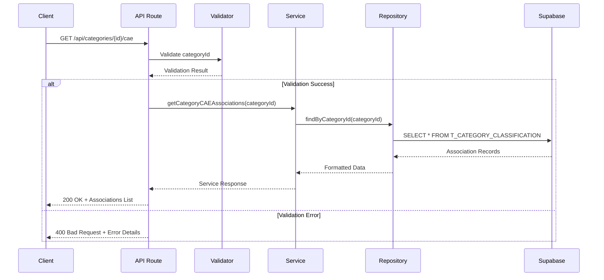
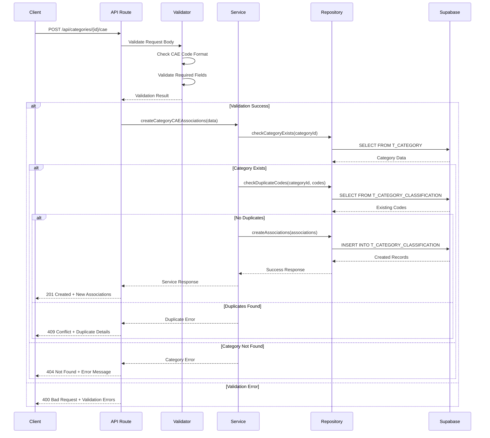
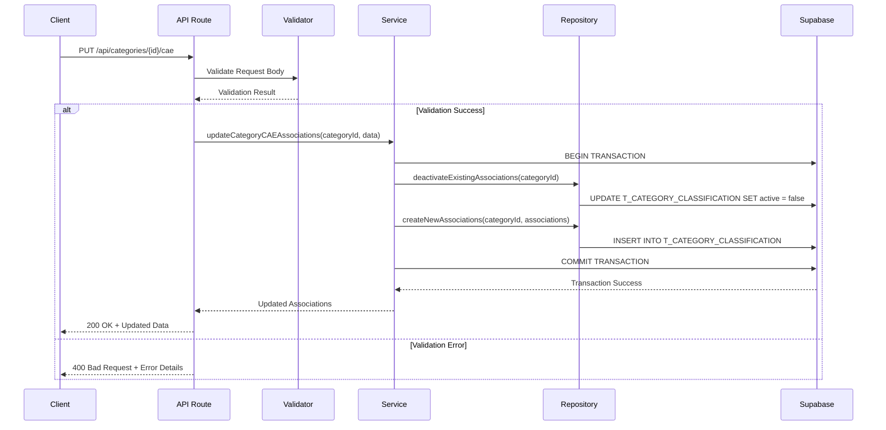
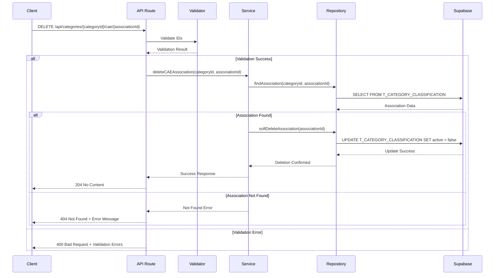

# PR01.06-BE-LIC - Análise Técnica Backend: Associação Categoria CAE

## 1. Visão Geral do Sistema

### 1.1 Contexto
Sistema backend para gestão de associações entre códigos CAE (Classificação das Atividades Económicas) e categorias de licenciamento, implementado através de Next.js API Routes integrado com Supabase PostgreSQL.

### 1.2 Objetivos
- Permitir associação múltipla de códigos CAE às categorias existentes
- Garantir integridade e unicidade dos dados
- Fornecer APIs RESTful para operações CRUD
- Implementar validações robustas de negócio
- Assegurar performance e escalabilidade

## 2. Requisitos Funcionais

### 2.1 Gestão de Associações CAE

**RF01 - Listar Associações CAE por Categoria**
- O sistema deve retornar todas as associações CAE de uma categoria específica
- Incluir informações de paginação quando aplicável
- Filtrar por status ativo/inativo
- Ordenar por data de criação (mais recente primeiro)

**RF02 - Criar Associações CAE**
- O sistema deve permitir criar múltiplas associações CAE simultaneamente
- Validar formato do código CAE (5 dígitos numéricos)
- Garantir unicidade do código CAE por categoria
- Definir status ativo como padrão

**RF03 - Atualizar Associações CAE**
- O sistema deve permitir atualização completa das associações de uma categoria
- Implementar operação de substituição (replace) das associações existentes
- Manter histórico através de timestamps de atualização

**RF04 - Remover Associação CAE**
- O sistema deve permitir remoção individual de associações
- Implementar soft delete através do campo 'active'
- Manter registro histórico da associação

**RF05 - Validação de Código CAE**
- O sistema deve validar se o código CAE existe e está ativo
- Verificar formato: exatamente 5 dígitos numéricos
- Retornar descrição oficial do código CAE quando disponível

### 2.2 Integridade de Dados

**RF06 - Validação de Categoria**
- O sistema deve verificar se a categoria existe antes de criar associações
- Validar se a categoria está ativa
- Retornar erro específico para categorias inexistentes

**RF07 - Controle de Duplicação**
- O sistema deve impedir códigos CAE duplicados para a mesma categoria
- Permitir mesmo código CAE em categorias diferentes
- Considerar apenas associações ativas para validação de unicidade

## 3. Requisitos Não Funcionais

### 3.1 Performance
- **RNF01**: Tempo de resposta máximo de 500ms para operações de leitura
- **RNF02**: Tempo de resposta máximo de 2s para operações de escrita
- **RNF03**: Suporte a até 1000 associações por categoria
- **RNF04**: Índices otimizados para consultas por category_id e cae_code

### 3.2 Segurança
- **RNF05**: Autenticação obrigatória para todas as operações
- **RNF06**: Implementação de Row Level Security (RLS) no Supabase
- **RNF07**: Validação de entrada para prevenção de SQL Injection
- **RNF08**: Logs de auditoria para operações de modificação

### 3.3 Disponibilidade
- **RNF09**: Disponibilidade de 99.9% durante horário comercial
- **RNF10**: Recuperação automática de falhas temporárias
- **RNF11**: Backup automático diário dos dados

### 3.4 Escalabilidade
- **RNF12**: Arquitetura preparada para crescimento horizontal
- **RNF13**: Cache de consultas frequentes
- **RNF14**: Paginação para listas com mais de 100 itens

## 4. Diagramas de Sequência

### 4.1 Listar Associações CAE



### 4.2 Criar Associações CAE



### 4.3 Atualizar Associações CAE



### 4.4 Remover Associação CAE



## 5. Especificações Técnicas

### 5.1 Estrutura de APIs

#### 5.1.1 GET /api/categories/[categoryId]/cae

**Parâmetros de Entrada:**
```typescript
interface GetCAEAssociationsParams {
  categoryId: string; // UUID da categoria
  page?: number;      // Página (default: 1)
  limit?: number;     // Itens por página (default: 50, max: 100)
  active?: boolean;   // Filtro por status (default: true)
}
```

**Resposta de Sucesso (200):**
```typescript
interface GetCAEAssociationsResponse {
  success: true;
  data: {
    associations: CategoryCAEAssociation[];
    pagination: {
      page: number;
      limit: number;
      total: number;
      totalPages: number;
    };
  };
}

interface CategoryCAEAssociation {
  id: string;
  categoryId: string;
  code: string;
  description: string;
  active: boolean;
  createdAt: string;
  updatedAt: string;
}
```

#### 5.1.2 POST /api/categories/[categoryId]/cae

**Parâmetros de Entrada:**
```typescript
interface CreateCAEAssociationsRequest {
  associations: CreateCAEAssociationItem[];
}

interface CreateCAEAssociationItem {
  code: string;        // Código CAE (5 dígitos)
  description: string; // Descrição da atividade
  active?: boolean;    // Status (default: true)
}
```

**Resposta de Sucesso (201):**
```typescript
interface CreateCAEAssociationsResponse {
  success: true;
  data: {
    created: CategoryCAEAssociation[];
    count: number;
  };
}
```

#### 5.1.3 PUT /api/categories/[categoryId]/cae

**Parâmetros de Entrada:**
```typescript
interface UpdateCAEAssociationsRequest {
  associations: UpdateCAEAssociationItem[];
}

interface UpdateCAEAssociationItem {
  id?: string;         // ID para atualização (opcional para novos)
  code: string;        // Código CAE (5 dígitos)
  description: string; // Descrição da atividade
  active: boolean;     // Status da associação
}
```

#### 5.1.4 DELETE /api/categories/[categoryId]/cae/[associationId]

**Resposta de Sucesso (204):** Sem conteúdo

### 5.2 Estrutura de Dados

#### 5.2.1 Tabela T_CATEGORY_CLASSIFICATION

```sql
CREATE TABLE T_CATEGORY_CLASSIFICATION (
    id UUID PRIMARY KEY DEFAULT gen_random_uuid(),
    category_id UUID NOT NULL,
    cae_code VARCHAR(10) NOT NULL,
    description TEXT NOT NULL,
    active BOOLEAN DEFAULT true,
    created_at TIMESTAMP WITH TIME ZONE DEFAULT NOW(),
    updated_at TIMESTAMP WITH TIME ZONE DEFAULT NOW()
);
```

#### 5.2.2 Índices de Performance

```sql
-- Índice principal para consultas por categoria
CREATE INDEX idx_category_classification_category_id 
ON T_CATEGORY_CLASSIFICATION(category_id);

-- Índice para consultas por código CAE
CREATE INDEX idx_category_classification_cae_code 
ON T_CATEGORY_CLASSIFICATION(cae_code);

-- Índice para filtros por status
CREATE INDEX idx_category_classification_active 
ON T_CATEGORY_CLASSIFICATION(active);

-- Índice composto para consultas otimizadas
CREATE INDEX idx_category_classification_category_active 
ON T_CATEGORY_CLASSIFICATION(category_id, active);
```

#### 5.2.3 Constraints de Integridade

```sql
-- Constraint única para evitar duplicação
CREATE UNIQUE INDEX idx_category_classification_unique 
ON T_CATEGORY_CLASSIFICATION(category_id, cae_code) 
WHERE active = true;

-- Constraint de formato para código CAE
ALTER TABLE T_CATEGORY_CLASSIFICATION 
ADD CONSTRAINT chk_cae_code_format 
CHECK (cae_code ~ '^[0-9]{5}$');

-- Constraint de tamanho para descrição
ALTER TABLE T_CATEGORY_CLASSIFICATION 
ADD CONSTRAINT chk_description_length 
CHECK (LENGTH(description) >= 10 AND LENGTH(description) <= 500);
```

### 5.3 Camadas de Implementação

#### 5.3.1 Controller Layer (API Routes)

```typescript
// /api/categories/[categoryId]/cae/route.ts
export async function GET(
  request: NextRequest,
  { params }: { params: { categoryId: string } }
) {
  try {
    // Validação de entrada
    const { categoryId } = await validateCategoryParams(params);
    const queryParams = await validateQueryParams(request.nextUrl.searchParams);
    
    // Chamada ao serviço
    const result = await categoryCAEService.getAssociations(categoryId, queryParams);
    
    return NextResponse.json(result, { status: 200 });
  } catch (error) {
    return handleAPIError(error);
  }
}
```

#### 5.3.2 Service Layer

```typescript
// services/categoryCAEService.ts
export class CategoryCAEService {
  constructor(private repository: CategoryCAERepository) {}

  async getAssociations(
    categoryId: string, 
    params: GetCAEAssociationsParams
  ): Promise<GetCAEAssociationsResponse> {
    // Validar se categoria existe
    await this.validateCategoryExists(categoryId);
    
    // Buscar associações
    const associations = await this.repository.findByCategoryId(categoryId, params);
    const total = await this.repository.countByCategoryId(categoryId, params);
    
    return {
      success: true,
      data: {
        associations,
        pagination: this.calculatePagination(params, total)
      }
    };
  }

  async createAssociations(
    categoryId: string,
    data: CreateCAEAssociationsRequest
  ): Promise<CreateCAEAssociationsResponse> {
    // Validações de negócio
    await this.validateCategoryExists(categoryId);
    await this.validateCAECodes(data.associations);
    await this.checkDuplicateCodes(categoryId, data.associations);
    
    // Criar associações
    const created = await this.repository.createMany(categoryId, data.associations);
    
    return {
      success: true,
      data: {
        created,
        count: created.length
      }
    };
  }
}
```

#### 5.3.3 Repository Layer

```typescript
// repositories/categoryCAERepository.ts
export class CategoryCAERepository {
  constructor(private supabase: SupabaseClient) {}

  async findByCategoryId(
    categoryId: string,
    params: GetCAEAssociationsParams
  ): Promise<CategoryCAEAssociation[]> {
    const { page = 1, limit = 50, active = true } = params;
    const offset = (page - 1) * limit;

    const { data, error } = await this.supabase
      .from('T_CATEGORY_CLASSIFICATION')
      .select('*')
      .eq('category_id', categoryId)
      .eq('active', active)
      .order('created_at', { ascending: false })
      .range(offset, offset + limit - 1);

    if (error) throw new DatabaseError(error.message);
    
    return data.map(this.mapToEntity);
  }

  async createMany(
    categoryId: string,
    associations: CreateCAEAssociationItem[]
  ): Promise<CategoryCAEAssociation[]> {
    const records = associations.map(item => ({
      category_id: categoryId,
      cae_code: item.code,
      description: item.description,
      active: item.active ?? true
    }));

    const { data, error } = await this.supabase
      .from('T_CATEGORY_CLASSIFICATION')
      .insert(records)
      .select();

    if (error) throw new DatabaseError(error.message);
    
    return data.map(this.mapToEntity);
  }
}
```

## 6. Validações Necessárias

### 6.1 Validações de Entrada

#### 6.1.1 Validação de Código CAE

```typescript
const CAECodeSchema = z.string()
  .regex(/^[0-9]{5}$/, 'Código CAE deve conter exatamente 5 dígitos numéricos')
  .refine(async (code) => {
    // Validação adicional se código CAE existe na base oficial
    return await validateCAECodeExists(code);
  }, 'Código CAE não encontrado na classificação oficial');
```

#### 6.1.2 Validação de Descrição

```typescript
const DescriptionSchema = z.string()
  .min(10, 'Descrição deve ter pelo menos 10 caracteres')
  .max(500, 'Descrição não pode exceder 500 caracteres')
  .trim()
  .refine((desc) => desc.length > 0, 'Descrição não pode estar vazia');
```

#### 6.1.3 Validação de Categoria

```typescript
const CategoryIdSchema = z.string()
  .uuid('ID da categoria deve ser um UUID válido')
  .refine(async (id) => {
    const exists = await categoryRepository.exists(id);
    return exists;
  }, 'Categoria não encontrada');
```

### 6.2 Validações de Negócio

#### 6.2.1 Unicidade de Código CAE por Categoria

```typescript
async function validateUniqueCAECodes(
  categoryId: string,
  codes: string[]
): Promise<void> {
  const existingCodes = await categoryCAERepository.findActiveCodes(categoryId);
  const duplicates = codes.filter(code => existingCodes.includes(code));
  
  if (duplicates.length > 0) {
    throw new BusinessRuleError(
      `Códigos CAE já associados à categoria: ${duplicates.join(', ')}`
    );
  }
}
```

#### 6.2.2 Limite de Associações por Categoria

```typescript
async function validateAssociationLimit(
  categoryId: string,
  newAssociationsCount: number
): Promise<void> {
  const currentCount = await categoryCAERepository.countByCategoryId(categoryId);
  const maxAssociations = 1000; // Limite configurável
  
  if (currentCount + newAssociationsCount > maxAssociations) {
    throw new BusinessRuleError(
      `Limite de ${maxAssociations} associações por categoria excedido`
    );
  }
}
```

### 6.3 Validações de Segurança

#### 6.3.1 Autenticação e Autorização

```typescript
async function validateUserAccess(
  request: NextRequest,
  categoryId: string
): Promise<User> {
  const user = await authenticateUser(request);
  
  if (!user) {
    throw new UnauthorizedError('Autenticação necessária');
  }
  
  const hasAccess = await checkCategoryAccess(user.id, categoryId);
  
  if (!hasAccess) {
    throw new ForbiddenError('Acesso negado à categoria');
  }
  
  return user;
}
```

#### 6.3.2 Sanitização de Entrada

```typescript
function sanitizeCAEAssociation(
  input: CreateCAEAssociationItem
): CreateCAEAssociationItem {
  return {
    code: input.code.replace(/\D/g, ''), // Remove não-dígitos
    description: sanitizeHtml(input.description.trim()),
    active: Boolean(input.active)
  };
}
```

## 7. Tratamento de Erros

### 7.1 Hierarquia de Erros

```typescript
// Base error class
export class APIError extends Error {
  constructor(
    message: string,
    public statusCode: number,
    public code: string
  ) {
    super(message);
    this.name = this.constructor.name;
  }
}

// Specific error types
export class ValidationError extends APIError {
  constructor(message: string, public details?: any) {
    super(message, 400, 'VALIDATION_ERROR');
  }
}

export class BusinessRuleError extends APIError {
  constructor(message: string) {
    super(message, 409, 'BUSINESS_RULE_ERROR');
  }
}

export class DatabaseError extends APIError {
  constructor(message: string) {
    super(message, 500, 'DATABASE_ERROR');
  }
}
```

### 7.2 Handler Global de Erros

```typescript
export function handleAPIError(error: unknown): NextResponse {
  console.error('API Error:', error);
  
  if (error instanceof APIError) {
    return NextResponse.json(
      {
        success: false,
        error: {
          code: error.code,
          message: error.message,
          details: error instanceof ValidationError ? error.details : undefined
        }
      },
      { status: error.statusCode }
    );
  }
  
  // Erro não tratado
  return NextResponse.json(
    {
      success: false,
      error: {
        code: 'INTERNAL_ERROR',
        message: 'Erro interno do servidor'
      }
    },
    { status: 500 }
  );
}
```

## 8. Configurações de Segurança Supabase

### 8.1 Row Level Security (RLS)

```sql
-- Habilitar RLS na tabela
ALTER TABLE T_CATEGORY_CLASSIFICATION ENABLE ROW LEVEL SECURITY;

-- Política para leitura (todos os usuários autenticados)
CREATE POLICY "Allow read access to authenticated users" 
ON T_CATEGORY_CLASSIFICATION
FOR SELECT 
TO authenticated
USING (true);

-- Política para inserção (usuários autenticados)
CREATE POLICY "Allow insert to authenticated users" 
ON T_CATEGORY_CLASSIFICATION
FOR INSERT 
TO authenticated
WITH CHECK (true);

-- Política para atualização (usuários autenticados)
CREATE POLICY "Allow update to authenticated users" 
ON T_CATEGORY_CLASSIFICATION
FOR UPDATE 
TO authenticated
USING (true)
WITH CHECK (true);

-- Política para exclusão (usuários autenticados)
CREATE POLICY "Allow delete to authenticated users" 
ON T_CATEGORY_CLASSIFICATION
FOR DELETE 
TO authenticated
USING (true);
```

### 8.2 Triggers de Auditoria

```sql
-- Função para log de auditoria
CREATE OR REPLACE FUNCTION audit_category_classification()
RETURNS TRIGGER AS $$
BEGIN
    IF TG_OP = 'INSERT' THEN
        INSERT INTO audit_log (table_name, operation, record_id, user_id, changes)
        VALUES ('T_CATEGORY_CLASSIFICATION', 'INSERT', NEW.id, auth.uid(), row_to_json(NEW));
        RETURN NEW;
    ELSIF TG_OP = 'UPDATE' THEN
        INSERT INTO audit_log (table_name, operation, record_id, user_id, changes)
        VALUES ('T_CATEGORY_CLASSIFICATION', 'UPDATE', NEW.id, auth.uid(), 
                json_build_object('old', row_to_json(OLD), 'new', row_to_json(NEW)));
        RETURN NEW;
    ELSIF TG_OP = 'DELETE' THEN
        INSERT INTO audit_log (table_name, operation, record_id, user_id, changes)
        VALUES ('T_CATEGORY_CLASSIFICATION', 'DELETE', OLD.id, auth.uid(), row_to_json(OLD));
        RETURN OLD;
    END IF;
    RETURN NULL;
END;
$$ LANGUAGE plpgsql;

-- Trigger de auditoria
CREATE TRIGGER audit_category_classification_trigger
    AFTER INSERT OR UPDATE OR DELETE ON T_CATEGORY_CLASSIFICATION
    FOR EACH ROW EXECUTE FUNCTION audit_category_classification();
```

## 9. Monitorização e Logs

### 9.1 Métricas de Performance

```typescript
// Middleware para métricas
export function withMetrics(handler: APIHandler): APIHandler {
  return async (request: NextRequest, context: any) => {
    const startTime = Date.now();
    const method = request.method;
    const url = request.url;
    
    try {
      const response = await handler(request, context);
      const duration = Date.now() - startTime;
      
      // Log de sucesso
      console.log(`${method} ${url} - ${response.status} - ${duration}ms`);
      
      // Métricas para monitorização
      recordMetric('api_request_duration', duration, {
        method,
        endpoint: url,
        status: response.status.toString()
      });
      
      return response;
    } catch (error) {
      const duration = Date.now() - startTime;
      
      // Log de erro
      console.error(`${method} ${url} - ERROR - ${duration}ms`, error);
      
      // Métricas de erro
      recordMetric('api_request_error', 1, {
        method,
        endpoint: url,
        error: error instanceof Error ? error.name : 'Unknown'
      });
      
      throw error;
    }
  };
}
```

### 9.2 Logs Estruturados

```typescript
interface LogContext {
  userId?: string;
  categoryId?: string;
  associationId?: string;
  operation: string;
  duration?: number;
}

export function logOperation(
  level: 'info' | 'warn' | 'error',
  message: string,
  context: LogContext
): void {
  const logEntry = {
    timestamp: new Date().toISOString(),
    level,
    message,
    service: 'category-cae-backend',
    ...context
  };
  
  console.log(JSON.stringify(logEntry));
}
```

## 10. Testes e Qualidade

### 10.1 Estratégia de Testes

#### 10.1.1 Testes Unitários
- Validação de schemas Zod
- Lógica de negócio nos serviços
- Transformação de dados nos repositórios
- Cobertura mínima: 80%

#### 10.1.2 Testes de Integração
- APIs completas com base de dados
- Fluxos de criação, atualização e remoção
- Validação de constraints de base de dados
- Testes de performance com dados volumosos

#### 10.1.3 Testes de Carga
- Simulação de 100 utilizadores simultâneos
- Teste de criação de 1000 associações por categoria
- Validação de tempos de resposta sob carga

### 10.2 Exemplo de Teste de Integração

```typescript
describe('Category CAE API Integration', () => {
  beforeEach(async () => {
    await setupTestDatabase();
    await createTestCategory();
  });

  afterEach(async () => {
    await cleanupTestDatabase();
  });

  it('should create multiple CAE associations', async () => {
    const payload = {
      associations: [
        { code: '62010', description: 'Programação informática' },
        { code: '62020', description: 'Consultoria informática' }
      ]
    };

    const response = await request(app)
      .post(`/api/categories/${testCategoryId}/cae`)
      .send(payload)
      .expect(201);

    expect(response.body.success).toBe(true);
    expect(response.body.data.created).toHaveLength(2);
    expect(response.body.data.count).toBe(2);
  });

  it('should prevent duplicate CAE codes', async () => {
    // Criar primeira associação
    await createTestAssociation(testCategoryId, '62010');

    const payload = {
      associations: [
        { code: '62010', description: 'Duplicado' }
      ]
    };

    const response = await request(app)
      .post(`/api/categories/${testCategoryId}/cae`)
      .send(payload)
      .expect(409);

    expect(response.body.success).toBe(false);
    expect(response.body.error.code).toBe('BUSINESS_RULE_ERROR');
  });
});
```

## 11. Deployment e Configuração

### 11.1 Variáveis de Ambiente

```bash
# Supabase Configuration
SUPABASE_URL=https://your-project.supabase.co
SUPABASE_ANON_KEY=your-anon-key
SUPABASE_SERVICE_ROLE_KEY=your-service-role-key

# Application Configuration
MAX_ASSOCIATIONS_PER_CATEGORY=1000
API_RATE_LIMIT_PER_MINUTE=100
LOG_LEVEL=info

# Security Configuration
JWT_SECRET=your-jwt-secret
CORS_ORIGINS=https://your-frontend-domain.com
```

### 11.2 Scripts de Migração

```sql
-- Migration: 001_create_category_classification_table.sql
CREATE TABLE IF NOT EXISTS T_CATEGORY_CLASSIFICATION (
    id UUID PRIMARY KEY DEFAULT gen_random_uuid(),
    category_id UUID NOT NULL,
    cae_code VARCHAR(10) NOT NULL,
    description TEXT NOT NULL,
    active BOOLEAN DEFAULT true,
    created_at TIMESTAMP WITH TIME ZONE DEFAULT NOW(),
    updated_at TIMESTAMP WITH TIME ZONE DEFAULT NOW()
);

-- Migration: 002_create_indexes.sql
CREATE INDEX IF NOT EXISTS idx_category_classification_category_id 
ON T_CATEGORY_CLASSIFICATION(category_id);

CREATE INDEX IF NOT EXISTS idx_category_classification_cae_code 
ON T_CATEGORY_CLASSIFICATION(cae_code);

-- Migration: 003_create_constraints.sql
CREATE UNIQUE INDEX IF NOT EXISTS idx_category_classification_unique 
ON T_CATEGORY_CLASSIFICATION(category_id, cae_code) 
WHERE active = true;
```

## 12. Conclusão

Este documento apresenta uma análise técnica completa para implementação do backend da funcionalidade de Associação CAE a Categorias. A arquitetura proposta garante:

- **Escalabilidade**: Através de índices otimizados e paginação
- **Integridade**: Com validações robustas e constraints de base de dados  
- **Segurança**: Implementando RLS, autenticação e auditoria
- **Performance**: Com tempos de resposta otimizados e cache
- **Manutenibilidade**: Através de código estruturado em camadas
- **Monitorização**: Com logs estruturados e métricas de performance

A implementação deve seguir as especificações técnicas detalhadas, garantindo qualidade através de testes abrangentes e deployment controlado.