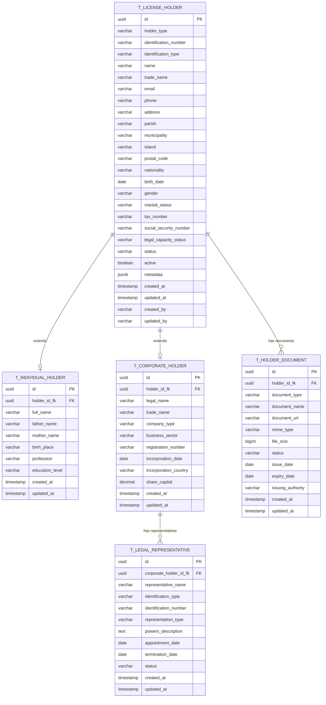

# PR02.02-BE-LIC-Gestão de Titulares de Licença

## 1. Visão Geral

Este documento especifica a implementação do módulo de **Gestão de Titulares de Licença** para o Sistema de Licenciamento de Cabo Verde. O módulo é responsável pelo registro, validação e gestão de pessoas físicas e jurídicas que podem ser titulares de licenças, incluindo validação de documentos de identificação, verificação de capacidade legal e gestão de representantes legais.

### 1.1 Objetivos

* Implementar modelo de dados unificado para pessoas físicas e jurídicas
* Implementar arquitetura DDD para gestão de titulares e suas capacidades
* Fornecer APIs REST para registro, consulta e atualização de titulares
* Garantir validações robustas de documentos de identificação
* Suportar gestão de representantes legais e procurações
* Implementar verificações de capacidade legal e conformidade

## 2. Modelo de Dados Normalizado

### 2.1 Diagrama ER



## 3. Arquitetura DDD

### 3.1 Domain Layer

#### 3.1.1 Aggregate Root: LicenseHolder

```java
@Entity
@Table(name = "t_license_holder")
@Inheritance(strategy = InheritanceType.JOINED)
@DiscriminatorColumn(name = "holder_type")
public abstract class LicenseHolder extends AggregateRoot<LicenseHolderId> {
    
    @EmbeddedId
    private LicenseHolderId id;
    
    @Enumerated(EnumType.STRING)
    @Column(name = "holder_type", insertable = false, updatable = false)
    private HolderType holderType;
    
    @Embedded
    private Identification identification;
    
    @Column(name = "name", nullable = false)
    private String name;
    
    @Embedded
    private ContactInfo contactInfo;
    
    @Enumerated(EnumType.STRING)
    @Column(name = "legal_capacity_status")
    private LegalCapacityStatus legalCapacityStatus;
    
    @Enumerated(EnumType.STRING)
    @Column(name = "status")
    private HolderStatus status;
    
    @OneToMany(mappedBy = "holder", cascade = CascadeType.ALL, fetch = FetchType.LAZY)
    private List<HolderDocument> documents = new ArrayList<>();
    
    // Métodos de negócio abstratos
    public abstract boolean isEligibleForLicense(LicenseType licenseType);
    public abstract void validateForLicenseApplication(LicenseType licenseType);
    
    // Métodos de negócio comuns
    public void updateContactInfo(ContactInfo newContactInfo, String updatedBy) {
        this.contactInfo = newContactInfo;
        this.updatedBy = updatedBy;
        this.updatedAt = Instant.now();
        
        addDomainEvent(new HolderContactUpdatedEvent(this.id));
    }
    
    public void addDocument(String documentType, String documentName, 
                           String documentUrl, String mimeType, Long fileSize,
                           LocalDate issueDate, LocalDate expiryDate, 
                           String issuingAuthority, String uploadedBy) {
        
        HolderDocument document = HolderDocument.create(
            this, documentType, documentName, documentUrl, mimeType, 
            fileSize, issueDate, expiryDate, issuingAuthority, uploadedBy
        );
        
        this.documents.add(document);
        
        addDomainEvent(new HolderDocumentAddedEvent(this.id, document.getId()));
    }
    
    public void activate(String updatedBy) {
        if (this.status == HolderStatus.ACTIVE) {
            throw new DomainException("Holder is already active");
        }
        
        validateLegalCapacity();
        
        this.status = HolderStatus.ACTIVE;
        this.updatedBy = updatedBy;
        this.updatedAt = Instant.now();
        
        addDomainEvent(new HolderActivatedEvent(this.id));
    }
    
    protected abstract void validateLegalCapacity();
}
```

Este documento foi corrigido para resolver os problemas de formatação identificados.