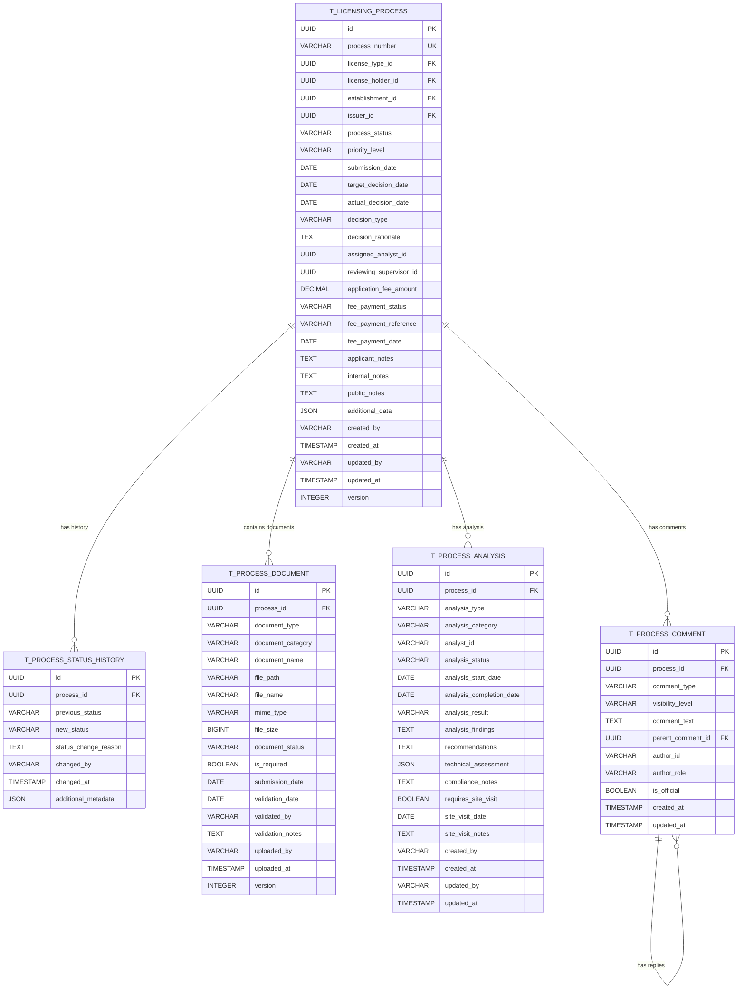

# PR02.05 - BE-LIC - Gestão de Processos de Licenciamento

## 1. Visão Geral

Este documento especifica o módulo **PR02.05 - Gestão de Processos de Licenciamento** do sistema de backend para gestão de licenças emitidas. Este módulo é responsável por gerenciar todo o ciclo de vida dos processos de licenciamento, desde a submissão inicial até a decisão final, incluindo análise técnica, validações, pareceres e aprovações.

### 1.1 Objetivos

* **Modelo de dados** **`T_LICENSING_PROCESS`**: Estrutura completa para gestão de processos de licenciamento

* **Arquitetura DDD**: Implementação seguindo padrões Domain-Driven Design

* **APIs REST**: Endpoints para operações CRUD e fluxos de processo

* **Validações de negócio**: Regras específicas para transições de status e validações de documentação

* **Gestão de fluxo**: Controle de etapas, prazos e responsabilidades

* **Histórico de decisões**: Rastreamento completo de todas as decisões e pareceres

## 2. Modelo de Dados

### 2.1 Diagrama ER



### 2.2 Definições SQL

#### 2.2.1 Tabela T\_LICENSING\_PROCESS

```sql
-- Tabela principal de processos de licenciamento
CREATE TABLE T_LICENSING_PROCESS (
    id UUID PRIMARY KEY DEFAULT gen_random_uuid(),
    process_number VARCHAR(50) UNIQUE NOT NULL,
    license_type_id UUID NOT NULL,
    license_holder_id UUID NOT NULL,
    establishment_id UUID,
    issuer_id UUID NOT NULL,
    process_status VARCHAR(30) NOT NULL DEFAULT 'SUBMITTED' 
        CHECK (process_status IN ('SUBMITTED', 'UNDER_REVIEW', 'PENDING_DOCUMENTS', 
                                 'TECHNICAL_ANALYSIS', 'SITE_VISIT_REQUIRED', 
                                 'PENDING_PAYMENT', 'APPROVED', 'REJECTED', 
                                 'CANCELLED', 'ON_HOLD')),
    priority_level VARCHAR(20) NOT NULL DEFAULT 'NORMAL' 
        CHECK (priority_level IN ('LOW', 'NORMAL', 'HIGH', 'URGENT')),
    submission_date DATE NOT NULL,
    target_decision_date DATE NOT NULL,
    actual_decision_date DATE,
    decision_type VARCHAR(20) 
        CHECK (decision_type IN ('APPROVED', 'REJECTED', 'CONDITIONAL_APPROVAL')),
    decision_rationale TEXT,
    assigned_analyst_id UUID,
    reviewing_supervisor_id UUID,
    application_fee_amount DECIMAL(15,2) NOT NULL DEFAULT 0.00,
    fee_payment_status VARCHAR(20) NOT NULL DEFAULT 'PENDING' 
        CHECK (fee_payment_status IN ('PENDING', 'PAID', 'PARTIALLY_PAID', 
                                     'OVERDUE', 'WAIVED', 'REFUNDED')),
    fee_payment_reference VARCHAR(100),
    fee_payment_date DATE,
    applicant_notes TEXT,
    internal_notes TEXT,
    public_notes TEXT,
    additional_data JSON,
    created_by VARCHAR(100) NOT NULL,
    created_at TIMESTAMP WITH TIME ZONE NOT NULL DEFAULT NOW(),
    updated_by VARCHAR(100),
    updated_at TIMESTAMP WITH TIME ZONE DEFAULT NOW(),
    version INTEGER NOT NULL DEFAULT 1,
    
    CONSTRAINT chk_decision_date_after_submission 
        CHECK (actual_decision_date IS NULL OR actual_decision_date >= submission_date),
    CONSTRAINT chk_target_date_after_submission 
        CHECK (target_decision_date >= submission_date),
    CONSTRAINT chk_decision_requires_rationale 
        CHECK (decision_type IS NULL OR decision_rationale IS NOT NULL)
);

-- Índices de performance
CREATE INDEX idx_licensing_process_status ON T_LICENSING_PROCESS(process_status);
CREATE INDEX idx_licensing_process_license_type ON T_LICENSING_PROCESS(license_type_id);
CREATE INDEX idx_licensing_process_holder ON T_LICENSING_PROCESS(license_holder_id);
CREATE INDEX idx_licensing_process_establishment ON T_LICENSING_PROCESS(establishment_id);
CREATE INDEX idx_licensing_process_issuer ON T_LICENSING_PROCESS(issuer_id);
CREATE INDEX idx_licensing_process_analyst ON T_LICENSING_PROCESS(assigned_analyst_id);
CREATE INDEX idx_licensing_process_submission_date ON T_LICENSING_PROCESS(submission_date DESC);
CREATE INDEX idx_licensing_process_target_date ON T_LICENSING_PROCESS(target_decision_date);
CREATE INDEX idx_licensing_process_priority ON T_LICENSING_PROCESS(priority_level, process_status);
CREATE INDEX idx_licensing_process_payment_status ON T_LICENSING_PROCESS(fee_payment_status);
```

#### 2.2.2 Tabela T\_PROCESS\_STATUS\_HISTORY

```sql
-- Histórico de mudanças de status
CREATE TABLE T_PROCESS_STATUS_HISTORY (
    id UUID PRIMARY KEY DEFAULT gen_random_uuid(),
    process_id UUID NOT NULL REFERENCES T_LICENSING_PROCESS(id) ON DELETE CASCADE,
    previous_status VARCHAR(30),
    new_status VARCHAR(30) NOT NULL,
    status_change_reason TEXT,
    changed_by VARCHAR(100) NOT NULL,
    changed_at TIMESTAMP WITH TIME ZONE NOT NULL DEFAULT NOW(),
    additional_metadata JSON
);

-- Índices
CREATE INDEX idx_process_status_history_process ON T_PROCESS_STATUS_HISTORY(process_id);
CREATE INDEX idx_process_status_history_date ON T_PROCESS_STATUS_HISTORY(changed_at DESC);
CREATE INDEX idx_process_status_history_status ON T_PROCESS_STATUS_HISTORY(new_status);
```

#### 2.2.3 Tabela T\_PROCESS\_DOCUMENT

```sql
-- Documentos do processo
CREATE TABLE T_PROCESS_DOCUMENT (
    id UUID PRIMARY KEY DEFAULT gen_random_uuid(),
    process_id UUID NOT NULL REFERENCES T_LICENSING_PROCESS(id) ON DELETE CASCADE,
    document_type VARCHAR(50) NOT NULL,
    document_category VARCHAR(30) NOT NULL DEFAULT 'SUPPORTING' 
        CHECK (document_category IN ('REQUIRED', 'SUPPORTING', 'TECHNICAL', 
                                    'LEGAL', 'FINANCIAL', 'ENVIRONMENTAL')),
    document_name VARCHAR(255) NOT NULL,
    file_path VARCHAR(500) NOT NULL,
    file_name VARCHAR(255) NOT NULL,
    mime_type VARCHAR(100) NOT NULL,
    file_size BIGINT NOT NULL CHECK (file_size > 0),
    document_status VARCHAR(20) NOT NULL DEFAULT 'PENDING' 
        CHECK (document_status IN ('PENDING', 'VALIDATED', 'REJECTED', 
                                  'REQUIRES_REVISION', 'EXPIRED')),
    is_required BOOLEAN NOT NULL DEFAULT FALSE,
    submission_date DATE NOT NULL DEFAULT CURRENT_DATE,
    validation_date DATE,
    validated_by VARCHAR(100),
    validation_notes TEXT,
    uploaded_by VARCHAR(100) NOT NULL,
    uploaded_at TIMESTAMP WITH TIME ZONE NOT NULL DEFAULT NOW(),
    version INTEGER NOT NULL DEFAULT 1
);

-- Índices
CREATE INDEX idx_process_document_process ON T_PROCESS_DOCUMENT(process_id);
CREATE INDEX idx_process_document_type ON T_PROCESS_DOCUMENT(document_type);
CREATE INDEX idx_process_document_category ON T_PROCESS_DOCUMENT(document_category);
CREATE INDEX idx_process_document_status ON T_PROCESS_DOCUMENT(document_status);
CREATE INDEX idx_process_document_required ON T_PROCESS_DOCUMENT(is_required, document_status);
```

#### 2.2.4 Tabela T\_PROCESS\_ANALYSIS

```sql
-- Análises técnicas do processo
CREATE TABLE T_PROCESS_ANALYSIS (
    id UUID PRIMARY KEY DEFAULT gen_random_uuid(),
    process_id UUID NOT NULL REFERENCES T_LICENSING_PROCESS(id) ON DELETE CASCADE,
    analysis_type VARCHAR(30) NOT NULL 
        CHECK (analysis_type IN ('TECHNICAL', 'LEGAL', 'ENVIRONMENTAL', 
                                'FINANCIAL', 'SAFETY', 'COMPLIANCE')),
    analysis_category VARCHAR(30) NOT NULL DEFAULT 'STANDARD' 
        CHECK (analysis_category IN ('STANDARD', 'DETAILED', 'EXPEDITED', 'SPECIAL')),
    analyst_id VARCHAR(100) NOT NULL,
    analysis_status VARCHAR(20) NOT NULL DEFAULT 'ASSIGNED' 
        CHECK (analysis_status IN ('ASSIGNED', 'IN_PROGRESS', 'COMPLETED', 
                                  'ON_HOLD', 'CANCELLED')),
    analysis_start_date DATE NOT NULL DEFAULT CURRENT_DATE,
    analysis_completion_date DATE,
    analysis_result VARCHAR(20) 
        CHECK (analysis_result IN ('APPROVED', 'REJECTED', 'CONDITIONAL', 
                                  'REQUIRES_ADDITIONAL_INFO')),
    analysis_findings TEXT,
    recommendations TEXT,
    technical_assessment JSON,
    compliance_notes TEXT,
    requires_site_visit BOOLEAN NOT NULL DEFAULT FALSE,
    site_visit_date DATE,
    site_visit_notes TEXT,
    created_by VARCHAR(100) NOT NULL,
    created_at TIMESTAMP WITH TIME ZONE NOT NULL DEFAULT NOW(),
    updated_by VARCHAR(100),
    updated_at TIMESTAMP WITH TIME ZONE DEFAULT NOW()
);

-- Índices
CREATE INDEX idx_process_analysis_process ON T_PROCESS_ANALYSIS(process_id);
CREATE INDEX idx_process_analysis_type ON T_PROCESS_ANALYSIS(analysis_type);
CREATE INDEX idx_process_analysis_analyst ON T_PROCESS_ANALYSIS(analyst_id);
CREATE INDEX idx_process_analysis_status ON T_PROCESS_ANALYSIS(analysis_status);
CREATE INDEX idx_process_analysis_result ON T_PROCESS_ANALYSIS(analysis_result);
```

#### 2.2.5 Tabela T\_PROCESS\_COMMENT

```sql
-- Comentários e comunicações do processo
CREATE TABLE T_PROCESS_COMMENT (
    id UUID PRIMARY KEY DEFAULT gen_random_uuid(),
    process_id UUID NOT NULL REFERENCES T_LICENSING_PROCESS(id) ON DELETE CASCADE,
    comment_type VARCHAR(20) NOT NULL DEFAULT 'GENERAL' 
        CHECK (comment_type IN ('GENERAL', 'TECHNICAL', 'ADMINISTRATIVE', 
                               'CLARIFICATION', 'OBJECTION', 'APPROVAL')),
    visibility_level VARCHAR(20) NOT NULL DEFAULT 'INTERNAL' 
        CHECK (visibility_level IN ('PUBLIC', 'INTERNAL', 'RESTRICTED', 'CONFIDENTIAL')),
    comment_text TEXT NOT NULL,
    parent_comment_id UUID REFERENCES T_PROCESS_COMMENT(id),
    author_id VARCHAR(100) NOT NULL,
    author_role VARCHAR(50) NOT NULL,
    is_official BOOLEAN NOT NULL DEFAULT FALSE,
    created_at TIMESTAMP WITH TIME ZONE NOT NULL DEFAULT NOW(),
    updated_at TIMESTAMP WITH TIME ZONE DEFAULT NOW()
);

-- Índices
CREATE INDEX idx_process_comment_process ON T_PROCESS_COMMENT(process_id);
CREATE INDEX idx_process_comment_type ON T_PROCESS_COMMENT(comment_type);
CREATE INDEX idx_process_comment_visibility ON T_PROCESS_COMMENT(visibility_level);
CREATE INDEX idx_process_comment_author ON T_PROCESS_COMMENT(author_id);
CREATE INDEX idx_process_comment_parent ON T_PROCESS_COMMENT(parent_comment_id);
CREATE INDEX idx_process_comment_date ON T_PROCESS_COMMENT(created_at DESC);
```

## 3. Arquitetura DDD

### 3.1 Aggregate Root: LicensingProcess

```java
@Entity
@Table(name = "T_LICENSING_PROCESS")
public class LicensingProcess extends AggregateRoot<LicensingProcessId> {
    
    @EmbeddedId
    private LicensingProcessId id;
    
    @Column(name = "process_number", unique = true, nullable = false)
    private String processNumber;
    
    @Column(name = "license_type_id", nullable = false)
    private UUID licenseTypeId;
    
    @Column(name = "license_holder_id", nullable = false)
    private UUID licenseHolderId;
    
    @Column(name = "establishment_id")
    private UUID establishmentId;
    
    @Column(name = "issuer_id", nullable = false)
    private UUID issuerId;
    
    @Enumerated(EnumType.STRING)
    @Column(name = "process_status", nullable = false)
    private ProcessStatus status;
    
    @Enumerated(EnumType.STRING)
    @Column(name = "priority_level", nullable = false)
    private PriorityLevel priorityLevel;
    
    @Column(name = "submission_date", nullable = false)
    private LocalDate submissionDate;
    
    @Column(name = "target_decision_date", nullable = false)
    private LocalDate targetDecisionDate;
    
    @Column(name = "actual_decision_date")
    private LocalDate actualDecisionDate;
    
    @Enumerated(EnumType.STRING)
    @Column(name = "decision_type")
    private DecisionType decisionType;
    
    @Column(name = "decision_rationale", columnDefinition = "TEXT")
    private String decisionRationale;
    
    @Column(name = "assigned_analyst_id")
    private String assignedAnalystId;
    
    @Column(name = "reviewing_supervisor_id")
    private String reviewingSupervisorId;
    
    @Embedded
    private ProcessFeeInfo feeInfo;
    
    @Embedded
    private ProcessNotes notes;
    
    @Type(JsonType.class)
    @Column(name = "additional_data", columnDefinition = "json")
    private Map<String, Object> additionalData;
    
    @Embedded
    private AuditInfo auditInfo;
    
    @Version
    private Integer version;
    
    @OneToMany(mappedBy = "process", cascade = CascadeType.ALL, fetch = FetchType.LAZY)
    private List<ProcessStatusHistory> statusHistory = new ArrayList<>();
    
    @OneToMany(mappedBy = "process", cascade = CascadeType.ALL, fetch = FetchType.LAZY)
    private List<ProcessDocument> documents = new ArrayList<>();
    
    @OneToMany(mappedBy = "process", cascade = CascadeType.ALL, fetch = FetchType.LAZY)
    private List<ProcessAnalysis> analyses = new ArrayList<>();
    
    @OneToMany(mappedBy = "process", cascade = CascadeType.ALL, fetch = FetchType.LAZY)
    private List<ProcessComment> comments = new ArrayList<>();
    
    protected LicensingProcess() {}
    
    // Factory method para criar novo processo
    public static LicensingProcess create(
            String processNumber,
            UUID licenseTypeId,
            UUID licenseHolderId,
            UUID establishmentId,
            UUID issuerId,
            PriorityLevel priorityLevel,
            LocalDate targetDecisionDate,
            BigDecimal applicationFeeAmount,
            String applicantNotes,
            String createdBy) {
        
        validateCreationParameters(processNumber, licenseTypeId, licenseHolderId, 
                                 issuerId, targetDecisionDate, applicationFeeAmount, createdBy);
        
        LicensingProcess process = new LicensingProcess();
        process.id = LicensingProcessId.generate();
        process.processNumber = processNumber;
        process.licenseTypeId = licenseTypeId;
        process.licenseHolderId = licenseHolderId;
        process.establishmentId = establishmentId;
        process.issuerId = issuerId;
        process.status = ProcessStatus.SUBMITTED;
        process.priorityLevel = priorityLevel != null ? priorityLevel : PriorityLevel.NORMAL;
        process.submissionDate = LocalDate.now();
        process.targetDecisionDate = targetDecisionDate;
        process.feeInfo = ProcessFeeInfo.create(applicationFeeAmount);
        process.notes = ProcessNotes.create(applicantNotes, null, null);
        process.additionalData = new HashMap<>();
        process.auditInfo = AuditInfo.create(createdBy);
        process.version = 1;
        
        // Adicionar histórico inicial
        process.addStatusHistory(null, ProcessStatus.SUBMITTED, 
                               "Process submitted", createdBy);
        
        // Publicar evento de domínio
        process.addDomainEvent(new LicensingProcessCreatedEvent(process.id, 
                             processNumber, licenseTypeId, licenseHolderId));
        
        return process;
    }
    
    // Métodos de negócio
    public void assignAnalyst(String analystId, String assignedBy) {
        validateAnalystAssignment(analystId, assignedBy);
        
        String previousAnalyst = this.assignedAnalystId;
        this.assignedAnalystId = analystId;
        this.auditInfo = this.auditInfo.update(assignedBy);
        
        addStatusHistory(this.status, ProcessStatus.UNDER_REVIEW, 
                        "Analyst assigned: " + analystId, assignedBy);
        this.status = ProcessStatus.UNDER_REVIEW;
        
        addDomainEvent(new AnalystAssignedEvent(this.id, analystId, previousAnalyst));
    }
    
    public ProcessDocument addDocument(
            String documentType,
            DocumentCategory category,
            String documentName,
            String filePath,
            String fileName,
            String mimeType,
            long fileSize,
            boolean isRequired,
            String uploadedBy) {
        
        validateDocumentAddition(documentType, documentName, filePath, 
                               fileName, fileSize, uploadedBy);
        
        ProcessDocument document = ProcessDocument.create(
            this.id, documentType, category, documentName, filePath,
            fileName, mimeType, fileSize, isRequired, uploadedBy);
        
        this.documents.add(document);
        this.auditInfo = this.auditInfo.update(uploadedBy);
        
        addDomainEvent(new ProcessDocumentAddedEvent(this.id, document.getId(), 
                     documentType, isRequired));
        
        return document;
    }
    
    public ProcessAnalysis requestAnalysis(
            AnalysisType analysisType,
            AnalysisCategory category,
            String analystId,
            boolean requiresSiteVisit,
            String requestedBy) {
        
        validateAnalysisRequest(analysisType, analystId, requestedBy);
        
        ProcessAnalysis analysis = ProcessAnalysis.create(
            this.id, analysisType, category, analystId, 
            requiresSiteVisit, requestedBy);
        
        this.analyses.add(analysis);
        this.auditInfo = this.auditInfo.update(requestedBy);
        
        // Atualizar status se necessário
        if (this.status == ProcessStatus.UNDER_REVIEW) {
            changeStatus(ProcessStatus.TECHNICAL_ANALYSIS, 
                        "Technical analysis requested", requestedBy);
        }
        
        addDomainEvent(new ProcessAnalysisRequestedEvent(this.id, analysis.getId(), 
                     analysisType, analystId));
        
        return analysis;
    }
    
    public void recordPayment(
            String paymentReference,
            LocalDate paymentDate,
            BigDecimal paidAmount,
            String recordedBy) {
        
        validatePaymentRecording(paymentReference, paymentDate, paidAmount, recordedBy);
        
        this.feeInfo = this.feeInfo.recordPayment(paymentReference, paymentDate, paidAmount);
        this.auditInfo = this.auditInfo.update(recordedBy);
        
        // Atualizar status se pagamento completo
        if (this.feeInfo.isFullyPaid() && this.status == ProcessStatus.PENDING_PAYMENT) {
            changeStatus(ProcessStatus.UNDER_REVIEW, "Payment completed", recordedBy);
        }
        
        addDomainEvent(new ProcessPaymentRecordedEvent(this.id, paymentReference, 
                     paidAmount, this.feeInfo.getPaymentStatus()));
    }
    
    public void approve(
            DecisionType decisionType,
            String decisionRationale,
            String approvedBy) {
        
        validateApproval(decisionType, decisionRationale, approvedBy);
        
        this.decisionType = decisionType;
        this.decisionRationale = decisionRationale;
        this.actualDecisionDate = LocalDate.now();
        this.auditInfo = this.auditInfo.update(approvedBy);
        
        changeStatus(ProcessStatus.APPROVED, "Process approved: " + decisionType, approvedBy);
        
        addDomainEvent(new ProcessApprovedEvent(this.id, decisionType, 
                     this.licenseTypeId, this.licenseHolderId));
    }
    
    public void reject(String rejectionReason, String rejectedBy) {
        validateRejection(rejectionReason, rejectedBy);
        
        this.decisionType = DecisionType.REJECTED;
        this.decisionRationale = rejectionReason;
        this.actualDecisionDate = LocalDate.now();
        this.auditInfo = this.auditInfo.update(rejectedBy);
        
        changeStatus(ProcessStatus.REJECTED, "Process rejected", rejectedBy);
        
        addDomainEvent(new ProcessRejectedEvent(this.id, rejectionReason));
    }
    
    public void cancel(String cancellationReason, String cancelledBy) {
        validateCancellation(cancellationReason, cancelledBy);
        
        this.auditInfo = this.auditInfo.update(cancelledBy);
        
        changeStatus(ProcessStatus.CANCELLED, cancellationReason, cancelledBy);
        
        addDomainEvent(new ProcessCancelledEvent(this.id, cancellationReason));
    }
    
    public ProcessComment addComment(
            CommentType commentType,
            VisibilityLevel visibilityLevel,
            String commentText,
            UUID parentCommentId,
            String authorId,
            String authorRole,
            boolean isOfficial) {
        
        validateCommentAddition(commentText, authorId, authorRole);
        
        ProcessComment comment = ProcessComment.create(
            this.id, commentType, visibilityLevel, commentText,
            parentCommentId, authorId, authorRole, isOfficial);
        
        this.comments.add(comment);
        this.auditInfo = this.auditInfo.update(authorId);
        
        addDomainEvent(new ProcessCommentAddedEvent(this.id, comment.getId(), 
                     commentType, isOfficial));
        
        return comment;
    }
    
    // Métodos de consulta
    public boolean isOverdue() {
        return this.actualDecisionDate == null && 
               LocalDate.now().isAfter(this.targetDecisionDate);
    }
    
    public boolean hasAllRequiredDocuments() {
        return this.documents.stream()
            .filter(ProcessDocument::isRequired)
            .allMatch(doc -> doc.getStatus() == DocumentStatus.VALIDATED);
    }
    
    public boolean hasCompletedAnalyses() {
        return this.analyses.stream()
            .allMatch(analysis -> analysis.getStatus() == AnalysisStatus.COMPLETED);
    }
    
    public boolean canBeApproved() {
        return this.status == ProcessStatus.UNDER_REVIEW &&
               hasAllRequiredDocuments() &&
               hasCompletedAnalyses() &&
               this.feeInfo.isFullyPaid();
    }
    
    public boolean canBeRejected() {
        return this.status != ProcessStatus.APPROVED &&
               this.status != ProcessStatus.REJECTED &&
               this.status != ProcessStatus.CANCELLED;
    }
    
    public long getDaysUntilDeadline() {
        return ChronoUnit.DAYS.between(LocalDate.now(), this.targetDecisionDate);
    }
    
    public List<ProcessDocument> getRequiredDocuments() {
        return this.documents.stream()
            .filter(ProcessDocument::isRequired)
            .toList();
    }
    
    public List<ProcessDocument> getPendingDocuments() {
        return this.documents.stream()
            .filter(doc -> doc.getStatus() == DocumentStatus.PENDING ||
                          doc.getStatus() == DocumentStatus.REQUIRES_REVISION)
            .toList();
    }
    
    // Métodos privados de validação
    private void changeStatus(ProcessStatus newStatus, String reason, String changedBy) {
        ProcessStatus previousStatus = this.status;
        this.status = newStatus;
        addStatusHistory(previousStatus, newStatus, reason, changedBy);
    }
    
    private void addStatusHistory(ProcessStatus previousStatus, ProcessStatus newStatus, 
                                String reason, String changedBy) {
        ProcessStatusHistory history = ProcessStatusHistory.create(
            this.id, previousStatus, newStatus, reason, changedBy);
        this.statusHistory.add(history);
    }
    
    private static void validateCreationParameters(String processNumber, UUID licenseTypeId,
            UUID licenseHolderId, UUID issuerId, LocalDate targetDecisionDate,
            BigDecimal applicationFeeAmount, String createdBy) {
        
        if (StringUtils.isBlank(processNumber)) {
            throw new DomainException("Process number is required");
        }
        if (licenseTypeId == null) {
            throw new DomainException("License type ID is required");
        }
        if (licenseHolderId == null) {
            throw new DomainException("License holder ID is required");
        }
        if (issuerId == null) {
            throw new DomainException("Issuer ID is required");
        }
        if (targetDecisionDate == null || targetDecisionDate.isBefore(LocalDate.now())) {
            throw new DomainException("Target decision date must be in the future");
        }
        if (applicationFeeAmount == null || applicationFeeAmount.compareTo(BigDecimal.ZERO) < 0) {
            throw new DomainException("Application fee amount must be non-negative");
        }
        if (StringUtils.isBlank(createdBy)) {
            throw new DomainException("Created by is required");
        }
    }
    
    private void validateAnalystAssignment(String analystId, String assignedBy) {
        if (StringUtils.isBlank(analystId)) {
            throw new DomainException("Analyst ID is required");
        }
        if (StringUtils.isBlank(assignedBy)) {
            throw new DomainException("Assigned by is required");
        }
        if (this.status == ProcessStatus.APPROVED || 
            this.status == ProcessStatus.REJECTED ||
            this.status == ProcessStatus.CANCELLED) {
            throw new DomainException("Cannot assign analyst to finalized process");
        }
    }
    
    private void validateDocumentAddition(String documentType, String documentName,
            String filePath, String fileName, long fileSize, String uploadedBy) {
        
        if (StringUtils.isBlank(documentType)) {
            throw new DomainException("Document type is required");
        }
        if (StringUtils.isBlank(documentName)) {
            throw new DomainException("Document name is required");
        }
        if (StringUtils.isBlank(filePath)) {
            throw new DomainException("File path is required");
        }
        if (StringUtils.isBlank(fileName)) {
            throw new DomainException("File name is required");
        }
        if (fileSize <= 0) {
            throw new DomainException("File size must be positive");
        }
        if (StringUtils.isBlank(uploadedBy)) {
            throw new DomainException("Uploaded by is required");
        }
    }
    
    private void validateAnalysisRequest(AnalysisType analysisType, String analystId, String requestedBy) {
        if (analysisType == null) {
            throw new DomainException("Analysis type is required");
        }
        if (StringUtils.isBlank(analystId)) {
            throw new DomainException("Analyst ID is required");
        }
        if (StringUtils.isBlank(requestedBy)) {
            throw new DomainException("Requested by is required");
        }
    }
    
    private void validatePaymentRecording(String paymentReference, LocalDate paymentDate,
            BigDecimal paidAmount, String recordedBy) {
        
        if (StringUtils.isBlank(paymentReference)) {
            throw new DomainException("Payment reference is required");
        }
        if (paymentDate == null) {
            throw new DomainException("Payment date is required");
        }
        if (paidAmount == null || paidAmount.compareTo(BigDecimal.ZERO) <= 0) {
            throw new DomainException("Paid amount must be positive");
        }
        if (StringUtils.isBlank(recordedBy)) {
            throw new DomainException("Recorded by is required");
        }
    }
    
    private void validateApproval(DecisionType decisionType, String decisionRationale, String approvedBy) {
        if (decisionType == null) {
            throw new DomainException("Decision type is required");
        }
        if (StringUtils.isBlank(decisionRationale)) {
            throw new DomainException("Decision rationale is required");
        }
        if (StringUtils.isBlank(approvedBy)) {
            throw new DomainException("Approved by is required");
        }
        if (!canBeApproved()) {
            throw new DomainException("Process cannot be approved in current state");
        }
    }
    
    private void validateRejection(String rejectionReason, String rejectedBy) {
        if (StringUtils.isBlank(rejectionReason)) {
            throw new DomainException("Rejection reason is required");
        }
        if (StringUtils.isBlank(rejectedBy)) {
            throw new DomainException("Rejected by is required");
        }
        if (!canBeRejected()) {
            throw new DomainException("Process cannot be rejected in current state");
        }
    }
    
    private void validateCancellation(String cancellationReason, String cancelledBy) {
        if (StringUtils.isBlank(cancellationReason)) {
            throw new DomainException("Cancellation reason is required");
        }
        if (StringUtils.isBlank(cancelledBy)) {
            throw new DomainException("Cancelled by is required");
        }
        if (this.status == ProcessStatus.APPROVED) {
            throw new DomainException("Cannot cancel approved process");
        }
    }
    
    private void validateCommentAddition(String commentText, String authorId, String authorRole) {
        if (StringUtils.isBlank(commentText)) {
            throw new DomainException("Comment text is required");
        }
        if (StringUtils.isBlank(authorId)) {
            throw new DomainException("Author ID is required");
        }
        if (StringUtils.isBlank(authorRole)) {
            throw new DomainException("Author role is required");
        }
    }
    
    // Getters
    public LicensingProcessId getId() { return id; }
    public String getProcessNumber() { return processNumber; }
    public UUID getLicenseTypeId() { return licenseTypeId; }
    public UUID getLicenseHolderId() { return licenseHolderId; }
    public UUID getEstablishmentId() { return establishmentId; }
    public UUID getIssuerId() { return issuerId; }
    public ProcessStatus getStatus() { return status; }
    public PriorityLevel getPriorityLevel() { return priorityLevel; }
    public LocalDate getSubmissionDate() { return submissionDate; }
    public LocalDate getTargetDecisionDate() { return targetDecisionDate; }
    public LocalDate getActualDecisionDate() { return actualDecisionDate; }
    public DecisionType getDecisionType() { return decisionType; }
    public String getDecisionRationale() { return decisionRationale; }
    public String getAssignedAnalystId() { return assignedAnalystId; }
    public String getReviewingSupervisorId() { return reviewingSupervisorId; }
    public ProcessFeeInfo getFeeInfo() { return feeInfo; }
    public ProcessNotes getNotes() { return notes; }
    public Map<String, Object> getAdditionalData() { return additionalData; }
    public AuditInfo getAuditInfo() { return auditInfo; }
    public Integer getVersion() { return version; }
    public List<ProcessStatusHistory> getStatusHistory() { return Collections.unmodifiableList(statusHistory); }
    public List<ProcessDocument> getDocuments() { return Collections.unmodifiableList(documents); }
    public List<ProcessAnalysis> getAnalyses() { return Collections.unmodifiableList(analyses); }
    public List<ProcessComment> getComments() { return Collections.unmodifiableList(comments); }
}
```

### 3.2 Value Objects

#### 3.2.1 LicensingProcessId

```java
@Embeddable
public class LicensingProcessId implements Serializable {
    
    @Column(name = "id")
    private UUID value;
    
    protected LicensingProcessId() {}
    
    private LicensingProcessId(UUID value) {
        this.value = Objects.requireNonNull(value, "Process ID cannot be null");
    }
    
    public static LicensingProcessId of(String id) {
        return new LicensingProcessId(UUID.fromString(id));
    }
    
    public static LicensingProcessId of(UUID id) {
        return new LicensingProcessId(id);
    }
    
    public static LicensingProcessId generate() {
        return new LicensingProcessId(UUID.randomUUID());
    }
    
    @Override
    public String toString() {
        return value.toString();
    }
    
    public UUID getValue() { return value; }
    
    @Override
    public boolean equals(Object o) {
        if (this == o) return true;
        if (o == null || getClass() != o.getClass()) return false;
        LicensingProcessId that = (LicensingProcessId) o;
        return Objects.equals(value, that.value);
    }
    
    @Override
    public int hashCode() {
        return Objects.hash(value);
    }
}
```

#### 3.2.2 ProcessFeeInfo

```java
@Embeddable
public class ProcessFeeInfo {
    
    @Column(name = "application_fee_amount", nullable = false)
    private BigDecimal applicationFeeAmount;
    
    @Enumerated(EnumType.STRING)
    @Column(name = "fee_payment_status", nullable = false)
    private FeePaymentStatus paymentStatus;
    
    @Column(name = "fee_payment_reference")
    private String paymentReference;
    
    @Column(name = "fee_payment_date")
    private LocalDate paymentDate;
    
    protected ProcessFeeInfo() {}
    
    private ProcessFeeInfo(BigDecimal applicationFeeAmount, FeePaymentStatus paymentStatus,
                          String paymentReference, LocalDate paymentDate) {
        this.applicationFeeAmount = applicationFeeAmount;
        this.paymentStatus = paymentStatus;
        this.paymentReference = paymentReference;
        this.paymentDate = paymentDate;
    }
    
    public static ProcessFeeInfo create(BigDecimal applicationFeeAmount) {
        return new ProcessFeeInfo(applicationFeeAmount, FeePaymentStatus.PENDING, null, null);
    }
    
    public ProcessFeeInfo recordPayment(String paymentReference, LocalDate paymentDate, 
                                       BigDecimal paidAmount) {
        
        FeePaymentStatus newStatus;
        if (paidAmount.compareTo(this.applicationFeeAmount) >= 0) {
            newStatus = FeePaymentStatus.PAID;
        } else {
            newStatus = FeePaymentStatus.PARTIALLY_PAID;
        }
        
        return new ProcessFeeInfo(this.applicationFeeAmount, newStatus, 
                                paymentReference, paymentDate);
    }
    
    public ProcessFeeInfo waiveFee() {
        return new ProcessFeeInfo(BigDecimal.ZERO, FeePaymentStatus.WAIVED, null, null);
    }
    
    public boolean isFullyPaid() {
        return paymentStatus == FeePaymentStatus.PAID || paymentStatus == FeePaymentStatus.WAIVED;
    }
    
    public boolean isPending() {
        return paymentStatus == FeePaymentStatus.PENDING;
    }
    
    public boolean isOverdue() {
        return paymentStatus == FeePaymentStatus.OVERDUE;
    }
    
    // Getters
    public BigDecimal getApplicationFeeAmount() { return applicationFeeAmount; }
    public FeePaymentStatus getPaymentStatus() { return paymentStatus; }
    public String getPaymentReference() { return paymentReference; }
    public LocalDate getPaymentDate() { return paymentDate; }
}
```

#### 3.2.3 ProcessNotes

```java
@Embeddable
public class ProcessNotes {
    
    @Column(name = "applicant_notes", columnDefinition = "TEXT")
    private String applicantNotes;
    
    @Column(name = "internal_notes", columnDefinition = "TEXT")
    private String internalNotes;
    
    @Column(name = "public_notes", columnDefinition = "TEXT")
    private String publicNotes;
    
    protected ProcessNotes() {}
    
    private ProcessNotes(String applicantNotes, String internalNotes, String publicNotes) {
        this.applicantNotes = applicantNotes;
        this.internalNotes = internalNotes;
        this.publicNotes = publicNotes;
    }
    
    public static ProcessNotes create(String applicantNotes, String internalNotes, String publicNotes) {
        return new ProcessNotes(applicantNotes, internalNotes, publicNotes);
    }
    
    public ProcessNotes updateApplicantNotes(String applicantNotes) {
        return new ProcessNotes(applicantNotes, this.internalNotes, this.publicNotes);
    }
    
    public ProcessNotes updateInternalNotes(String internalNotes) {
        return new ProcessNotes(this.applicantNotes, internalNotes, this.publicNotes);
    }
    
    public ProcessNotes updatePublicNotes(String publicNotes) {
        return new ProcessNotes(this.applicantNotes, this.internalNotes, publicNotes);
    }
    
    // Getters
    public String getApplicantNotes() { return applicantNotes; }
    public String getInternalNotes() { return internalNotes; }
    public String getPublicNotes() { return publicNotes; }
}
```

### 3.3 Enums

```java
public enum ProcessStatus {
    SUBMITTED("Submitted"),
    UNDER_REVIEW("Under Review"),
    PENDING_DOCUMENTS("Pending Documents"),
    TECHNICAL_ANALYSIS("Technical Analysis"),
    SITE_VISIT_REQUIRED("Site Visit Required"),
    PENDING_PAYMENT("Pending Payment"),
    APPROVED("Approved"),
    REJECTED("Rejected"),
    CANCELLED("Cancelled"),
    ON_HOLD("On Hold");
    
    private final String description;
    
    ProcessStatus(String description) {
        this.description = description;
    }
    
    public String getDescription() { return description; }
}

public enum PriorityLevel {
    LOW("Low"),
    NORMAL("Normal"),
    HIGH("High"),
    URGENT("Urgent");
    
    private final String description;
    
    PriorityLevel(String description) {
        this.description = description;
    }
    
    public String getDescription() { return description; }
}

public enum DecisionType {
    APPROVED("Approved"),
    REJECTED("Rejected"),
    CONDITIONAL_APPROVAL("Conditional Approval");
    
    private final String description;
    
    DecisionType(String description) {
        this.description = description;
    }
    
    public String getDescription() { return description; }
}

public enum FeePaymentStatus {
    PENDING("Pending"),
    PAID("Paid"),
    PARTIALLY_PAID("Partially Paid"),
    OVERDUE("Overdue"),
    WAIVED("Waived"),
    REFUNDED("Refunded");
    
    private final String description;
    
    FeePaymentStatus(String description) {
        this.description = description;
    }
    
    public String getDescription() { return description; }
}

public enum DocumentCategory {
    REQUIRED("Required"),
    SUPPORTING("Supporting"),
    TECHNICAL("Technical"),
    LEGAL("Legal"),
    FINANCIAL("Financial"),
    ENVIRONMENTAL("Environmental");
    
    private final String description;
    
    DocumentCategory(String description) {
        this.description = description;
    }
    
    public String getDescription() { return description; }
}

public enum DocumentStatus {
    PENDING("Pending"),
    VALIDATED("Validated"),
    REJECTED("Rejected"),
    REQUIRES_REVISION("Requires Revision"),
    EXPIRED("Expired");
    
    private final String description;
    
    DocumentStatus(String description) {
        this.description = description;
    }
    
    public String getDescription() { return description; }
}

public enum AnalysisType {
    TECHNICAL("Technical"),
    LEGAL("Legal"),
    ENVIRONMENTAL("Environmental"),
    FINANCIAL("Financial"),
    SAFETY("Safety"),
    COMPLIANCE("Compliance");
    
    private final String description;
    
    AnalysisType(String description) {
        this.description = description;
    }
    
    public String getDescription() { return description; }
}

public enum AnalysisCategory {
    STANDARD("Standard"),
    DETAILED("Detailed"),
    EXPEDITED("Expedited"),
    SPECIAL("Special");
    
    private final String description;
    
    AnalysisCategory(String description) {
        this.description = description;
    }
    
    public String getDescription() { return description; }
}

public enum AnalysisStatus {
    ASSIGNED("Assigned"),
    IN_PROGRESS("In Progress"),
    COMPLETED("Completed"),
    ON_HOLD("On Hold"),
    CANCELLED("Cancelled");
    
    private final String description;
    
    AnalysisStatus(String description) {
        this.description = description;
    }
    
    public String getDescription() { return description; }
}

public enum CommentType {
    GENERAL("General"),
    TECHNICAL("Technical"),
    ADMINISTRATIVE("Administrative"),
    CLARIFICATION("Clarification"),
    OBJECTION("Objection"),
    APPROVAL("Approval");
    
    private final String description;
    
    CommentType(String description) {
        this.description = description;
    }
    
    public String getDescription() { return description; }
}

public enum VisibilityLevel {
    PUBLIC("Public"),
    INTERNAL("Internal"),
    RESTRICTED("Restricted"),
    CONFIDENTIAL("Confidential");
    
    private final String description;
    
    VisibilityLevel(String description) {
        this.description = description;
    }
    
    public String getDescription() { return description; }
}
```

### 3.4 Repository Interface

```java
public interface LicensingProcessRepository extends Repository<LicensingProcess, LicensingProcessId> {
    
    // Métodos básicos
    Optional<LicensingProcess> findById(LicensingProcessId id);
    Optional<LicensingProcess> findByProcessNumber(String processNumber);
    LicensingProcess save(LicensingProcess process);
    void delete(LicensingProcess process);
    
    // Consultas por critérios
    Page<LicensingProcess> findByStatus(ProcessStatus status, Pageable pageable);
    Page<LicensingProcess> findByLicenseTypeId(UUID licenseTypeId, Pageable pageable);
    Page<LicensingProcess> findByLicenseHolderId(UUID licenseHolderId, Pageable pageable);
    Page<LicensingProcess> findByIssuerId(UUID issuerId, Pageable pageable);
    Page<LicensingProcess> findByAssignedAnalystId(String analystId, Pageable pageable);
    
    // Consultas por data
    List<LicensingProcess> findBySubmissionDateBetween(LocalDate startDate, LocalDate endDate);
    List<LicensingProcess> findByTargetDecisionDateBefore(LocalDate date);
    List<LicensingProcess> findOverdueProcesses();
    
    // Consultas por prioridade
    List<LicensingProcess> findByPriorityLevel(PriorityLevel priorityLevel);
    List<LicensingProcess> findHighPriorityProcesses();
    
    // Consultas por pagamento
    List<LicensingProcess> findByFeePaymentStatus(FeePaymentStatus paymentStatus);
    List<LicensingProcess> findPendingPaymentProcesses();
    
    // Consultas complexas
    Page<LicensingProcess> findByCriteria(
        ProcessStatus status,
        UUID licenseTypeId,
        UUID licenseHolderId,
        UUID issuerId,
        String assignedAnalystId,
        PriorityLevel priorityLevel,
        FeePaymentStatus paymentStatus,
        LocalDate submissionDateFrom,
        LocalDate submissionDateTo,
        String searchTerm,
        Pageable pageable);
    
    // Estatísticas
    long countByStatus(ProcessStatus status);
    long countByLicenseTypeId(UUID licenseTypeId);
    long countByIssuerId(UUID issuerId);
    long countOverdueProcesses();
    
    Map<ProcessStatus, Long> getProcessCountByStatus();
    Map<PriorityLevel, Long> getProcessCountByPriority();
    Map<String, Long> getProcessCountByAnalyst();
    
    // Métricas de performance
    Double getAverageProcessingTimeByLicenseType(UUID licenseTypeId);
    List<LicensingProcess> findProcessesExceedingTargetDate();
    Map<String, Double> getAnalystPerformanceMetrics();
}
```

### 3.5 Domain Services

#### 3.5.1 ProcessValidationService

```java
@Service
public class ProcessValidationService {
    
    private final LicenseTypeRepository licenseTypeRepository;
    private final LicenseHolderRepository licenseHolderRepository;
    private final EstablishmentRepository establishmentRepository;
    private final LicenseIssuerRepository licenseIssuerRepository;
    
    public ProcessValidationService(
            LicenseTypeRepository licenseTypeRepository,
            LicenseHolderRepository licenseHolderRepository,
            EstablishmentRepository establishmentRepository,
            LicenseIssuerRepository licenseIssuerRepository) {
        this.licenseTypeRepository = licenseTypeRepository;
        this.licenseHolderRepository = licenseHolderRepository;
        this.establishmentRepository = establishmentRepository;
        this.licenseIssuerRepository = licenseIssuerRepository;
    }
    
    public void validateProcessCreation(
            UUID licenseTypeId,
            UUID licenseHolderId,
            UUID establishmentId,
            UUID issuerId) {
        
        // Validar tipo de licença
        if (!licenseTypeRepository.existsById(licenseTypeId)) {
            throw new DomainException("License type not found: " + licenseTypeId);
        }
        
        // Validar titular
        if (!licenseHolderRepository.existsById(licenseHolderId)) {
            throw new DomainException("License holder not found: " + licenseHolderId);
        }
        
        // Validar estabelecimento (se fornecido)
        if (establishmentId != null && !establishmentRepository.existsById(establishmentId)) {
            throw new DomainException("Establishment not found: " + establishmentId);
        }
        
        // Validar emissor
        if (!licenseIssuerRepository.existsById(issuerId)) {
            throw new DomainException("License issuer not found: " + issuerId);
        }
        
        // Validar competência do emissor
        if (!licenseIssuerRepository.canIssue(issuerId, licenseTypeId)) {
            throw new DomainException("Issuer does not have competence for this license type");
        }
        
        // Validar elegibilidade do titular
        if (!licenseHolderRepository.isEligibleForLicense(licenseHolderId, licenseTypeId)) {
            throw new DomainException("License holder is not eligible for this license type");
        }
    }
    
    public void validateStatusTransition(ProcessStatus currentStatus, ProcessStatus newStatus) {
        if (!isValidStatusTransition(currentStatus, newStatus)) {
            throw new DomainException(
                String.format("Invalid status transition from %s to %s", 
                             currentStatus, newStatus));
        }
    }
    
    private boolean isValidStatusTransition(ProcessStatus from, ProcessStatus to) {
        return switch (from) {
            case SUBMITTED -> to == ProcessStatus.UNDER_REVIEW || 
                           to == ProcessStatus.PENDING_DOCUMENTS ||
                           to == ProcessStatus.CANCELLED;
            
            case UNDER_REVIEW -> to == ProcessStatus.TECHNICAL_ANALYSIS ||
                               to == ProcessStatus.SITE_VISIT_REQUIRED ||
                               to == ProcessStatus.PENDING_PAYMENT ||
                               to == ProcessStatus.APPROVED ||
                               to == ProcessStatus.REJECTED ||
                               to == ProcessStatus.ON_HOLD ||
                               to == ProcessStatus.CANCELLED;
            
            case PENDING_DOCUMENTS -> to == ProcessStatus.UNDER_REVIEW ||
                                    to == ProcessStatus.CANCELLED;
            
            case TECHNICAL_ANALYSIS -> to == ProcessStatus.UNDER_REVIEW ||
                                     to == ProcessStatus.SITE_VISIT_REQUIRED ||
                                     to == ProcessStatus.PENDING_DOCUMENTS ||
                                     to == ProcessStatus.ON_HOLD;
            
            case SITE_VISIT_REQUIRED -> to == ProcessStatus.TECHNICAL_ANALYSIS ||
                                      to == ProcessStatus.UNDER_REVIEW ||
                                      to == ProcessStatus.ON_HOLD;
            
            case PENDING_PAYMENT -> to == ProcessStatus.UNDER_REVIEW ||
                                  to == ProcessStatus.CANCELLED;
            
            case ON_HOLD -> to == ProcessStatus.UNDER_REVIEW ||
                          to == ProcessStatus.CANCELLED;
            
            case APPROVED, REJECTED, CANCELLED -> false; // Estados finais
        };
    }
}
```

#### 3.5.2 ProcessNumberGeneratorService

```java
@Service
public class ProcessNumberGeneratorService {
    
    private final LicensingProcessRepository processRepository;
    
    public ProcessNumberGeneratorService(LicensingProcessRepository processRepository) {
        this.processRepository = processRepository;
    }
    
    public String generateProcessNumber(UUID licenseTypeId, UUID issuerId) {
        String year = String.valueOf(LocalDate.now().getYear());
        String licenseTypeCode = getLicenseTypeCode(licenseTypeId);
        String issuerCode = getIssuerCode(issuerId);
        
        int sequentialNumber = getNextSequentialNumber(year, licenseTypeCode, issuerCode);
        
        return String.format("%s-%s-%s-%06d", 
                           year, licenseTypeCode, issuerCode, sequentialNumber);
    }
    
    private String getLicenseTypeCode(UUID licenseTypeId) {
        // Implementar busca do código do tipo de licença
        return "LIC"; // Placeholder
    }
    
    private String getIssuerCode(UUID issuerId) {
        // Implementar busca do código do emissor
        return "GOV"; // Placeholder
    }
    
    private int getNextSequentialNumber(String year, String licenseTypeCode, String issuerCode) {
        String pattern = year + "-" + licenseTypeCode + "-" + issuerCode + "-%";
        long count = processRepository.countByProcessNumberLike(pattern);
        return (int) count + 1;
    }
}
```

## 4. REST API Specification

### 4.1 Configuração Base da API

**Base URL:** `/api/v1/licensing-processes`

**Headers Obrigatórios:**

* `Content-Type: application/json`

* `Authorization: Bearer {token}`

* `Accept: application/json`

**Códigos de Status Padrão:**

* `200 OK` - Operação realizada com sucesso

* `201 Created` - Recurso criado com sucesso

* `400 Bad Request` - Dados inválidos na requisição

* `401 Unauthorized` - Token de autenticação inválido

* `403 Forbidden` - Usuário sem permissão para a operação

* `404 Not Found` - Recurso não encontrado

* `409 Conflict` - Conflito de dados (ex: número de processo duplicado)

* `422 Unprocessable Entity` - Erro de validação de negócio

* `500 Internal Server Error` - Erro interno do servidor

### 4.2 Endpoints para Processos de Licenciamento

#### 4.2.1 Criar Processo de Licenciamento

**POST** `/api/v1/licensing-processes`

**Request Body:**

```json
{
  "licenseTypeId": "550e8400-e29b-41d4-a716-446655440000",
  "licenseHolderId": "550e8400-e29b-41d4-a716-446655440001",
  "establishmentId": "550e8400-e29b-41d4-a716-446655440002",
  "issuerId": "550e8400-e29b-41d4-a716-446655440003",
  "priorityLevel": "NORMAL",
  "targetDecisionDate": "2025-06-30",
  "applicationFeeAmount": 1500.00,
  "applicantNotes": "Solicitação de licença para funcionamento de estabelecimento comercial",
  "additionalData": {
    "contactPhone": "+55 11 99999-9999",
    "preferredInspectionTime": "morning"
  }
}
```

**Response (201 Created):**

```json
{
  "id": "550e8400-e29b-41d4-a716-446655440010",
  "processNumber": "2025-LIC-GOV-000001",
  "licenseTypeId": "550e8400-e29b-41d4-a716-446655440000",
  "licenseHolderId": "550e8400-e29b-41d4-a716-446655440001",
  "establishmentId": "550e8400-e29b-41d4-a716-446655440002",
  "issuerId": "550e8400-e29b-41d4-a716-446655440003",
  "status": "SUBMITTED",
  "priorityLevel": "NORMAL",
  "submissionDate": "2025-01-15",
  "targetDecisionDate": "2025-06-30",
  "applicationFeeAmount": 1500.00,
  "feePaymentStatus": "PENDING",
  "applicantNotes": "Solicitação de licença para funcionamento de estabelecimento comercial",
  "additionalData": {
    "contactPhone": "+55 11 99999-9999",
    "preferredInspectionTime": "morning"
  },
  "createdAt": "2025-01-15T10:30:00Z",
  "version": 1
}
```

**Exemplo cURL:**

```bash
curl -X POST "https://api.example.com/api/v1/licensing-processes" \
  -H "Content-Type: application/json" \
  -H "Authorization: Bearer your-token-here" \
  -d '{
    "licenseTypeId": "550e8400-e29b-41d4-a716-446655440000",
    "licenseHolderId": "550e8400-e29b-41d4-a716-446655440001",
    "establishmentId": "550e8400-e29b-41d4-a716-446655440002",
    "issuerId": "550e8400-e29b-41d4-a716-446655440003",
    "priorityLevel": "NORMAL",
    "targetDecisionDate": "2025-06-30",
    "applicationFeeAmount": 1500.00
  }'
```

#### 4.2.2 Buscar Processo por ID

**GET** `/api/v1/licensing-processes/{id}`

**Response (200 OK):**

```json
{
  "id": "550e8400-e29b-41d4-a716-446655440010",
  "processNumber": "2025-LIC-GOV-000001",
  "licenseTypeId": "550e8400-e29b-41d4-a716-446655440000",
  "licenseHolderId": "550e8400-e29b-41d4-a716-446655440001",
  "establishmentId": "550e8400-e29b-41d4-a716-446655440002",
  "issuerId": "550e8400-e29b-41d4-a716-446655440003",
  "status": "UNDER_REVIEW",
  "priorityLevel": "NORMAL",
  "submissionDate": "2025-01-15",
  "targetDecisionDate": "2025-06-30",
  "assignedAnalystId": "analyst-001",
  "applicationFeeAmount": 1500.00,
  "feePaymentStatus": "PAID",
  "feePaymentDate": "2025-01-16",
  "applicantNotes": "Solicitação de licença para funcionamento de estabelecimento comercial",
  "internalNotes": "Documentação completa recebida",
  "createdAt": "2025-01-15T10:30:00Z",
  "updatedAt": "2025-01-16T14:20:00Z",
  "version": 2
}
```

#### 4.2.3 Buscar Processo por Número

**GET** `/api/v1/licensing-processes/by-number/{processNumber}`

**Exemplo:** `GET /api/v1/licensing-processes/by-number/2025-LIC-GOV-000001`

#### 4.2.4 Listar Processos

**GET** `/api/v1/licensing-processes`

**Query Parameters:**

* `page` (int, default: 0) - Número da página

* `size` (int, default: 20) - Tamanho da página

* `sort` (string, default: "submissionDate,desc") - Ordenação

* `status` (string) - Filtrar por status

* `licenseTypeId` (UUID) - Filtrar por tipo de licença

* `licenseHolderId` (UUID) - Filtrar por titular

* `issuerId` (UUID) - Filtrar por emissor

* `assignedAnalystId` (string) - Filtrar por analista

* `priorityLevel` (string) - Filtrar por prioridade

* `feePaymentStatus` (string) - Filtrar por status de pagamento

* `submissionDateFrom` (date) - Data de submissão inicial

* `submissionDateTo` (date) - Data de submissão final

* `search` (string) - Busca textual

**Response (200 OK):**

```json
{
  "content": [
    {
      "id": "550e8400-e29b-41d4-a716-446655440010",
      "processNumber": "2025-LIC-GOV-000001",
      "status": "UNDER_REVIEW",
      "priorityLevel": "NORMAL",
      "submissionDate": "2025-01-15",
      "targetDecisionDate": "2025-06-30",
      "licenseHolderId": "550e8400-e29b-41d4-a716-446655440001",
      "assignedAnalystId": "analyst-001",
      "feePaymentStatus": "PAID"
    }
  ],
  "pageable": {
    "pageNumber": 0,
    "pageSize": 20,
    "sort": {
      "sorted": true,
      "orders": [
        {
          "property": "submissionDate",
          "direction": "DESC"
        }
      ]
    }
  },
  "totalElements": 1,
  "totalPages": 1,
  "first": true,
  "last": true,
  "numberOfElements": 1
}
```

#### 4.2.5 Atualizar Processo

**PUT** `/api/v1/licensing-processes/{id}`

**Request Body:**

```json
{
  "priorityLevel": "HIGH",
  "targetDecisionDate": "2025-05-30",
  "assignedAnalystId": "analyst-002",
  "internalNotes": "Processo reclassificado como alta prioridade",
  "version": 2
}
```

#### 4.2.6 Alterar Status do Processo

**PATCH** `/api/v1/licensing-processes/{id}/status`

**Request Body:**

```json
{
  "newStatus": "TECHNICAL_ANALYSIS",
  "statusChangeReason": "Iniciando análise técnica detalhada",
  "version": 2
}
```

### 4.3 Endpoints para Documentos do Processo

#### 4.3.1 Listar Documentos do Processo

**GET** `/api/v1/licensing-processes/{processId}/documents`

**Query Parameters:**

* `documentType` (string) - Filtrar por tipo de documento

* `documentCategory` (string) - Filtrar por categoria

* `documentStatus` (string) - Filtrar por status

* `isRequired` (boolean) - Filtrar por obrigatório

**Response (200 OK):**

```json
[
  {
    "id": "550e8400-e29b-41d4-a716-446655440020",
    "processId": "550e8400-e29b-41d4-a716-446655440010",
    "documentType": "BUSINESS_LICENSE",
    "documentCategory": "REQUIRED",
    "documentName": "Alvará de Funcionamento",
    "fileName": "alvara_funcionamento.pdf",
    "mimeType": "application/pdf",
    "fileSize": 2048576,
    "documentStatus": "VALIDATED",
    "isRequired": true,
    "submissionDate": "2025-01-15",
    "validationDate": "2025-01-16",
    "validatedBy": "validator-001",
    "uploadedBy": "user-001",
    "uploadedAt": "2025-01-15T11:00:00Z"
  }
]
```

#### 4.3.2 Adicionar Documento ao Processo

**POST** `/api/v1/licensing-processes/{processId}/documents`

**Request Body (multipart/form-data):**

* `file` (file) - Arquivo do documento

* `documentType` (string) - Tipo do documento

* `documentCategory` (string) - Categoria do documento

* `documentName` (string) - Nome do documento

* `isRequired` (boolean) - Se é obrigatório

#### 4.3.3 Aprovar/Rejeitar Documento

**PATCH** `/api/v1/licensing-processes/{processId}/documents/{documentId}/validation`

**Request Body:**

```json
{
  "documentStatus": "VALIDATED",
  "validationNotes": "Documento aprovado conforme requisitos"
}
```

### 4.4 Endpoints para Análises do Processo

#### 4.4.1 Listar Análises do Processo

**GET** `/api/v1/licensing-processes/{processId}/analyses`

**Response (200 OK):**

```json
[
  {
    "id": "550e8400-e29b-41d4-a716-446655440030",
    "processId": "550e8400-e29b-41d4-a716-446655440010",
    "analysisType": "TECHNICAL",
    "analysisCategory": "STANDARD",
    "analystId": "analyst-001",
    "analysisStatus": "IN_PROGRESS",
    "analysisStartDate": "2025-01-17",
    "analysisResult": null,
    "requiresSiteVisit": true,
    "createdAt": "2025-01-17T09:00:00Z"
  }
]
```

#### 4.4.2 Criar Nova Análise

**POST** `/api/v1/licensing-processes/{processId}/analyses`

**Request Body:**

```json
{
  "analysisType": "ENVIRONMENTAL",
  "analysisCategory": "DETAILED",
  "analystId": "analyst-003",
  "requiresSiteVisit": true,
  "analysisStartDate": "2025-01-20"
}
```

#### 4.4.3 Atualizar Resultado da Análise

**PATCH** `/api/v1/licensing-processes/{processId}/analyses/{analysisId}/result`

**Request Body:**

```json
{
  "analysisStatus": "COMPLETED",
  "analysisResult": "APPROVED",
  "analysisFindings": "Estabelecimento atende todos os requisitos técnicos",
  "recommendations": "Manter monitoramento mensal dos equipamentos",
  "siteVisitDate": "2025-01-25",
  "siteVisitNotes": "Visita realizada com sucesso, instalações adequadas"
}
```

### 4.5 Endpoints para Comentários do Processo

#### 4.5.1 Listar Comentários do Processo

**GET** `/api/v1/licensing-processes/{processId}/comments`

**Query Parameters:**

* `commentType` (string) - Filtrar por tipo

* `visibilityLevel` (string) - Filtrar por visibilidade

* `authorId` (string) - Filtrar por autor

#### 4.5.2 Adicionar Comentário

**POST** `/api/v1/licensing-processes/{processId}/comments`

**Request Body:**

```json
{
  "commentType": "TECHNICAL",
  "visibilityLevel": "INTERNAL",
  "commentText": "Análise técnica concluída com aprovação",
  "isOfficial": true
}
```

### 4.6 Endpoints de Validação

#### 4.6.1 Validar Número de Processo

**GET** `/api/v1/licensing-processes/validate/process-number/{processNumber}`

**Response (200 OK):**

```json
{
  "valid": true,
  "exists": false,
  "message": "Número de processo disponível"
}
```

#### 4.6.2 Verificar Elegibilidade para Licença

**POST** `/api/v1/licensing-processes/validate/eligibility`

**Request Body:**

```json
{
  "licenseTypeId": "550e8400-e29b-41d4-a716-446655440000",
  "licenseHolderId": "550e8400-e29b-41d4-a716-446655440001",
  "establishmentId": "550e8400-e29b-41d4-a716-446655440002"
}
```

### 4.7 Endpoints de Busca Avançada

#### 4.7.1 Busca por Múltiplos Critérios

**POST** `/api/v1/licensing-processes/search`

**Request Body:**

```json
{
  "criteria": {
    "statuses": ["UNDER_REVIEW", "TECHNICAL_ANALYSIS"],
    "priorityLevels": ["HIGH", "URGENT"],
    "licenseTypeIds": ["550e8400-e29b-41d4-a716-446655440000"],
    "issuerIds": ["550e8400-e29b-41d4-a716-446655440003"],
    "submissionDateRange": {
      "from": "2025-01-01",
      "to": "2025-12-31"
    },
    "feePaymentStatuses": ["PENDING", "OVERDUE"]
  },
  "page": 0,
  "size": 20,
  "sort": "submissionDate,desc"
}
```

#### 4.7.2 Buscar Processos Próximos ao Vencimento

**GET** `/api/v1/licensing-processes/search/expiring-soon`

**Query Parameters:**

* `days` (int, default: 30) - Dias até o vencimento

* `page` (int, default: 0)

* `size` (int, default: 20)

### 4.8 Endpoints de Relatórios

#### 4.8.1 Estatísticas de Processos

**GET** `/api/v1/licensing-processes/reports/statistics`

**Query Parameters:**

* `period` (string) - Período (DAILY, WEEKLY, MONTHLY, YEARLY)

* `startDate` (date) - Data inicial

* `endDate` (date) - Data final

**Response (200 OK):**

```json
{
  "totalProcesses": 1250,
  "processesByStatus": {
    "SUBMITTED": 45,
    "UNDER_REVIEW": 320,
    "TECHNICAL_ANALYSIS": 180,
    "APPROVED": 650,
    "REJECTED": 55
  },
  "processesByPriority": {
    "LOW": 200,
    "NORMAL": 800,
    "HIGH": 200,
    "URGENT": 50
  },
  "averageProcessingTime": 45.5,
  "overdueProcesses": 25,
  "pendingPayments": 78
}
```

### 4.9 Tratamento de Erros

#### 4.9.1 Erro de Validação (400 Bad Request)

```json
{
  "error": "VALIDATION_ERROR",
  "message": "Dados inválidos na requisição",
  "details": [
    {
      "field": "licenseTypeId",
      "message": "ID do tipo de licença é obrigatório"
    },
    {
      "field": "targetDecisionDate",
      "message": "Data de decisão deve ser futura"
    }
  ],
  "timestamp": "2025-01-15T10:30:00Z"
}
```

#### 4.9.2 Erro de Negócio (422 Unprocessable Entity)

```json
{
  "error": "BUSINESS_RULE_VIOLATION",
  "message": "Transição de status inválida",
  "details": {
    "currentStatus": "APPROVED",
    "requestedStatus": "UNDER_REVIEW",
    "reason": "Não é possível alterar status de processo aprovado"
  },
  "timestamp": "2025-01-15T10:30:00Z"
}
```

#### 4.9.3 Recurso Não Encontrado (404 Not Found)

```json
{
  "error": "RESOURCE_NOT_FOUND",
  "message": "Processo de licenciamento não encontrado",
  "details": {
    "resourceType": "LicensingProcess",
    "resourceId": "550e8400-e29b-41d4-a716-446655440010"
  },
  "timestamp": "2025-01-15T10:30:00Z"
}
```

## 5. Camada de Aplicação

### 4.1 Use Cases

#### 4.1.1 CreateLicensingProcessUseCase

```java
@UseCase
public class CreateLicensingProcessUseCase {
    
    private final LicensingProcessRepository processRepository;
    private final ProcessValidationService validationService;
    private final ProcessNumberGeneratorService numberGeneratorService;
    private final DomainEventPublisher eventPublisher;
    
    public CreateLicensingProcessUseCase(
            LicensingProcessRepository processRepository,
            ProcessValidationService validationService,
            ProcessNumberGeneratorService numberGeneratorService,
            DomainEventPublisher eventPublisher) {
        this.processRepository = processRepository;
        this.validationService = validationService;
        this.numberGeneratorService = numberGeneratorService;
        this.eventPublisher = eventPublisher;
    }
    
    @Transactional
    public CreateLicensingProcessResponse execute(CreateLicensingProcessCommand command) {
        
        // Validar dados de entrada
        validationService.validateProcessCreation(
            command.getLicenseTypeId(),
            command.getLicenseHolderId(),
            command.getEstablishmentId(),
            command.getIssuerId());
        
        // Gerar número do processo
        String processNumber = numberGeneratorService.generateProcessNumber(
            command.getLicenseTypeId(), command.getIssuerId());
        
        // Criar processo
        LicensingProcess process = LicensingProcess.create(
            processNumber,
            command.getLicenseTypeId(),
            command.getLicenseHolderId(),
            command.getEstablishmentId(),
            command.getIssuerId(),
            command.getPriorityLevel(),
            command.getTargetDecisionDate(),
            command.getApplicationFeeAmount(),
            command.getApplicantNotes(),
            command.getCreatedBy());
        
        // Salvar processo
        LicensingProcess savedProcess = processRepository.save(process);
        
        // Publicar eventos de domínio
        eventPublisher.publishEvents(savedProcess.getDomainEvents());
        savedProcess.clearDomainEvents();
        
        return CreateLicensingProcessResponse.from(savedProcess);
    }
}
```

#### 4.1.2 AssignAnalystUseCase

```java
@UseCase
public class AssignAnalystUseCase {
    
    private final LicensingProcessRepository processRepository;
    private final DomainEventPublisher eventPublisher;
    
    public AssignAnalystUseCase(
            LicensingProcessRepository processRepository,
            DomainEventPublisher eventPublisher) {
        this.processRepository = processRepository;
        this.eventPublisher = eventPublisher;
    }
    
    @Transactional
    public void execute(AssignAnalystCommand command) {
        
        LicensingProcess process = processRepository.findById(
            LicensingProcessId.of(command.getProcessId()))
            .orElseThrow(() -> new ProcessNotFoundException(command.getProcessId()));
        
        process.assignAnalyst(command.getAnalystId(), command.getAssignedBy());
        
        processRepository.save(process);
        
        eventPublisher.publishEvents(process.getDomainEvents());
        process.clearDomainEvents();
    }
}
```

#### 4.1.3 AddProcessDocumentUseCase

```java
@UseCase
public class AddProcessDocumentUseCase {
    
    private final LicensingProcessRepository processRepository;
    private final FileStorageService fileStorageService;
    private final DomainEventPublisher eventPublisher;
    
    public AddProcessDocumentUseCase(
            LicensingProcessRepository processRepository,
            FileStorageService fileStorageService,
            DomainEventPublisher eventPublisher) {
        this.processRepository = processRepository;
        this.fileStorageService = fileStorageService;
        this.eventPublisher = eventPublisher;
    }
    
    @Transactional
    public AddProcessDocumentResponse execute(AddProcessDocumentCommand command) {
        
        LicensingProcess process = processRepository.findById(
            LicensingProcessId.of(command.getProcessId()))
            .orElseThrow(() -> new ProcessNotFoundException(command.getProcessId()));
        
        // Armazenar arquivo
        String filePath = fileStorageService.store(
            command.getFileData(),
            command.getFileName(),
            "processes/" + command.getProcessId());
        
        // Adicionar documento ao processo
        ProcessDocument document = process.addDocument(
            command.getDocumentType(),
            command.getCategory(),
            command.getDocumentName(),
            filePath,
            command.getFileName(),
            command.getMimeType(),
            command.getFileSize(),
            command.isRequired(),
            command.getUploadedBy());
        
        processRepository.save(process);
        
        eventPublisher.publishEvents(process.getDomainEvents());
        process.clearDomainEvents();
        
        return AddProcessDocumentResponse.from(document);
    }
}
```

#### 4.1.4 ApproveProcessUseCase

```java
@UseCase
public class ApproveProcessUseCase {
    
    private final LicensingProcessRepository processRepository;
    private final DomainEventPublisher eventPublisher;
    
    public ApproveProcessUseCase(
            LicensingProcessRepository processRepository,
            DomainEventPublisher eventPublisher) {
        this.processRepository = processRepository;
        this.eventPublisher = eventPublisher;
    }
    
    @Transactional
    public void execute(ApproveProcessCommand command) {
        
        LicensingProcess process = processRepository.findById(
            LicensingProcessId.of(command.getProcessId()))
            .orElseThrow(() -> new ProcessNotFoundException(command.getProcessId()));
        
        process.approve(
            command.getDecisionType(),
            command.getDecisionRationale(),
            command.getApprovedBy());
        
        processRepository.save(process);
        
        eventPublisher.publishEvents(process.getDomainEvents());
        process.clearDomainEvents();
    }
}
```

#### 4.1.5 RejectProcessUseCase

```java
@UseCase
public class RejectProcessUseCase {
    
    private final LicensingProcessRepository processRepository;
    private final DomainEventPublisher eventPublisher;
    
    public RejectProcessUseCase(
            LicensingProcessRepository processRepository,
            DomainEventPublisher eventPublisher) {
        this.processRepository = processRepository;
        this.eventPublisher = eventPublisher;
    }
    
    @Transactional
    public void execute(RejectProcessCommand command) {
        
        LicensingProcess process = processRepository.findById(
            LicensingProcessId.of(command.getProcessId()))
            .orElseThrow(() -> new ProcessNotFoundException(command.getProcessId()));
        
        process.reject(command.getRejectionReason(), command.getRejectedBy());
        
        processRepository.save(process);
        
        eventPublisher.publishEvents(process.getDomainEvents());
        process.clearDomainEvents();
    }
}
```

### 4.2 DTOs

#### 4.2.1 Command DTOs

```java
public class CreateLicensingProcessCommand {
    
    @NotNull(message = "License type ID is required")
    private UUID licenseTypeId;
    
    @NotNull(message = "License holder ID is required")
    private UUID licenseHolderId;
    
    private UUID establishmentId;
    
    @NotNull(message = "Issuer ID is required")
    private UUID issuerId;
    
    private PriorityLevel priorityLevel;
    
    @NotNull(message = "Target decision date is required")
    @Future(message = "Target decision date must be in the future")
    private LocalDate targetDecisionDate;
    
    @NotNull(message = "Application fee amount is required")
    @DecimalMin(value = "0.0", message = "Application fee amount must be non-negative")
    private BigDecimal applicationFeeAmount;
    
    @Size(max = 2000, message = "Applicant notes cannot exceed 2000 characters")
    private String applicantNotes;
    
    @NotBlank(message = "Created by is required")
    private String createdBy;
    
    // Constructors, getters and setters
    public CreateLicensingProcessCommand() {}
    
    public CreateLicensingProcessCommand(UUID licenseTypeId, UUID licenseHolderId,
            UUID establishmentId, UUID issuerId, PriorityLevel priorityLevel,
            LocalDate targetDecisionDate, BigDecimal applicationFeeAmount,
            String applicantNotes, String createdBy) {
        this.licenseTypeId = licenseTypeId;
        this.licenseHolderId = licenseHolderId;
        this.establishmentId = establishmentId;
        this.issuerId = issuerId;
        this.priorityLevel = priorityLevel;
        this.targetDecisionDate = targetDecisionDate;
        this.applicationFeeAmount = applicationFeeAmount;
        this.applicantNotes = applicantNotes;
        this.createdBy = createdBy;
    }
    
    // Getters and setters
    public UUID getLicenseTypeId() { return licenseTypeId; }
    public void setLicenseTypeId(UUID licenseTypeId) { this.licenseTypeId = licenseTypeId; }
    
    public UUID getLicenseHolderId() { return licenseHolderId; }
    public void setLicenseHolderId(UUID licenseHolderId) { this.licenseHolderId = licenseHolderId; }
    
    public UUID getEstablishmentId() { return establishmentId; }
    public void setEstablishmentId(UUID establishmentId) { this.establishmentId = establishmentId; }
    
    public UUID getIssuerId() { return issuerId; }
    public void setIssuerId(UUID issuerId) { this.issuerId = issuerId; }
    
    public PriorityLevel getPriorityLevel() { return priorityLevel; }
    public void setPriorityLevel(PriorityLevel priorityLevel) { this.priorityLevel = priorityLevel; }
    
    public LocalDate getTargetDecisionDate() { return targetDecisionDate; }
    public void setTargetDecisionDate(LocalDate targetDecisionDate) { this.targetDecisionDate = targetDecisionDate; }
    
    public BigDecimal getApplicationFeeAmount() { return applicationFeeAmount; }
    public void setApplicationFeeAmount(BigDecimal applicationFeeAmount) { this.applicationFeeAmount = applicationFeeAmount; }
    
    public String getApplicantNotes() { return applicantNotes; }
    public void setApplicantNotes(String applicantNotes) { this.applicantNotes = applicantNotes; }
    
    public String getCreatedBy() { return createdBy; }
    public void setCreatedBy(String createdBy) { this.createdBy = createdBy; }
}

public class AssignAnalystCommand {
    
    @NotNull(message = "Process ID is required")
    private UUID processId;
    
    @NotBlank(message = "Analyst ID is required")
    private String analystId;
    
    @NotBlank(message = "Assigned by is required")
    private String assignedBy;
    
    // Constructors, getters and setters
    public AssignAnalystCommand() {}
    
    public AssignAnalystCommand(UUID processId, String analystId, String assignedBy) {
        this.processId = processId;
        this.analystId = analystId;
        this.assignedBy = assignedBy;
    }
    
    public UUID getProcessId() { return processId; }
    public void setProcessId(UUID processId) { this.processId = processId; }
    
    public String getAnalystId() { return analystId; }
    public void setAnalystId(String analystId) { this.analystId = analystId; }
    
    public String getAssignedBy() { return assignedBy; }
    public void setAssignedBy(String assignedBy) { this.assignedBy = assignedBy; }
}

public class ApproveProcessCommand {
    
    @NotNull(message = "Process ID is required")
    private UUID processId;
    
    @NotNull(message = "Decision type is required")
    private DecisionType decisionType;
    
    @NotBlank(message = "Decision rationale is required")
    @Size(max = 2000, message = "Decision rationale cannot exceed 2000 characters")
    private String decisionRationale;
    
    @NotBlank(message = "Approved by is required")
    private String approvedBy;
    
    // Constructors, getters and setters
    public ApproveProcessCommand() {}
    
    public ApproveProcessCommand(UUID processId, DecisionType decisionType,
            String decisionRationale, String approvedBy) {
        this.processId = processId;
        this.decisionType = decisionType;
        this.decisionRationale = decisionRationale;
        this.approvedBy = approvedBy;
    }
    
    public UUID getProcessId() { return processId; }
    public void setProcessId(UUID processId) { this.processId = processId; }
    
    public DecisionType getDecisionType() { return decisionType; }
    public void setDecisionType(DecisionType decisionType) { this.decisionType = decisionType; }
    
    public String getDecisionRationale() { return decisionRationale; }
    public void setDecisionRationale(String decisionRationale) { this.decisionRationale = decisionRationale; }
    
    public String getApprovedBy() { return approvedBy; }
    public void setApprovedBy(String approvedBy) { this.approvedBy = approvedBy; }
}
```

#### 4.2.2 Response DTOs

```java
public class CreateLicensingProcessResponse {
    
    private UUID id;
    private String processNumber;
    private ProcessStatus status;
    private LocalDate submissionDate;
    private LocalDate targetDecisionDate;
    private PriorityLevel priorityLevel;
    private BigDecimal applicationFeeAmount;
    private FeePaymentStatus paymentStatus;
    
    public CreateLicensingProcessResponse() {}
    
    public static CreateLicensingProcessResponse from(LicensingProcess process) {
        CreateLicensingProcessResponse response = new CreateLicensingProcessResponse();
        response.id = process.getId().getValue();
        response.processNumber = process.getProcessNumber();
        response.status = process.getStatus();
        response.submissionDate = process.getSubmissionDate();
        response.targetDecisionDate = process.getTargetDecisionDate();
        response.priorityLevel = process.getPriorityLevel();
        response.applicationFeeAmount = process.getFeeInfo().getApplicationFeeAmount();
        response.paymentStatus = process.getFeeInfo().getPaymentStatus();
        return response;
    }
    
    // Getters and setters
    public UUID getId() { return id; }
    public void setId(UUID id) { this.id = id; }
    
    public String getProcessNumber() { return processNumber; }
    public void setProcessNumber(String processNumber) { this.processNumber = processNumber; }
    
    public ProcessStatus getStatus() { return status; }
    public void setStatus(ProcessStatus status) { this.status = status; }
    
    public LocalDate getSubmissionDate() { return submissionDate; }
    public void setSubmissionDate(LocalDate submissionDate) { this.submissionDate = submissionDate; }
    
    public LocalDate getTargetDecisionDate() { return targetDecisionDate; }
    public void setTargetDecisionDate(LocalDate targetDecisionDate) { this.targetDecisionDate = targetDecisionDate; }
    
    public PriorityLevel getPriorityLevel() { return priorityLevel; }
    public void setPriorityLevel(PriorityLevel priorityLevel) { this.priorityLevel = priorityLevel; }
    
    public BigDecimal getApplicationFeeAmount() { return applicationFeeAmount; }
    public void setApplicationFeeAmount(BigDecimal applicationFeeAmount) { this.applicationFeeAmount = applicationFeeAmount; }
    
    public FeePaymentStatus getPaymentStatus() { return paymentStatus; }
    public void setPaymentStatus(FeePaymentStatus paymentStatus) { this.paymentStatus = paymentStatus; }
}

public class LicensingProcessResponse {
    
    private UUID id;
    private String processNumber;
    private UUID licenseTypeId;
    private UUID licenseHolderId;
    private UUID establishmentId;
    private UUID issuerId;
    private ProcessStatus status;
    private PriorityLevel priorityLevel;
    private LocalDate submissionDate;
    private LocalDate targetDecisionDate;
    private LocalDate actualDecisionDate;
    private DecisionType decisionType;
    private String decisionRationale;
    private String assignedAnalystId;
    private BigDecimal applicationFeeAmount;
    private FeePaymentStatus paymentStatus;
    private String paymentReference;
    private LocalDate paymentDate;
    private String applicantNotes;
    private String publicNotes;
    private boolean isOverdue;
    private long daysUntilDeadline;
    private LocalDateTime createdAt;
    private LocalDateTime updatedAt;
    
    public LicensingProcessResponse() {}
    
    public static LicensingProcessResponse from(LicensingProcess process) {
        LicensingProcessResponse response = new LicensingProcessResponse();
        response.id = process.getId().getValue();
        response.processNumber = process.getProcessNumber();
        response.licenseTypeId = process.getLicenseTypeId();
        response.licenseHolderId = process.getLicenseHolderId();
        response.establishmentId = process.getEstablishmentId();
        response.issuerId = process.getIssuerId();
        response.status = process.getStatus();
        response.priorityLevel = process.getPriorityLevel();
        response.submissionDate = process.getSubmissionDate();
        response.targetDecisionDate = process.getTargetDecisionDate();
        response.actualDecisionDate = process.getActualDecisionDate();
        response.decisionType = process.getDecisionType();
        response.decisionRationale = process.getDecisionRationale();
        response.assignedAnalystId = process.getAssignedAnalystId();
        response.applicationFeeAmount = process.getFeeInfo().getApplicationFeeAmount();
        response.paymentStatus = process.getFeeInfo().getPaymentStatus();
        response.paymentReference = process.getFeeInfo().getPaymentReference();
        response.paymentDate = process.getFeeInfo().getPaymentDate();
        response.applicantNotes = process.getNotes().getApplicantNotes();
        response.publicNotes = process.getNotes().getPublicNotes();
        response.isOverdue = process.isOverdue();
        response.daysUntilDeadline = process.getDaysUntilDeadline();
        response.createdAt = process.getAuditInfo().getCreatedAt();
        response.updatedAt = process.getAuditInfo().getUpdatedAt();
        return response;
    }
    
    // Getters and setters omitidos por brevidade
}
```

## 5. Controladores REST

### 5.1 LicensingProcessController

```java
@RestController
@RequestMapping("/api/v1/licensing-processes")
@Validated
public class LicensingProcessController {
    
    private final CreateLicensingProcessUseCase createProcessUseCase;
    private final AssignAnalystUseCase assignAnalystUseCase;
    private final ApproveProcessUseCase approveProcessUseCase;
    private final RejectProcessUseCase rejectProcessUseCase;
    private final LicensingProcessRepository processRepository;
    
    public LicensingProcessController(
            CreateLicensingProcessUseCase createProcessUseCase,
            AssignAnalystUseCase assignAnalystUseCase,
            ApproveProcessUseCase approveProcessUseCase,
            RejectProcessUseCase rejectProcessUseCase,
            LicensingProcessRepository processRepository) {
        this.createProcessUseCase = createProcessUseCase;
        this.assignAnalystUseCase = assignAnalystUseCase;
        this.approveProcessUseCase = approveProcessUseCase;
        this.rejectProcessUseCase = rejectProcessUseCase;
        this.processRepository = processRepository;
    }
    
    @PostMapping
    public ResponseEntity<CreateLicensingProcessResponse> createProcess(
            @Valid @RequestBody CreateLicensingProcessCommand command) {
        
        CreateLicensingProcessResponse response = createProcessUseCase.execute(command);
        return ResponseEntity.status(HttpStatus.CREATED).body(response);
    }
    
    @GetMapping("/{id}")
    public ResponseEntity<LicensingProcessResponse> getProcess(@PathVariable UUID id) {
        
        Optional<LicensingProcess> process = processRepository.findById(LicensingProcessId.of(id));
        
        return process
            .map(p -> ResponseEntity.ok(LicensingProcessResponse.from(p)))
            .orElse(ResponseEntity.notFound().build());
    }
    
    @GetMapping
    public ResponseEntity<Page<LicensingProcessResponse>> getProcesses(
            @RequestParam(required = false) ProcessStatus status,
            @RequestParam(required = false) UUID licenseTypeId,
            @RequestParam(required = false) UUID licenseHolderId,
            @RequestParam(required = false) UUID issuerId,
            @RequestParam(required = false) String assignedAnalystId,
            @RequestParam(required = false) PriorityLevel priorityLevel,
            @RequestParam(required = false) FeePaymentStatus paymentStatus,
            @RequestParam(required = false) @DateTimeFormat(iso = DateTimeFormat.ISO.DATE) LocalDate submissionDateFrom,
            @RequestParam(required = false) @DateTimeFormat(iso = DateTimeFormat.ISO.DATE) LocalDate submissionDateTo,
            @RequestParam(required = false) String searchTerm,
            Pageable pageable) {
        
        Page<LicensingProcess> processes = processRepository.findByCriteria(
            status, licenseTypeId, licenseHolderId, issuerId, assignedAnalystId,
            priorityLevel, paymentStatus, submissionDateFrom, submissionDateTo,
            searchTerm, pageable);
        
        Page<LicensingProcessResponse> response = processes.map(LicensingProcessResponse::from);
        return ResponseEntity.ok(response);
    }
    
    @PutMapping("/{id}/assign-analyst")
    public ResponseEntity<Void> assignAnalyst(
            @PathVariable UUID id,
            @Valid @RequestBody AssignAnalystCommand command) {
        
        command.setProcessId(id);
        assignAnalystUseCase.execute(command);
        return ResponseEntity.ok().build();
    }
    
    @PutMapping("/{id}/approve")
    public ResponseEntity<Void> approveProcess(
            @PathVariable UUID id,
            @Valid @RequestBody ApproveProcessCommand command) {
        
        command.setProcessId(id);
        approveProcessUseCase.execute(command);
        return ResponseEntity.ok().build();
    }
    
    @PutMapping("/{id}/reject")
    public ResponseEntity<Void> rejectProcess(
            @PathVariable UUID id,
            @Valid @RequestBody RejectProcessCommand command) {
        
        command.setProcessId(id);
        rejectProcessUseCase.execute(command);
        return ResponseEntity.ok().build();
    }
    
    @GetMapping("/statistics")
    public ResponseEntity<Map<String, Object>> getStatistics() {
        
        Map<String, Object> statistics = new HashMap<>();
        statistics.put("countByStatus", processRepository.getProcessCountByStatus());
        statistics.put("countByPriority", processRepository.getProcessCountByPriority());
        statistics.put("overdueCount", processRepository.countOverdueProcesses());
        statistics.put("analystPerformance", processRepository.getAnalystPerformanceMetrics());
        
        return ResponseEntity.ok(statistics);
    }
}
```

## 6. Testes

### 6.1 Testes Unitários de Domínio

```java
class LicensingProcessTest {
    
    @Test
    void shouldCreateLicensingProcessSuccessfully() {
        // Given
        String processNumber = "2025-LIC-GOV-000001";
        UUID licenseTypeId = UUID.randomUUID();
        UUID licenseHolderId = UUID.randomUUID();
        UUID issuerId = UUID.randomUUID();
        LocalDate targetDate = LocalDate.now().plusDays(30);
        BigDecimal feeAmount = new BigDecimal("100.00");
        String createdBy = "admin";
        
        // When
        LicensingProcess process = LicensingProcess.create(
            processNumber, licenseTypeId, licenseHolderId, null,
            issuerId, PriorityLevel.NORMAL, targetDate, feeAmount,
            "Test notes", createdBy);
        
        // Then
        assertThat(process.getProcessNumber()).isEqualTo(processNumber);
        assertThat(process.getStatus()).isEqualTo(ProcessStatus.SUBMITTED);
        assertThat(process.getLicenseTypeId()).isEqualTo(licenseTypeId);
        assertThat(process.getFeeInfo().getApplicationFeeAmount()).isEqualTo(feeAmount);
        assertThat(process.getDomainEvents()).hasSize(1);
    }
    
    @Test
    void shouldAssignAnalystSuccessfully() {
        // Given
        LicensingProcess process = createValidProcess();
        String analystId = "analyst123";
        String assignedBy = "supervisor";
        
        // When
        process.assignAnalyst(analystId, assignedBy);
        
        // Then
        assertThat(process.getAssignedAnalystId()).isEqualTo(analystId);
        assertThat(process.getStatus()).isEqualTo(ProcessStatus.UNDER_REVIEW);
        assertThat(process.getDomainEvents()).hasSize(2); // Creation + Assignment
    }
    
    @Test
    void shouldApproveProcessWhenAllConditionsMet() {
        // Given
        LicensingProcess process = createProcessReadyForApproval();
        DecisionType decisionType = DecisionType.APPROVED;
        String rationale = "All requirements met";
        String approvedBy = "supervisor";
        
        // When
        process.approve(decisionType, rationale, approvedBy);
        
        // Then
        assertThat(process.getStatus()).isEqualTo(ProcessStatus.APPROVED);
        assertThat(process.getDecisionType()).isEqualTo(decisionType);
        assertThat(process.getActualDecisionDate()).isEqualTo(LocalDate.now());
    }
    
    @Test
    void shouldThrowExceptionWhenApprovingWithoutRequiredDocuments() {
        // Given
        LicensingProcess process = createValidProcess();
        
        // When & Then
        assertThatThrownBy(() -> 
            process.approve(DecisionType.APPROVED, "Test", "admin"))
            .isInstanceOf(DomainException.class)
            .hasMessageContaining("cannot be approved");
    }
    
    private LicensingProcess createValidProcess() {
        return LicensingProcess.create(
            "2025-LIC-GOV-000001",
            UUID.randomUUID(),
            UUID.randomUUID(),
            null,
            UUID.randomUUID(),
            PriorityLevel.NORMAL,
            LocalDate.now().plusDays(30),
            new BigDecimal("100.00"),
            "Test notes",
            "admin");
    }
    
    private LicensingProcess createProcessReadyForApproval() {
        // Implementar criação de processo com todos os requisitos atendidos
        return createValidProcess();
    }
}
```

### 6.2 Testes de Integração

```java
@SpringBootTest
@Transactional
class LicensingProcessControllerIntegrationTest {
    
    @Autowired
    private TestRestTemplate restTemplate;
    
    @Autowired
    private LicensingProcessRepository processRepository;
    
    @Test
    void shouldCreateProcessSuccessfully() {
        // Given
        CreateLicensingProcessCommand command = new CreateLicensingProcessCommand(
            UUID.randomUUID(),
            UUID.randomUUID(),
            null,
            UUID.randomUUID(),
            PriorityLevel.NORMAL,
            LocalDate.now().plusDays(30),
            new BigDecimal("100.00"),
            "Test notes",
            "admin");
        
        // When
        ResponseEntity<CreateLicensingProcessResponse> response = 
            restTemplate.postForEntity("/api/v1/licensing-processes", command, 
                                     CreateLicensingProcessResponse.class);
        
        // Then
        assertThat(response.getStatusCode()).isEqualTo(HttpStatus.CREATED);
        assertThat(response.getBody().getProcessNumber()).isNotNull();
        assertThat(response.getBody().getStatus()).isEqualTo(ProcessStatus.SUBMITTED);
    }
    
    @Test
    void shouldReturnProcessById() {
        // Given
        LicensingProcess savedProcess = createAndSaveProcess();
        
        // When
        ResponseEntity<LicensingProcessResponse> response = 
            restTemplate.getForEntity("/api/v1/licensing-processes/" + savedProcess.getId().getValue(),
                                    LicensingProcessResponse.class);
        
        // Then
        assertThat(response.getStatusCode()).isEqualTo(HttpStatus.OK);
        assertThat(response.getBody().getId()).isEqualTo(savedProcess.getId().getValue());
    }
    
    private LicensingProcess createAndSaveProcess() {
        LicensingProcess process = LicensingProcess.create(
            "2025-LIC-GOV-000001",
            UUID.randomUUID(),
            UUID.randomUUID(),
            null,
            UUID.randomUUID(),
            PriorityLevel.NORMAL,
            LocalDate.now().plusDays(30),
            new BigDecimal("100.00"),
            "Test notes",
            "admin");
        return processRepository.save(process);
    }
}
```

## 7. Considerações de Implementação

### 7.1 Performance

* Implementar cache para consultas frequentes de processos

* Usar índices compostos para consultas complexas

* Implementar paginação em todas as listagens

* Considerar particionamento da tabela por ano

### 7.2 Segurança

* Implementar controle de acesso baseado em roles

* Validar permissões para operações sensíveis

* Auditar todas as mudanças de status

* Criptografar dados sensíveis

### 7.3 Integração

* Publicar eventos para integração com outros módulos

* Implementar webhooks para notificações externas

* Considerar integração com sistemas de workflow

* Implementar APIs para sistemas legados

### 7.4 Testes e Qualidade

* Manter cobertura de testes acima de 80%

* Implementar testes de carga para operações críticas

* Usar testes de contrato para APIs

* Implementar monitoramento de métricas de negócio

