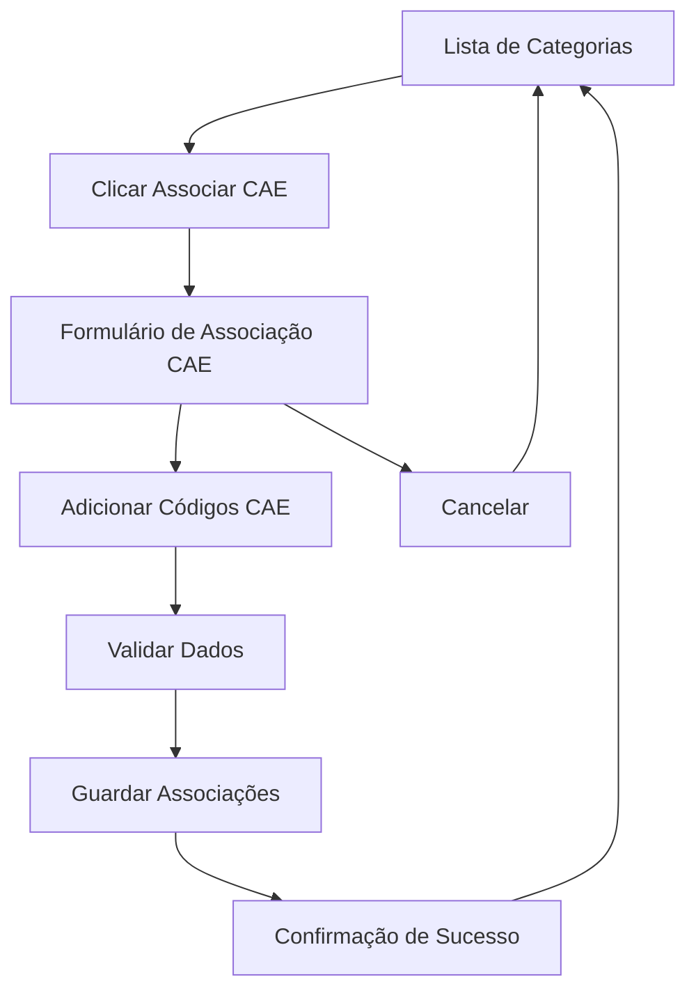

# Documento de Requisitos do Produto - Associação CAE a Categorias

## 1. Product Overview

Sistema para associar códigos CAE (Classificação das Atividades Económicas) às categorias existentes no sistema de licenciamento, permitindo uma gestão mais granular e organizada das atividades económicas por categoria.

O sistema resolve a necessidade de vincular atividades económicas específicas às categorias de licenciamento, facilitando a identificação e gestão de processos por tipo de atividade económica.

## 2. Core Features

### 2.1 User Roles

Não é necessária distinção de roles para esta funcionalidade. Todos os utilizadores autenticados podem gerir associações CAE.

### 2.2 Feature Module

A funcionalidade de associação CAE a categorias consiste nas seguintes páginas principais:

1. **Lista de Categorias**: Página existente com nova ação "Associar CAE" para cada categoria
2. **Formulário de Associação CAE**: Modal/página para gerir múltiplas associações CAE por categoria

### 2.3 Page Details

| Page Name                 | Module Name            | Feature description                                                                                                |
| ------------------------- | ---------------------- | ------------------------------------------------------------------------------------------------------------------ |
| Lista de Categorias       | Ação Associar CAE      | Adicionar botão "Associar CAE" na coluna de ações. Abrir modal/página de associação ao clicar.                     |
| Formulário Associação CAE | Cabeçalho da Categoria | Exibir nome e código da categoria selecionada para contexto.                                                       |
| Formulário Associação CAE | Lista Dinâmica CAE     | Usar IGRPFormList para gerir múltiplas associações. Permitir adicionar/remover itens dinamicamente.                |
| Formulário Associação CAE | Campos de Associação   | Para cada item: code (código CAE obrigatório), description (descrição obrigatória), active (switch ativo/inativo). |
| Formulário Associação CAE | Validação              | Validar formato código CAE, unicidade por categoria, campos obrigatórios. Exibir mensagens de erro claras.         |
| Formulário Associação CAE | Ações do Formulário    | Botões Guardar (submeter dados) e Cancelar (fechar sem guardar).                                                   |

## 3. Core Process

### Fluxo Principal do Utilizador

1. **Acesso à Lista de Categorias**: O utilizador navega para a lista de categorias existente
2. **Seleção de Categoria**: Clica no botão "Associar CAE" na linha da categoria desejada
3. **Formulário de Associação**: Sistema abre modal/página com formulário de associação CAE
4. **Gestão de Associações**: Utilizador pode adicionar múltiplas associações CAE usando o componente de lista dinâmica
5. **Validação e Submissão**: Sistema valida dados e guarda as associações
6. **Confirmação**: Utilizador recebe feedback de sucesso e retorna à lista de categorias

## 4. User Interface Design

### 4.1 Design Style

* **Cores Primárias**: Manter paleta existente do sistema IGRP

* **Cores Secundárias**: Azul para ações primárias, cinza para ações secundárias

* **Estilo de Botões**: Seguir padrão IGRP com bordas arredondadas e estados hover/focus

* **Tipografia**: Fonte do sistema IGRP, tamanhos 14px para texto normal, 12px para labels

* **Layout**: Card-based para formulários, tabela responsiva para listas

* **Ícones**: Usar ícones Lucide React consistentes com o sistema (Plus, Link, Edit, Trash)

### 4.2 Page Design Overview

| Page Name                    | Module Name              | UI Elements                                                                                 |
| ---------------------------- | ------------------------ | ------------------------------------------------------------------------------------------- |
| Lista de Categorias          | Ação Associar CAE        | Botão ghost com ícone Link, tooltip "Associar CAE", posicionado na coluna de ações          |
| Formulário de Associação CAE | Header do Modal          | Título "Associar CAE - \[Nome da Categoria]", botão fechar (X) no canto superior direito    |
| Formulário de Associação CAE | Informações da Categoria | Card com fundo cinza claro, exibindo Nome, Código e Setor da categoria                      |
| Formulário de Associação CAE | Lista Dinâmica           | IGRPFormList com botão "Adicionar CAE" (ícone Plus), cards expansíveis para cada associação |
| Formulário de Associação CAE | Campos de Entrada        | IGRPInputText para código CAE (obrigatório), IGRPTextarea para descrição (obrigatório)      |
| Formulário de Associação CAE | Ações do Formulário      | Botões "Guardar" (primário), "Cancelar" (secundário), alinhados à direita                   |

### 4.3 Responsiveness

* **Desktop-first**: Otimizado para desktop com adaptação para mobile

* **Breakpoints**: Seguir sistema de grid IGRP (sm: 640px, md: 768px, lg: 1024px)

* **Touch Optimization**: Botões com área mínima de 44px para dispositivos touch

* **Modal Responsivo**: Formulário adapta-se ao tamanho da tela, ocupando 90% da largura em mobile

