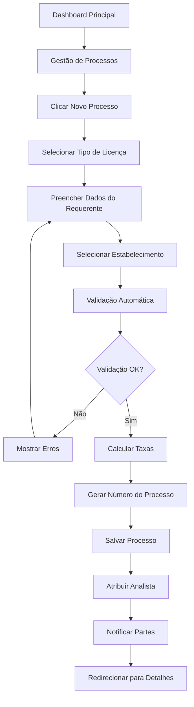
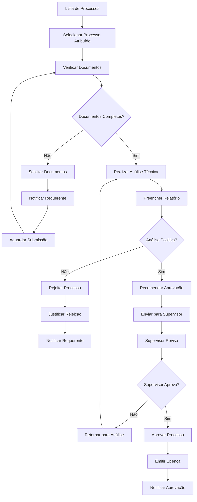
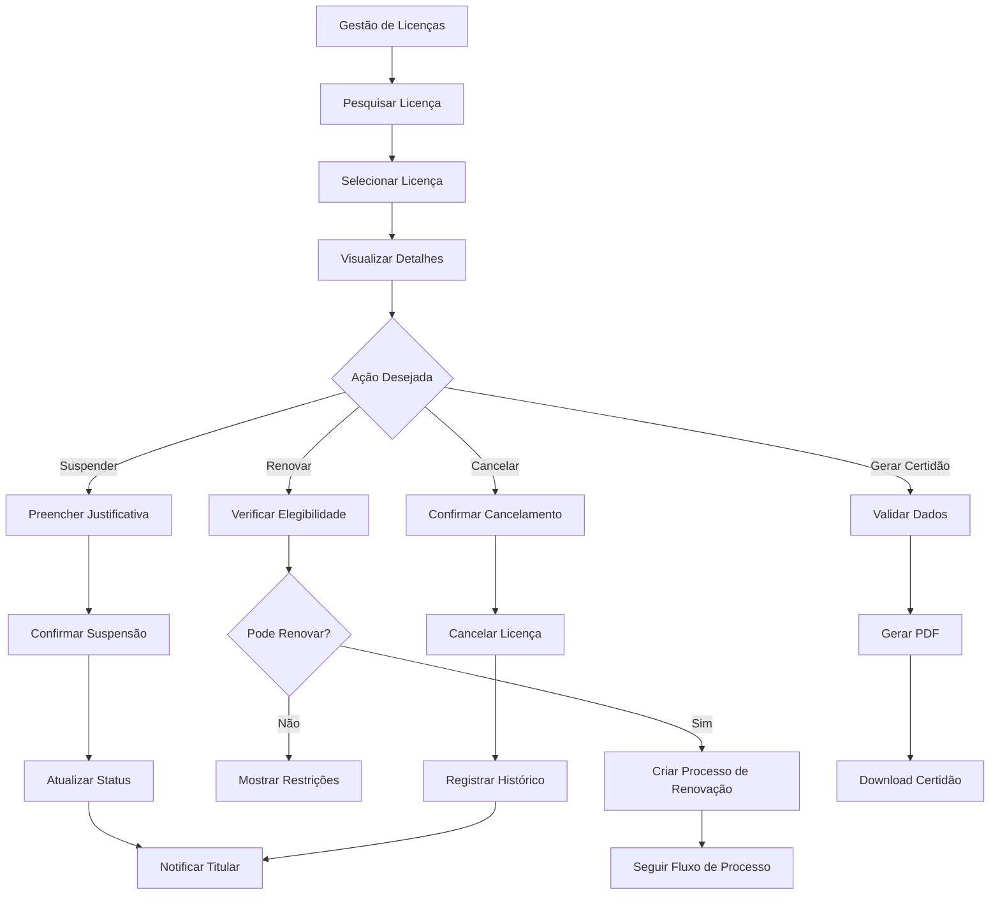
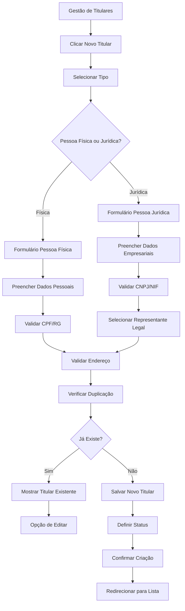
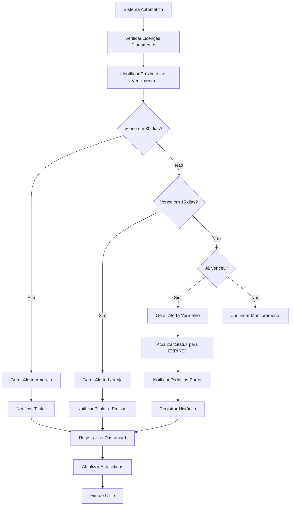

# PRD - Frontend do Módulo de Gestão de Licenças Emitidas

## 1. Visão Geral

O Frontend do Módulo de Gestão de Licenças Emitidas é uma interface web moderna que consome APIs de microserviços para permitir a gestão completa do ciclo de vida das licenças. A interface integra-se com cinco microserviços especializados: Gestão de Estabelecimentos, Gestão de Titulares, Gestão de Licenças Emitidas, Gestão de Emissores e Gestão de Processos de Licenciamento.

O módulo resolve o problema da necessidade de uma interface unificada para interagir com os microserviços de licenciamento, permitindo que funcionários públicos, analistas e gestores executem suas tarefas através de uma experiência de usuário intuitiva e responsiva. O público-alvo são analistas de licenciamento, supervisores, gestores de processos, funcionários de atendimento e administradores do sistema.

O valor de negócio reside na criação de uma interface moderna que facilita o acesso aos microserviços de licenciamento, melhorando a produtividade dos usuários e fornecendo uma experiência consistente para todas as operações regulamentares.

## 2. Requisitos Funcionais

### 2.1 Papéis de Utilizador

*Nota: A gestão de papéis e permissões é totalmente gerenciada pelo IGRP Framework 3.0 através do sistema RBAC integrado.*

| Papel                      | Método de Registo                  | Permissões Principais                                                  |
| -------------------------- | ---------------------------------- | ---------------------------------------------------------------------- |
| Administrador do Sistema   | Gerenciado pelo IGRP Framework 3.0 | Acesso completo a todas as funcionalidades de gestão de licenças       |
| Gestor de Licenciamento    | Gerenciado pelo IGRP Framework 3.0 | Pode visualizar, editar e aprovar processos dentro do seu âmbito       |
| Analista de Licenciamento  | Gerenciado pelo IGRP Framework 3.0 | Pode processar, analisar e recomendar decisões sobre processos         |
| Supervisor de Processos    | Gerenciado pelo IGRP Framework 3.0 | Pode revisar, aprovar e supervisionar processos e analistas            |
| Funcionário de Atendimento | Gerenciado pelo IGRP Framework 3.0 | Pode criar processos, consultar status e atualizar informações básicas |
| Utilizador de Consulta     | Gerenciado pelo IGRP Framework 3.0 | Apenas visualização de licenças e processos públicos                   |

### 2.2 Módulos Funcionais

O frontend de gestão de licenças emitidas consiste nas seguintes páginas principais que consomem APIs dos microserviços:

1. **Dashboard Principal**: visão geral consolidada, estatísticas agregadas dos microserviços, alertas e ações rápidas
2. **Gestão de Licenças Emitidas**: interface para o microserviço de licenças - listagem, pesquisa, visualização e operações
3. **Gestão de Processos de Licenciamento**: interface para o microserviço de processos - controle de fluxo e workflow
4. **Gestão de Titulares**: interface para o microserviço de titulares - cadastro de pessoas físicas e jurídicas
5. **Gestão de Emissores**: interface para o microserviço de emissores - configuração de órgãos e competências
6. **Gestão de Estabelecimentos**: interface para o microserviço de estabelecimentos - cadastro e geolocalização
7. **Relatórios e Analytics**: agregação de dados dos microserviços para relatórios e análises

### 2.3 Detalhes das Páginas

#### 2.3.1 Especificações Detalhadas do Dashboard Principal

**Componentes de Interface do Dashboard:**

| Componente            | Tipo      | API Consumida                        | Descrição                                                                         |
| --------------------- | --------- | ------------------------------------ | --------------------------------------------------------------------------------- |
| Estatísticas Gerais   | Cards     | GET /api/v1/licenses/stats           | Total de licenças ativas, processos em andamento, licenças próximas do vencimento |
| Gráfico de Processos  | Chart.js  | GET /api/v1/processes/analytics      | Evolução de processos por período (mensal/trimestral)                             |
| Alertas de Vencimento | Lista     | GET /api/v1/licenses?expiring=true   | Licenças que vencem nos próximos 30/60/90 dias                                    |
| Processos Pendentes   | Tabela    | GET /api/v1/processes?status=pending | Processos aguardando ação do usuário logado                                       |
| Ações Rápidas         | Botões    | Navegação SPA                        | Criar novo processo, consultar licença, gerar relatório                           |
| Filtros Contextuais   | Seletores | Múltiplas APIs                       | Filtrar por emissor, tipo de licença, período                                     |

**Regras de Negócio do Dashboard:**

1. **Personalização por Perfil:**

   * Administradores veem estatísticas globais

   * Analistas veem apenas processos atribuídos

   * Gestores veem dados da sua jurisdição

2. **Alertas Automáticos:**

   * Licenças com vencimento em 30 dias (amarelo)

   * Licenças com vencimento em 15 dias (laranja)

   * Licenças vencidas (vermelho)

   * Processos em atraso (roxo)

3. **Atualização em Tempo Real:**

   * Refresh automático a cada 5 minutos

   * Notificações push para alterações críticas

   * Sincronização com mudanças de status

#### 2.3.2 Especificações Detalhadas da Gestão de Licenças Emitidas

**Componentes do Formulário de Licenças:**

| Campo               | Componente      | API Integração                     | Validação Frontend                       | Descrição                                |
| ------------------- | --------------- | ---------------------------------- | ---------------------------------------- | ---------------------------------------- |
| Número da Licença   | Input Text      | POST /api/v1/licenses              | Formato específico, validação assíncrona | Identificador único da licença           |
| Tipo de Licença     | Select/Dropdown | GET /api/v1/license-types          | Deve existir e estar ativo               | Tipo de licença conforme parametrização  |
| Titular             | Autocomplete    | GET /api/v1/holders?search=        | Deve existir e ter capacidade legal      | Pessoa física ou jurídica titular        |
| Estabelecimento     | Autocomplete    | GET /api/v1/establishments?search= | Deve existir e estar ativo               | Estabelecimento onde a licença se aplica |
| Emissor             | Select/Dropdown | GET /api/v1/issuers                | Deve ter competência para o tipo         | Órgão emissor da licença                 |
| Data de Emissão     | Date Picker     | -                                  | Não pode ser futura                      | Data de emissão da licença               |
| Data de Validade    | Date Picker     | -                                  | Posterior à emissão                      | Data de expiração (se aplicável)         |
| Status da Licença   | Select          | -                                  | ACTIVE, SUSPENDED, CANCELLED, EXPIRED    | Estado atual da licença                  |
| Valor da Taxa       | Number Input    | -                                  | >= 0, formato monetário                  | Valor pago pela licença                  |
| Condições Especiais | Textarea        | -                                  | Máximo 1000 caracteres                   | Condições específicas da licença         |
| Renovável           | Checkbox        | -                                  | Default baseado no tipo                  | Se a licença pode ser renovada           |

**Funcionalidades da Interface de Licenças:**

1. **Listagem com DataTable:**

   * Filtros dinâmicos via GET /api/v1/licenses?filters

   * Pesquisa em tempo real com debounce

   * Ordenação server-side por colunas

   * Paginação com controle de tamanho de página

   * Exportação via GET /api/v1/licenses/export

2. **Operações via Modal/Formulário:**

   * Visualizar detalhes via GET /api/v1/licenses/{id}

   * Suspender via PUT /api/v1/licenses/{id}/suspend

   * Reativar via PUT /api/v1/licenses/{id}/activate

   * Cancelar via PUT /api/v1/licenses/{id}/cancel

   * Renovar via POST /api/v1/licenses/{id}/renew

   * Gerar certidão via GET /api/v1/licenses/{id}/certificate

   * Histórico via GET /api/v1/licenses/{id}/history

3. **Validações de Frontend:**

   * Validação assíncrona de campos obrigatórios

   * Verificação de permissões de usuário

   * Confirmação de operações críticas

   * Feedback visual de estados de loading

#### 2.3.3 Especificações Detalhadas da Gestão de Processos de Licenciamento

**Componentes do Formulário de Processos:**

| Campo                | Componente       | API Integração                     | Validação Frontend               | Descrição                          |
| -------------------- | ---------------- | ---------------------------------- | -------------------------------- | ---------------------------------- |
| Número do Processo   | Display Field    | GET /api/v1/processes/{id}         | Somente leitura                  | Identificador único do processo    |
| Tipo de Licença      | Select/Dropdown  | GET /api/v1/license-types          | Deve existir e estar ativo       | Tipo de licença solicitada         |
| Requerente           | Autocomplete     | GET /api/v1/holders?search=        | Deve ter capacidade legal        | Pessoa que solicita a licença      |
| Estabelecimento      | Autocomplete     | GET /api/v1/establishments?search= | Deve existir e estar ativo       | Local onde será aplicada a licença |
| Emissor Competente   | Select (Auto)    | GET /api/v1/issuers/competent      | Baseado no tipo e localização    | Órgão competente para processar    |
| Status do Processo   | Status Badge     | -                                  | Workflow definido                | Estado atual do processo           |
| Prioridade           | Select           | -                                  | LOW, NORMAL, HIGH, URGENT        | Nível de prioridade                |
| Data de Submissão    | Date Display     | -                                  | Data atual                       | Data de criação do processo        |
| Data Alvo de Decisão | Date Display     | -                                  | Baseada nos prazos do tipo       | Prazo para decisão                 |
| Analista Atribuído   | User Select      | GET /api/v1/users?role=analyst     | Usuário com perfil adequado      | Responsável pela análise           |
| Supervisor Revisor   | User Select      | GET /api/v1/users?role=supervisor  | Usuário com perfil de supervisor | Responsável pela revisão           |
| Taxa de Aplicação    | Currency Display | -                                  | Baseada no tipo de licença       | Valor da taxa a pagar              |
| Status do Pagamento  | Status Badge     | -                                  | PENDING, PAID, OVERDUE, WAIVED   | Situação do pagamento              |
| Notas do Requerente  | Textarea         | -                                  | Máximo 2000 caracteres           | Observações do solicitante         |
| Notas Internas       | Textarea         | -                                  | Máximo 2000 caracteres           | Observações da equipe              |
| Notas Públicas       | Textarea         | -                                  | Máximo 1000 caracteres           | Informações visíveis ao requerente |

**Interface de Gestão de Processos (Tabs Component):**

1. **Aba Principal - Dados Gerais:**

   * Formulário reativo com validação em tempo real

   * Timeline component via GET /api/v1/processes/{id}/timeline

   * Status badges e indicadores visuais

   * Action buttons baseados em permissões

2. **Aba Documentos:**

   * File upload component via POST /api/v1/processes/{id}/documents

   * Document viewer/preview component

   * Version control via GET /api/v1/documents/{id}/versions

   * Download links via GET /api/v1/documents/{id}/download

3. **Aba Análises Técnicas:**

   * Dynamic form builder para análises

   * Assignment component via PUT /api/v1/processes/{id}/assign

   * Results display via GET /api/v1/processes/{id}/analyses

   * Calendar component para agendamentos

4. **Aba Comunicações:**

   * Threaded comments component

   * Message composer via POST /api/v1/processes/{id}/comments

   * Notification center integration

   * Communication history via GET /api/v1/processes/{id}/communications

5. **Aba Histórico:**

   * Audit log component via GET /api/v1/processes/{id}/audit

   * Status change timeline

   * User action tracking

   * Filterable chronological view

**Workflow de Processos:**

| Status              | Descrição             | Ações Disponíveis                            | Próximos Status                         |
| ------------------- | --------------------- | -------------------------------------------- | --------------------------------------- |
| SUBMITTED           | Processo submetido    | Atribuir analista, solicitar documentos      | UNDER\_REVIEW, PENDING\_DOCUMENTS       |
| UNDER\_REVIEW       | Em análise            | Solicitar análise técnica, aprovar, rejeitar | TECHNICAL\_ANALYSIS, APPROVED, REJECTED |
| PENDING\_DOCUMENTS  | Aguardando documentos | Validar documentos, solicitar correções      | UNDER\_REVIEW, REJECTED                 |
| TECHNICAL\_ANALYSIS | Análise técnica       | Completar análise, agendar visita            | UNDER\_REVIEW, APPROVED, REJECTED       |
| APPROVED            | Aprovado              | Emitir licença, arquivar                     | COMPLETED                               |
| REJECTED            | Rejeitado             | Reabrir (se aplicável), arquivar             | SUBMITTED, ARCHIVED                     |
| CANCELLED           | Cancelado             | Arquivar                                     | ARCHIVED                                |
| ON\_HOLD            | Suspenso              | Retomar, cancelar                            | UNDER\_REVIEW, CANCELLED                |

#### 2.3.4 Especificações Detalhadas da Gestão de Titulares

**Campos para Pessoa Física:**

| Campo                      | Tipo        | Obrigatório | Validação                      | Descrição                |
| -------------------------- | ----------- | ----------- | ------------------------------ | ------------------------ |
| Tipo de Identificação      | Seleção     | Sim         | CPF, RG, PASSAPORTE            | Tipo de documento        |
| Número de Identificação    | Texto       | Sim         | Formato válido, único          | Número do documento      |
| Nome Completo              | Texto       | Sim         | 3-200 caracteres               | Nome da pessoa           |
| Data de Nascimento         | Data        | Sim         | Idade >= 18 anos               | Data de nascimento       |
| Nacionalidade              | Seleção     | Sim         | Lista de países                | Nacionalidade            |
| Email                      | Email       | Sim         | Formato válido, único          | Endereço de email        |
| Telefone                   | Texto       | Sim         | Formato válido                 | Número de telefone       |
| Endereço                   | Texto Longo | Sim         | Máximo 500 caracteres          | Endereço completo        |
| Município                  | Seleção     | Sim         | Lista de municípios            | Município de residência  |
| Ilha                       | Seleção     | Sim         | Lista de ilhas                 | Ilha de residência       |
| Status de Capacidade Legal | Seleção     | Automático  | CAPABLE, INCAPABLE, RESTRICTED | Capacidade para licenças |
| Status do Titular          | Seleção     | Sim         | ACTIVE, INACTIVE, SUSPENDED    | Estado do titular        |

**Campos para Pessoa Jurídica:**

| Campo                      | Tipo             | Obrigatório | Validação                      | Descrição                  |
| -------------------------- | ---------------- | ----------- | ------------------------------ | -------------------------- |
| Tipo de Identificação      | Seleção          | Sim         | CNPJ, NIF, REGISTRO\_COMERCIAL | Tipo de documento          |
| Número de Identificação    | Texto            | Sim         | Formato válido, único          | Número do documento        |
| Razão Social               | Texto            | Sim         | 3-200 caracteres               | Nome oficial da empresa    |
| Nome Fantasia              | Texto            | Não         | 3-200 caracteres               | Nome comercial             |
| Data de Constituição       | Data             | Sim         | Não pode ser futura            | Data de criação da empresa |
| Tipo de Empresa            | Seleção          | Sim         | SA, LDA, UNIPESSOAL, etc.      | Forma jurídica             |
| Email Corporativo          | Email            | Sim         | Formato válido                 | Email da empresa           |
| Telefone Corporativo       | Texto            | Sim         | Formato válido                 | Telefone da empresa        |
| Endereço da Sede           | Texto Longo      | Sim         | Máximo 500 caracteres          | Endereço da sede           |
| Município da Sede          | Seleção          | Sim         | Lista de municípios            | Município da sede          |
| Ilha da Sede               | Seleção          | Sim         | Lista de ilhas                 | Ilha da sede               |
| Representante Legal        | Seleção/Pesquisa | Sim         | Deve ser pessoa física ativa   | Responsável legal          |
| Status de Capacidade Legal | Seleção          | Automático  | CAPABLE, INCAPABLE, RESTRICTED | Capacidade para licenças   |
| Status do Titular          | Seleção          | Sim         | ACTIVE, INACTIVE, SUSPENDED    | Estado do titular          |

**Funcionalidades da Gestão de Titulares:**

1. **Interface Unificada:**

   * Seletor de tipo (Pessoa Física/Jurídica)

   * Formulários dinâmicos baseados no tipo

   * Validações específicas por tipo

   * Pesquisa unificada por nome ou documento

2. **Validações Avançadas:**

   * Verificação de duplicação de documentos

   * Validação de formato de documentos

   * Verificação de maioridade para pessoas físicas

   * Validação de representante legal para empresas

3. **Operações Especiais:**

   * Suspender titular (impede novas licenças)

   * Reativar titular suspenso

   * Histórico de licenças do titular

   * Relatório de atividades

#### 2.3.5 Especificações Detalhadas da Gestão de Emissores

**Campos do Formulário de Emissores:**

| Campo                | Tipo        | Obrigatório | Validação                     | Descrição                  |
| -------------------- | ----------- | ----------- | ----------------------------- | -------------------------- |
| Código do Emissor    | Texto       | Sim         | 3-20 caracteres, único        | Identificador único        |
| Nome do Emissor      | Texto       | Sim         | 3-200 caracteres              | Nome oficial do órgão      |
| Tipo de Emissor      | Seleção     | Sim         | MUNICIPAL, REGIONAL, NACIONAL | Nível administrativo       |
| Nível Organizacional | Seleção     | Sim         | DEPARTMENT, AGENCY, MINISTRY  | Tipo de organização        |
| Jurisdição           | Seleção     | Sim         | Lista de territórios          | Área de competência        |
| Área de Competência  | Texto Longo | Sim         | Máximo 500 caracteres         | Descrição das competências |
| Email de Contato     | Email       | Sim         | Formato válido                | Email institucional        |
| Telefone de Contato  | Texto       | Sim         | Formato válido                | Telefone institucional     |
| Endereço             | Texto Longo | Sim         | Máximo 500 caracteres         | Endereço da sede           |
| Município            | Seleção     | Sim         | Lista de municípios           | Município da sede          |
| Ilha                 | Seleção     | Sim         | Lista de ilhas                | Ilha da sede               |
| Status Operacional   | Seleção     | Sim         | ACTIVE, INACTIVE, SUSPENDED   | Estado do emissor          |

**Gestão de Competências:**

1. **Associação com Tipos de Licença:**

   * Interface para associar tipos de licença ao emissor

   * Validação de competência territorial

   * Configuração de delegações de competência

   * Histórico de alterações de competência

2. **Configuração de Jurisdições:**

   * Definição de áreas geográficas de atuação

   * Mapeamento por município/ilha

   * Sobreposição de competências

   * Resolução de conflitos jurisdicionais

#### 2.3.6 Especificações Detalhadas da Gestão de Estabelecimentos

**Campos do Formulário de Estabelecimentos:**

| Campo                    | Tipo             | Obrigatório | Validação                   | Descrição                        |
| ------------------------ | ---------------- | ----------- | --------------------------- | -------------------------------- |
| Número Matricial         | Texto            | Sim         | Formato específico, único   | Identificador único oficial      |
| Nome do Estabelecimento  | Texto            | Sim         | 3-200 caracteres            | Nome oficial                     |
| Nome Comercial           | Texto            | Não         | 3-200 caracteres            | Nome fantasia                    |
| Tipo de Estabelecimento  | Seleção          | Sim         | Valores via API de opções   | Classificação do estabelecimento |
| Segmento de Atividade    | Seleção          | Sim         | Baseado no tipo             | Área de atuação                  |
| Latitude                 | Número           | Não         | Coordenada válida para CV   | Coordenada geográfica            |
| Longitude                | Número           | Não         | Coordenada válida para CV   | Coordenada geográfica            |
| Endereço Completo        | Texto Longo      | Sim         | Máximo 500 caracteres       | Localização detalhada            |
| Município                | Seleção          | Sim         | Lista de municípios         | Município de localização         |
| Ilha                     | Seleção          | Sim         | Lista de ilhas              | Ilha de localização              |
| Proprietário/Responsável | Seleção/Pesquisa | Sim         | Deve ser titular ativo      | Responsável pelo estabelecimento |
| Status Operacional       | Seleção          | Sim         | ACTIVE, INACTIVE, SUSPENDED | Estado do estabelecimento        |

**Funcionalidades Especiais:**

1. **Georreferenciamento:**

   * Integração com mapas para seleção de coordenadas

   * Validação de coordenadas dentro do território nacional

   * Visualização em mapa da localização

   * Cálculo de distâncias para análises

2. **Validações Territoriais:**

   * Verificação de município/ilha compatíveis

   * Validação de zoneamento (se aplicável)

   * Verificação de restrições ambientais

   * Compatibilidade com tipo de atividade

#### 2.3.7 Especificações Detalhadas dos Relatórios e Analytics

**Tipos de Relatórios Disponíveis:**

| Relatório                       | Parâmetros                              | Formato        | Descrição                     |
| ------------------------------- | --------------------------------------- | -------------- | ----------------------------- |
| Licenças por Período            | Data início/fim, tipo, emissor          | PDF, Excel     | Listagem de licenças emitidas |
| Processos em Andamento          | Status, analista, prioridade            | PDF, Excel     | Processos por status          |
| Estatísticas de Performance     | Período, emissor, tipo                  | PDF, Dashboard | Métricas de desempenho        |
| Licenças Próximas do Vencimento | Dias antecedência, tipo                 | PDF, Excel     | Alertas de vencimento         |
| Relatório de Titulares          | Tipo titular, status, município         | PDF, Excel     | Cadastro de titulares         |
| Análise de Prazos               | Período, tipo processo                  | PDF, Dashboard | Cumprimento de prazos         |
| Relatório de Taxas              | Período, tipo licença, status pagamento | PDF, Excel     | Controle financeiro           |

**Dashboard Analytics:**

1. **Métricas Principais:**

   * Total de licenças ativas por tipo

   * Processos por status e prioridade

   * Taxa de aprovação por emissor

   * Tempo médio de processamento

   * Receita de taxas por período

2. **Gráficos Interativos:**

   * Evolução temporal de licenças

   * Distribuição geográfica por ilha/município

   * Performance de analistas

   * Tendências de tipos de licença

\| Nome da Página | Nome do Módulo | Descrição da Funcionalidade |
\|----------------|----------------|-----------------------------||
\| Dashboard Principal | Visão Geral | Estatísticas gerais, alertas de vencimento, processos pendentes, ações rápidas, gráficos de performance |
\| Gestão de Licenças | Lista de Licenças | Visualizar, filtrar, pesquisar licenças emitidas. Operações de suspensão, reativação, cancelamento e renovação |
\| Gestão de Licenças | Formulário de Licença | Criar/editar licença com campos: número, tipo, titular, estabelecimento, emissor, datas, status, condições |
\| Gestão de Processos | Lista de Processos | Visualizar processos por status, prioridade, analista. Filtros avançados e ações de workflow |
\| Gestão de Processos | Formulário de Processo | Interface com abas: dados gerais, documentos, análises técnicas, comunicações, histórico |
\| Gestão de Processos | Workflow de Aprovação | Controle de transições de status, atribuições, aprovações e rejeições com justificativas |
\| Gestão de Titulares | Lista de Titulares | Visualizar titulares (pessoas físicas e jurídicas), filtros por tipo, status, localização |
\| Gestão de Titulares | Formulário de Titular | Criar/editar titular com campos específicos para pessoa física ou jurídica, validações de capacidade legal |
\| Gestão de Emissores | Lista de Emissores | Visualizar órgãos emissores, competências, jurisdições, status operacional |
\| Gestão de Emissores | Formulário de Emissor | Criar/editar emissor com campos: código, nome, tipo, jurisdição, competências, contatos |
\| Gestão de Estabelecimentos | Lista de Estabelecimentos | Visualizar estabelecimentos registrados, filtros por tipo, localização, status |
\| Gestão de Estabelecimentos | Formulário de Estabelecimento | Criar/editar estabelecimento com georreferenciamento, validações territoriais, responsável |
\| Relatórios e Analytics | Dashboard Analytics | Métricas de performance, gráficos interativos, indicadores de gestão |
\| Relatórios e Analytics | Gerador de Relatórios | Configuração de parâmetros, geração em PDF/Excel, agendamento de relatórios |

## 3. Requisitos Não-Funcionais

### 3.1 Performance

* Tempo de carregamento das páginas: máximo 3 segundos

* Tempo de resposta para operações CRUD: máximo 2 segundos

* Suporte para até 50.000 licenças ativas sem degradação de performance

* Paginação automática para listas com mais de 50 itens

* Cache inteligente para dados de parametrização

* Otimização de consultas com índices apropriados

### 3.2 Usabilidade

* Interface responsiva compatível com desktop, tablet e mobile

* Navegação intuitiva com breadcrumbs e menu contextual

* Validação em tempo real nos formulários com feedback visual

* Mensagens de erro claras e acionáveis em português

* Suporte para atalhos de teclado nas operações principais

* Interface acessível conforme padrões WCAG 2.1

* Tema visual consistente com identidade governamental

### 3.3 Confiabilidade

* Validação de dados no frontend e backend

* Prevenção de duplicação de números únicos (licenças, processos)

* Backup automático antes de operações críticas

* Rollback automático em caso de falha na operação

* Logs de auditoria completos para todas as operações

* Controle de concorrência para edições simultâneas

* Recuperação automática de sessão em caso de desconexão

### 3.4 Manutenibilidade

* Código gerado automaticamente pelo iGRP Studio

* Schemas de validação centralizados e reutilizáveis

* Separação clara entre lógica de negócio e apresentação

* Documentação automática das APIs e componentes

* Testes automatizados para validações críticas

* Versionamento de componentes e dependências

* Monitoramento de performance e erros

### 3.5 Segurança

* Autenticação baseada em tokens JWT

* Controle de acesso baseado em perfis (RBAC)

* Criptografia de dados sensíveis

* Proteção contra ataques CSRF e XSS

* Logs de segurança para auditoria

* Sessões com timeout automático

* Validação de entrada rigorosa

## 4. Fluxos de Trabalho

### 4.1 Fluxo de Criação de Processo de Licenciamento

### 4.2 Fluxo de Análise e Aprovação de Processo

### 4.3 Fluxo de Gestão de Licença Emitida

### 4.4 Fluxo de Cadastro de Titular

### 4.5 Fluxo de Monitoramento de Vencimentos

## 5. Especificações Técnicas

### 5.1 Tecnologias Frontend

*A aplicação utiliza integralmente o IGRP Framework 3.0 e seu ecossistema de componentes.*

* **Framework Base**: IGRP Framework 3.0 com React 18+ e TypeScript

* **Design System**: IGRP-Framework-React-Design-System

* **Componentes UI**: Biblioteca de componentes IGRP pré-construídos

* **State Management**: Sistema de estado integrado do IGRP Framework

* **Validação**: Sistema de validação nativo do IGRP

* **Gráficos**: Componentes de gráficos do IGRP Design System

* **Mapas**: Componentes de mapa integrados do IGRP

* **Upload**: Componente de upload nativo do IGRP

* **Build Tool**: Ferramentas de build do IGRP Framework 3.0

### 5.2 Padrões de Interface

*Todos os padrões de interface seguem as diretrizes do IGRP-Framework-React-Design-System.*

**Navegação:**

* Componentes de navegação padronizados do IGRP

* Breadcrumbs automáticos baseados na estrutura de rotas

* Sistema de tabs integrado do design system

**Formulários:**

* Componentes de formulário do IGRP com validação integrada

* Sistema de validação nativo com feedback visual

* Auto-save gerenciado pelo framework

* Estados de loading e erro padronizados

**Tabelas:**

* Componente DataTable do IGRP com funcionalidades completas

* Paginação, filtros e ordenação nativos

* Ações contextuais padronizadas

* Exportação de dados integrada

**Feedback:**

* Sistema de notificações gerenciado pelo IGRP Framework 3.0

* Componentes de modal e toast padronizados

* Estados de carregamento consistentes

* Tratamento de erros centralizado

### 5.3 Integração com Microserviços

**Autenticação e Autorização:**

* Gerenciada integralmente pelo IGRP Framework 3.0

* Sistema RBAC com controle granular de permissões

* Tokens JWT gerenciados automaticamente pelo framework

* Renovação automática e logout seguro

**Comunicação API:**

* Cliente HTTP integrado do IGRP Framework

* Interceptors automáticos para autenticação

* Retry e cache inteligente nativos

* Padrão RESTful com suporte a GraphQL

**Gestão de Estado:**

* Sistema de estado nativo do IGRP Framework 3.0

* Sincronização automática com APIs

* Persistência de estado gerenciada pelo framework

* DevTools integrados para debugging

**Monitoramento e Telemetria:**

* Coleta automática de métricas pelo IGRP Framework 3.0

* Logging centralizado e estruturado

* Monitoramento de performance integrado

* Alertas automáticos para falhas críticas

**Notificações:**

* Sistema de notificações gerenciado pelo IGRP Framework 3.0

* Suporte a email, push e notificações in-app

* Templates configuráveis e personalizáveis

* Histórico e rastreamento de entrega

### 5.4 Responsividade

*A responsividade é totalmente gerenciada pelo IGRP-Framework-React-Design-System, garantindo consistência e otimização automática.*

**Sistema Responsivo IGRP:**

* Breakpoints padronizados do design system

* Componentes nativamente responsivos

* Grid system flexível e adaptativo

* Otimização automática para diferentes dispositivos

**Características:**

* Adaptação automática de layout pelo framework

* Componentes touch-friendly por padrão

* Performance otimizada com lazy loading nativo

* Suporte offline gerenciado pelo IGRP Framework 3.0

**Deployment e Performance:**

* Pipeline de deployment gerenciado pelo IGRP Framework 3.0

* Otimização automática de assets

* CDN e cache inteligente integrados

* Monitoramento de performance em tempo real

## 6. Critérios de Aceitação

### 6.1 Funcionalidades Principais

* ✅ Todas as operações CRUD funcionam corretamente

* ✅ Validações impedem dados inconsistentes

* ✅ Workflow de processos segue regras de negócio

* ✅ Relatórios geram dados precisos

* ✅ Notificações são enviadas adequadamente

* ✅ Auditoria registra todas as operações

### 6.2 Performance e Usabilidade

* ✅ Páginas carregam em menos de 3 segundos

* ✅ Interface responsiva em todos os dispositivos

* ✅ Navegação intuitiva sem treinamento

* ✅ Mensagens de erro são claras

* ✅ Operações têm feedback visual

* ✅ Atalhos de teclado funcionam

### 6.3 Segurança e Confiabilidade

* ✅ Controle de acesso por perfil funciona

* ✅ Dados sensíveis são protegidos

* ✅ Sistema recupera de falhas automaticamente

* ✅ Logs de auditoria são completos

* ✅ Backup automático funciona

* ✅ Validações impedem ataques

### 6.4 Integração e Compatibilidade

* ✅ APIs respondem conforme especificação

* ✅ Integração com sistema de parametrização

* ✅ Compatibilidade com navegadores modernos

* ✅ Funciona em diferentes resoluções

* ✅ Dados são consistentes entre módulos

* ✅ Sincronização em tempo real funciona

## 7. Plano de Implementação

### 7.1 Fase 1 - Fundação (4 semanas)

* Configuração do ambiente React + Vite

* Setup do Redux Toolkit e RTK Query

* Implementação da autenticação JWT

* Desenvolvimento do layout base com Material-UI

* Criação do dashboard principal

* Testes de integração com microserviços

### 7.2 Fase 2 - Gestão de Entidades (6 semanas)

* Módulo de gestão de titulares

* Módulo de gestão de emissores

* Módulo de gestão de estabelecimentos

* Validações e regras de negócio

* Testes funcionais completos

### 7.3 Fase 3 - Processos e Licenças (8 semanas)

* Módulo de gestão de processos

* Workflow de aprovação

* Módulo de gestão de licenças

* Sistema de documentos e análises

* Testes de workflow completos

### 7.4 Fase 4 - Relatórios e Finalização (4 semanas)

* Sistema de relatórios e analytics

* Otimizações de performance

* Testes de carga e stress

* Documentação final

* Treinamento de usuários

### 7.5 Fase 5 - Deploy e Suporte (2 semanas)

* Deploy em ambiente de produção

* Monitoramento e ajustes

* Suporte pós-implementação

* Coleta de feedback dos usuários

* Planejamento de melhorias futuras

