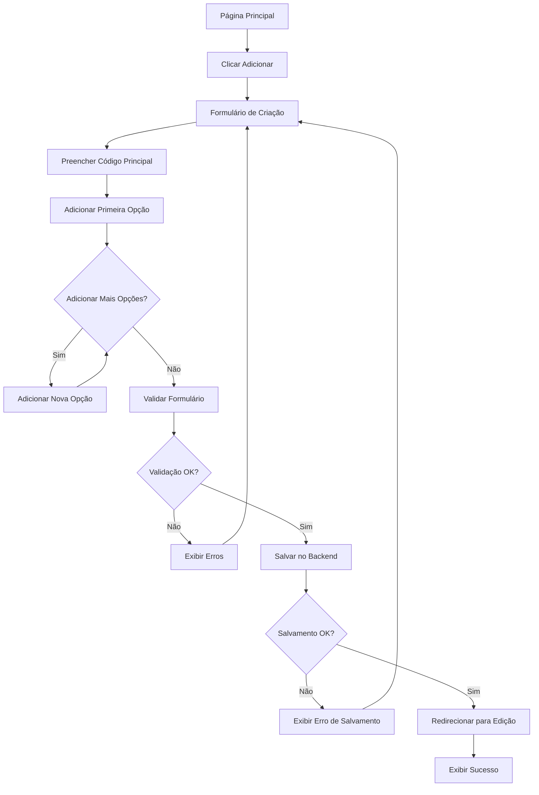
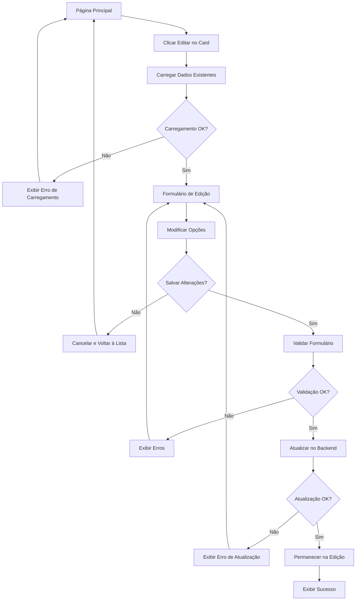
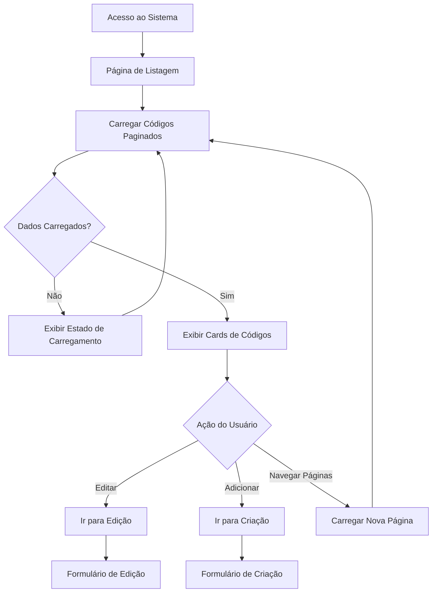

# PRD - Módulo de Parametrizações Base (Options)

## 1. Visão Geral

O módulo de Parametrizações Base é um sistema de configuração que permite gerenciar parâmetros dinâmicos do sistema de licenciamento através de pares chave-valor organizados por códigos principais. Este módulo fornece uma interface administrativa para criar, editar e visualizar configurações que são utilizadas em todo o sistema, como tipos de licenças, status, categorias e outras opções configuráveis.

### Objetivos Principais

* Centralizar a gestão de parâmetros configuráveis do sistema

* Permitir configuração dinâmica sem necessidade de alterações no código

* Suportar múltiplos idiomas através do sistema de locale

* Facilitar a manutenção e organização de opções por categorias

### Valor de Negócio

* Redução do tempo de configuração do sistema

* Flexibilidade para adaptação a diferentes contextos regulatórios

* Facilita a internacionalização e localização do sistema

## 2. Requisitos Funcionais

### 2.1 Gestão de Códigos Principais (ccode)

**RF001 - Criar Código Principal**

* O sistema deve permitir criar um novo código principal único

* O código deve ser obrigatório, alfanumérico e convertido automaticamente para maiúsculas

* Deve validar unicidade do código antes da criação

* Deve exibir mensagem de erro se o código já existir

**RF002 - Validação de Código Principal**

* Códigos seguem padrão UPPER\_CASE com underscores conforme backend

* Códigos não podem ser duplicados no sistema

* Códigos devem ter pelo menos 1 caractere

* Espaços em branco devem ser removidos automaticamente

* Conversão automática para maiúsculas

* Integração com endpoint de verificação: GET /api/v1/options/{ccode}/{ckey}/exists

### 2.2 Gestão de Opções (Pares Chave-Valor)

**RF003 - Gestão de Opções Parametrizadas**

* O sistema integra configurações pré-definidas do backend através de códigos principais (ccode)

* Cada código principal representa uma categoria de configuração (ex: VALIDITY\_UNIT, SECTOR\_TYPE)

* Cada opção deve ter chave (ckey) e valor (cvalue) obrigatórios conforme estrutura OptionRequestDTO

* Suporte a campos opcionais: locale, ordenação, descrição, metadata

* Validação de chaves únicas por combinação ccode+ckey+locale (regra de unicidade do backend)

* Dependência das estruturas de dados definidas no backend (OptionRequestDTO, OptionResponseDTO)

**RF004 - Editar Opções**

* Permitir edição de todas as propriedades das opções

* Manter validação de unicidade de chaves por locale

* Permitir reordenação através do campo sortOrder

* Suporte a ativação/desativação de opções individuais

**RF005 - Remover Opções**

* Permitir remoção de opções individuais

* Validar que pelo menos uma opção permaneça no código

* Confirmação antes da remoção

### 2.3 Funcionalidades de Locale

**RF006 - Suporte Multi-idioma**

* Cada opção pode ter um locale específico (padrão: pt-CV)

* Chaves podem ser duplicadas entre locales diferentes

* Filtros por locale na visualização

### 2.4 Sistema de Ordenação

**RF007 - Ordenação Personalizada**

* Campo sortOrder numérico para definir ordem de exibição

* Valor padrão: 1

* Suporte a números inteiros positivos

* Ordenação automática na listagem

### 2.5 Gestão de Estado

**RF008 - Ativação/Desativação**

* Cada opção pode ser ativada ou desativada

* Opções desativadas não aparecem em consultas de opções ativas

* Estado padrão: ativo (true)

### 2.6 Metadados e Descrições

**RF009 - Campos Descritivos**

* Campo descrição para documentar o propósito da opção

* Campo metadata para armazenar dados estruturados (JSON)

* Validação de JSON válido no campo metadata

* Campos opcionais com valores padrão vazios

### 2.7 Interface de Listagem

**RF010 - Visualização de Códigos**

* Listagem em cards agrupados por código principal

* Exibição do número de itens por código

* Prévia das primeiras 5 opções por código

* Botão de edição direto para cada código

**RF011 - Paginação e Filtros**

* Paginação com 20 itens por página

* Filtro por código específico

* Filtro por status ativo/inativo

* Busca por conteúdo

### 2.8 Formulários

**RF012 - Formulário de Criação**

* Interface para criar novo código com opções

* Validação em tempo real

* Adição dinâmica de múltiplas opções

* Botões de ação: Guardar e Cancelar

**RF013 - Formulário de Edição**

* Carregamento automático dos dados existentes

* Código principal não editável (apenas visualização)

* Edição completa das opções

* Atualização em lote de todas as opções do código

## 3. Requisitos Não-Funcionais

### 3.1 Performance

**RNF001 - Tempo de Resposta**

* Carregamento da listagem: máximo 2 segundos

* Salvamento de formulário: máximo 3 segundos

* Validações em tempo real: máximo 500ms

**RNF002 - Capacidade**

* Suporte a até 1000 códigos principais

* Até 100 opções por código principal

* Paginação eficiente para grandes volumes

### 3.2 Usabilidade

**RNF003 - Interface Responsiva**

* Compatibilidade com dispositivos desktop e tablet

* Layout adaptativo para diferentes resoluções

* Navegação intuitiva entre páginas

**RNF004 - Acessibilidade**

* Suporte a leitores de tela

* Navegação por teclado

* Contraste adequado para deficientes visuais

* Labels descritivos em todos os campos

### 3.3 Confiabilidade

**RNF005 - Validação de Dados**

* Validação client-side e server-side

* Sanitização de inputs

* Prevenção de XSS e injection attacks

**RNF006 - Tratamento de Erros**

* Mensagens de erro claras e específicas

* Recuperação graceful de falhas de rede

* Logs detalhados para debugging

### 3.4 Manutenibilidade

**RNF007 - Código Limpo**

* Separação clara entre componentes, ações e validações

* Documentação inline adequada

* Testes unitários com cobertura mínima de 80%

**RNF008 - Monitoramento**

* Logs de auditoria para todas as operações

* Métricas de uso e performance

* Alertas para falhas críticas

## 4. Fluxos de Trabalho

### 4.1 Fluxo de Criação de Nova Parametrização

### 4.2 Fluxo de Edição de Parametrização Existente

### 4.3 Fluxo de Visualização e Navegação

## 5. Casos de Teste

### 5.1 Testes de Criação

**CT001 - Criar Código Principal Válido**

* **Pré-condição**: Usuário na página de criação

* **Passos**:

  1. Inserir código "TEST\_CODE"
  2. Adicionar opção com chave "key1" e valor "value1"
  3. Clicar em "Guardar"

* **Resultado Esperado**: Código criado com sucesso, redirecionamento para edição

**CT002 - Tentar Criar Código Duplicado**

* **Pré-condição**: Código "EXISTING\_CODE" já existe

* **Passos**:

  1. Inserir código "EXISTING\_CODE"
  2. Adicionar opção válida
  3. Clicar em "Guardar"

* **Resultado Esperado**: Erro "O código principal 'EXISTING\_CODE' já existe"

**CT003 - Criar Código sem Opções**

* **Pré-condição**: Usuário na página de criação

* **Passos**:

  1. Inserir código válido
  2. Remover todas as opções
  3. Clicar em "Guardar"

* **Resultado Esperado**: Erro "É necessário adicionar pelo menos uma opção"

**CT004 - Criar Opção com Chave Duplicada no Mesmo Locale**

* **Pré-condição**: Usuário criando código com múltiplas opções

* **Passos**:

  1. Adicionar opção com chave "key1", locale "pt-CV"
  2. Adicionar segunda opção com chave "key1", locale "pt-CV"
  3. Clicar em "Guardar"

* **Resultado Esperado**: Erro "Chave duplicada para o mesmo locale"

**CT005 - Criar Opções com Chave Duplicada em Locales Diferentes**

* **Pré-condição**: Usuário criando código com múltiplas opções

* **Passos**:

  1. Adicionar opção com chave "key1", locale "pt-CV"
  2. Adicionar segunda opção com chave "key1", locale "en-US"
  3. Clicar em "Guardar"

* **Resultado Esperado**: Código criado com sucesso (chaves iguais em locales diferentes são permitidas)

### 5.2 Testes de Edição

**CT006 - Editar Opção Existente**

* **Pré-condição**: Código "TEST\_CODE" existe com opções

* **Passos**:

  1. Acessar edição do código
  2. Modificar valor de uma opção existente
  3. Clicar em "Guardar"

* **Resultado Esperado**: Opção atualizada com sucesso

**CT007 - Tentar Editar Código Principal**

* **Pré-condição**: Usuário na página de edição

* **Passos**:

  1. Tentar modificar o campo código principal

* **Resultado Esperado**: Campo deve estar desabilitado/somente leitura

**CT008 - Remover Todas as Opções na Edição**

* **Pré-condição**: Código com múltiplas opções

* **Passos**:

  1. Remover todas as opções do código
  2. Clicar em "Guardar"

* **Resultado Esperado**: Erro "É necessário adicionar pelo menos uma opção"

### 5.3 Testes de Validação

**CT009 - Validar Campo Código Obrigatório**

* **Pré-condição**: Usuário na página de criação

* **Passos**:

  1. Deixar campo código vazio
  2. Tentar salvar

* **Resultado Esperado**: Erro "Código é obrigatório"

**CT010 - Validar Campos Chave e Valor Obrigatórios**

* **Pré-condição**: Usuário adicionando nova opção

* **Passos**:

  1. Deixar chave ou valor vazio
  2. Tentar salvar

* **Resultado Esperado**: Erro "Chave é obrigatória" ou "Valor é obrigatório"

**CT011 - Validar Ordenação Numérica**

* **Pré-condição**: Usuário editando opção

* **Passos**:

  1. Inserir valor não numérico no campo ordenação
  2. Tentar salvar

* **Resultado Esperado**: Erro "Ordenação inválida" ou conversão automática para número

**CT012 - Validar Metadata JSON**

* **Pré-condição**: Usuário editando opção com metadata

* **Passos**:

  1. Inserir JSON inválido no campo metadata
  2. Tentar salvar

* **Resultado Esperado**: Tratamento graceful - aceitar como string ou validar JSON

### 5.4 Testes de Interface

**CT013 - Navegação entre Páginas**

* **Pré-condição**: Usuário na página principal

* **Passos**:

  1. Clicar em "Adicionar"
  2. Verificar redirecionamento para criação
  3. Clicar em "Cancelar"
  4. Verificar retorno à página principal

* **Resultado Esperado**: Navegação funciona corretamente

**CT014 - Paginação da Listagem**

* **Pré-condição**: Sistema com mais de 20 códigos

* **Passos**:

  1. Acessar página principal
  2. Verificar exibição de 20 itens
  3. Navegar para próxima página

* **Resultado Esperado**: Paginação funciona corretamente

**CT015 - Responsividade Mobile**

* **Pré-condição**: Acesso via dispositivo móvel ou simulação

* **Passos**:

  1. Acessar todas as páginas do módulo
  2. Verificar layout e usabilidade

* **Resultado Esperado**: Interface adaptada para mobile

### 5.5 Testes de Performance

**CT016 - Carregamento com Grande Volume**

* **Pré-condição**: Sistema com 500+ códigos

* **Passos**:

  1. Acessar página principal
  2. Medir tempo de carregamento

* **Resultado Esperado**: Carregamento em menos de 2 segundos

**CT017 - Salvamento de Código com Muitas Opções**

* **Pré-condição**: Criar código com 50+ opções

* **Passos**:

  1. Preencher formulário com muitas opções
  2. Salvar e medir tempo

* **Resultado Esperado**: Salvamento em menos de 3 segundos

### 5.6 Testes de Erro e Recuperação

**CT018 - Falha de Rede Durante Salvamento**

* **Pré-condição**: Simular falha de rede

* **Passos**:

  1. Preencher formulário
  2. Desconectar rede
  3. Tentar salvar

* **Resultado Esperado**: Mensagem de erro clara, dados preservados no formulário

**CT019 - Timeout de Sessão**

* **Pré-condição**: Sessão expirada

* **Passos**:

  1. Tentar realizar operação com sessão expirada

* **Resultado Esperado**: Redirecionamento para login ou renovação de sessão

**CT020 - Dados Corrompidos no Carregamento**

* **Pré-condição**: Dados inconsistentes no backend

* **Passos**:

  1. Tentar carregar código com dados corrompidos

* **Resultado Esperado**: Tratamento graceful, mensagem de erro apropriada

## 6. Categorias de Opções Padrão

O sistema integra as seguintes categorias de configuração pré-definidas no backend:

### 6.1 VALIDITY\_UNIT (Unidades de Validade)

* **DAYS**: "Dias" - Unidade de validade em dias

* **MONTHS**: "Meses" - Unidade de validade em meses

* **YEARS**: "Anos" - Unidade de validade em anos

### 6.2 SECTOR\_TYPE (Tipos de Setor)

* **PRIMARY**: "Primário" - Setor primário

* **SECONDARY**: "Secundário" - Setor secundário

* **TERCEARY**: "Terceário" - Setor terceário

### 6.3 LICENSING\_MODEL (Modelos de Licenciamento)

* **PERMANENT**: "Definitivo" - Modelo definitivo

* **TEMPORARY**: "Provisório" - Modelo provisório

* **HYBRID**: "Provisório + Definitiva" - Provisório + Definitiva

### 6.4 CURRENCY\_CODE (Códigos de Moeda)

* **CVE**: "Escudo Cabo-verdiano" - Moeda nacional

* **EUR**: "Euro" - Moeda europeia

* **USD**: "Dólar Americano" - Moeda internacional

## 7. Integração com Backend

### 7.1 Estruturas de Dados

O módulo frontend consome as seguintes estruturas definidas no backend:

**OptionRequestDTO**

* ccode: Código da categoria (obrigatório, UPPER\_CASE)

* ckey: Chave da opção (obrigatório, UPPER\_CASE)

* cvalue: Valor da opção (obrigatório)

* locale: Localização (opcional, padrão: pt\_CV)

* sort\_order: Ordem de classificação (opcional, >= 0)

* metadata: Metadados adicionais (opcional, JSON)

**OptionResponseDTO**

* id: Identificador único

* ccode, ckey, cvalue, locale, sort\_order: Campos de resposta

**WrapperListOptionsDTO**

* Estrutura de paginação com pageNumber, pageSize, totalElements

* Lista de OptionResponseDTO no campo content

### 7.2 Endpoints de API

* **GET /api/v1/options**: Listagem paginada de opções

* **GET /api/v1/options/{ccode}**: Opções por código de categoria

* **POST /api/v1/options**: Criação de nova opção

* **PUT /api/v1/options/{id}**: Atualização de opção existente

* **DELETE /api/v1/options/{id}**: Remoção de opção

* **GET /api/v1/options/{ccode}/{ckey}/exists**: Verificação de existência

### 7.3 Regras de Validação Backend

* Combinação ccode + ckey + locale deve ser única

* Campos ccode e ckey devem seguir padrão UPPER\_CASE

* Campo sort\_order deve ser >= 0 se informado

* Campo locale deve seguir padrão ISO (ex: pt\_CV, en\_US)

* Opções em uso não podem ser desativadas

## 8. Critérios de Aceitação

### 6.1 Critérios Funcionais

**CA001 - Gestão Completa de Códigos**

* ✅ Usuário pode criar novos códigos principais únicos

* ✅ Usuário pode editar códigos existentes (exceto o código principal)

* ✅ Usuário pode visualizar todos os códigos em formato de lista paginada

* ✅ Sistema valida unicidade de códigos principais

* ✅ Sistema converte códigos para maiúsculas automaticamente

**CA002 - Gestão Completa de Opções**

* ✅ Usuário pode adicionar múltiplas opções por código

* ✅ Usuário pode editar todas as propriedades das opções

* ✅ Usuário pode remover opções individuais

* ✅ Sistema valida que pelo menos uma opção existe por código

* ✅ Sistema valida unicidade de chaves por locale

**CA003 - Validações Robustas**

* ✅ Todos os campos obrigatórios são validados

* ✅ Validações ocorrem tanto no client quanto no server

* ✅ Mensagens de erro são claras e específicas

* ✅ Validação de tipos de dados (números, JSON, etc.)

* ✅ Sanitização adequada de inputs

**CA004 - Interface Intuitiva**

* ✅ Navegação clara entre páginas

* ✅ Formulários responsivos e acessíveis

* ✅ Feedback visual para ações do usuário

* ✅ Estados de carregamento apropriados

* ✅ Confirmações para ações destrutivas

### 6.2 Critérios de Performance

**CA005 - Tempos de Resposta Adequados**

* ✅ Listagem carrega em menos de 2 segundos

* ✅ Salvamento completa em menos de 3 segundos

* ✅ Validações respondem em menos de 500ms

* ✅ Interface permanece responsiva durante operações

**CA006 - Escalabilidade**

* ✅ Sistema suporta até 1000 códigos principais

* ✅ Sistema suporta até 100 opções por código

* ✅ Paginação eficiente para grandes volumes

* ✅ Busca e filtros performáticos

### 6.3 Critérios de Qualidade

**CA007 - Confiabilidade**

* ✅ Sistema recupera graciosamente de falhas

* ✅ Dados são preservados durante erros de rede

* ✅ Validações previnem corrupção de dados

* ✅ Logs adequados para debugging

**CA008 - Usabilidade**

* ✅ Interface funciona em desktop e tablet

* ✅ Suporte a navegação por teclado

* ✅ Compatibilidade com leitores de tela

* ✅ Contraste adequado para acessibilidade

**CA009 - Manutenibilidade**

* ✅ Código bem estruturado e documentado

* ✅ Separação clara de responsabilidades

* ✅ Testes unitários com cobertura adequada

* ✅ Componentes reutilizáveis

### 6.4 Critérios de Segurança

**CA010 - Proteção de Dados**

* ✅ Validação e sanitização de todos os inputs

* ✅ Prevenção de ataques XSS e injection

* ✅ Autenticação adequada para acesso

* ✅ Logs de auditoria para operações críticas

### 6.5 Critérios de Integração

**CA011 - Compatibilidade com Sistema**

* ✅ Integração adequada com framework IGRP

* ✅ Uso correto dos componentes de design system

* ✅ Compatibilidade com APIs existentes

* ✅ Seguimento dos padrões arquiteturais do projeto

***

**Documento criado em**: 2025
**Versão**: 1.0
**Responsável**: Equipe de Desenvolvimento
**Aprovação**: Pendente
