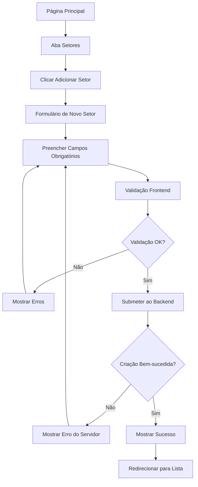
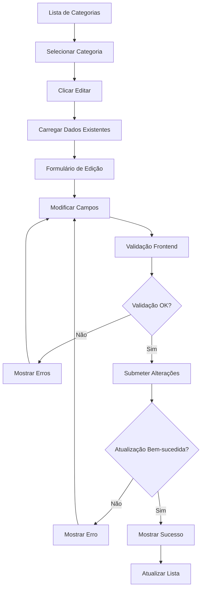
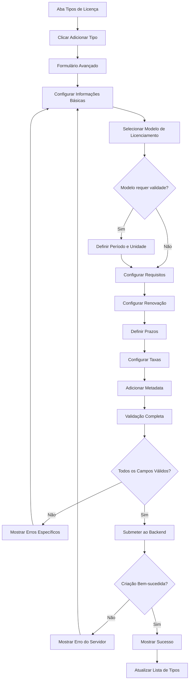
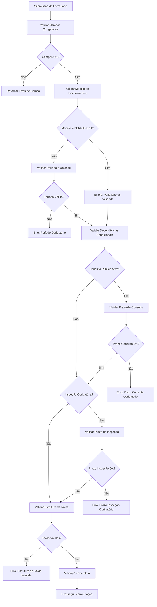
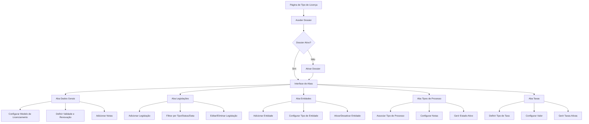

# PRD - Módulo de Parametrização do Sistema de Licenciamento

## 1. Visão Geral

O Módulo de Parametrização é um componente fundamental do sistema de licenciamento que permite a configuração e gestão das entidades base necessárias para o funcionamento do sistema. Este módulo oferece uma interface unificada para administrar Setores Económicos, Categorias de Atividade e Tipos de Licença, proporcionando flexibilidade na configuração do sistema conforme as necessidades regulamentares.

O módulo resolve o problema da necessidade de configuração dinâmica das estruturas de licenciamento, permitindo que administradores do sistema configurem novos setores, categorias e tipos de licença sem necessidade de alterações no código. O público-alvo são administradores do sistema e gestores de licenciamento que precisam de configurar e manter as parametrizações base.

O valor de negócio reside na capacidade de adaptação rápida a mudanças regulamentares e na padronização da gestão de configurações do sistema.

## 2. Requisitos Funcionais

### 2.1 Papéis de Utilizador

| Papel | Método de Registo | Permissões Principais |
|-------|-------------------|----------------------|
| Administrador do Sistema | Atribuição interna | Acesso completo a todas as funcionalidades de parametrização |
| Gestor de Licenciamento | Convite por administrador | Pode visualizar e editar parametrizações dentro do seu âmbito |
| Utilizador de Consulta | Atribuição por gestor | Apenas visualização das parametrizações |

### 2.2 Módulos Funcionais

O módulo de parametrização consiste nas seguintes páginas principais:

1. **Página Principal de Parametrização**: interface com abas, navegação entre módulos, ações contextuais
2. **Gestão de Setores**: listagem, criação, edição e visualização de setores económicos
3. **Gestão de Categorias**: listagem, criação, edição e gestão hierárquica de categorias
4. **Gestão de Tipos de Licença**: configuração completa de tipos de licença com parâmetros avançados incluindo modelos de licenciamento, períodos de validade, requisitos regulamentares, estruturas de taxas e metadata personalizada

### 2.3 Detalhes das Páginas

#### 2.3.1 Especificações Detalhadas do Módulo de Setores

**Campos do Formulário de Setores:**

| Campo | Tipo | Obrigatório | Validação | Descrição |
|-------|------|-------------|-----------|----------|
| Nome | Texto | Sim | 3-100 caracteres, único globalmente | Nome descritivo do setor económico |
| Código | Texto | Sim | 3-20 caracteres alfanuméricos, único globalmente | Identificador único do setor |
| Tipo de Setor | Seleção | Sim | PRIMARY, SECONDARY, TERTIARY | Classificação económica do setor |
| Ordenação | Número | Não | >= 0 | Ordem de apresentação nas listas |
| Ativo | Boolean | Não | Default: true | Estado de ativação do setor |
| Descrição | Texto Longo | Não | Máximo 500 caracteres | Descrição detalhada do setor |

**Regras de Negócio para Setores:**

1. **Classificação por Tipo:**
   - PRIMARY: Setores de atividade primária (agricultura, pesca, mineração)
   - SECONDARY: Setores de atividade secundária (indústria, construção)
   - TERTIARY: Setores de atividade terciária (serviços, comércio)

2. **Validações Específicas:**
   - Código único em todo o sistema
   - Nome único globalmente
   - Não pode ser eliminado se tiver categorias associadas
   - Desativação em cascata afeta categorias e tipos de licença

3. **Relacionamentos:**
   - Um setor pode conter múltiplas categorias
   - Setor inativo torna todas as categorias associadas inacessíveis
   - Ordenação determina sequência de apresentação

**Casos de Uso Práticos para Setores:**
- Configuração de setores económicos nacionais
- Organização hierárquica de atividades económicas
- Filtros e agrupamentos em relatórios
- Base para estruturação de categorias de atividade

#### 2.3.2 Especificações Detalhadas do Módulo de Categorias

**Campos do Formulário de Categorias:**

| Campo | Tipo | Obrigatório | Validação | Descrição |
|-------|------|-------------|-----------|----------|
| Nome | Texto | Sim | 3-100 caracteres, único por setor | Nome descritivo da categoria |
| Código | Texto | Sim | 3-20 caracteres alfanuméricos, único globalmente | Identificador único da categoria |
| Setor | Seleção | Sim | Deve existir e estar ativo | Setor ao qual a categoria pertence |
| Categoria Pai | Seleção | Não | Deve pertencer ao mesmo setor | Categoria superior na hierarquia |
| Ordenação | Número | Não | >= 0 | Ordem de apresentação nas listas |
| Ativo | Boolean | Não | Default: true | Estado de ativação da categoria |
| Descrição | Texto Longo | Não | Máximo 500 caracteres | Descrição detalhada da categoria |
| Metadata | JSON | Não | JSON válido | Configurações adicionais personalizáveis |

**Regras de Negócio para Categorias:**

1. **Estrutura Hierárquica:**
   - Suporte para múltiplos níveis de hierarquia
   - Categoria pai deve pertencer ao mesmo setor
   - Prevenção de referências circulares
   - Validação de integridade na alteração de hierarquia

2. **Validações Específicas:**
   - Código único globalmente
   - Nome único dentro do mesmo setor
   - Categoria pai não pode ser a própria categoria
   - Não pode ser eliminada se tiver tipos de licença associados
   - Não pode ser eliminada se tiver categorias filhas

3. **Metadata Personalizada:**
   - Configurações específicas por categoria
   - Parâmetros adicionais para tipos de licença
   - Informações regulamentares específicas
   - Dados de integração com sistemas externos

4. **Relacionamentos:**
   - Pertence obrigatoriamente a um setor
   - Pode ter uma categoria pai (opcional)
   - Pode ter múltiplas categorias filhas
   - Pode conter múltiplos tipos de licença

**Casos de Uso Práticos para Categorias:**
- Organização hierárquica de atividades por setor
- Agrupamento de tipos de licença relacionados
- Configuração de regras específicas por categoria
- Estruturação de processos de licenciamento
- Base para relatórios e estatísticas

**Integridade Referencial:**
- Alteração de setor requer validação de dependências
- Desativação em cascata afeta tipos de licença
- Eliminação requer verificação de categorias filhas
- Manutenção automática de hierarquia

#### 2.3.3 Especificações Detalhadas do Módulo de Tipos de Licença

**Campos do Formulário de Tipos de Licença:**

| Campo | Tipo | Obrigatório | Validação | Descrição |
|-------|------|-------------|-----------|----------|
| Nome | Texto | Sim | 3-100 caracteres, único por categoria | Nome descritivo do tipo de licença |
| Código | Texto | Sim | 3-20 caracteres alfanuméricos, único globalmente | Identificador único do tipo |
| Categoria | Seleção | Sim | Deve existir e estar ativa | Categoria à qual o tipo pertence |
| Modelo de Licenciamento | Seleção | Sim | PERMANENT, TEMPORARY, RENEWABLE | Define o comportamento da licença |
| Período de Validade | Número | Condicional | > 0 quando modelo não é PERMANENT | Duração da validade |
| Unidade de Validade | Seleção | Condicional | DAYS, MONTHS, YEARS | Unidade do período de validade |
| Renovação Automática | Boolean | Não | - | Se permite renovação automática |
| Inspeção Obrigatória | Boolean | Não | - | Se requer inspeção antes da emissão |
| Consulta Pública | Boolean | Não | - | Se requer período de consulta pública |
| Prazo de Processamento | Número | Não | > 0 | Dias úteis para processamento |
| Prazo de Consulta Pública | Número | Condicional | > 0 quando consulta pública ativa | Dias para consulta pública |
| Prazo de Inspeção | Número | Condicional | > 0 quando inspeção obrigatória | Dias para realizar inspeção |
| Taxas | Array | Não | Estrutura válida de taxas | Configuração de taxas aplicáveis |
| Ordenação | Número | Não | >= 0 | Ordem de apresentação nas listas |
| Ativo | Boolean | Não | Default: true | Estado de ativação do tipo |
| Descrição | Texto Longo | Não | Máximo 500 caracteres | Descrição detalhada do tipo |
| Metadata | JSON | Não | JSON válido | Configurações adicionais personalizáveis |

**Regras de Negócio Específicas:**

1. **Modelo de Licenciamento:**
   - **PROVISÓRIO (TEMPORARY)**: Licenças com validade fixa e possibilidade de renovação
     - Campos obrigatórios: Período de validade, Unidade de validade, Prazo máximo, Renovável
     - Lógica condicional: "Renovável" ativado → habilita "Renovação Automática"
     - "Renovável" desativado → desabilita "Renovação Automática"
   - **DEFINITIVO (PERMANENT)**: Licenças sem data de expiração
     - Campos desabilitados: Período de validade, Unidade de validade, Prazo máximo, Renovável, Renovação automática
     - Todos os campos relacionados à validade ficam inativos
     - Modelo permanente não permite renovação
   - **HÍBRIDO (HYBRID)**: Licenças flexíveis com configuração personalizada
     - Campos obrigatórios: Período de validade, Unidade de validade, Prazo máximo
     - Lógica de renovação: "Renovável" ativado → habilita "Renovação Automática"
     - Flexibilidade para configurar renovação conforme necessário

2. **Validação de Períodos:**
   - Período de validade obrigatório para modelos TEMPORARY e RENEWABLE
   - Unidade de validade deve ser compatível com o período
   - Prazos de processamento não podem exceder o período de validade

3. **Dependências Condicionais:**
   - Consulta pública requer prazo específico
   - Inspeção obrigatória requer prazo de inspeção
   - Renovação automática aplicável aos modelos PROVISÓRIO (TEMPORARY) e HÍBRIDO (HYBRID)
   - Campo "Renovação Automática" habilitado apenas quando "Renovável" está ativado
   - Modelo DEFINITIVO (PERMANENT) não possui opções de renovação

4. **Estrutura de Taxas:**
   - Pode incluir taxa base, taxas adicionais e descontos
   - Cada taxa deve ter código, descrição e valor
   - Suporte para taxas fixas e percentuais

5. **Relacionamentos:**
   - Tipo deve pertencer a uma categoria ativa
   - Categoria deve pertencer a um setor ativo
   - Não pode ser eliminado se existirem licenças associadas

**Validações Específicas:**

- **Unicidade:** Código único globalmente, nome único por categoria
- **Integridade:** Verificação de dependências antes de eliminação
- **Consistência:** Validação de combinações de campos
- **Formato:** Validação de estruturas JSON para metadata e taxas

### Controles Condicionais do Formulário

**Switch de Renovação Automática:**

- O campo 'Renovação Automática' deve ser controlado pelo switch 'Renovável'
- Quando 'Renovável' está desativado, 'Renovação Automática' deve ficar desabilitado
- Exibir texto de ajuda: 'Disponível apenas quando renovação está habilitada' quando desabilitado
- Validação: Renovação automática pode ser ativada para modelos PROVISÓRIO (TEMPORARY) e HÍBRIDO (HYBRID) quando 'Renovável' está ativo
- Modelo DEFINITIVO (PERMANENT): Todos os campos de renovação ficam desabilitados

**Controle de Prazo Máximo:**

- O campo 'Prazo Máximo (dias)' deve ser obrigatório quando:
  - 'Requer Consulta Pública' estiver ativado, OU
  - 'Requer Inspeção' estiver ativado
- Validação: O prazo máximo não pode exceder o período de validade da licença

**Exibição Condicional de Taxas:**

- Os campos relacionados a taxas devem ser exibidos apenas quando o switch 'Possui Taxas' estiver ativado:
  - Valor Base (campo obrigatório quando ativo)
  - Moeda (seleção carregada dinamicamente via API CURRENCY)
  - Campos adicionais de configuração de taxas
- Quando 'Possui Taxas' está desativado, ocultar todos os campos de taxa
- Validação: Se 'Possui Taxas' estiver ativado, 'Valor Base' e 'Moeda' são obrigatórios
- Carregamento dinâmico de moedas via API das opções CURRENCY

### Regras de Validação Adicionais

**Dependências Condicionais Atualizadas:**

- Renovação automática requer modelo PROVISÓRIO (TEMPORARY) ou HÍBRIDO (HYBRID) E switch 'Renovável' ativado
- Modelo DEFINITIVO (PERMANENT): Desabilita automaticamente todos os campos de validade e renovação
- Consulta pública requer prazo específico no campo 'Prazo Máximo'
- Inspeção obrigatória requer prazo específico no campo 'Prazo Máximo'
- Configuração de taxas requer switch 'Possui Taxas' ativado com 'Valor Base' e 'Moeda' obrigatórios

**Casos de Teste Adicionais:**

**CT027 - Controle de Renovação Automática por Modelo e Switch**

- Selecionar modelo DEFINITIVO (PERMANENT)
- Verificar que todos os campos de validade e renovação ficam desabilitados
- Selecionar modelo PROVISÓRIO (TEMPORARY) ou HÍBRIDO (HYBRID)
- Desativar switch 'Renovável'
- Verificar que 'Renovação Automática' fica desabilitado
- Tentar ativar 'Renovação Automática'
- Resultado Esperado: Campo permanece desabilitado com texto de ajuda 'Disponível apenas quando renovação está habilitada'

**CT028 - Sistema de Taxas Aprimorado**

- Desativar switch 'Possui Taxas'
- Verificar que campos 'Valor Base' e 'Moeda' ficam ocultos
- Ativar switch 'Possui Taxas'
- Verificar que campos 'Valor Base' e 'Moeda' ficam visíveis
- Verificar carregamento dinâmico de moedas via API CURRENCY
- Tentar guardar sem preencher 'Valor Base' ou 'Moeda'
- Resultado Esperado: Erro de validação para campos obrigatórios

**CT029 - Validação Integrada de Modelos de Licenciamento**

- Selecionar modelo PROVISÓRIO (TEMPORARY)
- Verificar campos obrigatórios: Período de validade, Unidade de validade, Prazo máximo, Renovável
- Ativar 'Renovável' e verificar habilitação de 'Renovação Automática'
- Selecionar modelo HÍBRIDO (HYBRID)
- Verificar campos obrigatórios: Período de validade, Unidade de validade, Prazo máximo
- Ativar 'Requer Consulta Pública' ou 'Requer Inspeção' e deixar 'Prazo Máximo' vazio
- Tentar guardar
- Resultado Esperado: Erro 'Prazo máximo obrigatório quando consulta pública ou inspeção estão ativas'

#### 2.3.4 Especificações Detalhadas da Funcionalidade de Dossier

A funcionalidade de Dossier é uma extensão avançada dos Tipos de Licença que permite a gestão completa e detalhada de todos os aspetos relacionados com um tipo específico de licença. Esta funcionalidade organiza-se em cinco áreas principais através de uma interface com abas.

**Visão Geral do Dossier:**

O Dossier é uma funcionalidade opcional que pode ser ativada para cada tipo de licença individualmente. Quando ativo, proporciona uma interface completa para gerir:

1. **Dados Gerais** - Configurações base do tipo de licença
2. **Legislações** - Legislação aplicável e documentos regulamentares
3. **Entidades** - Entidades envolvidas no processo de licenciamento
4. **Tipos de Processo** - Associações com diferentes tipos de processo
5. **Taxas** - Estrutura detalhada de taxas aplicáveis

**Ativação e Configuração:**

| Funcionalidade | Descrição | Comportamento |
|----------------|-----------|---------------|
| Ativar/Desativar Dossier | Controlo principal da funcionalidade | Switch que habilita/desabilita toda a interface de dossier |
| Estado Persistente | Manutenção de dados | Dados do dossier são preservados mesmo quando desativado |
| Interface Condicional | Apresentação baseada no estado | Interface de abas só aparece quando dossier está ativo |

**Aba 1: Dados Gerais**

| Campo | Tipo | Obrigatório | Validação | Descrição |
|-------|------|-------------|-----------|----------|
| Modelo de Licenciamento | Seleção | Não | Valores pré-definidos via API | Modelo específico para este tipo |
| Valor de Validade | Número | Não | >= 0 | Período de validade específico |
| Unidade de Validade | Seleção | Não | Dias/Meses/Anos | Unidade do período de validade |
| Permitir Renovação | Boolean | Não | - | Se permite renovação da licença |
| Dias para Renovação | Número | Condicional | >= 0 quando renovação ativa | Prazo para renovação |
| Notas | Texto Longo | Não | - | Observações gerais |

**Aba 2: Legislações**

| Campo | Tipo | Obrigatório | Validação | Descrição |
|-------|------|-------------|-----------|----------|
| Nome | Texto | Sim | 1-200 caracteres | Nome da legislação |
| Tipo de Legislação | Seleção | Sim | Valores via API de opções | Classificação da legislação |
| Data de Publicação | Data | Sim | Formato válido | Data de publicação oficial |
| Boletim da República | Texto | Não | - | Referência do boletim |
| Descrição | Texto Longo | Não | - | Descrição detalhada |
| URL do Documento | URL | Não | URL válida | Link para documento oficial |
| Status | Seleção | Sim | ACTIVE/INACTIVE | Estado da legislação |

**Funcionalidades da Aba Legislações:**
- Filtros avançados (nome, tipo, status, período de datas)
- Listagem com paginação
- Criação, edição e eliminação de legislações
- Validação de URLs de documentos
- Gestão de status ativo/inativo

**Aba 3: Entidades**

| Campo | Tipo | Obrigatório | Validação | Descrição |
|-------|------|-------------|-----------|----------|
| Tipo de Entidade | Seleção | Sim | Valores via API de opções | Classificação da entidade |
| Nome | Texto | Sim | 1-200 caracteres | Nome da entidade |
| Notas | Texto Longo | Não | - | Observações sobre a entidade |
| Ativo | Boolean | Não | Default: true | Estado de ativação |

**Funcionalidades da Aba Entidades:**
- Listagem de entidades associadas
- Criação e edição inline
- Controlo de estado ativo/inativo
- Eliminação com confirmação

**Aba 4: Tipos de Processo**

| Campo | Tipo | Obrigatório | Validação | Descrição |
|-------|------|-------------|-----------|----------|
| Tipo de Processo | Seleção | Sim | Valores via API de opções | Tipo de processo associado |
| Notas | Texto Longo | Não | - | Observações sobre a associação |
| Ativo | Boolean | Não | Default: true | Estado de ativação |

**Funcionalidades da Aba Tipos de Processo:**
- Associação de múltiplos tipos de processo
- Gestão de notas específicas por associação
- Controlo individual de estado ativo
- Eliminação de associações

**Aba 5: Taxas**

| Campo | Tipo | Obrigatório | Validação | Descrição |
|-------|------|-------------|-----------|----------|
| Tipo de Taxa | Seleção | Sim | Valores via API de opções | Classificação da taxa |
| Valor | Número | Sim | >= 0 | Montante da taxa |
| Notas | Texto Longo | Não | - | Observações sobre a taxa |
| Ativo | Boolean | Não | Default: true | Estado de ativação |

**Funcionalidades da Aba Taxas:**
- Configuração de múltiplas taxas
- Definição de valores monetários
- Gestão de estado ativo/inativo
- Notas explicativas por taxa

**Regras de Negócio do Dossier:**

1. **Persistência de Dados:**
   - Todos os dados do dossier são armazenados na metadata do tipo de licença
   - Desativar o dossier não elimina os dados, apenas oculta a interface
   - Reativar o dossier restaura todos os dados anteriores

2. **Validações Transversais:**
   - Todas as abas partilham validações comuns de campos obrigatórios
   - URLs devem ser válidas quando preenchidas
   - Datas devem estar em formato correto
   - Valores numéricos devem ser não-negativos

3. **Integração com APIs:**
   - Opções de seleção carregadas dinamicamente via API de opções
   - Códigos de opções: VALIDITY_UNIT, LICENSING_MODEL, TPLEG, LEGISLATION_STATUS, ENTITY_TYPE, PROCESS_TYPE, FEE_TYPE
   - Sincronização automática com alterações nas opções

4. **Interface e Usabilidade:**
   - Navegação por abas com estado persistente
   - Formulários inline para criação/edição
   - Confirmações para operações de eliminação
   - Feedback visual para operações de gravação
   - Filtros e pesquisa na aba de legislações

**Casos de Uso do Dossier:**

1. **Configuração Completa de Tipo de Licença:**
   - Definir todos os parâmetros específicos
   - Associar legislação aplicável
   - Configurar entidades envolvidas
   - Estabelecer estrutura de taxas

2. **Gestão Regulamentar:**
   - Manter atualizada a legislação aplicável
   - Gerir alterações de entidades competentes
   - Atualizar estruturas de taxas
   - Documentar alterações regulamentares

3. **Suporte ao Processo de Licenciamento:**
   - Fornecer informação completa para emissão de licenças
   - Suportar cálculo automático de taxas
   - Identificar entidades envolvidas no processo
   - Referenciar legislação aplicável

**Integração com Sistema de Licenciamento:**

O dossier serve como fonte de informação para:
- Processos de emissão de licenças
- Cálculo automático de taxas
- Identificação de entidades competentes
- Referenciação de legislação aplicável
- Validação de requisitos regulamentares

| Nome da Página | Nome do Módulo | Descrição da Funcionalidade |
|----------------|----------------|-----------------------------|
| Página Principal | Interface com Abas | Navegação entre Setores, Categorias e Tipos de Licença. Ações contextuais por aba ativa |
| Gestão de Setores | Lista de Setores | Visualizar, filtrar, ordenar setores. Criar novo setor, editar existente |
| Gestão de Setores | Formulário de Setor | Criar/editar setor com campos: nome, código, tipo (primário/secundário/terciário), descrição, ordenação, estado ativo |
| Gestão de Categorias | Lista de Categorias | Visualizar categorias por setor, estrutura hierárquica, filtros, ordenação |
| Gestão de Categorias | Formulário de Categoria | Criar/editar categoria com campos: nome, código, setor, categoria pai, descrição, ordenação, estado ativo, metadata |
| Gestão de Tipos de Licença | Lista de Tipos | Visualizar tipos de licença por categoria, filtros avançados, configurações |
| Gestão de Tipos de Licença | Formulário de Tipo | Configuração completa: nome, código, categoria, modelo de licenciamento, período de validade, unidade de validade, renovação automática, inspeção obrigatória, consulta pública, prazos de processamento, estrutura de taxas, ordenação, estado ativo, descrição, metadata personalizada |
| Gestão de Tipos de Licença | Dossier de Tipo | Interface avançada para gestão completa de dossier: dados gerais, legislações, entidades, tipos de processo e taxas associadas |

## 3. Requisitos Não-Funcionais

### 3.1 Performance
- Tempo de carregamento das listas: máximo 2 segundos
- Tempo de resposta para operações CRUD: máximo 1 segundo
- Suporte para até 10.000 registos por entidade sem degradação de performance
- Paginação automática para listas com mais de 100 itens

### 3.2 Usabilidade
- Interface responsiva compatível com desktop e tablet
- Navegação intuitiva com breadcrumbs e indicadores visuais
- Validação em tempo real nos formulários
- Mensagens de erro claras e acionáveis
- Suporte para atalhos de teclado nas operações principais

### 3.3 Confiabilidade
- Validação de dados no frontend e backend
- Prevenção de duplicação de códigos únicos
- Backup automático antes de operações de edição
- Rollback automático em caso de falha na operação
- Logs de auditoria para todas as operações

### 3.4 Manutenibilidade
- Código gerado automaticamente pelo iGRP Studio
- Schemas de validação centralizados
- Separação clara entre lógica de negócio e apresentação
- Documentação automática das APIs
- Testes automatizados para validações críticas

## 4. Fluxos de Trabalho

### 4.1 Fluxo de Criação de Setor



### 4.2 Fluxo de Edição de Categoria



### 4.3 Fluxo de Configuração de Tipo de Licença



### 4.4 Fluxo de Validação de Dependências



### 4.5 Fluxo de Gestão de Dossier para Tipos de Licença



## 5. Casos de Teste

### 5.1 Casos de Teste para Setores

| ID | Cenário | Dados de Entrada | Resultado Esperado |
|----|---------|-----------------|------------------|
| CT-SET-001 | Criar setor válido | Nome: "Agricultura", Código: "AGR", Tipo: "PRIMARIO" | Setor criado com sucesso |
| CT-SET-002 | Criar setor com código duplicado | Nome: "Teste", Código: "AGR" (existente) | Erro de validação |
| CT-SET-003 | Editar setor existente | Alterar nome para "Agricultura e Pecuária" | Setor atualizado com sucesso |
| CT-SET-004 | Desativar setor | Setor ativo → Inativo | Status alterado, relacionamentos preservados |
| CT-SET-005 | Validar ordenação | Definir ordem: 1, 2, 3 | Setores ordenados corretamente na listagem |
| CT-SET-006 | Validar campos obrigatórios | Nome vazio ou código vazio | Erro de validação apresentado |
| CT-SET-007 | Testar descrição longa | Descrição com 500 caracteres | Descrição aceite e armazenada |
| CT-SET-008 | Filtrar por tipo | Filtro: "PRIMARIO" | Apenas setores primários apresentados |

### 5.2 Casos de Teste para Categorias

| ID | Cenário | Dados de Entrada | Resultado Esperado |
|----|---------|-----------------|------------------|
| CT-CAT-001 | Criar categoria raiz | Nome: "Licenças Ambientais", Pai: null | Categoria criada no nível raiz |
| CT-CAT-002 | Criar subcategoria | Nome: "Impacto Ambiental", Pai: "Licenças Ambientais" | Subcategoria criada corretamente |
| CT-CAT-003 | Validar hierarquia | Criar 3 níveis de categorias | Estrutura hierárquica mantida |
| CT-CAT-004 | Eliminar categoria com filhos | Categoria com subcategorias | Erro - não permite eliminação |
| CT-CAT-005 | Mover categoria na hierarquia | Alterar categoria pai | Categoria movida, hierarquia atualizada |
| CT-CAT-006 | Validar referência circular | Definir pai como próprio filho | Erro de validação impedindo ciclo |
| CT-CAT-007 | Testar metadata personalizada | Adicionar propriedades específicas | Metadata armazenada e recuperada |
| CT-CAT-008 | Ordenação dentro do nível | Definir ordem entre categorias irmãs | Ordenação respeitada na apresentação |

### 5.3 Casos de Teste para Tipos de Licença

| ID | Cenário | Dados de Entrada | Resultado Esperado |
|----|---------|-----------------|------------------|
| CT-TL-001 | Criar tipo básico | Nome, código, categoria, setor | Tipo criado com campos obrigatórios |
| CT-TL-002 | Ativar dossier | Tipo existente + ativar dossier | Interface de dossier disponível |
| CT-TL-003 | Configurar dados gerais | Modelo, validade, renovação | Configurações salvas na metadata |
| CT-TL-004 | Adicionar legislação | Nome, tipo, data, status | Legislação associada ao tipo |
| CT-TL-005 | Gerir entidades | Tipo entidade, nome, notas | Entidade associada ao tipo |
| CT-TL-006 | Configurar taxas | Tipo taxa, valor, notas | Taxa configurada para o tipo |
| CT-TL-007 | Desativar dossier | Dossier ativo → inativo | Interface oculta, dados preservados |
| CT-TL-008 | Reativar dossier | Dossier inativo → ativo | Interface restaurada com dados anteriores |

### 5.4 Casos de Teste para Funcionalidade de Dossier

| ID | Cenário | Dados de Entrada | Resultado Esperado |
|----|---------|-----------------|------------------|
| CT-DOS-001 | Filtrar legislações por tipo | Filtro: "DECRETO" | Apenas legislações do tipo decreto |
| CT-DOS-002 | Validar URL de documento | URL inválida em legislação | Erro de validação apresentado |
| CT-DOS-003 | Eliminar legislação com confirmação | Ação de eliminação | Modal de confirmação apresentado |
| CT-DOS-004 | Adicionar múltiplas entidades | Várias entidades do mesmo tipo | Todas as entidades adicionadas |
| CT-DOS-005 | Configurar renovação condicional | Renovação ativa + dias vazios | Erro de validação para dias obrigatórios |
| CT-DOS-006 | Associar tipos de processo | Múltiplos tipos selecionados | Todas as associações criadas |
| CT-DOS-007 | Validar valores de taxas | Valor negativo | Erro de validação impedindo valor |
| CT-DOS-008 | Navegação entre abas | Alternar entre todas as abas | Estado de cada aba preservado |
| CT-DOS-009 | Persistência após desativação | Desativar e reativar dossier | Todos os dados restaurados |
| CT-DOS-010 | Sincronização com API de opções | Alteração em opções externas | Interface atualizada automaticamente |

### 5.5 Testes de Validação

### 5.5 Testes de Integração

| ID | Cenário | Objetivo | Resultado Esperado |
|----|---------|----------|-------------------|
| CT-INT-001 | Sincronização com API de opções | Verificar carregamento dinâmico | Opções atualizadas automaticamente |
| CT-INT-002 | Operações simultâneas | Testar concorrência | Dados consistentes entre utilizadores |
| CT-INT-003 | Falha de conectividade | Comportamento offline | Mensagens apropriadas, retry automático |
| CT-INT-004 | Validação de integridade | Referências entre entidades | Relacionamentos mantidos corretamente |

### 5.6 Testes Específicos de Tipos de Licença

**CT014 - Criação de Tipo de Licença PERMANENT**
- **Pré-condições**: Categoria ativa existe
- **Passos**:
  1. Navegar para aba Tipos de Licença
  2. Clicar "Adicionar Tipo"
  3. Preencher nome: "Licença Permanente Teste"
  4. Preencher código: "LPT001"
  5. Selecionar categoria existente
  6. Selecionar modelo: "PERMANENT"
  7. Deixar período de validade vazio
  8. Clicar "Guardar"
- **Resultado Esperado**: Tipo criado sem exigir período de validade

**CT015 - Criação de Tipo de Licença TEMPORARY com Validação**
- **Pré-condições**: Categoria ativa existe
- **Passos**:
  1. Selecionar modelo: "TEMPORARY"
  2. Não preencher período de validade
  3. Tentar guardar
- **Resultado Esperado**: Erro "Período de validade obrigatório para licenças temporárias"

**CT016 - Configuração de Consulta Pública**
- **Pré-condições**: Formulário de tipo de licença aberto
- **Passos**:
  1. Ativar "Consulta Pública"
  2. Deixar "Prazo de Consulta Pública" vazio
  3. Tentar guardar
- **Resultado Esperado**: Erro "Prazo de consulta pública obrigatório quando consulta pública ativa"

**CT017 - Configuração de Inspeção Obrigatória**
- **Pré-condições**: Formulário de tipo de licença aberto
- **Passos**:
  1. Ativar "Inspeção Obrigatória"
  2. Deixar "Prazo de Inspeção" vazio
  3. Tentar guardar
- **Resultado Esperado**: Erro "Prazo de inspeção obrigatório quando inspeção obrigatória ativa"

**CT018 - Validação de Estrutura de Taxas**
- **Pré-condições**: Formulário de tipo de licença aberto
- **Passos**:
  1. Adicionar taxa com código vazio
  2. Tentar guardar
- **Resultado Esperado**: Erro "Código da taxa obrigatório"

**CT019 - Renovação Automática para Modelo Incorreto**
- **Pré-condições**: Formulário de tipo de licença aberto
- **Passos**:
  1. Selecionar modelo: "PERMANENT"
  2. Ativar "Renovação Automática"
  3. Tentar guardar
- **Resultado Esperado**: Erro "Renovação automática só aplicável a licenças renováveis"

**CT020 - Validação de Unicidade de Código**
- **Pré-condições**: Tipo com código "LPT001" já existe
- **Passos**:
  1. Criar novo tipo com código "LPT001"
  2. Tentar guardar
- **Resultado Esperado**: Erro "Código já existe no sistema"

**CT021 - Validação de Unicidade de Nome por Categoria**
- **Pré-condições**: Tipo "Licença Teste" existe na categoria A
- **Passos**:
  1. Criar novo tipo "Licença Teste" na mesma categoria A
  2. Tentar guardar
- **Resultado Esperado**: Erro "Nome já existe nesta categoria"

**CT022 - Edição de Tipo com Licenças Associadas**
- **Pré-condições**: Tipo tem licenças emitidas associadas
- **Passos**:
  1. Tentar alterar modelo de licenciamento
  2. Tentar guardar
- **Resultado Esperado**: Aviso sobre impacto em licenças existentes

**CT023 - Eliminação de Tipo com Dependências**
- **Pré-condições**: Tipo tem licenças associadas
- **Passos**:
  1. Tentar eliminar tipo
- **Resultado Esperado**: Erro "Não é possível eliminar tipo com licenças associadas"

**CT024 - Validação de Metadata JSON**
- **Pré-condições**: Formulário de tipo de licença aberto
- **Passos**:
  1. Inserir JSON inválido no campo metadata
  2. Tentar guardar
- **Resultado Esperado**: Erro "Formato JSON inválido"

**CT025 - Configuração Completa de Tipo Complexo**
- **Pré-condições**: Categoria ativa existe
- **Passos**:
  1. Criar tipo RENEWABLE com todos os campos preenchidos
  2. Configurar consulta pública e inspeção
  3. Adicionar múltiplas taxas
  4. Incluir metadata personalizada
  5. Guardar
- **Resultado Esperado**: Tipo criado com todas as configurações preservadas

**CT026 - Filtros Avançados na Lista**
- **Pré-condições**: Múltiplos tipos existem
- **Passos**:
  1. Filtrar por categoria
  2. Filtrar por modelo de licenciamento
  3. Filtrar por estado ativo
- **Resultado Esperado**: Lista filtrada corretamente

**CT027 - Ordenação Personalizada**
- **Pré-condições**: Tipos com diferentes valores de ordenação
- **Passos**:
  1. Verificar ordem na lista
  2. Alterar valor de ordenação
  3. Verificar nova ordem
- **Resultado Esperado**: Lista reordenada conforme valores de ordenação

### 5.3 Testes de Interface

**CT007 - Navegação entre Abas**
- **Cenário**: Clicar em diferentes abas
- **Resultado Esperado**: Conteúdo atualizado, URL reflete aba ativa

**CT008 - Responsividade**
- **Cenário**: Redimensionar janela para tablet/mobile
- **Resultado Esperado**: Layout adapta-se mantendo funcionalidade

**CT009 - Ações Contextuais**
- **Cenário**: Verificar botões de ação por aba
- **Resultado Esperado**: Botões corretos aparecem conforme aba ativa

### 5.4 Testes de Performance

**CT010 - Carregamento de Lista Grande**
- **Cenário**: Lista com 1000+ itens
- **Resultado Esperado**: Carregamento em menos de 2 segundos

**CT011 - Operação CRUD Simultânea**
- **Cenário**: Múltiplos utilizadores editando simultaneamente
- **Resultado Esperado**: Operações processadas sem conflito

### 5.5 Testes de Erro e Recuperação

**CT012 - Falha de Conexão**
- **Cenário**: Perda de conexão durante submissão
- **Resultado Esperado**: Mensagem de erro, dados preservados

**CT013 - Timeout de Sessão**
- **Cenário**: Sessão expira durante edição
- **Resultado Esperado**: Redirecionamento para login, dados preservados

## 6. Critérios de Aceitação

### 6.1 Critérios Funcionais

**CA-F001 - Gestão de Setores**
- ✅ Criar setor com nome, código, tipo, ordenação e descrição
- ✅ Editar todos os campos de setor existente
- ✅ Desativar setor preservando relacionamentos
- ✅ Validar unicidade de código entre setores ativos
- ✅ Ordenar setores por campo de ordenação definido
- ✅ Filtrar setores por tipo e status ativo/inativo

**CA-F002 - Gestão de Categorias**
- ✅ Criar categoria raiz sem categoria pai
- ✅ Criar subcategorias com referência à categoria pai
- ✅ Mover categorias na hierarquia alterando categoria pai
- ✅ Impedir eliminação de categorias com subcategorias
- ✅ Validar e impedir referências circulares na hierarquia
- ✅ Gerir metadata personalizada por categoria
- ✅ Ordenar categorias dentro do mesmo nível hierárquico

**CA-F003 - Gestão de Tipos de Licença**
- ✅ Criar tipo com campos obrigatórios: nome, código, categoria, setor
- ✅ Associar tipo a setor e categoria existentes
- ✅ Gerir metadata complexa em formato JSON
- ✅ Ativar/desativar funcionalidade de dossier opcionalmente
- ✅ Validar unicidade de código entre tipos ativos
- ✅ Preservar dados ao alterar status ativo/inativo

**CA-F004 - Funcionalidade de Dossier**
- ✅ Apresentar interface com 5 abas quando dossier ativo
- ✅ Configurar dados gerais: modelo, validade, renovação, notas
- ✅ Gerir legislações: criar, editar, filtrar, eliminar
- ✅ Associar entidades com tipo, nome e notas
- ✅ Configurar tipos de processo associados
- ✅ Definir estrutura de taxas com tipos e valores
- ✅ Preservar todos os dados ao desativar dossier
- ✅ Restaurar dados completos ao reativar dossier
- ✅ Validar campos obrigatórios em cada aba
- ✅ Sincronizar opções com APIs externas automaticamente

### 6.5 Critérios Específicos para Tipos de Licença

**CA011 - Gestão Completa de Modelos de Licenciamento**
- ✅ Suportar modelo PERMANENT sem período de validade
- ✅ Exigir período de validade para modelos TEMPORARY e RENEWABLE
- ✅ Validar unidades de tempo (DAYS, MONTHS, YEARS)
- ✅ Permitir renovação automática apenas para modelo RENEWABLE
- ✅ Calcular datas de expiração baseadas no período configurado

**CA012 - Validação de Dependências Condicionais**
- ✅ Exigir prazo de consulta quando consulta pública ativa
- ✅ Exigir prazo de inspeção quando inspeção obrigatória
- ✅ Validar consistência entre prazos e período de validade
- ✅ Prevenir configurações contraditórias
- ✅ Mostrar avisos para configurações que afetam licenças existentes

**CA013 - Gestão Avançada de Taxas**
- ✅ Suportar múltiplas taxas por tipo de licença
- ✅ Validar estrutura JSON das taxas
- ✅ Permitir taxas fixas e percentuais
- ✅ Calcular totais automaticamente
- ✅ Manter histórico de alterações de taxas

**CA014 - Integridade e Relacionamentos**
- ✅ Garantir unicidade de código globalmente
- ✅ Garantir unicidade de nome por categoria
- ✅ Validar existência e estado ativo da categoria
- ✅ Prevenir eliminação com dependências
- ✅ Manter integridade referencial

**CA015 - Configurações Avançadas**
- ✅ Suportar metadata personalizada em formato JSON
- ✅ Validar formato e estrutura da metadata
- ✅ Permitir configuração de ordenação personalizada
- ✅ Suportar ativação/desativação sem perda de dados
- ✅ Manter auditoria completa de alterações

**CA016 - Interface Específica para Tipos de Licença**
- ✅ Formulário adaptativo baseado no modelo selecionado
- ✅ Validação em tempo real de dependências
- ✅ Assistente para configuração de taxas
- ✅ Pré-visualização de configurações
- ✅ Filtros avançados na listagem

**CA017 - Performance e Escalabilidade**
- ✅ Carregamento eficiente de tipos por categoria
- ✅ Paginação inteligente com filtros
- ✅ Cache de configurações frequentemente acessadas
- ✅ Otimização de consultas com relacionamentos
- ✅ Suporte para grandes volumes de tipos

### 6.2 Critérios de Interface e Usabilidade

**CA-UI001 - Responsividade**
- ✅ Interface adaptável a ecrãs desktop (≥1024px)
- ✅ Funcionalidade completa em tablets (768px-1023px)
- ✅ Navegação otimizada para dispositivos móveis (≤767px)
- ✅ Componentes redimensionáveis automaticamente

**CA-UI002 - Navegação**
- ✅ Navegação por abas intuitiva e consistente
- ✅ Breadcrumbs para localização na hierarquia
- ✅ Botões de ação claramente identificados
- ✅ Estados de carregamento visíveis durante operações

**CA-UI003 - Validações e Feedback**
- ✅ Validações em tempo real durante preenchimento
- ✅ Mensagens de erro específicas e claras
- ✅ Confirmações para operações de eliminação
- ✅ Feedback visual para operações bem-sucedidas
- ✅ Indicação clara de campos obrigatórios

### 6.3 Critérios de Performance

**CA-P001 - Tempos de Resposta**
- ✅ Carregamento inicial da página < 3 segundos
- ✅ Operações CRUD < 2 segundos
- ✅ Filtros e pesquisas < 1 segundo
- ✅ Navegação entre abas instantânea

**CA-P002 - Gestão de Dados**
- ✅ Paginação eficiente para listas > 50 itens
- ✅ Carregamento lazy de opções via API
- ✅ Cache local de dados frequentemente acedidos
- ✅ Otimização de consultas para hierarquias complexas

### 6.4 Critérios de Integração

**CA-I001 - APIs e Conectividade**
- ✅ Todas as operações exclusivamente via APIs REST
- ✅ Tratamento robusto de erros de conectividade
- ✅ Retry automático para operações falhadas
- ✅ Sincronização automática com alterações externas
- ✅ Suporte a operações em modo offline limitado

**CA-I002 - Integridade de Dados**
- ✅ Validação de integridade referencial
- ✅ Transações consistentes para operações complexas
- ✅ Prevenção de estados inconsistentes
- ✅ Recuperação automática de erros temporários

### 6.5 Critérios de Segurança e Auditoria

**CA-S001 - Controlo de Acesso**
- ✅ Validação de permissões para todas as operações
- ✅ Sessões seguras com timeout automático
- ✅ Logs de auditoria para alterações críticas
- ✅ Proteção contra operações não autorizadas

**CA-S002 - Validação de Dados**
- ✅ Sanitização de inputs do utilizador
- ✅ Validação de tipos de dados
- ✅ Prevenção de injeção de código
- ✅ Validação de tamanhos máximos de campos

## 7. Especificações Técnicas para Tipos de Licença

### 7.1 Estrutura de Dados da API

**Endpoint de Criação/Edição:**
```typescript
POST/PUT /api/license-types

interface LicenseTypeRequest {
  nome: string;                    // 3-100 caracteres
  codigo: string;                  // 3-20 caracteres alfanuméricos
  categoria_id: string;            // UUID da categoria
  modelo_licenciamento: 'PERMANENT' | 'TEMPORARY' | 'RENEWABLE';
  periodo_validade?: number;       // Obrigatório se não PERMANENT
  unidade_validade?: 'DAYS' | 'MONTHS' | 'YEARS';
  renovacao_automatica?: boolean;
  inspecao_obrigatoria?: boolean;
  consulta_publica?: boolean;
  prazo_processamento?: number;
  prazo_consulta_publica?: number; // Obrigatório se consulta_publica = true
  prazo_inspecao?: number;         // Obrigatório se inspecao_obrigatoria = true
  taxas?: TaxaConfig[];
  ordenacao?: number;
  ativo?: boolean;
  descricao?: string;
  metadata?: Record<string, any>;
}

interface TaxaConfig {
  codigo: string;
  nome: string;
  valor: number;
  tipo: 'FIXA' | 'PERCENTUAL';
  obrigatoria: boolean;
  descricao?: string;
}
```

**Resposta da API:**
```typescript
interface LicenseTypeResponse {
  id: string;
  nome: string;
  codigo: string;
  categoria: {
    id: string;
    nome: string;
    setor: {
      id: string;
      nome: string;
    };
  };
  modelo_licenciamento: string;
  periodo_validade?: number;
  unidade_validade?: string;
  configuracoes: {
    renovacao_automatica: boolean;
    inspecao_obrigatoria: boolean;
    consulta_publica: boolean;
  };
  prazos: {
    processamento?: number;
    consulta_publica?: number;
    inspecao?: number;
  };
  taxas: TaxaConfig[];
  ordenacao: number;
  ativo: boolean;
  descricao?: string;
  metadata?: Record<string, any>;
  created_at: string;
  updated_at: string;
  licencas_associadas_count: number;
}
```

### 7.2 Validações de Backend

**Regras de Validação Implementadas:**

1. **Validação de Modelo:**
   ```typescript
   if (modelo_licenciamento !== 'PERMANENT') {
     if (!periodo_validade || !unidade_validade) {
       throw new ValidationError('Período e unidade de validade obrigatórios');
     }
   }
   ```

2. **Validação de Dependências:**
   ```typescript
   if (consulta_publica && !prazo_consulta_publica) {
     throw new ValidationError('Prazo de consulta pública obrigatório');
   }
   
   if (inspecao_obrigatoria && !prazo_inspecao) {
     throw new ValidationError('Prazo de inspeção obrigatório');
   }
   ```

3. **Validação de Renovação:**
   ```typescript
   if (renovacao_automatica && modelo_licenciamento !== 'RENEWABLE') {
     throw new ValidationError('Renovação automática só para modelo RENEWABLE');
   }
   ```

### 7.3 Eventos e Notificações

**Eventos Disparados:**
- `license_type.created` - Novo tipo criado
- `license_type.updated` - Tipo atualizado
- `license_type.activated` - Tipo ativado
- `license_type.deactivated` - Tipo desativado
- `license_type.validation_failed` - Falha na validação

**Integração com Outros Módulos:**
- Notificação ao módulo de licenças sobre alterações
- Sincronização com sistema de taxas
- Atualização de caches de configuração

### 7.4 Performance e Otimizações

**Estratégias de Cache:**
- Cache de tipos ativos por categoria (TTL: 1 hora)
- Cache de configurações de taxas (TTL: 30 minutos)
- Invalidação automática em alterações

**Índices de Base de Dados:**
```sql
CREATE INDEX idx_tipo_licenca_categoria ON tipo_licenca(categoria_id);
CREATE INDEX idx_tipo_licenca_codigo ON tipo_licenca(codigo);
CREATE INDEX idx_tipo_licenca_ativo ON tipo_licenca(ativo);
CREATE INDEX idx_tipo_licenca_ordenacao ON tipo_licenca(ordenacao);
```

---

**Versão**: 2.0  
**Data**: 2025  
**Responsável**: Equipa de Desenvolvimento do Sistema de Licenciamento  
**Aprovação**: Gestor de Produto  
**Última Atualização**: Expansão detalhada do módulo de tipos de licenças